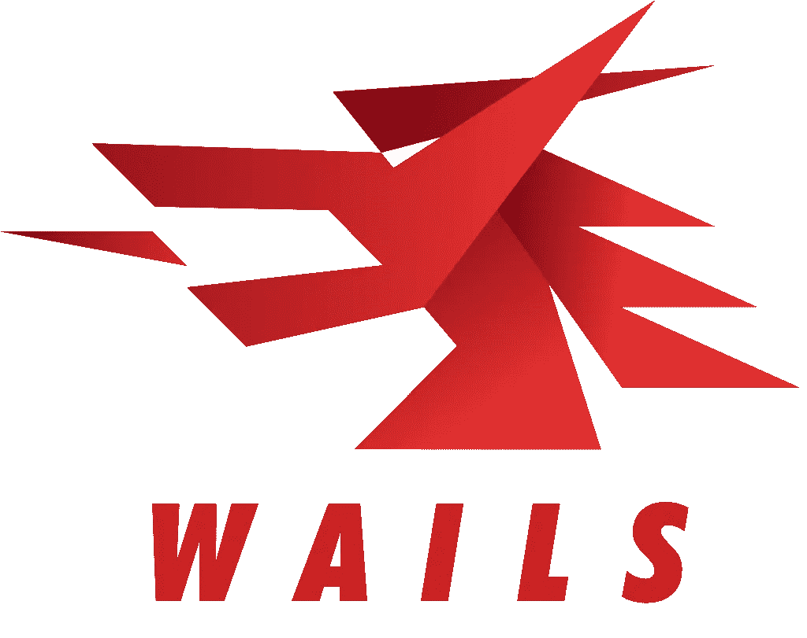
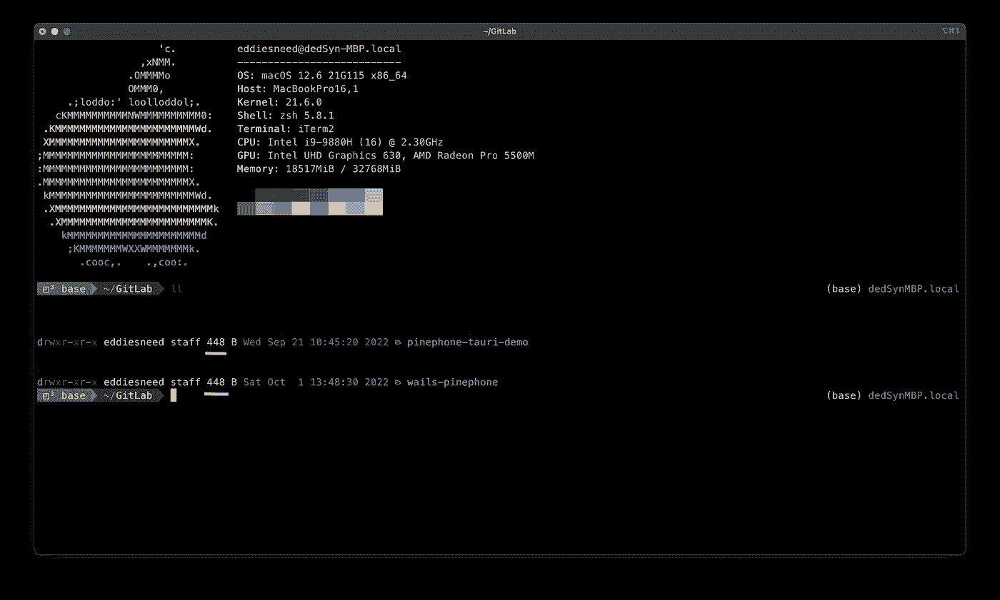
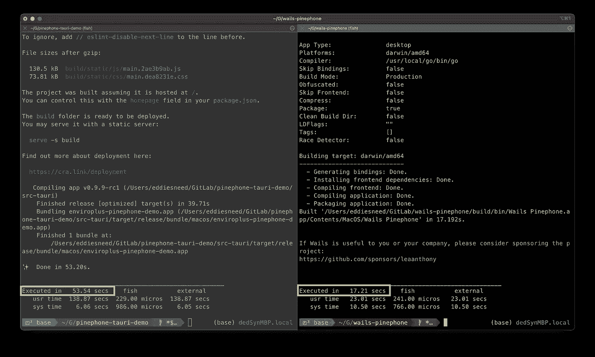
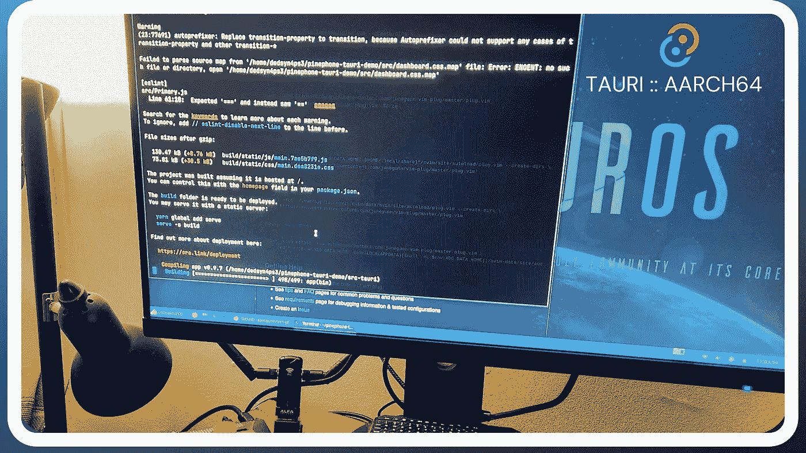

# 另一个奇妙的电子选择

> 原文：<https://levelup.gitconnected.com/another-fantastic-electron-alternative-cc3a5ce12462>

## 使用 Wails 框架构建令人惊叹的桌面应用程序

镇上还有另一个电子替代品

我们都熟悉电子这个庞然大物，以及它自诞生以来所带来的众多应用。现在，与它的全盛时期相比，在各种讨论和文章中读到使用它构建的应用程序的庞大二进制大小、沉重的资源利用率等已经变得很常见。结果，其他框架逐渐开始出现，试图提供一些不同的东西，在许多情况下利用更有效的后端编程语言。

不久前，我在寻找使用 web 技术构建桌面应用程序的更好替代方案时，偶然发现了 Rust-driven Tauri 框架。它使用 Rust 来处理所有后端功能和进程间通信，由于我通常不会编写很多 Rust 代码，我承认对于使用它进行所有后端函数调用我有点紧张。也就是说，我当然愿意检验它，看看它是否能带来更好的性能和整体开发人员体验。

我第一次 Tauri 经历的最终结果给我留下了极其深刻的印象…以至于我发表了一篇关于它的文章！我以为我已经找到了我一直在寻找的电子的替代品，**，但事实证明它并不是镇上唯一合适的选择！**

写完我的上一篇文章后，**我注意到有一个崭露头角的 Go 驱动框架，它提供了和 Tauri 一样的功能性**……我想再次重申一下*使用了 Go* ！现在，我不介意生锈…一点也不。我用它来转换我在 web 服务器上运行的一些较小的脚本，以提高性能，但是除了这些脚本，我的主要后端和 API 几乎完全是用 Go 编写的。我主要决定在我的上一个项目中使用 Tauri，仅仅是因为除了 Fyne(这仍然是一个很棒的项目)之外，没有任何真正的替代方法可以使用 Go，或者更深入的方法，比如使用 GTK 绑定。不过现在看来，**围棋爱好者可以庆幸了！**

一个用于地鼠的 GUI 框架

T 本文的重点不在于区分一个框架是否比另一个更好，而是让人们注意到这样一个事实，即开发人员在为他们的下一个图形项目选择框架时有着惊人的选择

如果你是一个顽固的鲁斯塔西亚人，*继续前进，选择陶里*…但是如果你是一个顽固的地鼠(像我一样)，**你会喜欢和沃尔斯一起工作**。这两种语言都提供了跨多个平台工作的能力，并且每个框架都生成了紧凑的最终二进制文件(它们在磁盘大小和资源使用方面也是相似的)。

在我使用 Wails 的体验中，一个更令人印象深刻的方面，类似于使用 Go 的一般体验，是将项目构建成最终的二进制可执行文件的整体速度…这真是太快了！这在很大程度上归结于在编译时传递给 Go 编译器的生产编译标志，尽管 Tauri 使用的 Rust 编译器遵循类似的指令，但使用 Go 时，类似规模的项目的总体编译时间明显更快。以下两个屏幕截图显示了两个项目目录及其各自的大小，以及每个待构建项目的执行时间比较:

相同的项目，不同的框架

Golang (Wails)有一些快速的建造时间

> 考虑它是一个轻量级和快速的电子围棋替代品。您可以利用 Go 的灵活性和强大功能，结合丰富的现代前端，轻松构建应用程序。

如果你在上面的比较中注意到了，我使用了一个项目，我一直在用这两个框架为运行 Linux 的移动设备(如 PinePhone)开发好看的应用程序。当我试图从手机本身构建 Tauri 项目时，这是一件相当缓慢和棘手的事情(由于较低的硬件规格，这在某种程度上是意料之中的)。我最终选择在 Raspberry Pi 4 上进行所有开发和构建，以获得更好的体验。

在 Pi 4 上构建 aarch64 Tauri 项目

在重写项目以使用 Go 和 Wails 进行所有后端函数调用后，我能够定期从 PinePhone 本身构建项目的新二进制文件！这被证明是非常可爱的，因为我现在可以在旅途中做一些小的改变，并构建一个新的可执行文件在我的 PinePhone 上运行，而不需要依赖另一个设备来构建。

O 总的来说，我使用 Wails 和 Tauri 开发桌面应用程序的经历非常棒！令人惊讶的是，今天的开发人员有能力使用前端 web 框架来设计好看的独立桌面应用程序，以及由不止一个后端语言框架提供的能力和灵活性…而是多个！

Tauri 已经开始用它的类型安全、强大的 Rust 驱动框架来为自己命名。他们继续扩展他们项目的开发，当然也有一个不断增长的社区来展示他们的努力！如果你是一个有一点使用 Rust 经验的开发人员，并且想尝试学习如何使用 web UI 制作一个桌面应用程序，**一定要看看 Tauri 文档！**

Google 的 Go 语言在过去几年里有了相当大的发展。即使在大规模环境中，它也能处理并发性，而且简单的学习曲线使它对大公司和小公司的开发人员都极具吸引力。出于同样的原因，我自己坚持在我的许多服务器应用程序中使用 Go，并且我计划继续这样做！我可以毫不犹豫地说，如果任何阅读这篇文章的人都喜欢在日常编程中使用 Go，并希望开始创建优雅的全功能桌面应用程序，**您肯定会喜欢使用 Wails。随着项目的继续发展，一定要定期查看他们的主页！**

 [## 哭墙工程|哭墙

### 使用 Go 构建漂亮的跨平台应用程序

wails.io](https://wails.io) 

如果阅读本文的任何人对这些框架在真实项目中的实际实现感到好奇，**请随意查看我在 GitLab 上使用它们整理的一些应用程序。**此外，请务必关注我的未来文章，我将撰写与整合新项目和其他有趣内容相关的文章！

 [## 埃德·卢瑟福 GitLab

### GitLab.com

gitlab.com](https://gitlab.com/dedSyn4ps3)