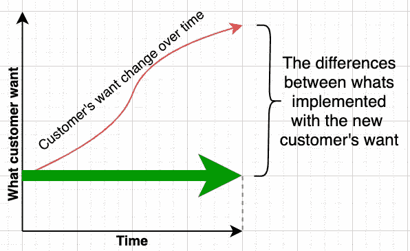
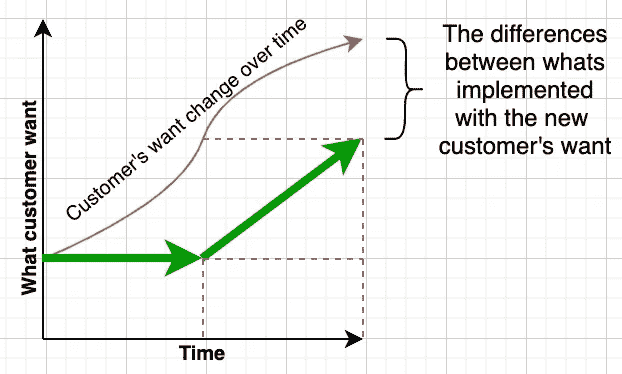
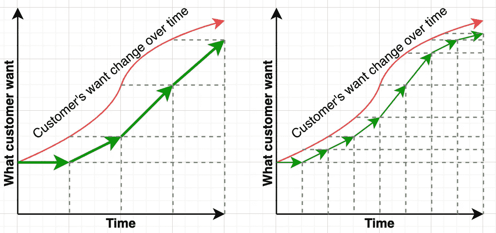
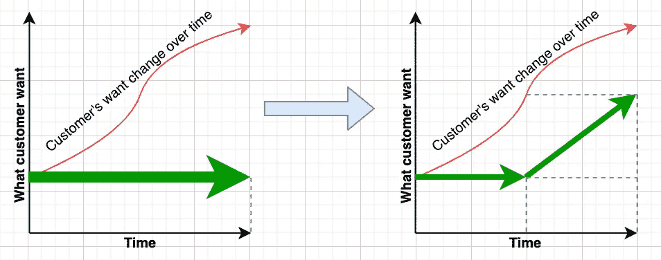
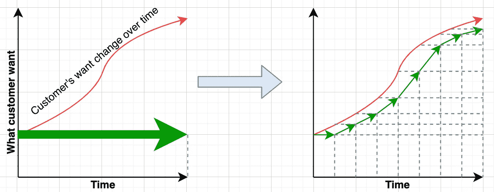

# 敏捷软件开发的另一种观点

> 原文：<https://levelup.gitconnected.com/another-view-of-agile-software-development-263590cd16b8>

## 程序员的世界

## 用不同的方式说明软件开发的灵活性

贾斯汀在 [Unsplash](https://unsplash.com?utm_source=medium&utm_medium=referral) 上的照片

当我第一次搜索敏捷软件开发时，我发现很难理解它是如何改进软件开发的。对我来说，那时，敏捷宣言听起来太好了，以至于不切实际。

快进到今天，在亲身体验了它的美好之后，我完全接受了它。尽管如此，我还是想知道是否有一种方法可以说明敏捷软件开发的好处。

经过一番思考后，以下可能是看待它的一种方式。

# 时间与客户需求

假设最初我们收集了所有客户的需求。然后，我们开始我们的发展，一次性达到目标，如下面的绿色箭头所示。

由于我们已经收集了所有的要求，这将需要一些时间来让它交付。不幸的是，当它完成的时候，客户的需求已经改变了(或者意识到它与我们最初认为的非常不同)。差别比较大。

## 分解成多个发展阶段。

为了得到更好的结果，我们不是一次做完所有的事情，而是把原来计划的 50%都做完。

当我们完成 50%时，我们再次评估客户想要什么，然后朝着新的方向改变我们的路线，如下所示。

最终结果表明，与一次性完成相比，我们更接近新客户的需求。

从中学习，也许让我们把它们进一步分解成 4 个阶段的开发或 8 个阶段的开发，让我们看看进展如何？

如果你看到上面的结果，我们把它分成的阶段越多，我们就越接近顾客最终想要的。

另一个有趣的观点是，与最初相比，绿色运输线也变得更加弯曲。因此称之为敏捷(更平滑、更灵活)是正确的。

# 少相位多变化与多相位少变化

使用这样的图表来观察敏捷性的另一个有趣的见解是，我们现在可以理解为什么早期的开发人员讨厌变化。

## 从 1 阶段到 2 阶段是很自然的

一个人先把一个单阶段的项目改成两个阶段，而不是直接跳到多个阶段，这样更自然。

然而，这样做的一个主要缺点是，当我们进入 2 阶段时，我们看到我们需要迎合的变化是巨大的。

开发人员已经完成了 50%的工作，现在他们需要做这么多的改变，以便朝着新的方向前进。因此，开发者厌恶改变。

提出 2 阶段变更的项目经理由于不满意的开发人员而感到困扰，不敢尝试推荐多阶段交付。

## 从单相到多相的大胆跳跃。

想象一下，我们不是从一个单一阶段的开发变更为两个阶段，而是直接变更为最大阶段(在我们的例子中是 8 个阶段)。

虽然现在听到我们有许多阶段要交付很吓人，但好消息是，在每个阶段中，只有 12.5%完成了。大多数开发者仍然可以做出改变，因为还没有做太多。

与两个相位变化相比，多个相位能够实现较小的变化。这种多阶段的变化使得敏捷开发比少阶段开发更友好。

难怪敏捷软件开发突然成为一种采用的革命性方法，因为它是一种不自然的大胆尝试，人们会从典型的瀑布模型出发。

# 我们从插图中学到了什么？

下面有 3 条经验可以让软件开发更加敏捷

## 1.在交付的每个阶段尽可能做到最少。

做得最少，可能是产品交付、用户需求、工作的初始架构等等。除了改变，没有什么是确定的。我们能得到的反馈越少越好。不要求完美。

 [## 为什么我喜欢不完美的软件开发实践

### 完美可能会成为软件开发的障碍

better 编程. pub](https://betterprogramming.pub/why-i-prefer-imperfect-software-development-practices-b13cfdcf85bf) 

## 2.在最短的时间内尽可能多地发布

一旦我们有了某样东西，我们应该试着把它释放出来。这使我们能够获得真实的用户输入来验证我们的许多假设。它还允许一个人在需要时快速改变。

 [## 软件越早发布越好

### 频繁发布软件如何让每个人受益

better 编程. pub](https://betterprogramming.pub/software-release-early-release-often-is-really-good-b4acb017e79) 

## 3.在每个阶段收集尽可能多的用户输入

用户对我们每个版本的输入将使我们能够改变前进的方向。它是帮助我们前进并实现我们预期目标的主要灯塔。

有意识地做到以上三点将增加我们快速适应客户变化的开发灵活性。因此，更满意的客户，更好的产品交付。

> 警告:以上是软件开发灵活性如何使产品更接近客户不断变化的需求的简单观点。它忽略了诸如变更开销成本之类的东西，即虽然没有硬件变更那么大，但仍然会影响软件整体交付时间表的成本。