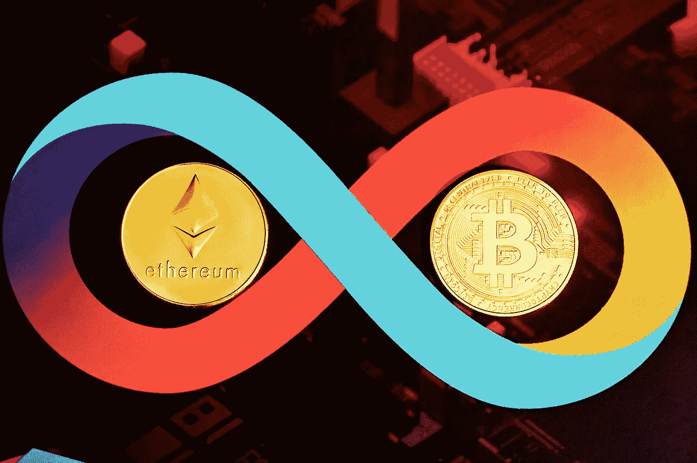
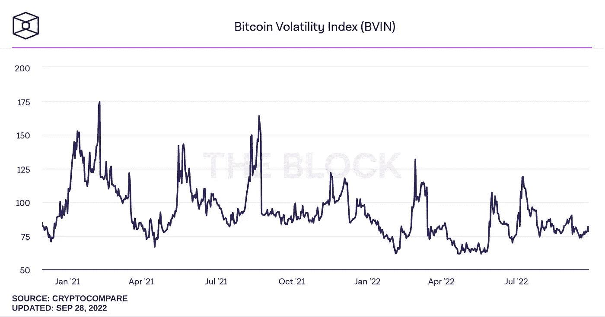
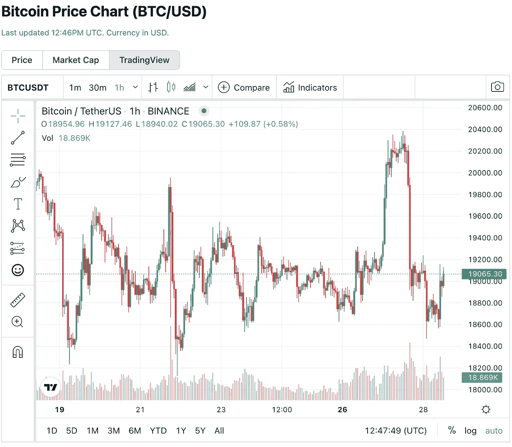
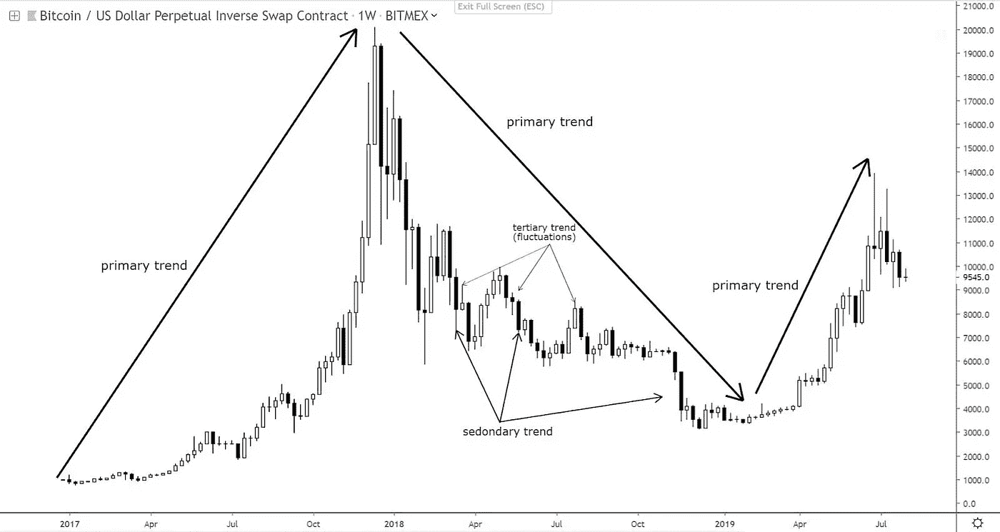

# 预测趋势:如何跟踪加密货币图表

> 原文：<https://levelup.gitconnected.com/anticipating-trends-how-to-follow-cryptocurrency-charts-ba6ea0955143>

在一个像 crypto 一样不稳定和不可预测的环境中，有一个行动计划可以决定成败。虽然比特币和以太坊等产品的价格波动不稳定，让交易者的日子不好过，但它们也有责任为直观的市场交易和经过充分研究的投资带来丰厚回报。技术分析在这里起着关键作用，投资者可以借此快速识别趋势，并迅速果断地采取行动。

但是投资者如何进行技术分析呢？它能对投资组合的表现产生多大的影响？

*(图片:* [*【格挡】*](https://www.theblock.co/data/crypto-markets/prices/bitcoin-volatility-index-bvx) *)*

正如我们从比特币的波动指数(BVIN)中可以看到的那样，这种资产容易出现剧烈的价格波动，其波动幅度是传统股票的数倍。虽然这些快速波动可能难以理解，但技术分析可以帮助投资者更好地发现运动即将到来的迹象。

考虑到这一点，我们来看看投资者如何利用技术分析来更深入地了解加密货币的表现，并利用它来识别和预测未来的趋势。

# 影响加密价格的因素

在我们看加密货币可以传达给投资者的技术指标[之前，让我们来看看可以影响资产价格和表现的许多因素。](/3-essential-ways-to-keeping-your-crypto-safe-throughout-the-bull-market-9e938313df50)

供给和需求是所有投资者在选择跟踪哪些资产时必须考虑的一个主要因素。例如，比特币被设定为限量流通 2100 万枚硬币——目前的供应量约为 1910 万枚。授予矿商的 BTC 数量也计划每四年减半——这使得比特币成为一种随着时间推移而日益稀缺的资产。

不同的硬币有不同的发行限额——或者根本没有。在寻找技术指标之前，看看供给等因素总是值得的，因为一般来说，流通中的硬币越多，资产的价值就越低。高流通量的资产也需要高得多的交易量来推动有意义的价格上涨。

投资者还需要了解加密货币的各种应用及其基础项目。这一点，加上基础技术及其各种变化，可以对价格反弹产生深远的影响。以最近的价格下跌和以太坊在最近的合并事件后[的反弹为例。](https://time.com/nextadvisor/investing/cryptocurrency/ethereum-hits-new-all-time-high-price/)

监管变化也会严重影响资产价格。随着中国的禁令，比特币一直在挣扎，而 [SEC 在 2020 年对 XRP 的臭名昭著的诉讼](https://consent.yahoo.com/v2/collectConsent?sessionId=3_cc-session_c2d9e253-cb18-4a54-891b-fdba2b43712f)见证了一段价格波动极其剧烈的时期。

虽然影响加密价格的一些因素可能很难跟踪，但通过有效的分析可以发现和预测趋势。让我们更深入地看看投资者可以留意的一些技术信号:

# 识别第一、第二和第三趋势

根据道氏理论，所有的市场，[包括加密](/reading-cryptocurrency-markets-is-it-possible-to-understand-trends-within-crypto-2f06b995e387)，都会经历三种形式的趋势。主要趋势的特点是持续数月甚至数年的大规模市场运动，而次要趋势可能与主要趋势相反，这意味着牛市中的回调或其他形式的更暂时的相反运动。

投资者还必须关注三级趋势，这是可以持续一周左右的极短期走势。这些趋势通常被认为是市场中的白噪音，应该被有长期计划的投资者忽略。

*(图片:* [*阿德里安·兹杜奇克*](https://twitter.com/crypto_birb/status/1160984132014542848) *)*

从上图中我们可以看出，投资者必须最大程度地尊重主要趋势，如牛市和熊市，而次要趋势也可以通过逆趋势而动来获得短期收益，从而提供在市场中进行精明移动的小机会。

值得注意的是，主要趋势通常有三个阶段，投资者可以利用。例如，在牛市中，交易者可以利用次级趋势，在初级趋势夺回资产之前，以更低的价格买入。

主要趋势的第一阶段通常包括牛市的积累或熊市的分配。当市场情绪开始与市场趋势相反时，就会出现这种情况，这为投资者提前行动以预测价格上涨或下跌铺平了道路。

随后，公众的参与带来了第二个阶段，随着价格运动开始积聚动力，更广泛的市场对主要趋势做出反应。最后，牛市进入过度阶段，熊市进入恐慌阶段——在这一阶段结束时，投资者继续投机。意识到即将发生变化的投资者可以在更广泛的市场滞后参与短暂的财富逆转时尽早行动。

# 了解你的蜡烛

交易者普遍喜欢蜡烛图，因为它们显示了更多关于加密价格趋势的信息。每个蜡烛线[显示了它所代表的每个时间段的交易活动](https://www.makeuseof.com/crypto-technical-analysis-explained/)。

烛台可以是绿色或红色，分别表示价格上涨或下跌。蜡烛线的底部显示该时间段的开盘价，顶部(或底部)显示收盘价。

蜡烛也有灯芯，它显示在特定的时间范围内价格的高低。

*(图片:* [*【守宫】*](https://www.coingecko.com/en/coins/bitcoin) *)*

阅读蜡烛线的能力是有效交易的关键，不同形状的蜡烛线可以传达不同的趋势指标。例如，[比特币基地认为](https://www.coinbase.com/learn/tips-and-tutorials/how-to-read-candlestick-charts)如果一根蜡烛有一根长长的向下的灯芯，它可能表明交易者在资产下跌时快速买入——表明价格上涨的情绪高涨。与此同时，长时间的上涨可能表明投资者正在寻求兑现他们的利润——这表明他们相信资产价格可能会下跌。

# 利用数据做出明智的估计

投资者可以利用这些数据来深入了解他们选择的加密资产。特别是，他们可以使用趋势分析来确定[加密货币](/encouraging-crypto-functionality-why-the-recent-cryptocurrency-crash-may-improve-the-ecosystems-e5260adcf05d)的支撑位和阻力位。这是指价格何时见底或见顶。

在发现阻力所在时，投资者可以使用止损单来确保如果他们的资产跌破阻力水平，他们可以在更大的损失开始积累之前卖掉他们的硬币。

还有[许多可用的工具](https://www.gemini.com/cryptopedia/technical-analysis-bitcoin-and-crypto#section-some-tools-of-bitcoin-technical-analysis)来帮助使这些见解更加明显。使用平均方向指数、布林线、相对强弱指数或标准差对交易者来说是很大的财富。这也有助于[利用从 PoweredTemplate 等平台上获得的预先准备好的](https://poweredtemplate.com/presentation-templates/category=data-driven,flow-charts,infographics,matrix,pie,process,stage,tables,timeline-calendar,tree)图表模板，将原始信息记录为可操作的见解，或者与同行分享您的发现。

虽然加密的世界可能是一个高度不稳定的地方，投资者可以通过强大的技术分析更好地发现趋势并更快地采取行动。因此，记住要密切关注新的趋势，检查主要趋势的开始阶段，负责任地投资你选择的资产，以获得强大的投资组合。