# 幕后的防伪标记

> 原文：<https://levelup.gitconnected.com/antiforgery-tokens-behind-the-scenes-dcddda54db8a>

## 防伪标记的工作原理。NET 5.0

汤姆·温克尔斯在 [Unsplash](https://unsplash.com/photos/I7oLRdM9YIw) 上的照片

在本文中，我将通过回答以下问题来讨论防伪标记是如何在幕后工作的:

1.  如何生成 **cookie** **名称**？
2.  cookie 和 HTML 表单标记是如何生成的？
3.  令牌**是如何验证的**？

你应该已经知道什么是防伪标志，以及如何在 Asp.Net 核心使用它们。

## 跟着走

您可以跳过这一部分，但是自己调试会更有趣。

我不会在这里展示所有的代码，但是这是一个非常简单的 MVC 应用程序，它有一个表单和一个发布表单的按钮。

你可以从我的 [GitHub](https://github.com/DavidKlempfner/AntiforgeryTest) 账号下载代码。

确保你设置了 VS，让它以匿名模式打开 Chrome，这样每次运行时 cookie 都是新鲜的。

我用这些[指令](/how-to-debug-asp-net-core-source-code-448544c16473)来调试。NET 5.0 源代码。

# cookie 名称是如何生成的？

当您向设置为使用防伪令牌的后端发出 POST 请求时，以下 cookie 将随请求一起发送。

cookie 名称是在`=`之前的部分，之后的部分是值。

我们来看看那些随机字符是怎么产生的。

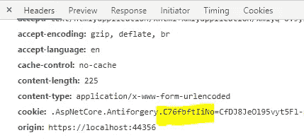

作为标题传递的防伪 cookie

神奇发生在`AntiforgeryOptionsSetup.ComputeCookieName()`。

源代码可以在[这里](https://github.com/aspnet/Antiforgery/blob/master/src/Microsoft.AspNetCore.Antiforgery/Internal/AntiforgeryOptionsSetup.cs#L28)找到。

`C76fbftIiNo`是从存储您的解决方案的文件夹路径生成的**，它存储在`applicationId`变量中。**

**流程为:**

1.  将`applicationId`转换为存储 UTF8 字节的字节数组。
2.  取这个字节数组的 SHA256 哈希。
3.  Base64URL 对值进行编码，就是这样！

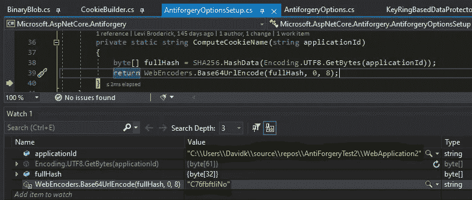

因为该值是基于`applicationId`的，所以应用程序的所有用户应该有相同的 cookie 名称。

# cookie 和 HTML 表单标记是如何生成的？

在下面的代码中，cookie 标记被称为`NewCookieToken`，HTML 表单标记被称为`NewRequestToken`。

神奇的事情发生在[默认防伪。序列化()](https://github.com/aspnet/Antiforgery/blob/master/src/Microsoft.AspNetCore.Antiforgery/Internal/DefaultAntiforgery.cs/#L418)。

**步骤有:**

1.  使用[随机数发生器](https://github.com/aspnet/Antiforgery/blob/master/src/Microsoft.AspNetCore.Antiforgery/Internal/BinaryBlob.cs#L95)构建一个字节数组。
2.  基于步骤 1 生成一个[唯一数组](https://github.com/aspnet/Antiforgery/blob/master/src/Microsoft.AspNetCore.Antiforgery/Internal/DefaultAntiforgeryTokenSerializer.cs#L134)。
3.  [加密](https://github.com/aspnet/Antiforgery/blob/master/src/Microsoft.AspNetCore.Antiforgery/Internal/DefaultAntiforgeryTokenSerializer.cs#L168)数组。
4.  在加密数组前添加一个[魔法头](https://github.com/aspnet/Universe/blob/release/2.2/src/DataProtection/src/Microsoft.AspNetCore.DataProtection/KeyManagement/KeyRingBasedDataProtector.cs#L130)和`defaultKeyId`。
5.  [Base64URL 对加密数组进行编码](https://github.com/aspnet/Antiforgery/blob/master/src/Microsoft.AspNetCore.Antiforgery/Internal/DefaultAntiforgeryTokenSerializer.cs#L173)并将其用作令牌字符串。

以上步骤用于构建`NewCookieToken`和`NewRequestToken.` ，它们都重用了第一步中的同一个数组。

下面的屏幕截图显示了“监视”窗口中用于输入的值，以及作为实际令牌字符串的最终输出:

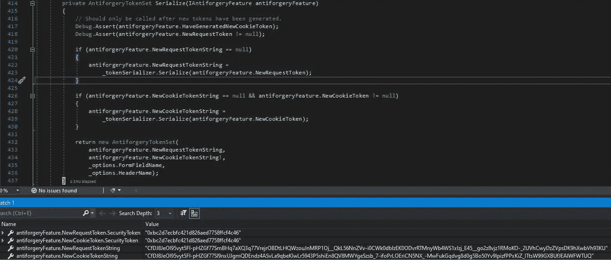

查看观察窗口，您可以看到`NewRequestToken`和`NewCookieToken`都有相同的字节数组，但是实际生成的令牌的值不同。

我们来看看是怎么回事。

1.  **使用随机数生成器构建一个字节数组**

源代码可以在这里找到[。](https://github.com/dotnet/corefx/blob/master/src/System.Security.Cryptography.Algorithms/src/System/Security/Cryptography/RandomNumberGenerator.cs#L97)

字节数组是使用一个随机数生成器在 [BinaryBlob 中填充的。GenerateNewToken()](https://github.com/aspnet/Antiforgery/blob/master/src/Microsoft.AspNetCore.Antiforgery/Internal/BinaryBlob.cs#L92\) :

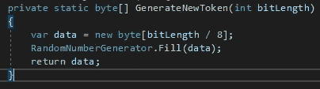

**2。基于步骤 1** 生成唯一数组

源代码可以在[这里](https://github.com/aspnet/Antiforgery/blob/master/src/Microsoft.AspNetCore.Antiforgery/Internal/DefaultAntiforgeryTokenSerializer.cs#L134)找到。

这一步中的逻辑对于这两个令牌略有不同。

注意，当存储在字节数组中时，任何空字符串和布尔值`false`都被转换为 0x00，而布尔值`true`被转换为 0x01。

新库克托肯

使用以下内容创建一个新数组:

**索引 0** :硬编码令牌版本 01 写入第一个字节。

**索引 1 到 16** :来自步骤 1 的字节数组。

**索引 17** :布尔值`true` ( `IsCookieToken`)。

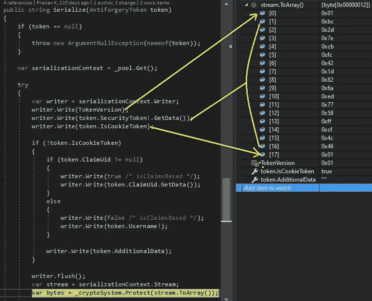

**新请求令牌:**

使用以下内容创建一个新数组:

**索引 0** :硬编码令牌版本 01 写入第一个字节。

**索引 1 到 16** :来自步骤 1 的字节数组。

**索引 17** :布尔值`false` ( `IsCookieToken`)。

**索引 18** :来自`else`块的`false`的布尔值。

**索引 19** :空字符串(`token.Username`)。

**索引 20** :空字符串(`token.AdditionalData`)。

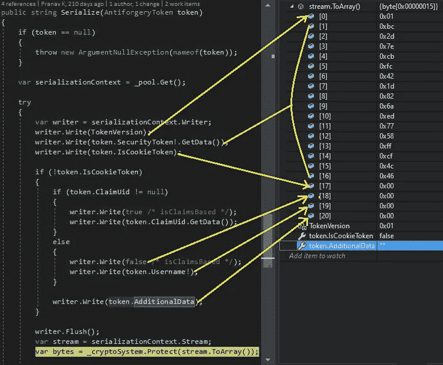

**3。加密数组**

源代码可以在[这里](https://github.com/aspnet/Universe/blob/release/2.2/src/DataProtection/src/Microsoft.AspNetCore.DataProtection/KeyManagement/KeyRingBasedDataProtector.cs#L117)找到。

你可以把这个部分想象成一个黑匣子。这很复杂，但是您可以自行调试，以便更深入地了解它是如何加密的。

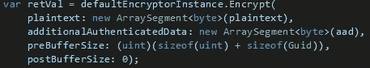

**4。在加密数组前添加一个 magic 头和 defaultKeyId。**

源代码可以在[这里](https://github.com/aspnet/Universe/blob/release/2.2/src/DataProtection/src/Microsoft.AspNetCore.DataProtection/KeyManagement/KeyRingBasedDataProtector.cs#L130)找到。

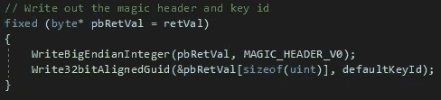

`WriteBigEndianInteger()`方法将一个`uint`写入加密数组。您可以看到下面的值:

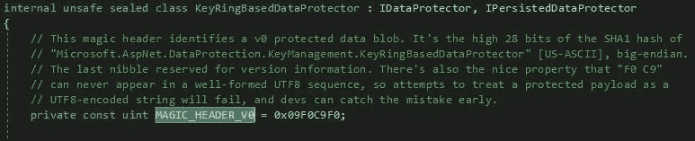

看看上面截图中的评论。您可以通过使用在线 SHA1 哈希生成器[来检查它是否真的是 SHA1 哈希:](https://passwordsgenerator.net/sha1-hash-generator/)

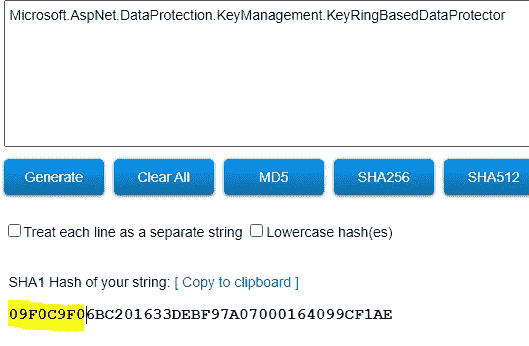

`Write32bitAlignedGuid()`方法写一个 GUID，指示使用了哪个加密密钥。

**5。Base64URL 对加密数组进行编码，并将其用作令牌**

源代码可以在[这里](https://github.com/dotnet/aspnetcore/blob/master/src/Shared/WebEncoders/WebEncoders.cs#L259)找到。

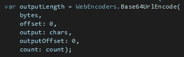

加密数组是 Base64Url 编码的，它返回一个字符串。这是最后的结果。

## 最终结果

您可以看到`NewRequestToken`值被写入 DOM，并将与 HTTP POST 的主体一起发送。

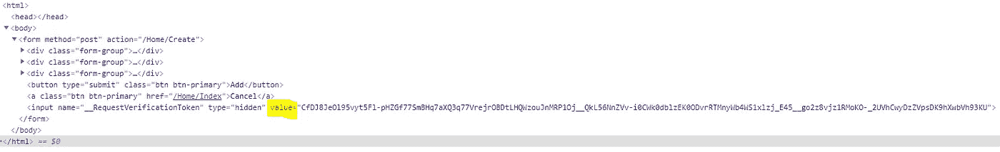

当发出 POST 请求时，您可以在标题中看到`NewCookieToken`:

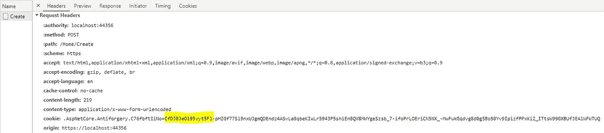

# 身份 cookie

您是否注意到`NewRequestToken`和`NewCookieToken`中的前 26 个字符是相同的？这是因为它只是魔术头，加密密钥 ID base64URL 编码，这在生成两个令牌时是相同的。

原来 AspNetCore 使用了相同的代码。应用程序 cookie，如果你的应用程序使用身份。

这就是为什么你的 AspNetCore？身份。应用程序和防伪 cookies 将具有相同的前 26 个字符。

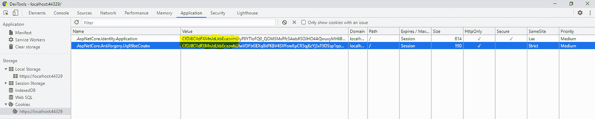

# 令牌是如何验证的？

该过程本质上与生成过程完全相同，只是相反。

令牌被去除了魔术头和加密密钥 ID。剩下的是加密的、随机生成的字节数组。

这些数组被解密。

因为使用了相同的随机生成的字节数组来生成 cookie 和 HTML 表单标记，所以只要生成的未加密数组相同，就会验证标记并处理 HTTP 请求。

下面是进行[验证的代码块](https://github.com/aspnet/Antiforgery/blob/master/src/Microsoft.AspNetCore.Antiforgery/Internal/DefaultAntiforgeryTokenGenerator.cs#L143):

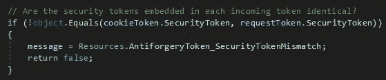

# 发送多个请求

上面已经向您展示了在第一个 HTTP 请求期间会发生什么。

**刷新页面会怎么样？**

相同的 cookie 将被发送给后续的请求，但是 HTML 表单令牌在每次页面加载时都是不同的。

如果重新加载页面，则通过解密 cookie 提取随机生成的数组。

然后像以前一样，使用这个数组来生成 HTML 表单的令牌。由于`CbcAuthenticatedEncryptor`类中的一些[随机化](https://github.com/aspnet/DataProtection/blob/88a191f0f348a1eae467a906048e6adcac5f9cc3/src/Microsoft.AspNetCore.DataProtection/Cng/CbcAuthenticatedEncryptor.cs#L311)，你每次都会得到一个新的 HTML 表单标记字符串。

这就是为什么，如果你不断刷新页面，你会看到 **cookie 标记保持不变**，而 **HTML 表单标记每次都不一样**，但两者的前 26 个字符总是相同的。

## 一个防伪标记可以有多少种不同的值？

要深入了解防伪令牌值背后的统计数据，请阅读这篇文章。