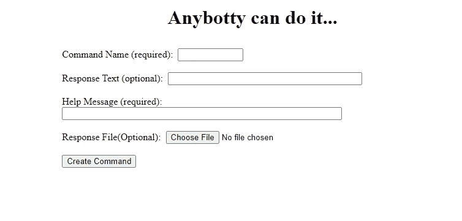

# AnyBotty:一个定制的命令不和谐机器人

> 原文：<https://levelup.gitconnected.com/anybotty-a-custom-command-discord-bot-97f16a00492c>

前段时间[我创建了一个不和谐机器人](/creating-a-simple-discord-bot-with-discord-js-7b389da3d387)，它有一个重要的任务:让用户知道《刀锋战士 II:班纳洛德》何时发布。在将这个机器人添加到我的 Discord 服务器(一个小型的家庭/朋友服务器)后，我收到了许多关于给机器人添加更多功能的请求:自定义命令、自定义响应等。所有这些都是添加的。这些变化通常很小，不需要太多的努力，这让我想到必须有一些方法来自动化。

这导致了 AnyBotty 的诞生，这是一个不和谐的机器人，允许用户用自定义消息甚至基于图像的响应来创建自己的命令。这个机器人有两个主要组件:使用 HTML/JS 和 Node 的 web 界面/服务器和用 Python 编写的机器人本身。开发了一个 web 应用程序来添加命令，以便用户可以为他们的自定义命令上传文件。如果没有这些文件，所有这些逻辑都可以通过几个管理命令集成到机器人本身中。

# 网络应用

首先，机器人的用户需要某种方式来上传命令信息和机器人可以访问的图像。这是通过一个非常基本的 web 应用程序完成的。HTML 包含一个难看的表单(没有修饰),它通过 JS fetch API 向节点服务器提交请求。预先警告，我不是一个网站开发人员，我几乎专门从事后端系统的工作。

在这个 HTML 中将 *YOUR_SERVER_URL* 替换为您的服务器的 URL 和请求端点应该会将这些数据插入到下面描述的 JSON 文件中。

接下来，设置一个 Node.js 服务器来接受来自这个 web 页面的请求，并将数据附加到几个 JSON 文件中，bot 将使用这些文件来创建响应。

上面的 JavaScript 充满了解释功能的注释。本质上，API 监听端口 9009，并包含一个端点，表单数据被发送到这个端点， *abadd* (AnyBotty add)。此方法将分析表单数据，验证是否有足够的数据来创建命令，如果有足够的数据，则创建命令。命令信息被写入两到三个 JSON 文件:

1.  ***help.json:*** 命令名到帮助消息的映射。当用户输入*时会显示这些！ab help* 并且是查看哪些命令可用的唯一方法。
2.  ***messages . JSON:***从命令名到文本的映射，当命令被执行时，应该从 bot 返回给用户。消息文本不是必需的，因此并非所有命令在该文件中都可用。
3.  ***files.json:*** 命令名到 bot 返回文件的映射。同样，这不是必填字段，因此可能不包含所有命令。

成功上传命令后，AnyBotty 会通过下面的 bash 脚本重新启动。请注意，我使用了 *forever* JS 库来确保进程始终运行(针对 bot 和节点 API)。

如果使用这些代码中的任何一个，一定要用正确的值替换服务器脚本中的 *< BOT_DIR >* 和重启脚本中的*<any botty _ DIRECTORY>*(它们应该是相同的值)。

该说的都说了，该做的都做了，下面的 web UI 用来上传新命令。

# 不和谐机器人

接下来，我们将使用 [Discord.py](https://discordpy.readthedocs.io/en/stable/) 在 Python 中创建 Discord bot。举例来说，提供了三个默认的 JSON 配置文件。这些文件如上所述。

默认的 files.json 文件。

默认 help.json 文件。

默认 messages.json 文件。

bot 使用这三个文件来执行命令。

不和谐机器人还需要不和谐机器人生成的令牌。我将它存储在一个 JSON 文件中，这个文件在启动时被机器人读取。您也可以将您的密钥存储在 *auth.json* 文件中，或者将密钥保存在您的 Python 代码中。关于这个设置的更多信息可以在我之前的[帖子](/creating-a-simple-discord-bot-with-discord-js-7b389da3d387)中找到。

auth.json

有了这些文件，我们就可以设置机器人了。

首先，需要启动机器人，这是使它对你的不和谐服务器可用的魔法

这有 bot 两个依赖项， *json* 和[discord 来自 discord.py](https://discordpy.readthedocs.io/en/stable/) 。

bot client 类包含进行初始设置的方法和一个在退出时调用的命令(或多或少什么也不做)。

在构造函数中，设置了基目录，并加载了前面描述的三个 JSON 文件中的数据。接下来，我们需要一种方法来接受来自客户端(不和谐服务器)的消息。这个机器人只会解析以*开头的命令！ab* 所有其他消息将被忽略。

这个方法获取命令逻辑解析的关于公会、频道、消息内容和用户的信息。

命令逻辑(*process _ command*)*从消息中获取信息，并确定将哪些响应返回给用户。*

*该 bot 提供了一个内置命令 *help* ，它向用户返回所有可用的命令，包括命令创建者提供的帮助消息。否则，JSON 对象、文件、帮助和消息使用命令名作为键来检索与所提供的命令相关联的任何响应消息或文件。如果文件中不存在该命令，它将被忽略。*

*最后，包含了将响应(文件和/或文本)实际发送回 Discord 客户端的逻辑。*

*这个逻辑非常简单。公会和频道信息用于确定将消息发送到哪里，discord.py API 用于将消息发送到适当的地方。*

*机器人的完整代码如下所示*

# *结论*

*在这篇文章中，我介绍了我的自定义命令 Discord bot，AnyBotty 背后的推理和实现。虽然我在上周创建了这个机器人，但我们已经在我的 Discord 服务器上享受了很多乐趣。一个意想不到的副作用是到底是谁创建了这些命令(谁也不知道)，以及看到是否有新内容时的兴奋感。如果你有自己的服务器(或者其他托管方式)，我认为像这样的机器人对任何服务器来说都是非常有价值的。如果有足够的兴趣，我可能会考虑设置这个不和谐的应用程序，可以很容易下载和集成。*

# *完整代码*

*完整的代码可以在[机器人的 GitHub 库](https://github.com/anthonymorast/anybotty)中找到。你需要为网络应用和不和谐机器人使用你自己的服务器。关于设置机器人的信息可以在我的[之前关于这个话题的帖子](/creating-a-simple-discord-bot-with-discord-js-7b389da3d387)中找到。网上有大量关于设置简单网络应用的信息。*