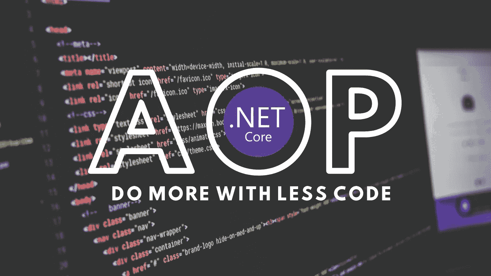
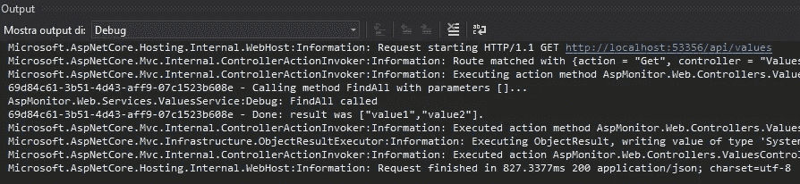

# 如何提高。使用 AOP 的. Net 应用程序

> 原文：<https://levelup.gitconnected.com/aop-dotnet-applications-67c6d94c08b0>

## 了解如何配置依赖注入，使事情按设计发生

不写代码完成任务是任何一个开发者的梦想。在本文中，我们将学习一种无需编写一行代码就能让事情发生的模式。哲学就是 AOP(面向方面编程)。这种技术在 Java 中广泛使用，有助于保持高质量的标准。今天我们将学习如何使用它。没有痛苦的网络核心项目。在简单的理论解释之后，你会发现两个例子(所有的代码都在我的 GitHub 档案中)。



ASP.NET 核心中的 AOP:用更少的代码做更多的事情

# 什么是 AOP

让我们从维基百科的定义开始:

> 在计算中，面向方面编程(AOP)是一种编程范式，旨在通过允许分离横切关注点来增加模块化。它通过在不修改代码本身的情况下向现有代码添加额外的行为(建议)来做到这一点[…]这允许将对业务逻辑不重要的行为(如日志记录)添加到程序中，而不会弄乱作为功能核心的代码。[https://en.wikipedia.org/wiki/Aspect-oriented_programming](https://en.wikipedia.org/wiki/Aspect-oriented_programming)

概念简单，可以用一句话概括。

> 不用写代码就能让事情发生。

这适用于所有需要的代码，但不引入任何业务逻辑。

下面是 AOP 如何改变我们代码的一些例子。第一个是关于日志。

```
public void SaveData(InputClass input)
{Stopwatch timer= new Stopwatch();
  timer.Start();
  logger.Info("enterd SaveData method");
  if(logger.LogLevel==LoggingLeve.Debug)
  {
      logger.Debug(MyJsonTool.ConvertToJson(input);
  }dataRepositoryInstance.Save(input); logger.Info($"enterd SaveData method in {timer.ElapsedMilliseconds}ms");}
```

如果我告诉你，所有这些代码都可以产生相同的输出，只要写这个就行了，会怎么样？

```
public virtual void SaveData(InputClass input)
{
  dataRepositoryInstance.Save(input);
}
```

所以，所有的工作只是添加一个虚拟关键字的方法，这是伟大的！我们稍后再回到虚拟关键字来理解它与 AOP 的关系。

如果您不相信 AOP 的强大功能，只需看看如何将数据获取的代码简化如下:

```
[Fetch("SELECT * FROM customers WHERE name=?")]
public List<MyDTO> GetByName(string name);
```

我希望您现在已经非常确信 AOP 可以在许多场景中提供帮助，并且可以成为一个强大的盟友。让我们看看它是如何工作的，以及如何将它集成到一个. net 核心应用程序中。

本文包含两个示例:

1.  使用 DinamyProxy 和 Autofact 截取日志的简单例子。
2.  这是一篇非常好的关于 AOP 技术的深度文章，展示了如何实现 AOP 引擎。

# 示例 1:自动控制器日志记录

在这个示例中，我们将配置一个拦截器来记录所有传入的请求。这可以扩展到我们应用程序的所有其他层，就当是概念验证。

**拦截者**

拦截器的结构非常简单。在方法执行前后记录它。在这个示例中，我使用一个 GUID 来一起引用事件日志，但是还可以进行许多改进。

我们可以讨论到明天，关于如何愚蠢地将数据转储到日志中，或者我们可以改进这个系统，使用一个更好的日志系统和一个聪明的方法来跟踪输入、计时和输出。



如您所见，有一个方法执行的痕迹，带有计时。想象一下，在您的 Asp.net Web API 应用程序的所有控制器上，或者在业务逻辑的每个服务方法中。好看吗？它节省了大量代码。

# 示例 2:低代码查询实现

这个例子展示了如何通过添加一些注释来为方法添加默认行为。这个例子是从头开始实现的，没有使用任何库，以突出它是如何工作的。

要创建的基类是 DispatcherProxy。此类实现泛型类型的代理，该代理截获方法调用并返回自定义对象。这就是我们需要用一个有效的方法替换一个空方法。

无论如何，要实现一个通用引擎，我们需要更多的东西。我创建了一个通用属性，叫做 AOPAttribute，有很多幻想。继承它的每个注释都需要实现执行。使用这种模式，所有的实现都委托给属性，我们的代理引擎与许多实现完全解耦。

您可以在下面的代码片段中查看相关的代码部分。仅仅使用几行代码，我们就能够实现一个非常强大的引擎，但这只是一个例子。你可以尽情想象能为你解决多少用例。

我告诉你太快了吗？一步一步开始就好。

## 第一步:我们想要什么

首先，我们希望实现一种允许自动实现方法的机制。在 C#中，我们不能在类上使用 DispatcherProxy，而只能在接口上使用，所以我们需要总是从一个具有所有方法声明的接口开始。无论如何，我们也想手动实现一些方法，所以我们也需要一个具体的类。现在有一个棘手的问题。如果我们让类从接口继承，这是逻辑，我们将被迫实现所有方法，因为这是编译器的要求。我采用的技巧是简单地忘记继承。类和接口之间的关系将在以后的 DI 中定义

这是水果仓库的片段。该接口包含自动实现的方法和手动实现的 InitDB。

## 第二步:代理

我们现在需要的是创建一个代理，它将维护接口和实现的类之间的关系，提供基于注释的方法。代码非常简单，参见下面的代码片段。

用法非常简单，使用常规的。净核心依赖注入。

## 第三步:注释

所有这些的基础注释是 AOPAnnotation。这是一个抽象类，包含一个 Execute 方法，它取代了通常的方法体。然后我们有了查询注释，在我们的例子中，它使用从开发人员那里传来的查询模板来获取数据。

## 第四步:实际观察

将所有这些放在一起非常简单。只需使用我们手动编写的存储库。

# 带什么回家

AOP 是一个非常有趣的模式，因为它自动化了代码编写。它非常强大，但是有两个弱点:

1.  性能:深入使用反射和精化阶段的额外步骤，可能会增加计算时间。
2.  失控:系统为你做得越多，你就越不知道如何解决。

现代工具和框架有助于在不使用代码的情况下减少代码，因此并不总是必要的。无论如何，当你在设计一个框架或大型基础设施时，了解它是非常重要的，因为它可能是赢得战争的正确武器。例如，当我设计开源无头 CMS 的架构时，这是一个很好的联盟。

关于性能或者稳定性，只要记住 Java Spring 框架就可以了。它将 It 作为一切的基础，并且现在是企业应用程序的最佳选择之一。

[所有的源代码都在那里，在我的 GitHub 简介上](https://github.com/zeppaman/csharp-aop)

## 参考

*   AOP 的用例[【https://github.com/arduosoft/RawCMS】T4
*   一篇关于。net AOP[[https://medium . com/@ nik96a/using-di-with-dispatch proxy-based-decorators-in-c-net-core-AC 02 f 02 C5 Fe 5](https://medium.com/@nik96a/using-di-with-dispatchproxy-based-decorators-in-c-net-core-ac02f02c5fe5)]
*   维基百科上的 AOP 定义[[https://en.wikipedia.org/wiki/Aspect-oriented_programming](https://en.wikipedia.org/wiki/Aspect-oriented_programming)]
*   本文的源代码[https://github.com/zeppaman/csharp-aop](https://github.com/zeppaman/csharp-aop)