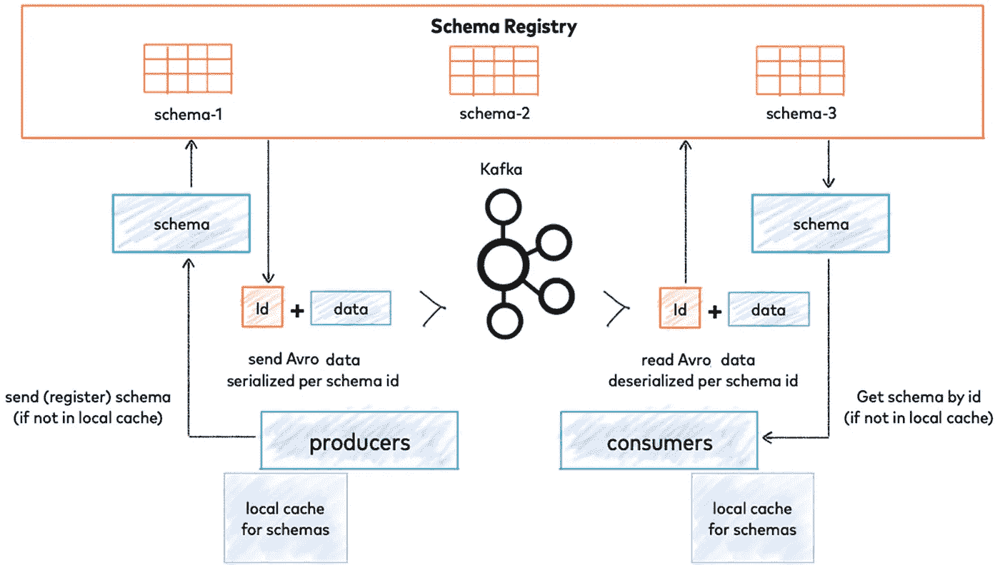
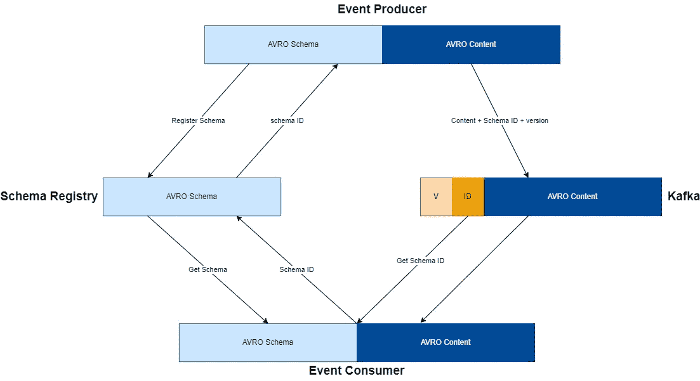
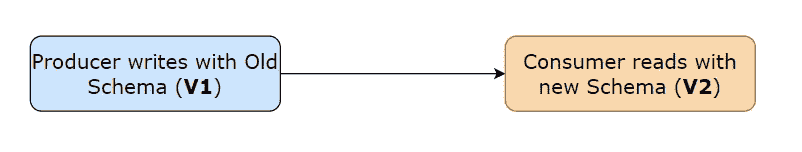
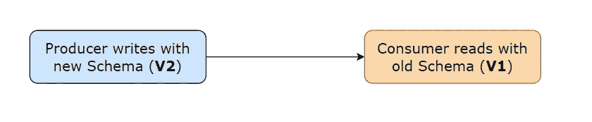

# 阿帕奇·AVRO:将结构化数据引入卡夫卡

> 原文：<https://levelup.gitconnected.com/apache-avro-bringing-structured-data-to-kafka-b225ae9eaa47>

Apache Avro 是一个数据序列化系统，旨在创建一种开放的、通用的、跨语言的文件格式，用于在持久存储中存储数据。Apache AVRO 支持常见数据类型的模式，并带有一个模式注册表，可用于在运行时检查和验证 AVRO 对象的模式。

# 什么是 Apache Avro 和 Schema Registry？

Avro 使用一种模式来序列化数据，这种模式可以用来帮助在进入 Kafka 的数据上实施结构。这很重要，因为它有助于确保一个主题中的所有消息彼此一致，这使得以后处理和查询数据变得更加容易。

> Kafka 在没有数据验证的情况下处理二进制字节。如果生产者改变了数据格式，消费者就会崩溃。为了避免这种情况，需要商定一种通用的数据格式，并且生产者和消费者都可以使用这种格式。Avro 依赖于 JSON 中定义的模式。当存储 Avro 数据时，其模式也随之存储。

卡夫卡的建筑与 AVRO 和图式注册表。

# 定义模式

下面是模式的结构:

*   **名称**:模式名称
*   **名称空间**:包名
*   **单据**:描述
*   **别名(可选)**:别名
*   **字段** :
    - **名称:**字段名称
    - **类型**:字段数据类型
    - **单据**:描述
    - **默认**:字段默认值。

# 模式注册表

Schema Registry 允许开发人员为他们的数据注册模式，然后 Avro 可以用来在进入 Kafka 的数据上自动执行这些模式。它提供了关于主题的向后/向前/完全兼容性。

Schema registry 提供 REST APIs 来:

*   添加架构
*   更新模式
*   检索模式
*   删除模式

模式和内容从生产者发送到消费者。

# 图式进化

模式进化是 Avro 模式的自动转换。这种转换是在客户机正在使用的模式版本(它的本地副本)和当前存储中包含的内容之间进行的。当架构的本地副本与用于写入值的架构不同时(即，当读取器架构与写入器架构不同时)，将执行此数据转换。当读取器模式与用于写入值的模式匹配时，不需要转换。

模式进化仅在反序列化期间应用。如果读取器架构不同于值的编写器架构，则在反序列化期间会自动修改该值，以符合读取器架构。为此，使用默认值。

不同版本的模式之间主要有 3 类兼容性:

## 向后兼容性

向后兼容性

## 向前兼容性

向前兼容性

## 全兼容性

当一个系统同时支持不同模式版本之间的向后和向前兼容性时，它被称为完全兼容性

# 更改模式的规则

如果要修改已经在模式注册表中使用的模式，需要记住几个规则:

1.  为了获得最佳结果，请始终为模式中的字段提供默认值。这样，如果您认为有必要，就可以在以后删除字段。如果您没有为某个字段提供默认值，则不能从您的模式中删除该字段。
2.  您不能更改字段的数据类型。如果您已经决定某个字段应该是某个数据类型，而不是最初创建它时使用的数据类型，那么就向您的模式中添加一个使用适当数据类型的全新字段。
3.  向架构中添加字段时，必须为该字段提供默认值。
4.  您不能重命名现有字段。但是，如果您想要通过某个名称而不是最初使用创建的名称来访问该字段，请为该字段添加并使用别名。

# 使用 AVRO 的 Kafka 生产者和消费者的示例 Java 代码

查看这个示例 Java 代码来理解这个概念，它使用了 apache AVRO、Schema Registry 和 Kafka。

 [## GitHub-jindalarpit/Kafka-avro-demo

### 在 GitHub 上创建一个帐户，为 jindalarpit/kafka-avro-demo 开发做贡献。

github.com](https://github.com/jindalarpit/kafka-avro-demo) 

# 参考

*   https://www.udemy.com/course/confluent-schema-registry/
*   [https://docs . Oracle . com/CD/e 26161 _ 02/html/GettingStartedGuide/avroschemas . html](https://docs.oracle.com/cd/E26161_02/html/GettingStartedGuide/avroschemas.html)