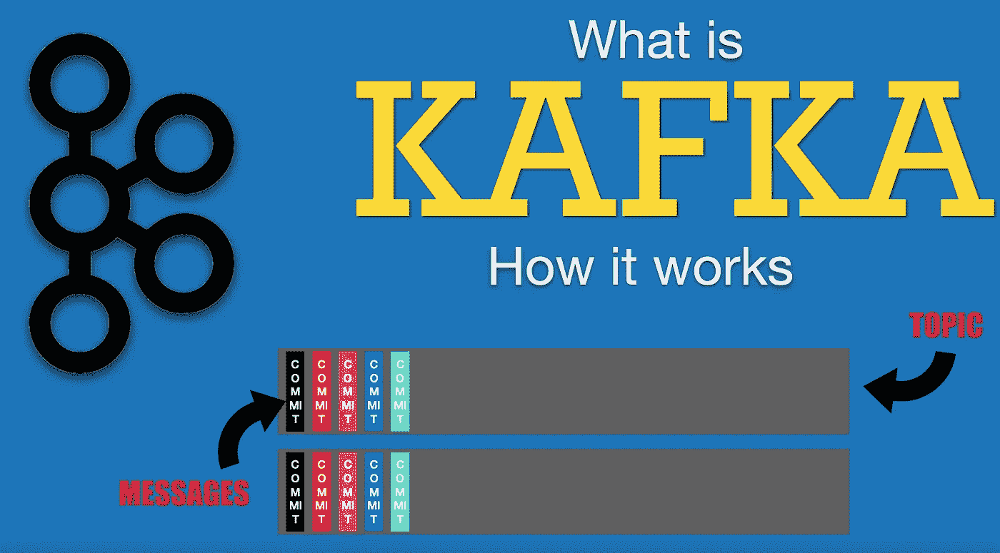
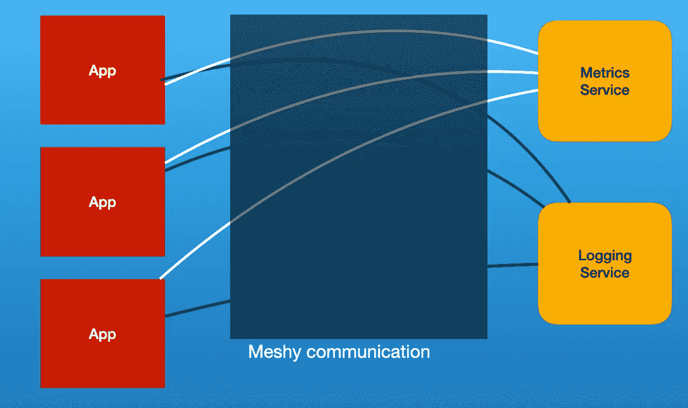
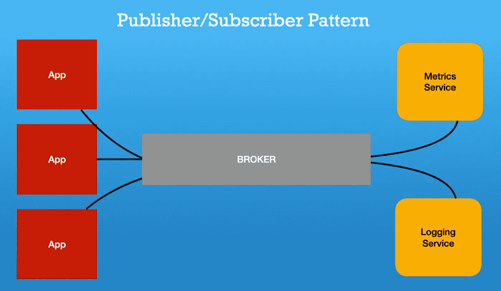
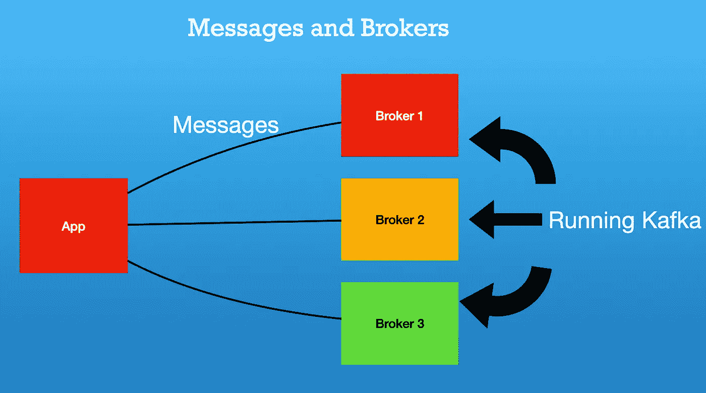
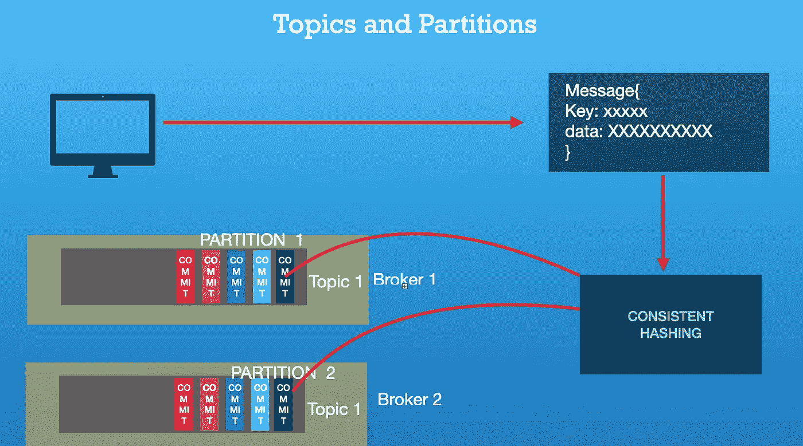

# 阿帕奇卡夫卡架构及其工作原理

> 原文：<https://levelup.gitconnected.com/apache-kafka-architecture-and-how-does-it-work-54e99f72b9be>

Apache Kafka 是分布式事件存储。它基于发布者-订阅者模式。它为高度可伸缩的系统提供冗余和并发性。

如果你更喜欢视频而不是文字，你可以在 Youtube 上找到同样的视频解释:【https://youtu.be/f8BDoivhtG4 

要理解卡夫卡，我们首先要理解出版商-订户模式。我们先来看看传统建筑的问题。

因此，在传统架构的情况下，许多服务将对其他服务进行 API 调用。例如，我们有一个日志服务和指标服务，分别用于存储指标和指标和日志。因此，这种传统架构存在两个问题:首先，如果任何服务由于部署或任何故障而中断。从应用程序发送的信息将被丢弃，这将导致数据丢失。另一方面，如果我们看看这里的网络，这里的网络似乎非常混乱。

所以传统建筑有两个问题

1.  部署或服务中断时的数据丢失
2.  网络非常混乱，这使得开发人员很难调试这些问题。

所以我们使用发布者-订阅者模式来解决这个问题。在发布者-订阅者模式的情况下，我们在中间引入了一个代理。先前对服务进行 REST API 调用的应用程序现在将向代理发布数据。另一方面，较早接收数据的服务将从代理接收数据。

因此，这里的网络非常干净，因为我们只使用来自代理的所有数据。

*如果任何服务(如度量服务或日志服务)停止运行，该怎么办？*

在这种情况下，消息将由代理保留，不会丢失。当特定服务再次启动并运行时，它将能够使用从代理发布的数据。

# **卡夫卡是什么？**

用技术术语来说，Kaka 是一个分布式提交日志。

所以现在让我们试着分解一下，理解卡夫卡的各个组成部分。

1.  代理和消息
2.  话题和政治家
3.  出版商消费者和消费者群体

**经纪人和消息**

因为卡夫卡一般分布在多台机器上。每台运行卡夫卡实例的机器。这些机器被称为代理。发布者发送给代理的信息称为消息。

**主题和分区:**

因此，当我们讨论 Kaka 是一个分布式提交日志时，我们可以假设这个主题是一个巨大的提交日志文件。主题相当于数据库中存储所有信息的表。所以出版商会将数据放入特定的主题中。主题是只附加文件系统，其中所有消息都附加在日志文件的末尾。这些主题被细分成更小的部分，这些部分被称为分区。这些分区用于使我们的系统更具可伸缩性，并在特定时间为并发请求提供服务。

**发布者**:发布者是把数据推进卡夫卡的机器。

**消费者**:消费者从特定主题中读取数据。

**代理**:运行卡夫卡的个人机器被称为代理。

**主题**:主题相当于数据库中的表格。它是存储信息的抽象。

**分区**:主题的一个子分区称为分区。

# **卡夫卡是如何工作的？**

所以出版商过去常常在卡夫卡的主题中推送信息。一个卡夫卡主题被分成若干分区。特定主题的分区基于分区关键字来标识。这个分区密钥是由 Kafka Broker 通过在消息上运行一致的算法而生成的。

现在，我们将卡夫卡主题中的数据分成了更小的请愿书。将有一组消费者订阅特定的主题并接收数据进行处理。订阅特定主题的一组消费者被称为**消费者群体。**

因此，每个使用者都维护偏移量，直到处理完数据。因此，消费者使用当前偏移量来轮询 kaka 代理，并要求在此之后发布数据。如果主题中存在许多这样的数据，消费者将获得这些数据。在接收到数据时，消费者将更新其偏移量，并将新偏移量标记为数据已被处理的点的标记。