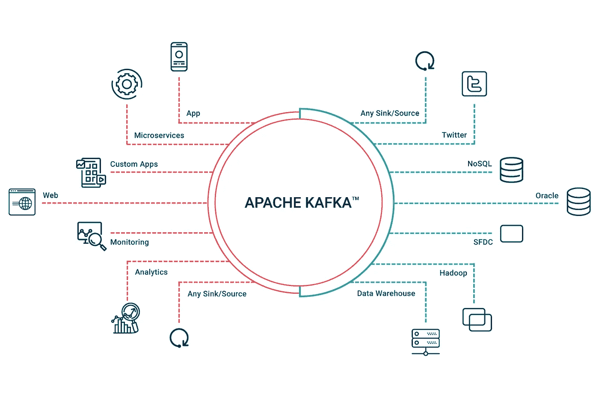
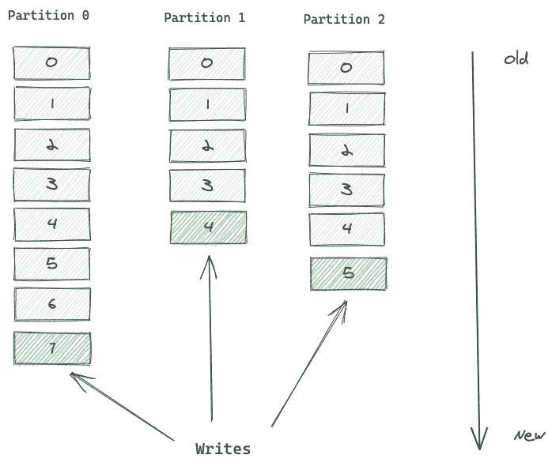
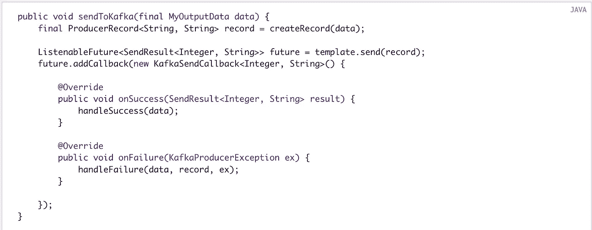
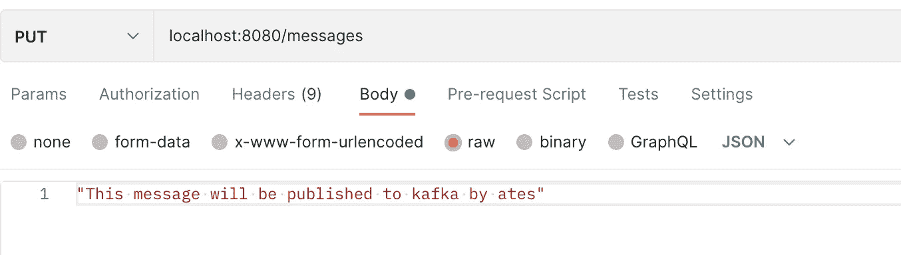
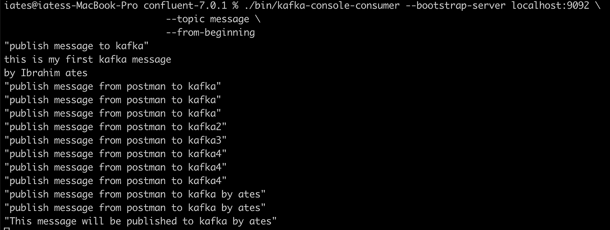
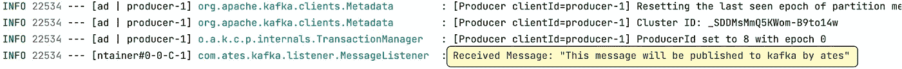

# 阿帕奇卡夫卡与 Java

> 原文：<https://levelup.gitconnected.com/apache-kafka-with-java-7c3a0dafd7f5>



图片来源:[https://ax ual . com/WP-content/uploads/2021/05/Apache-Kafka-streaming-platform . JPEG](https://axual.com/wp-content/uploads/2021/05/apache-kafka-streaming-platform.jpeg)

我想讨论的另一种异步通信方式是消息流及其众所周知的平台 Apache Kafka(这篇文章的其余部分将是 Kafka)。在上一篇文章中，我试图解释消息队列和著名的 RabbitMQ。

在开始 Kafka 之前，我将简单地提到消息队列和消息流之间的区别。如果您想了解更多信息，请查看参考链接。

*   **删除消息**

流和队列的区别在于，一旦消息被写入流，它们就留在那里。消息队列是指一旦从队列中读取了一条消息，该消息就会被删除。

在任何情况下，将消息从队列中删除并发送到端点都会导致消息在处理之前丢失。死信是一种解决方案，用于保存我们的消息，以应对 API 层中的一些有问题的情况或异常。但是让我们假设你有一个网络层的问题。您的消息已从队列中删除，但由于网络问题，没有提供服务。接下来会发生什么？很不幸，你会丢失你的信息。

在流中，即使你的信息被阅读，它也会一直存在。此外，它不仅仅是消息传输。它也是数据存储，通常存储在数据库表的行中。这种风格是事件源。[这里的](https://martinfowler.com/eaaDev/EventSourcing.html)解释了什么是事件采购。

*   **主题划分**

没有办法分割队列中的消息。但是我们可以在消息流中将主题分成几个部分。



图片来源:[https://medium . com/event-driven-utopia/understanding-Kafka-topic-partitions-ae40f 80552 e 8](https://medium.com/event-driven-utopia/understanding-kafka-topic-partitions-ae40f80552e8)

*   **回调结果**

您可以用一个`ProducerListener`配置`KafkaTemplate`来获得一个异步回调，无论发送的结果是成功还是失败，而不是等待`Future`完成。



图片来源:[https://docs . spring . io/spring-Kafka/reference/html/# spring-boot-producer-app](https://docs.spring.io/spring-kafka/reference/html/#spring-boot-producer-app)

## 卡夫卡

最著名的消息流平台是卡夫卡。

卡夫卡如此受欢迎并被广泛使用的原因是:

*   快的
*   可攀登的
*   容错的
*   高可用性和对节点故障的弹性

此外，它还有一些好处，如:

*   跟踪网络活动
*   警报和报告运营指标
*   将数据转换成标准格式
*   连续处理流向主题的数据流。

现在，我想展示我们如何通过代码实践进行开发。

开始之前，请确保您安装了 Kafka，然后在您的本地机器上启动 Kafka broker。

## 在 Mac 上安装 Kafka

1.  在二进制下载下从 https://kafka.apache.org/downloads[下载最新版本。](https://kafka.apache.org/downloads)
2.  导航到 Kafka 文件夹的根目录并打开一个终端。对于这个例子，我下载了 3.2.0 版本，并把它移到了目录的`~/kafka-3.2.0`下。

或者

您可以使用自制软件下载并安装，例如:`brew install kafka`

## 启动 Kafka 代理

如果您位于 Kafka 文件夹的根目录下，则执行以下脚本来启动 Kafka broker。

```
bin/zookeeper-server-start.sh config/zookeeper.properties
```

## 应用程序接口

*   **发布部分**

首先，我开发了 publish part 来发布消息，为此，我配置了***kafkatopiconfig。***

kafkaAdmin 是通过给出地址来配置的，一个新主题是通过主题名创建的。

***KafkaProducerConfig***

ProducerFactory 是通过给定地址和序列化程序配置等配置来配置的。

Kafka 模板应该配置为发布消息。

**application.yml**

我创建了一个端点来**发布**消息给 ***消息控制器*** 中的卡夫卡。

***MessageService***类；

为了发布消息，使用了我上面定义的 KafkaTemplate。

*   **消费部分**

在完成发布部分之后，我开发了一个消费者部分来读取关于该主题的消息。一开始我配置了 **KafkaConsumerConfig** 。

然后，我添加了 MessageListener 类。

**注意:**没有@Component 或@Service，@KafkaListener 在这个例子中不起作用。

最后我用*打电话给端点“这条消息将由 ates*body 通过邮递员发布给卡夫卡；



邮递员请求

之后，我通过运行下面的脚本，看到我的消息发布在卡夫卡专题上；

```
./bin/kafka-console-consumer --bootstrap-server localhost:9092 \
                             --topic message \
                             --from-beginning
```



所有发布的消息

另外，我在 API 控制台中看到了该消息。



收到的消息:“此消息将由 ates 发布给卡夫卡”

全部代码都在我的 [Github](https://github.com/atesibrahim/kafka) 页面上。

希望有帮助，

期待在下一期分布式技术文章中见到您。

感谢阅读…

***参考文献*** :

[](https://kafka.apache.org/) [## 阿帕奇卡夫卡

### 超过 80%的财富 100 强公司信任并使用卡夫卡。阿帕奇卡夫卡是一个开源的分布式事件…

kafka.apache.org](https://kafka.apache.org/) [](https://aws.amazon.com/msk/what-is-kafka/) [## 什么是阿帕奇卡夫卡？AWS

### Apache Kafka 是一个分布式流平台，用于构建实时流数据管道和…

aws.amazon.com](https://aws.amazon.com/msk/what-is-kafka/) [](https://martinfowler.com/eaaDev/EventSourcing.html) [## 活动采购

### 事件源的基本思想是确保应用程序状态的每一个变化都被捕获到…

martinfowler.com](https://martinfowler.com/eaaDev/EventSourcing.html) [](https://medium.com/@patelharshali136/apache-kafka-tutorial-kafka-for-beginners-a58140cef84f) [## 阿帕奇卡夫卡教程—面向初学者的卡夫卡

### 1.卡夫卡教程

medium.com](https://medium.com/@patelharshali136/apache-kafka-tutorial-kafka-for-beginners-a58140cef84f)  [## 阿帕奇卡夫卡的春天

### 公共接口 message listener {(1)void on message(consumer record data)；}公共接口…

docs.spring.io](https://docs.spring.io/spring-kafka/reference/html/#quick-tour) [](https://hevodata.com/learn/install-kafka-on-mac/) [## 如何在 Mac 上安装卡夫卡？| 3 个简单的步骤

### 来自数据库、传感器、移动设备、云服务等来源的事件形式的实时数据…

hevodata.com](https://hevodata.com/learn/install-kafka-on-mac/) [](https://developer.confluent.io/quickstart/kafka-local/) [## Apache Kafka 快速入门-本地安装

### 汇合平台包括 Apache Kafka。通过运行以下命令下载社区版。wget…

developer.confluent.io](https://developer.confluent.io/quickstart/kafka-local/) [](https://hackernoon.com/tagged/kafka?ref=hackernoon.com) [## 44

### 编辑描述

hackernoon.com](https://hackernoon.com/tagged/kafka?ref=hackernoon.com) 

# 分级编码

感谢您成为我们社区的一员！更多内容见[级编码出版物](https://levelup.gitconnected.com/)。
跟随: [Twitter](https://twitter.com/gitconnected) ， [LinkedIn](https://www.linkedin.com/company/gitconnected) ，[迅](https://newsletter.levelup.dev/)
升一级就是转型科技招聘👉 [**加入我们的人才集体**](https://jobs.levelup.dev/talent/welcome?referral=true)