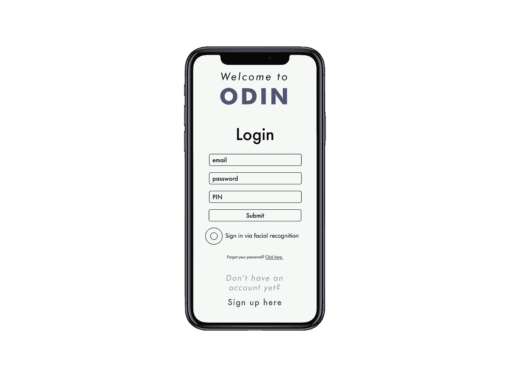
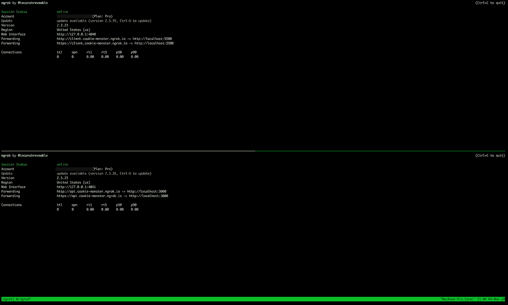
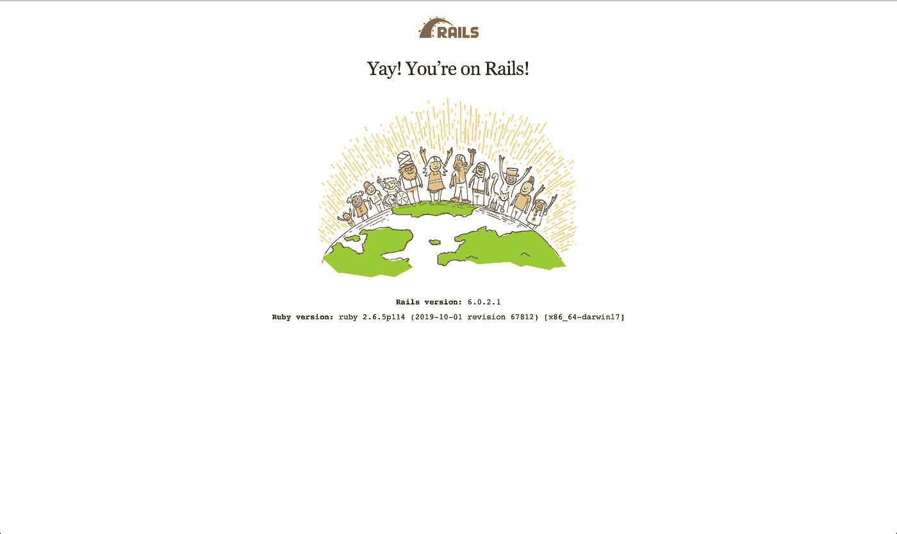
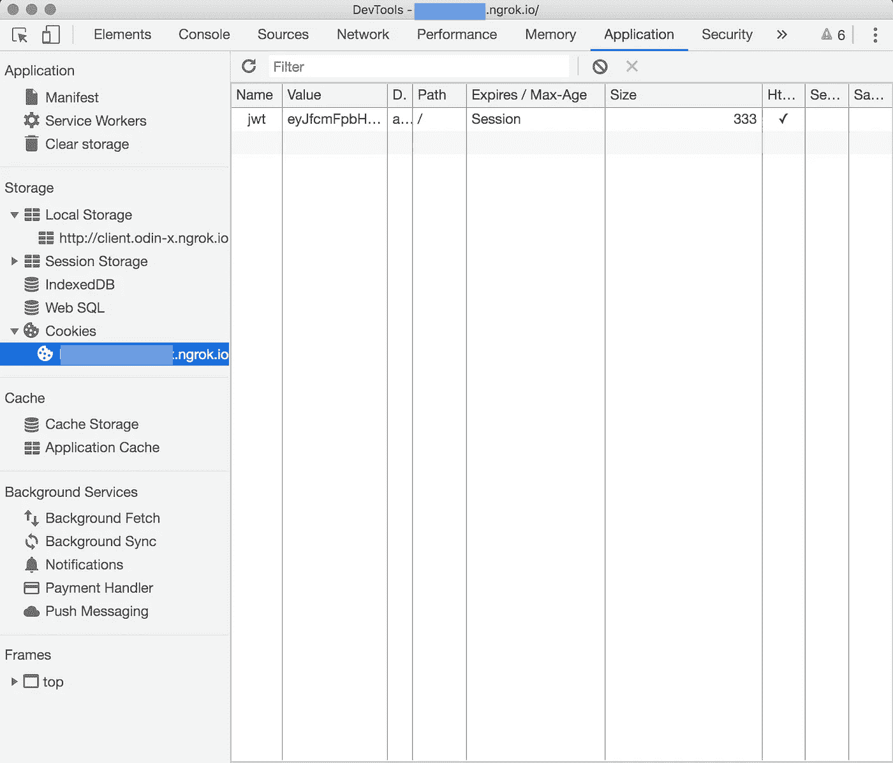

# 使用 Rails 6 和 React 通过 JWT 保护 API

> 原文：<https://levelup.gitconnected.com/api-authentication-with-jwt-and-cookies-featuring-rails-6-and-react-bd33a477c559>

## 关于在同一个域中为基于 cookie 的身份验证提供 API 和前端应用程序的指南



在这篇文章中，我将带你建立一个基于 cookie 的带有子域的认证系统，这样你的应用将符合 web 标准，它的 cookie 将保存在 iOS 和 Safari 上。

# 为什么要把 JWT 放在饼干里？

存储在本地存储器中的一个简单的 JWT 将足以保护一个小的应用程序。但是，在大型生产级应用程序中，它会带来安全风险。我们通过将 JWT 编码为仅 HTTP cookie 并将其传递给用户的浏览器来缓解许多安全问题。这样，恶意的 Javascript 就无法访问我们的 JWT，因为浏览器本身会为每个后续请求自动包含 cookie。这大大减少了前端的身份验证代码/逻辑的数量，因为我们不需要使用 Javascript 来管理和存储令牌。

# 苹果的问题…

苹果 Safari 在 MacOS 和 iOS 上的最新变化改变了 cookies 的保存方式。如果您的服务器设置为跨源提供 cookie，Safari 将不会存储服务器传递的 cookie。这是因为 cookie 的来源和请求来源是不同的。

本文介绍了如何以符合这些规则的方式实现身份验证系统。

简而言之，认证请求源(React)和响应源(Rails 6)必须在同一个域中。

如果我们的后端和前端是分开托管的，这会在开发过程中造成问题(如果您在 API 模式下使用 create-react-app 和 Rails，这是非常常见的)。为了解决这个问题，我们将使用 ngrok。

# 设置 Ngrok

对于门外汉来说，Ngrok 是一个很棒的软件，它可以让你把流量从互联网传输到你的本地服务器。如果您想将运行在本地主机上的开发服务器提供给互联网的其他部分，这将非常有用。

首先前往[https://ngrok.com](https://ngrok.com)注册一个专业账户，这将允许我们保留一个域名，可用于我们的前端和后端。我们将使用 client . your-domain-here . ngrok . io 服务 React 应用程序，使用 api.your-domain-here.ngrok.io 服务 Rails 服务器。关于设置 ngrok 的基本介绍，请参考 Twilio [的这篇优秀指南 https://www . Twilio . com/blog/2016/12/localhost-tunneling-ngrok-MAC-OS-x . html](https://www.twilio.com/blog/2016/12/localhost-tunneling-ngrok-mac-os-x.html)。设置完成后，将其连接到你的付费账户(说明见 https://ngrok.com)并在 ngrok web dashboard 中保留你的域名。

## 点燃 ngrok



我喜欢使用 Tmux 来做这种事情，你可以看到 2 个 ngrok 隧道将流量路由到我的本地服务器

假设您的 rails 服务器运行在端口 3000 上，导航到您下载 ngrok 的位置并输入

```
./ngrok http 3000 -subdomain api.your-subdomain-here
```

对前端进行同样的操作，我们将假设您的 React 服务器运行在端口 5500 上

```
./ngrok http 5500 -subdomain client.your-subdomain-here
```

这些命令实际上告诉 ngrok 在您的保留域下创建一个子域，并将去往这些 URL 的所有流量路由到端口 5500 和 3000。

通过这种设置，我们满足了 Apple/Safari 在用户浏览器中愉快地接受和保存服务器 cookies 的要求。

# 让我们从后端开始

我们将为此使用 Rails 6，你可以在我的 github repo 上找到完整的代码:[https://github . com/donrestarone/cookie-authentic ation-back end](https://github.com/donrestarone/cookie-authentication-backend)。我为每个步骤都创建了分支，这样更容易理解。

## 仅适用于 Rails API 应用程序



如果你像我一样在 API 模式下使用 Rails 6，你首先需要在 config/application.rb 中添加一个额外的中间件。如果您使用的是传统的 Rails 堆栈，可以跳过这一步。

在第 36 行，我们添加了 ActionDispatch::Cookies

接下来，我们需要确保我们可以访问控制器中的 cookies 模块。为此，我们将这一行添加到 ApplicationController 中。

通过将它包含在这里，我们所有的控制器都可以处理 cookies

## 设置 CORS(跨来源资源共享)

通常对于 API，我们将允许通配符域(这意味着任何域都可以向我们的服务器发出请求)。这种方法不适用于 http-only cookie，因为它们被绑定到客户端的特定域。为了解决这个问题，我们将把为 React 应用程序提供服务的域列入白名单。

如果您使用的是 Rails 6+，那么 Rack-cors gem 的最新版本中目前存在一个 bug，导致它拒绝白标域。请确保使用“rack-cors”，即“~> 0.4.1”来避免此问题。

Debug true 将显示进入 API 的所有请求的日志。没有这个，被拒绝的请求将不会显示。这样，如果你的前端不能与后端对话，你可以进行调试(检查 chrome 开发工具中的 CORS 错误)

## 创建一个编码和解码 JWT 氏症的模块

该模块将接受作为哈希和到期时间传递的有效负载。如果令牌过期、无效或未经 Rails secret 签名，此函数将返回 false。否则，它将返回解码后的令牌

我们将把这个文件保存在 lib/core _ modules/JSON _ web _ token 下

为了更好地衡量，我们将明确地告诉 Rails 自动加载/lib 文件夹。

我们用第 24 行的代码告诉 Rails 自动加载/lib 下的所有文件

为了简洁起见，我将跳过模型并注册设置，因为您可以在我的 Github repo 上查找它。

## 当用户登录时提供 cookie，当用户退出时销毁它

Cookie 身份验证几乎与 JWT 身份验证相同，用户将提供他们的电子邮件和密码，如果这些有效，我们将签署一个 cookie 并将其传递给他们的浏览器。

神奇的事情发生在第 22 行，我们在饼干上签名。该值被设置为 JWT(包含一些用户信息，如他们的 ID ), http only 选项确保它只被传递给浏览器，而不是客户端 Javascript。

对于注销，在运行 destroy 方法之前，我们确保 cookie 是有效的(这就是 before_action 块所做的)。如果是，我们只需删除 cookie，就可以将它从用户的浏览器中删除。

## 检查用户是否有有效的 cookie，并从中提取用户信息

首先，我们将在应用程序控制器中创建一些助手函数。这两种方法将被反复使用，以检查用户是否拥有有效的 cookie，并从该 cookie 中获取当前用户信息。

authenticate_cookie 将检查传递的 cookie 并尝试解码它。如果有效，它将返回 true，从而继续过滤器链。否则，它将呈现一个错误，React 应用程序可以使用该错误向用户显示一条有用的消息(可能会告诉用户他们的会话已经过期，他们需要重新登录)。

current_user 将帮助我们找到在任何给定时刻发出请求的用户。

大部分繁重的工作现在已经完成。万一你在这里逗留了这么久，那就出发吧！

# 设置 React

这一部分真的很简单，你所需要做的就是添加凭证:“include”到你的每一个 fetch 调用，浏览器会自动包含请求的 cookie。这是一个登录和退出的例子

如果你在登录时瞥一眼 chrome dev tools，你会看到一个只有 http 的 cookie 被 Rails 服务器放入你的浏览器。此 cookie 会在您注销时消失。



这就是全部了！

沙希科是一名来自多伦多的软件工程师，也是 T2 Restarone 公司的创始人。当他不开发软件时，他就在 Medium 和 [YouTube](https://www.youtube.com/channel/UCFl6NiPZtdsLHWUPWhrJj3g) 上创造内容，帮助人们过渡到科技行业。