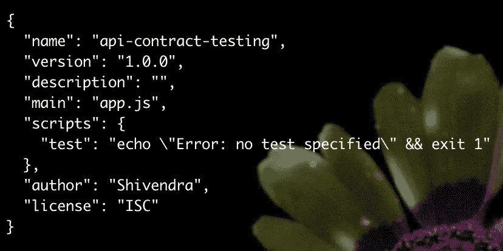
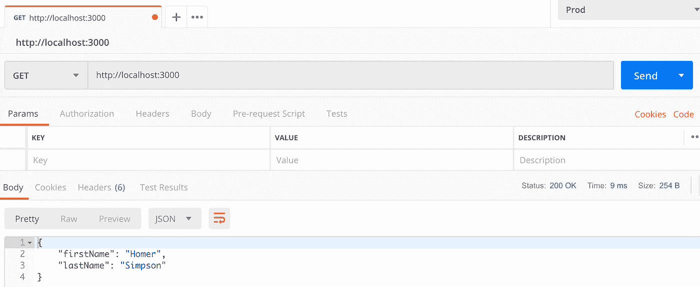
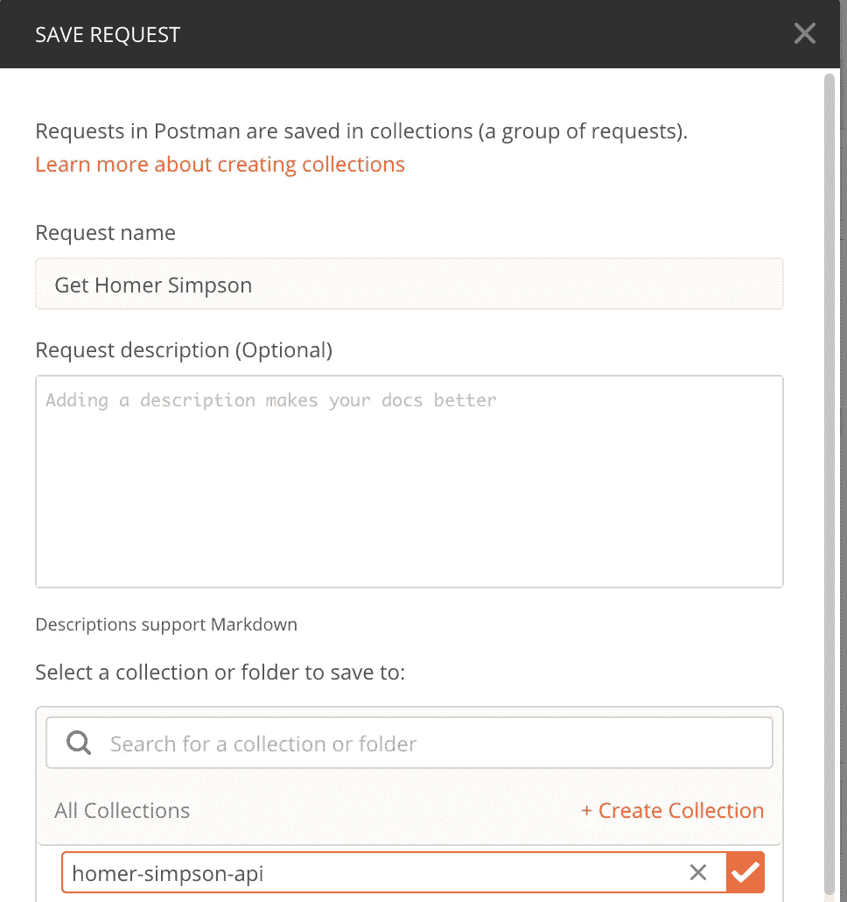
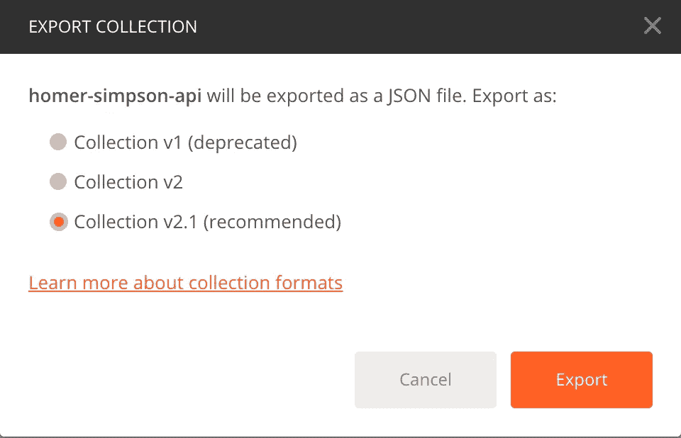

# 与邮递员的 API 合同测试

> 原文：<https://levelup.gitconnected.com/api-contract-testing-with-postman-a8af93e79d5>

我将向您展示一种使用 Postman 和 Node.js 测试 API 契约的简单方法。

我正在为我目前的公司开发一个移动应用程序。我们面临的挑战之一是 API 端点/契约的频繁变更。我们还面临着沟通的挑战，因为我们身处不同的地方——开发这个特定 API 的开发人员住在西班牙的巴塞罗那，而我在新西兰。

我需要一种机制，对那些 API 契约的变更提供早期和一致的反馈。编写集成测试似乎太重了，我需要能更快完成的东西。

## 我对这个问题的解决方案

首先，我们将使用名为 **Postman** 的工具。Postman 是一个非常有用的辅助 API 开发的工具。它支持创建 HTTP 请求、保存和共享请求集合、针对这些请求的响应编写测试，等等。

其次，我们将编写一个 Javascript 文件，允许我们以自动化的方式运行这些 Postman 请求和测试。

我会尽力描述每一步。如果它过于简单，我向更有经验的读者道歉，如果我解释得不够，我向经验较少的技术专家道歉。你可以在 Github 上找到这方面的代码——https://github.com/shivendraodean/api-contract-testing

***我们开始吧！*** 请下载以下工具-

*   邮递员—[https://www.getpostman.com](https://www.getpostman.com)
*   node . js—[https://nodejs.org/en/](https://nodejs.org/en/)
*   纽曼—[https://www.npmjs.com/package/newman](https://www.npmjs.com/package/newman)

## 1 —创建一个基本的 API 项目



图 1 —项目详情

将以下命令一次一行地复制并粘贴到终端中。

***npm init*** 会提示更多信息，按照图 1 填写。

```
mkdir api-contract-testing
cd api-contract-testing
npm init
touch app.js
touch apiContractTest.js
npm install express newman
```

将以下内容复制并粘贴到 app.js 中。这是一个基本的 express.js 服务器应用程序。第 11 行基本上是根*路径*，它将返回给我们一些数据。

```
const express = require('express')
const app = express()
const port = 3000const testData = {
  firstName: 'Homer',
  lastName: 'Simpson'
}app.get('/', (req, res) => res.send(testData))app.listen(port, () => console.log(`Server listening on port ${port}`))
```

保存文件并执行以下命令。然后打开网络浏览器，导航到 [http://localhost:3000](http://localhost:3000)

这个结果就是我们现在要用 postman 测试的。

```
node app.js
```

## 2-创建邮递员集合

**2.1 —** 创建新的获取请求



**2.2 —** 点击测试选项卡，向请求中添加测试。 ***模式*** 引用了一个全局变量，我们将在下一步*中定义它。*粘贴以下内容。

```
pm.test("Homer's schema should be correct", function() {
    var response = pm.response.json();

    var result=tv4.validateResult(response, schema) pm.expect(result.valid).to.be.true;
});
```

接下来，我们定义模式。我从这个 web 应用程序生成了模式-[https://jsonschema.net/#/](https://jsonschema.net/#/)

它基本上允许您在左侧粘贴任何 JSON，并在右侧推断 JSON 模式，然后您可以复制并使用该模式。

点击预先请求脚本并粘贴以下内容—

```
schema = {
  "definitions": {},
  "$schema": "[http://json-schema.org/draft-07/schema#](http://json-schema.org/draft-07/schema#)",
  "$id": "[http://example.com/root.json](http://example.com/root.json)",
  "type": "object",
  "title": "The Root Schema",
  "required": [
    "firstName",
    "lastName"
  ],
  "properties": {
    "firstName": {
      "$id": "#/properties/firstName",
      "type": "string",
      "title": "The Firstname Schema",
      "default": "",
      "examples": [
        "Homer"
      ],
      "pattern": "^(.*)$"
    },
    "lastName": {
      "$id": "#/properties/lastName",
      "type": "string",
      "title": "The Lastname Schema",
      "default": "",
      "examples": [
        "Simpson"
      ],
      "pattern": "^(.*)$"
    }
  }
}
```

现在，如果您按“发送”，请求将被发送，测试将运行。



**2.3 —** 将请求保存到集合。现在您已经有了一个集合，您可以打开**测试运行器**并为该集合运行测试。

**2.4 —** 出口收汇。单击集合旁边的椭圆，然后选择“导出”。指定 JS 的根目录作为下载目的地。

**3 —用 Javascript 编程运行测试**

将以下脚本复制到 apiContractTest.js 中。

```
const newman = require('newman')newman.run({
  collection: require('./homer-simpson-api.postman_collection.json'),
  reporters: 'cli',
})
```

将以下内容复制到 package.json 文件的脚本部分。

```
"contractTests": "node ./apiContractTest.js",
```

现在执行这个，确保 API 服务器正在运行—

```
npm run contractTests
```

这就是了。我希望你觉得这是有用的。

你可以在 Github 上找到这个的代码——这里是[https://github.com/shivendraodean/api-contract-testing](https://github.com/shivendraodean/api-contract-testing)

如果你觉得有帮助，请喜欢并分享。

[](https://levelup.gitconnected.com)[](https://gitconnected.com/learn/javascript) [## 学习 JavaScript -最佳 JavaScript 教程(2019) | gitconnected

### 50 大 JavaScript 教程-免费学习 JavaScript。课程由开发人员提交并投票，从而实现…

gitconnected.com](https://gitconnected.com/learn/javascript) 