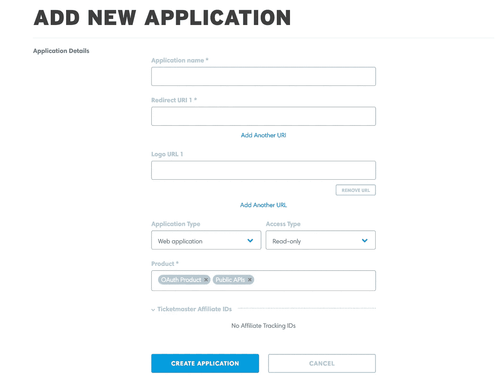
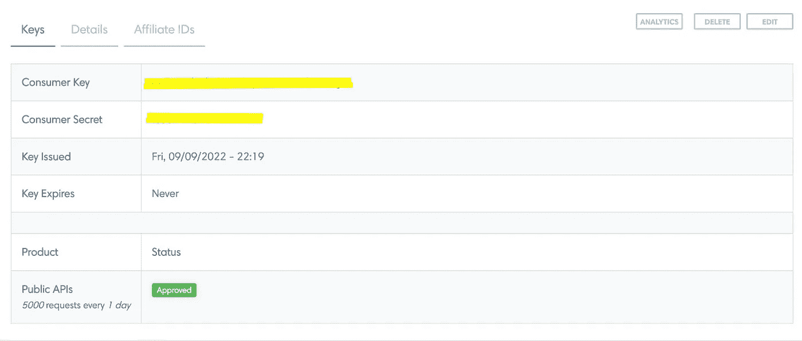
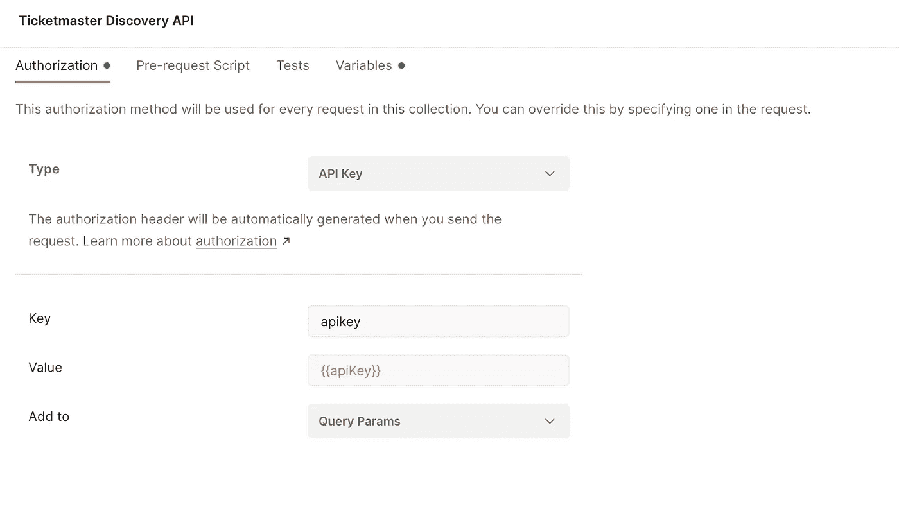
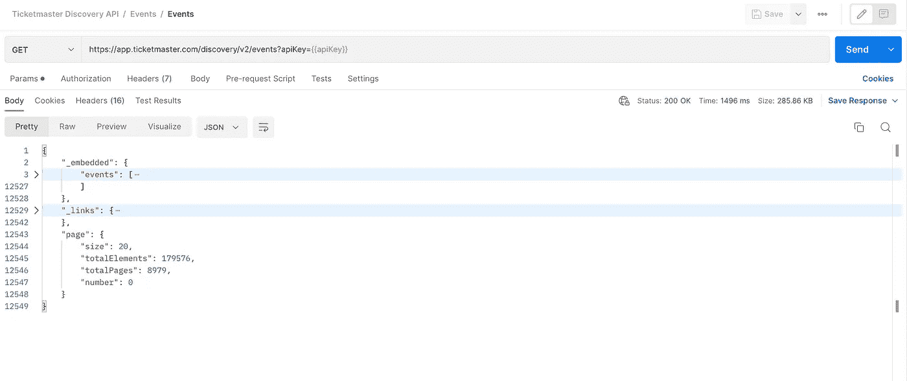
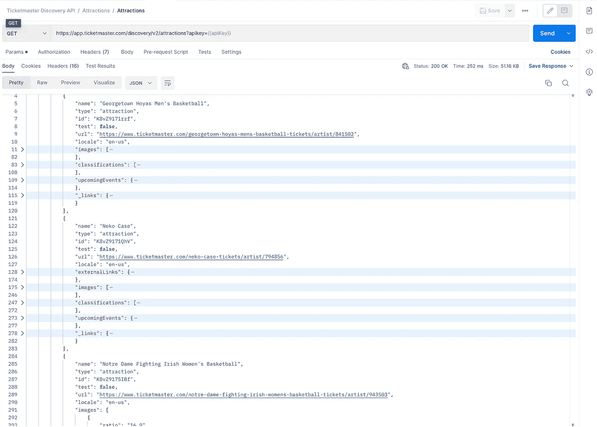
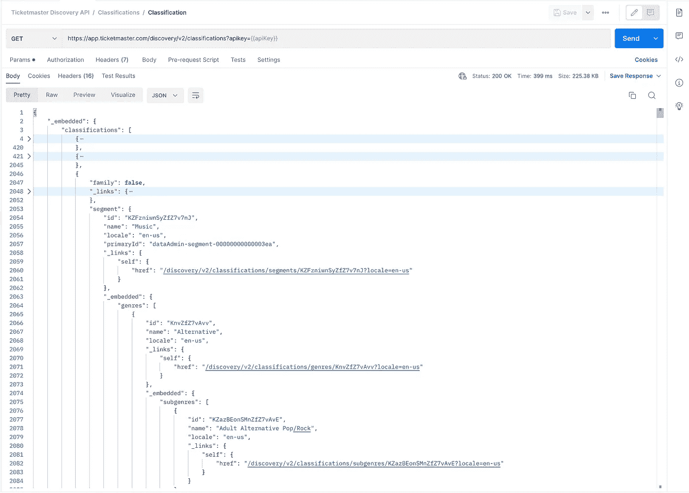
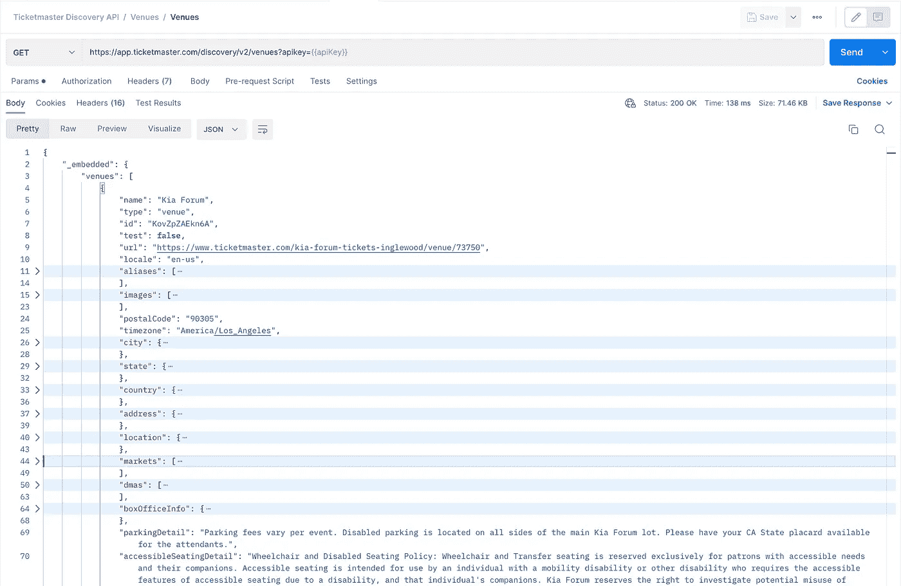
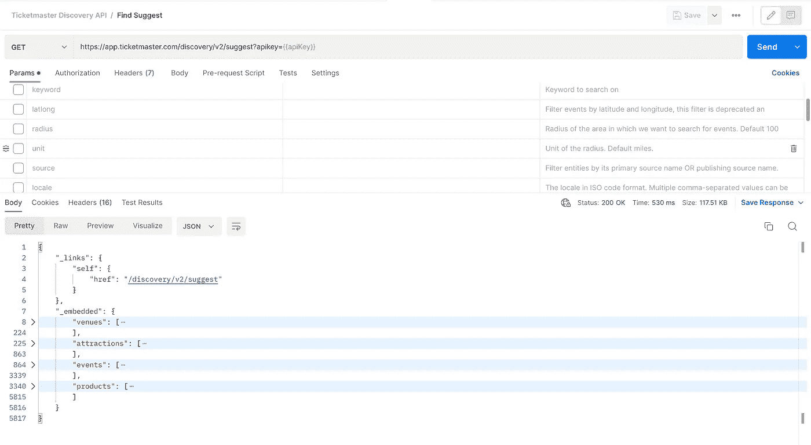
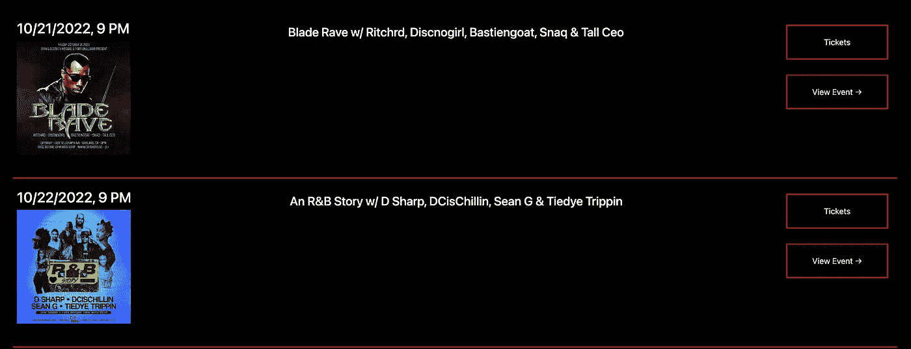

# API 深度挖掘:Ticketmaster 发现 API

> 原文：<https://levelup.gitconnected.com/api-deep-dive-ticketmaster-discovery-api-922edeceaa17>

深入探索 Ticketmaster 探索 API！本文附邮差合集，一探究竟。

Ticketmaster discovery API 深度挖掘

Ticketmaster 是世界上最大的机票分销公司。该公司拥有超过 10，000 名客户，他们的活动范围从歌剧到摔跤比赛到百老汇表演再到音乐会。如果你去过大型体育场或场馆的售票活动，那么你可能以前用过 Ticketmaster。

我组织音乐活动，自 2017 年以来，作为我的业余爱好，我做了很多活动营销，所以我对这个世界非常熟悉。自然，我必须看看 Ticketmaster 可能有什么 API。对于任何开发人员来说，最容易入门的是发现 API。

Ticketmaster Discovery API 可用于查看使用 Ticketmaster 的事件——正如我们上面所概述的，这意味着大量的事件。

我不得不说我确实喜欢这个记录网站。它有一个用例表和一个非常好的数据模型图，很容易阅读。

这里有一个我做的文档和收藏的链接，你可以跟着玩。 那我们就潜入其中吧！

# **引导和认证**

要开始使用 API，请访问他们位于[https://developer.ticketmaster.com/](https://developer.ticketmaster.com/)的控制台仪表板。

从下面的表单创建一个新的应用程序。您将看到一个应用程序表，其中包含您的消费者密码和客户端 ID。但是，您不需要这些，因为这些是他们的合作伙伴 API，需要更多的审查。

***要获得您的 API 密钥*** ，只需导航到文档。您的 API 密匙将在任何示例中自动填充。从示例 URI 中获取您的 API 密钥。

创建 Ticketmaster 应用程序

Ticketmaster 应用程序详细信息

一旦有了 API 键，就可以转到 Postman，在集合级别添加 API 键作为查询参数。

添加 API 键作为查询参数

# **API 端点**

现在我们可以调用我们的 API。使用事件的基本端点，您可以看到它们显然有大量的结果。除非您尝试自己重建他们的数据库，否则他们的其他端点会帮助您准确定位您可能需要的事件。

包含大量页面和事件的事件端点

实际上，您可以将端点组织到这些主要分类中，以帮助查找事件:按地点、按景点和按分类。

**您可以按景点、场馆或分类搜索活动。**

*景点可以是艺术家、运动队、巡回演出等。*如果你想跟踪一个表演者、团队或艺术家，请使用此选项。

按景点搜索活动

分类实际上是事件(片段)的流派或类型。每个事件都有一个分类，可以细分为片段、类型或子类型。

按分类搜索事件

如果你有一个最喜欢的场地，并且想看看那里正在举行什么活动，场地是很棒的。或者如果你只是需要场地细节。

按场馆搜索活动

***API 甚至有一个端点，用于事件的搜索建议。***

查找建议端点

每个端点都有许多选项来过滤和查找事件。您甚至可以查询尚未宣布或确定日期的活动，只要主办方已经发布了该活动。几乎太多的过滤选项需要列出:*位置，半径，段号，venueId，genreId，includeTBA，include TBD 等。*

# 使用**案例**

文档有一个非常简单的用例表。但是从另一个层面来说，这个 API 可以用来根据许多不同的标准获取时事通讯。例如为乐队或场所创建时事通讯、为哥特音乐网站寻找活动源等。

我用这个 API 为我做的一个场地网站制作了一个[盖茨比插件](https://www.gatsbyjs.com/plugins/gatsby-source-ticketmaster/)。

下面是使用发现 API 的站点:[https://crybab . live](https://crybaby.live)

使用 Ticketmaster 发现 API 的 Gatsby 插件有一个事件源

创意企业家在这里有很多用途。

# 最后的想法！

API 非常棒。如上所述，我已经使用 Discovery API 创建了一个场馆网站。文档也很酷。我喜欢用例表和数据图表。找到你需要的东西也很容易。

我并不喜欢某些端点的所有查询参数。看起来使用 JSON 数据负载进行过滤会更好。我甚至认为这可能是一个非常好的 API，可以放在 GraphQL 之后，用于事件的密集查询和查询搜索建议。

对于每个请求，API 密钥都以明文形式公开。虽然这个 API 不做任何数据更改，但如果有人得到它并运行速率限制，这仍然是一件痛苦的事情。然而，这种设计模式对于 API 来说并不罕见，所以*而不是*这样暴露 API 键的障碍。也许使用消费者秘密和消费者 ID 来交换 API 令牌将是对抗使用你的速率限制的人的最好方法。

总的来说，这是一个非常酷和有价值的 API！这里有一个链接，你可以用它来玩。

# **TL；博士**

*   Ticketmaster Discovery API 是一个完美的只读 API，可以根据场地、分类或景点来吸引活动。
*   身份验证很容易，但是 API 键每次都在查询参数中，所有过滤选项也是如此——它最终会有很大的 URL
*   大量的方式来查询和过滤事件！超级容易使用和开始。
*   链接到邮差合集:[https://documenter.getpostman.com/view/1034536/2s847FwEYE](https://documenter.getpostman.com/view/1034536/2s847FwEYE)

## 其他邮递员和 API 文章

*   [制造邮递员不和机器人](/automate-the-boring-stuff-with-postman-discord-bots-9a2ad0088792)
*   [有邮差和不和的网络插座](/websockets-with-postman-and-discord-db26efed56c1)
*   [使用 Postman Hack 同步截图](https://medium.com/swlh/automate-the-boring-stuff-with-postman-syncing-product-screenshots-3af6e0e2e2cf)

[在 LinkedIn 上联系我](https://www.linkedin.com/in/stcalica/)。