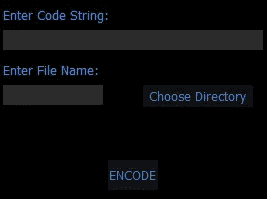
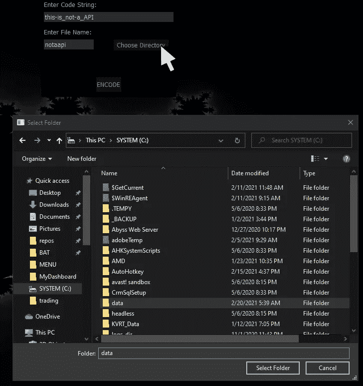
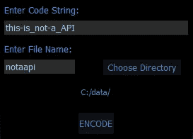
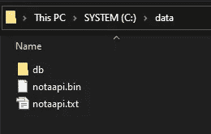
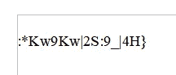
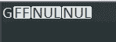

# API 加密前端

> 原文：<https://levelup.gitconnected.com/api-encryption-front-end-9bbfedd8c45f>

我写了一个关于如何使用密码加密 API 密钥的程序。该密码的输出是一个包含加密字符串的. txt 文件和一个包含解密密钥的. bin 文件。



我希望这个密码有一个图形化的前端，可以从主屏幕上的菜单栏调用。上面的图片是我最后得到的。完整的代码位于本文的末尾。

我们通过输入 API 代码(或密码等)来使用 GUI。)输入“输入代码字符串:”下的文本框中。接下来，输入要用于的文件名。txt 和。bin 文件，然后点击“选择目录”。点击此按钮将打开操作系统文件对话窗口。

在下图中，我选择了“数据”子目录作为输出文件的目的地。



当单击文件对话窗口上的“选择文件夹”时，目标文件夹会显示在 GUI 窗口上，如下所示。



单击“ENCODE”按钮，两个文本框将清除它们的条目，并为下一个 API 做好准备。要退出程序，请单击 GUI 黑色背景中的任意位置。输出显示如下。



下面是“notaapi.txt”的内容。



以及“notaapi.bin”的内容。



和往常一样，我使用的是 Python 3.8 和 PyQt5。让我们从导入语句开始。

```
import sys
from PyQt5.QtCore import *(* QRect,
    pyqtSignal,
    QObject,
    Qt,
    QStringListModel,
*)* from PyQt5.QtGui import QFont
from PyQt5.QtWidgets import *(* QApplication,
    QMainWindow,
    QLabel,
    QLineEdit,
    QFileDialog,
*)* from qtpy_cfg import *(* qblack,
    qbutton_dim,
    qtbutton,
    qledit,
    qbutton_calc,
*)*
```

*qtpy_cfg()* 是我写的一个带有各种 PyQt5 支持函数的 helper 文件。我将提供五个导入函数的代码。

下一行需要一些解释。我写了几个模块，保存在一个目录中。为了导入它们中的任何一个，目录路径通过被“插入”到系统路径中来初始化。

```
sys.path.insert*(* 1, 'C:\\Users\\mount\\source\\repos\\MyDashboard\\MODULES\\'*)* from ubEnigma import generate_key_and_code as gkc
```

其中一个模块是 [*ubEnigma*](https://github.com/zazen000/ubEnigma.py) ，它包含了这个过程工作所需的所有加密功能。一旦路径启动， *generate_key_and_code()* 从 *ubEnigma* 导入。

我们需要一个类来将系统级文件对话窗口与我们的程序集成在一起。

```
class Dir_Dialog*(*QFileDialog*)*:

    def __init__*(*self, parent=None*)*:
        super*(* Dir_Dialog, self *)*.__init__*(* parent *)* def getfiles*(*self*)*:
        dlg = QFileDialog*()* dlg.setFileMode*(* QFileDialog.Directory *)* paths = QStringListModel*()* if dlg.exec_*()*:
            path = dlg.selectedFiles*()* return path
```

我想指出的一点是在 *getfiles(self)* 函数中。中的第二行指示*QFileDialog()setFileMode()*到*。目录*。那行代码指示文件对话窗口只显示目录。 *if* 语句返回选择的目录路径。

我在[TutorialsPoint.com](https://www.tutorialspoint.com/pyqt5/pyqt5_qfiledialog_widget.htm)上发现了这段代码，并根据我的情况做了一些修改，因为原始代码是用来查找和显示文件的。

接下来，我们编写可能是有史以来最短的 python 类。

```
class Communicate*(*QObject*)*:
    closeApp = pyqtSignal*()*
```

如您所见，这个类使用 *pyqtSignal()* 向 PyQt5 发送一个关闭应用程序的信号。我们称之为关闭应用程序。

最后一个类是 GUI 类。

```
class Encode*(*QMainWindow*)*:

    def __init__*(*self*)*:
        super*()*.__init__*()* self.left   = 1222
        self.top    = 23
        self.width  = 270
        self.height = 200
        self.comm   = Communicate*()* self.comm.closeApp.connect*(* self.close *)* self.dirView = Dir_Dialog*()*
```

我们设置 app 的大小和位置，初始化*通信*类变量， *self.comm()。*我们指定该变量连接到 *self.close()* ，一个内部 PyQt5 函数。然后我们将 *Dir_Dialog* 类分配给 *self.dirView()* 。

接下来，我们为我们想要的外观初始化样式变量。

```
qblack*(*self*)* q_ledit  = qledit*(*self*)* qcalc    = qbutton_calc*(* self *)*
```

*qblack()* 是一个格式化 GUI 窗口的函数，它是全黑的，没有标题栏或正常显示窗口的任何其他部分。它的代码如下所示。

```
def qblack(self):
    self.setWindowFlags(Qt.FramelessWindowHint)
    self.setGeometry(self.left,self.top,self.width,self.height)
    self.setAutoFillBackground(True)
    p = self.palette()
    p.setColor(self.backgroundRole(), Qt.black)
    self.setPalette(p)
```

下一行是样式按钮的格式。它之所以这样命名，是因为我从事的一个计算器项目使用了这个样式表(发布日期 TBD)。

```
def qbutton_calc(self):
    return "QPushButton {color: rgba(54, 136, 200, 250); " \
           "background-color: rgba(29, 29, 29, 150); " \
           "border: black; border-width: 2px;}"
```

最后三行初始化字体和字体大小。

```
canda_10 = QFont*(* 'Candalara', 10 *)* canda_8  = QFont*(* 'Candalara', 8 *)* incon_10 = QFont*(* 'Inconsolata', 10*)*
```

该应用程序使用三个标签。下面是这些标签的代码。

```
self.code_lbl = QLabel*(* self*)* self.code_lbl.setStyleSheet*(* "QLabel {color: rgba(80,130,255,255); "
        "background-color: black;}"
    *)* self.code_lbl.setFont*(* canda_10 *)* self.code_lbl.setText*(* "Enter Code String:" *)* self.code_lbl.setGeometry*(* 5, 5, 105, 20 *)* self.file_lbl = QLabel*(* self*)* self.file_lbl.setStyleSheet*(* "QLabel {color: rgba(80,130,255,255); "
        "background-color: black;}"
    *)* self.file_lbl.setFont*(* canda_10 *)* self.file_lbl.setText*(* "Enter File Name: " *)* self.file_lbl.setGeometry*(* 5, 60, 110, 20 *)* self.dir_lbl = QLabel*(* self*)* self.dir_lbl.setStyleSheet*(* "QLabel {color: rgba(54, 136, 200, 250); "
        "background-color: black; }"
    *)* self.dir_lbl.setFont*(* canda_8 *)* self.dir_lbl.setAlignment*(*Qt.AlignCenter*)* self.dir_lbl.setGeometry*(* 0, 120, 270, 20 *)*
```

接下来是文本框的代码，在 PyQt5 中称为“QLineEdit”。

```
self.code_txt = QLineEdit*(* self *)* self.code_txt.setStyleSheet*(* "QLineEdit {background-color: rgba(46, 46, 46, 240);"
         "color: rgba(162,201,229,255); border: black;}"
     )self.code_txt.setFont*(*incon_10*)* self.code_txt.setGeometry*(* QRect*(* 5, 30, 260, 20 *) )* self.code_txt.setFocus*()* self.file_txt = QLineEdit*(* self *)* self.file_txt.setStyleSheet*(* "QLineEdit {background-color: rgba(46, 46, 46, 240); "
         "color: rgba(162,201,229,255); border: black;}"
     )self.file_txt.setFont*(*incon_10*)* self.file_txt.setGeometry*(* QRect*(* 5, 85, 100, 20 *) )*
```

应用程序上有两个按钮。这是他们的代码。

```
qtbutton*(*self, 'encode', 110, 160, 50, 30, qcalc,
         canda_10, 'ENCODE', self.encode,
    *)* qtbutton*(*self, 'dir', 145, 85, 110, 22, qcalc,
         canda_10, 'Choose Directory', self.dir,
    *)*
```

*qtbutton()* 构建一个按钮。 *qtbutton()* 的代码如下。

```
def qtbutton(self, name, x, y, w, h, style,
             font, title, connection):
    self.name = QPushButton(self)
    self.name.setStyleSheet(style)
    self.name.setFont(font)
    self.name.setText(title)
    self.name.setGeometry(x, y, w, h)
    self.name.clicked.connect(connection)
```

现在是时候定义一些函数了。

```
def mousePressEvent*(*self*)*:
    self.comm.closeApp.emit*()*
```

*mousePressEvent()* 是 PyQt5 的内部函数。在应用程序显示屏的黑色背景上点击鼠标左键，发出 *closeApp()* 信号。

当点击“选择目录”时，下一个函数运行。目标路径被格式化，然后显示在 *dir_lbl()* 中。

```
def dir*(*self*)*:
    path = self.dirView.getfiles*()[*0*]* + r'/'
    self.dir_lbl.setText*(*path*)*
```

“编码”按钮的功能收集来自两个文本框和目录标签的输入。以文件名为前缀的路径被分配给变量 *binn* 和 *txxt* 。

```
def encode*(*self*)*:
    path = self.dir_lbl.text*()* data = self.code_txt.text*()* file = self.file_txt.text*()* binn = f'*{*path*}{*file*}*.bin'
    txxt = f'*{*path*}{*file*}*.txt'
    gkc*(* binn, txxt, text=data *)* self.dir_lbl.clear*()* self.code_txt.clear*()* self.file_txt.clear*()* self.code_txt.setFocus*()*
```

*generate _ key _ and _ code()*，( *gkc()* )，生成 API 字符串的密钥和加密代码。标签和文本框被清除，光标重新定位到第一个文本框中。我在下面加入了*generate _ key _ and _ code()*的代码。ubEnigma 可以从这个库获得。

```
def generate_key_and_code*(*bin_name, txt_name, text='api'*)*:
    write_key*(*'i', bin_name, getRandomKey*())* myKey = read_key*(*'i', bin_name*)* myMode = 'encrypt'
    myMessage = text

    coded = main*(*myMode, myKey, myMessage*)* write_txt_file*(*txt_name, coded*)*
```

最后，代码的最后一部分。

```
if __name__ == '__main__':
    app = QApplication*([])* ex  = Encode*()* ex.show*()* sys.exit*(*app.exec_*())*
```

下面的代码不是这个程序的一部分。我展示它是为了向您展示如何将加密的 API 代码合并到您的脚本中。

```
Key     = read_key('i','C:\data\notaapi.bin')
Mode    = 'decrypt'
Message = read_txt_file('C:\data\notaapi.txt')
```

函数 *read_key()* 和 *read_txt_file()* 是 ubEnigma 的一部分。

我只在我的系统上使用它。这个模块本身对于生产级加密来说不够健壮。我写这篇文章的时候还不知道什么是散列值。此外，键码在 IDE 的调试模式下是公开的。对我来说，这是一个有趣又有教育意义的项目。

如果你喜欢阅读这样的故事，并想支持我成为一名作家，可以考虑每月 5 美元订阅 Medium。作为会员，你可以无限制地访问媒体上的故事。如果你用我的[链接](https://zenndogg-52643-medium.com/membership)注册，我会赚一小笔佣金。

完整代码:

```
import sys
from PyQt5.QtCore import *(* QRect,
    pyqtSignal,
    QObject,
    Qt,
    QStringListModel,
*)* from PyQt5.QtGui import QFont
from PyQt5.QtWidgets import *(* QApplication,
    QMainWindow,
    QLabel,
    QLineEdit,
    QFileDialog,
*)* from qtpy_cfg import *(* qblack,
    qbutton_dim,
    qtbutton,
    qbutton_calc,
*)* sys.path.insert*(* 1, 'C:\\Users\\mount\\source\\repos\\MyDashboard\\MODULES\\'*)* from ubEnigma import generate_key_and_code as gkc

class Communicate*(*QObject*)*:
    closeApp = pyqtSignal*()* class Dir_Dialog*(*QFileDialog*)*:

    def __init__*(*self, parent=None*)*:
        super*(* Dir_Dialog, self *)*.__init__*(* parent *)* def getfiles*(*self*)*:
        dlg = QFileDialog*()* dlg.setFileMode*(* QFileDialog.Directory *)* paths = QStringListModel*()* if dlg.exec_*()*:
            path = dlg.selectedFiles*()* return path

class Encode*(*QMainWindow*)*:

    def __init__*(*self*)*:
        super*()*.__init__*()* self.left   = 1222
        self.top    = 23
        self.width  = 270
        self.height = 200
        self.comm   = Communicate*()* self.comm.closeApp.connect*(* self.close *)* self.dirView = Dir_Dialog*()* qblack*(*self*)* qcalc    = qbutton_calc*(* self *)* canda_10 = QFont*(* 'Candalara', 10 *)* canda_8  = QFont*(* 'Candalara', 8 *)* incon_10 = QFont*(* 'Inconsolata', 10*)* self.code_lbl = QLabel*(* self*)* self.code_lbl.setStyleSheet*(* "QLabel {color: rgba(80,130,255,255); "
                "background-color: black;}"
            *)* self.code_lbl.setFont*(* canda_10 *)* self.code_lbl.setText*(* "Enter Code String:" *)* self.code_lbl.setGeometry*(* 5, 5, 105, 20 *)* self.file_lbl = QLabel*(* self*)* self.file_lbl.setStyleSheet*(* "QLabel {color: rgba(80,130,255,255); "
                "background-color: black;}"
            *)* self.file_lbl.setFont*(* canda_10 *)* self.file_lbl.setText*(* "Enter File Name: " *)* self.file_lbl.setGeometry*(* 5, 60, 110, 20 *)* self.dir_lbl = QLabel*(* self*)* self.dir_lbl.setStyleSheet*(* "QLabel {color: rgba(54, 136, 200, 250); "
                "background-color: black; }"
            *)* self.dir_lbl.setFont*(* canda_8 *)* self.dir_lbl.setAlignment*(*Qt.AlignCenter*)* self.dir_lbl.setGeometry*(* 0, 120, 270, 20 *)* self.code_txt = QLineEdit*(* self *)* self.code_txt.setStyleSheet*(* "QLineEdit {background-color: rgba(46,46,46,240); "
                "color: rgba(162,201,229,255); border: black;}"
            *)* self.code_txt.setFont*(*incon_10*)* self.code_txt.setGeometry*(* QRect*(* 5, 30, 260, 20 *) )* self.code_txt.setFocus*()* self.file_txt = QLineEdit*(* self *)* self.file_txt.setStyleSheet*(* "QLineEdit {background-color: rgba(46,46,46,240); "
                "color: rgba(162,201,229,255); border: black;}"
            *)* self.file_txt.setFont*(*incon_10*)* self.file_txt.setGeometry*(* QRect*(* 5, 85, 100, 20 *))* qtbutton*(*self, 'encode', 110, 160, 50, 30, qcalc,
                 canda_10, 'ENCODE', self.encode*)* qtbutton*(*self, 'dir', 145, 85, 110, 22, qcalc,
                 canda_10, 'Choose Directory', self.dir)def mousePressEvent*(*self*)*:
        self.comm.closeApp.emit*()* def dir*(*self*)*:
        path = self.dirView.getfiles*()[*0*]* + r'/'
        self.dir_lbl.setText*(*path*)* def encode*(*self*)*:
        path = self.dir_lbl.text*()* data = self.code_txt.text*()* file = self.file_txt.text*()* binn = f'*{*path*}{*file*}*.bin'
        txxt = f'*{*path*}{*file*}*.txt'
        gkc*(* binn, txxt, text=data *)* self.dir_lbl.clear*()* self.code_txt.clear*()* self.file_txt.clear*()* self.code_txt.setFocus*()* if __name__ == '__main__':
    app = QApplication*([])* ex  = Encode*()* ex.show*()* sys.exit*(*app.exec_*())*
```

*qtpy_cfg()* 函数:

```
def qblack(self):
    self.setWindowFlags(Qt.FramelessWindowHint)
    self.setGeometry(self.left,self.top,self.width,self.height)
    self.setAutoFillBackground(True)
    p = self.palette()
    p.setColor(self.backgroundRole(), Qt.black)
    self.setPalette(p)

def qtbutton(self, name, x, y, w, h, style,
             font, title, connection):
    self.name = QPushButton(self)
    self.name.setStyleSheet(style)
    self.name.setFont(font)
    self.name.setText(title)
    self.name.setGeometry(x, y, w, h)
    self.name.clicked.connect(connection)

def qbutton_calc(self):
    return "QPushButton {color: rgba(54, 136, 200, 250); " \
           "background-color: rgba(29, 29, 29, 150); " \
           "border: black; border-width: 2px;}"

def qbutton_dim(self):
    return "QPushButton {color: rgba(54, 136, 200, 250); " \
           "background-color: black; }"
```

我希望你喜欢阅读。请留言评论。我乐于接受赞美、批评和巧克力饼干。