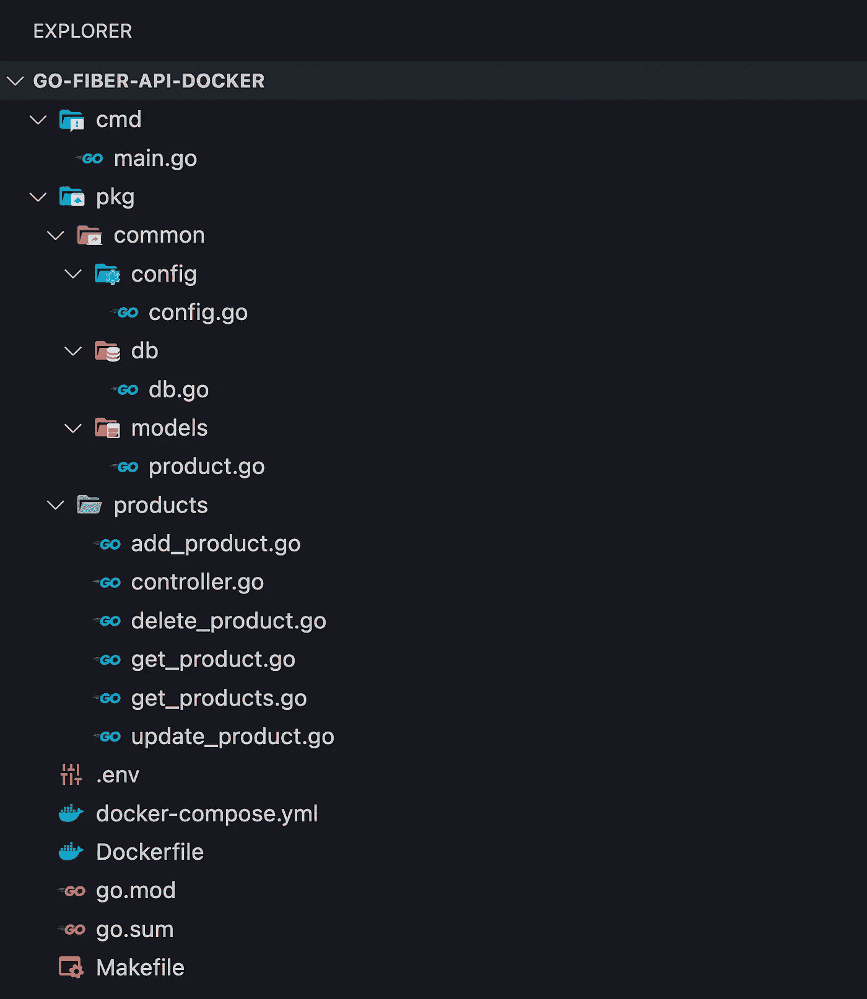
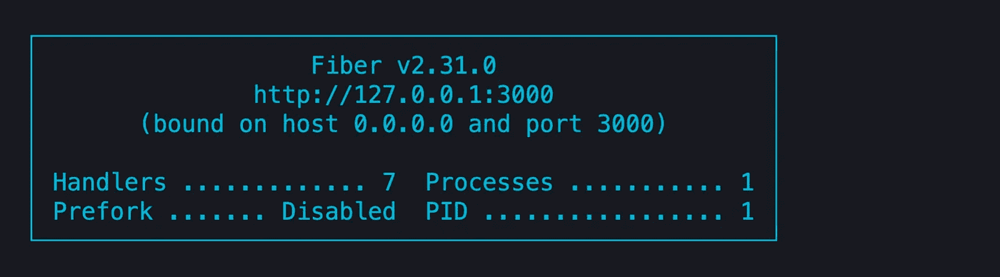

# Go 中的简单 API 与光纤和 Docker (2022)

> 原文：<https://levelup.gitconnected.com/api-in-go-with-fiber-and-docker-5de04651463a>

## 用 Fiber、GORM、Postgres 和 Docker 在 Go 中构建一个简单的 API


今天，我们将在 **Go** 中用 Fiber、Postgres 和 GORM 构建一个简单的 API。我们将用 **Docker** 来设置一切，这样你就不需要在你的本地机器上安装 Postgres 了。

在我们开始之前，这里是 Github 上的[库](https://github.com/hellokvn/go-fiber-api-docker)。

[](https://github.com/hellokvn/go-fiber-api-docker) [## GitHub-hello kvn/go-fiber-API-docker

### 此时您不能执行该操作。您已使用另一个标签页或窗口登录。您已在另一个选项卡中注销，或者…

github.com](https://github.com/hellokvn/go-fiber-api-docker) 

# 先决条件

你需要的是在你的本地机器上安装 Docker。还有，你需要对围棋有一个基本的了解。

docker 容器将使用 Go 版本 1.18 和 Postgres 版本 14.2。

# 项目设置

首先，我们将启动我们的项目并安装我们需要的模块。

```
$ mkdir go-fiber-api-docker
$ cd go-fiber-api-docker
$ go mod init go-fiber-api-docker
```

现在让我们安装 Fiber、GORM 和 Viper。我们使用 Viper 来管理环境变量，稍后我们将在一个`.env`文件中设置这些变量。

```
$ go get github.com/spf13/viper
$ go get github.com/gofiber/fiber/v2
$ go get gorm.io/gorm
$ go get gorm.io/driver/postgres
```

让我们继续最后的项目结构。

```
$ mkdir -p cmd pkg/products pkg/common/db pkg/common/config pkg/common/models
```

另外，让我们添加一些文件。

```
$ touch Makefile .env docker-compose.yml Dockerfile cmd/main.go pkg/products/add_product.go pkg/products/controller.go pkg/products/delete_product.go pkg/products/get_product.go pkg/products/get_products.go pkg/products/update_product.go pkg/common/db/db.go pkg/common/config/config.go pkg/common/models/product.go
```

因此，在创建我们的项目后，文件结构应该如下所示:



## 环境变量

首先，我们需要添加一些环境变量来存储我们将要监听的应用程序端口和数据库的 URL。

让我们给`.env`添加代码

## 配置

在这个文件中，我们定义了 Config 结构来解组先前定义的环境变量。

让我们添加代码到`pkg/common/config/config.go`

## 模型

我们将只有一个称为产品的模型/实体。

让我们给`pkg/common/models/product.go`添加代码

## 数据库连接

在这里，我们连接到由 Docker 建立的数据库。`AutoMigrate`功能自动生成表格`product`。

让我们给`pkg/common/db/db.go`添加代码

## 控制器

在这里，我们定义了一个结构来将 DB 接收器指向它。

让我们给`pkg/products/controller.go`添加代码

## 添加产品

这是第一个处理程序，它基于请求体创建一个新产品。

让我们给`pkg/products/add_product.go`添加代码

## 删除产品

这个处理程序将通过一个名为`id`的参数删除产品。

让我们给`pkg/products/delete_product.go`添加代码

## 按 ID 获取产品

这里，我们再次从参数中获取`id`,以找到特定的产品。

让我们给`pkg/products/get_product.go`添加代码

## 获取所有产品

在这里，我们将所有产品合二为一。请记住，我们在这里没有使用任何限制。

让我们给`pkg/products/get_products.go`添加代码

## 更新产品

为了更新产品，我们需要首先通过产品的`id`找到产品，然后，在保存之前，我们将新的有效载荷与产品合并。

让我们添加代码到`pkg/products/update_product.go`

## 控制器(再次)

现在，我们需要再次修改控制器文件。这一次，我们添加了刚刚编写的处理程序。

让我们把`pkg/products/controller.go`从

到

## 引导程序

此外，我们需要初始化配置、数据库和路由。

让我们添加代码到`cmd/main.go`

## 生成文件

为了缩短我们的命令，我们通过`make ...`使用 Makefile 来调用这些命令

让我们给`Makefile`添加代码

## Dockerfile 文件

在这个 Dockerfile 文件中，我们称之为`golang:1.18`图像。

让我们给`Dockerfile`添加代码

## Docker 撰写

在为我们的应用程序启动容器之前，我们需要创建一个 Postgres 容器。在那里，我们定义了一个健康检查，稍后我们将依赖于 Go 容器。否则，我们的应用程序可能会在数据库创建之前运行。

让我们给`docker-compose.yml`添加代码

# 命令

## 启动应用程序

```
$ docker-compose up
```

## 停止应用程序

```
$ docker-compose down
```

启动 docker-compose 时终端中的控制台输出:



# 测试端点

现在，我们可以测试刚刚创建的两条路由。我们可以测试它，通过使用软件如[邮差](https://www.postman.com/)、[失眠](https://insomnia.rest/)，或者我们简单地运行 CURL 命令。

## 帖子:添加新产品

```
$ curl --request POST \
  --url http://localhost:3000/products *\* --header 'Content-Type: application/json' \
  --data '{
    "name": "Apple iPhone 13",
    "stock": 100,
    "price": 999
  }'
```

## 获取:获取所有产品

别忘了，您也可以在浏览器中运行 get 命令。

```
$ curl --request GET --url http://localhost:3000/products
```

## 获取:通过 ID 获取产品

```
$ curl --request GET --url http://localhost:3000/products/1
```

## PUT:按 ID 更新产品

```
$ curl --request PUT \
  --url http://localhost:3000/products/1 \
  --header 'Content-Type: application/json' \
  --data '{
 "name: "Apple iPhone 13",
 "stock": 50,
 "price": 999
}'
```

## 删除:按 ID 删除产品

```
$ curl --request DELETE --url http://localhost:3000/products/1
```

我们完了！太好了。别忘了，我已经把这个项目上传到了 Github 上。

干杯！

# 接下来阅读

[](/microservices-with-go-grpc-api-gateway-and-authentication-part-1-2-393ad9fc9d30) [## 采用 gRPC、API 网关和身份验证的微服务

### 使用 gRPC、GORM 和 Viper 在 Go 中创建 3 个微服务和 1 个 API 网关

levelup.gitconnected.com](/microservices-with-go-grpc-api-gateway-and-authentication-part-1-2-393ad9fc9d30) [](/devops-why-you-should-use-terraform-667f0411e383) [## 为什么您应该使用 Terraform

### DevOps:什么是 Terraform，为什么它这么好

levelup.gitconnected.com](/devops-why-you-should-use-terraform-667f0411e383) [](/transactions-in-relational-databases-with-postgres-examples-256abc44f0b9) [## 关系数据库中的事务与 Postgres 示例

### 什么是数据库中的事务以及如何使用它们！

levelup.gitconnected.com](/transactions-in-relational-databases-with-postgres-examples-256abc44f0b9)