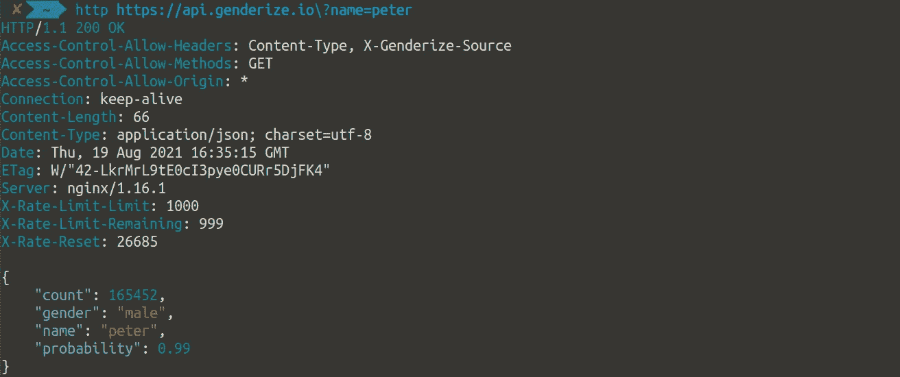
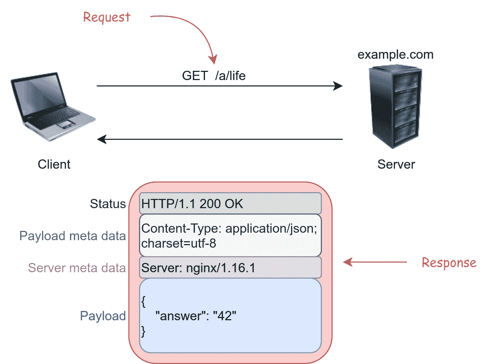
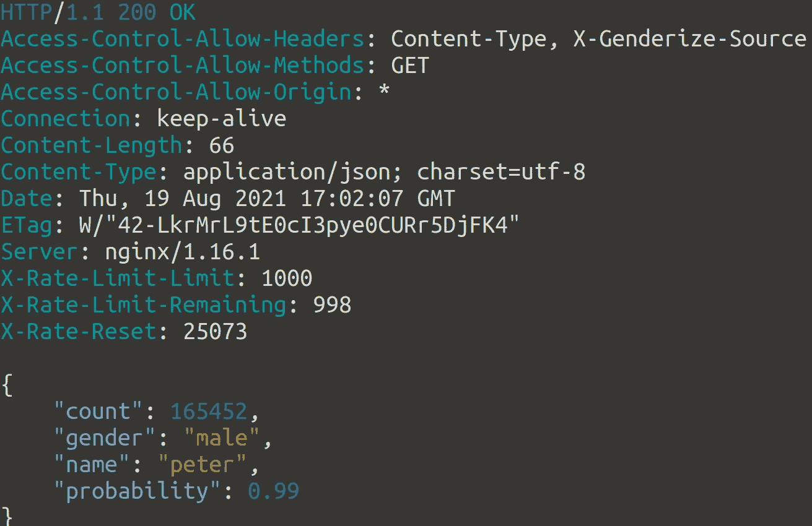
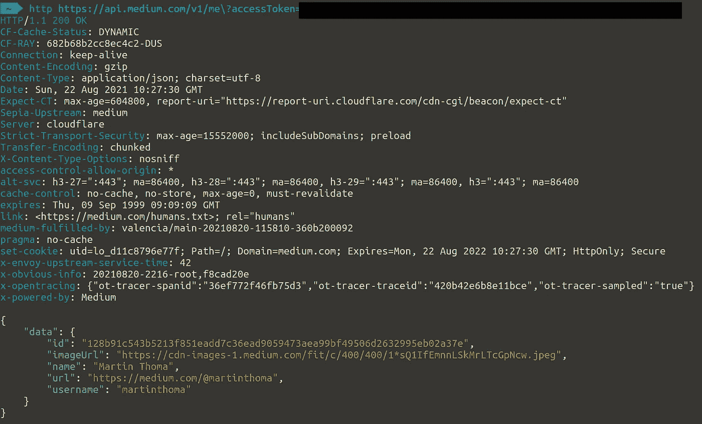
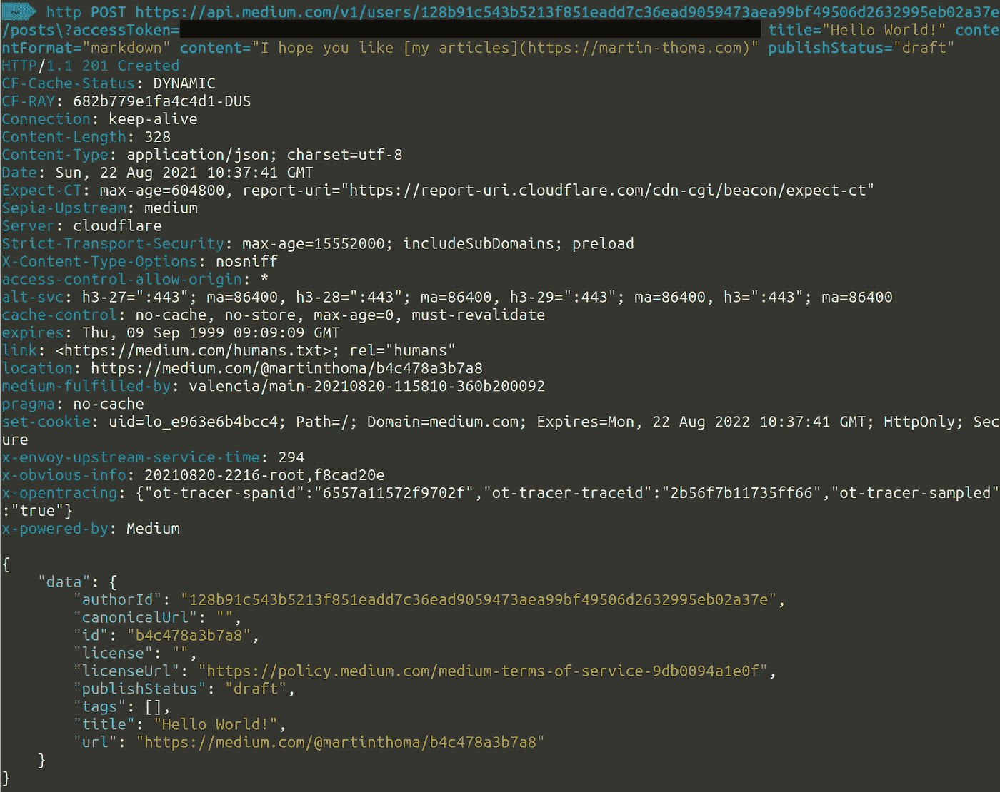
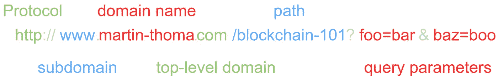
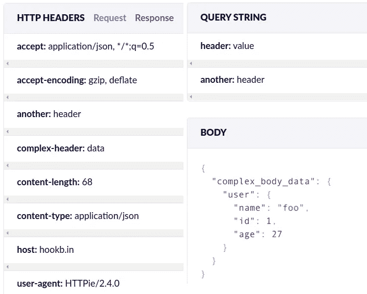

# 使用 HTTPie 进行 API 测试

> 原文：<https://levelup.gitconnected.com/api-testing-with-httpie-2d2d0dbe71ab>



使用 HTTPie 发送的 HTTP 请求和收到的响应的示例。马丁·托马斯截图。

测试是软件开发的关键部分。它有不同的风格，比如单元测试、压力测试、验收测试、冒烟测试。“试一试”可能是所有方法中最简单的一种，但是对于确信事情按照它们应该的方式运行是至关重要的。

我们经常把非开发人员作为最终用户，但是在某些情况下，开发人员就是我们的最终用户。在 web 上，这通常意味着我们向他们提供 REST APIs。REST APIs 无处不在。例子包括[特雷罗](https://developer.atlassian.com/cloud/trello/rest/api-group-actions/)、 [MediaWiki / Wikipedia](https://www.mediawiki.org/wiki/API:Main_page) 、 [Google Drive](https://developers.google.com/drive/api/v2/reference#Children) ，以及[更多](https://github.com/public-apis/public-apis)。

阅读完本文后，您将在测试 REST APIss 的上下文中理解与 REST API 相关的核心概念。此外，您将知道如何使用 [HTTPie](https://httpie.io/) 实际发送请求。这显然与 REST API 设计无关。

# 基础知识

## 什么是 API？

当一个网站为人类用户创建时，它有一个图形界面。人们从视觉上解析网站，寻找常见的设计元素，比如标题、导航、内容部分，也许还有一些元数据。

当我们为其他开发者构建一个东西时，我们称之为 API:应用编程接口。它纯粹基于文本，具有更正式的结构。把它想象成特定的形式。API 有正式声明“如果你给我发送表格 X，我将回复表格 Y”的文档。

## 客户端/服务器和请求/响应

在 API 世界中，我们有一个客户端和一个服务器。客户端通常是浏览器，而服务器是网站/内容所在的地方。通常，有很多客户端，只有很少的服务器。服务器既是硬件又是软件。这要看上下文。



客户端和服务器有一个请求/响应关系。在这个例子中，客户机发送一个对“/a/life”资源的 GET 请求。服务器用状态代码 200(成功)和其他标头进行响应。有效负载为{"answer": "42"}。图片由马丁·托马斯提供。

客户端向服务器发送请求。服务器发回一个响应。

## HTTP 方法

每个请求只使用一个 HTTP 方法。五种最常见的方法是:

*   **GET**:GET 请求不应该改变任何东西。你只想看那里有什么
*   **POST** :创造新的东西。
*   **补丁**:更新现有对象。
*   **贴**:类似贴和贴合。客户端发送一个标识符。如果该标识符存在，更新它后面的对象。如果没有，则创建该对象。
*   **删除**:删除一个对象。

所以你可以说:“客户端发送一个 GET 请求。”。

> 花絮:当你刚在浏览器中输入一个网址，浏览器总会发出一个 GET 请求。当您在网站上填写表单时，它通常是一个 POST 请求。

## 报头和有效载荷

请求和响应由任意多个报头和有效载荷组成。头是键值对，例如

```
Access-Control-Allow-Methods: GET
Access-Control-Allow-Origin: *
Connection: keep-alive
Content-Length: 66
Content-Type: application/json; charset=utf-8
Date: Thu, 19 Aug 2021 16:35:15 GMT
ETag: W/"42-LkrMrL9tE0cI3pye0CURr5DjFK4"
Server: nginx/1.16.1
X-Rate-Limit-Limit: 1000
X-Rate-Limit-Remaining: 999
X-Rate-Reset: 26685
```

有效载荷可以是任何东西。通常是文本，但也可以是字节流。对于 REST APIs，文本通常是 JSON 格式的:

```
{
    "count": 165452,
    "gender": "male",
    "name": "peter",
    "probability": 0.99
}
```

## HTTP 状态代码

您应该知道 3 种状态代码:

*   200:成功——一切顺利。
*   404:未找到——您或开发人员搞砸了
*   500:内部服务器错误——开发人员搞砸了

它们总是有 3 个数字，并按第一个数字分组:

*   1XX:信息
*   2XX:成功代码
*   3XX:重定向
*   4XX:服务器认为客户端做错了什么
*   5XX:服务器出现问题

查找特定代码的好资源有:

*   Mozilla 开发者网络(MDN): [HTTP 响应状态代码](https://developer.mozilla.org/de/docs/Web/HTTP/Status)
*   [HTTP 状态 Codes.com](https://httpstatuses.com/)
*   维基百科:[HTTP 状态代码列表](https://en.wikipedia.org/wiki/List_of_HTTP_status_codes)

# HTTPie:入门

HTTPie 是一个命令行 HTTP 客户端。我会推荐安装，不过你也可以在[官方 httpie 网站](https://httpie.io/)上运行。

让我们首先发送示例中的 HTTP 请求。只需在您的控制台中输入以下内容:

```
http [https://api.genderize.io\?name=peter](https://api.genderize.io\?name=peter)
```

您应该会看到类似如下的响应:



马丁·托马斯截图

当你在浏览器中输入那个链接时，你只会看到有效载荷。浏览器接收标题，但它对您隐藏标题。

# 发送 POST 请求/验证

为了向您展示 POST 请求和认证，我将使用 Medium。如果你想效仿这个例子，你需要先[创建一个账户](https://medium.com/m/signin)(免费——或者[成为会员](https://martinthoma.medium.com/membership)，如果你想支持我的话)。然后[转到设置](https://medium.com/me/settings)并寻找“集成令牌”。创建一个。

API 文档很难看，但是 API 使用起来很简单。

让我们首先检查我们是否通过发送 GET 请求获得了身份验证权:

```
http [https://api.medium.com/v1/me\?accessToken=[](https://api.medium.com/v1/me\?accessToken=[your)integration token]
```

它应该是这样的:



马丁·托马斯截图

保存您的`id`。在下文中，我将称它为`user_id`，我将简单地称你的集成令牌为`token`。

接下来，我们发送一个创建文章草稿的 POST 请求。换行符只是为了可读性；您应该在终端的一行中输入它:

```
http POST https://api.medium.com/v1/users/{user_id}/posts?accessToken={token} title="Hello World!" contentFormat="markdown" content="I hope you like [my articles](https://martin-thoma.com)" publishStatus="draft"
```

它应该是这样的:



恭喜你！您刚刚发送了第一个 POST 请求，并处理了基于令牌的身份验证！

# 发送数据:URL、有效负载和报头

通过 HTTPS 发送数据有三种方式:通过 URL、通过请求有效负载或通过报头。所有提到的 HTTP 方法(GET、POST、PUT、PATCH、DELETE)可以在同一个请求中使用所有 3 种方法。

当您发送请求时，URL 如下所示:



解释了 URL 术语。图片作者:马丁·托马斯

查询字符串位于 URL 的末尾，如下所示:

`?foo=bar&key=value`

它总是以问号开头，包含键值对。键值对由一个&符号`&`分隔。键和值由等号`=`分隔。

# 把所有的放在一起

让我们使用这三种类型来发送数据。为了看看它是否工作，我使用 hookbin.com(以前我使用 requestbin)。这些服务只是给你一个可以发送请求的 URL。他们会记录下这些请求，然后给你看。

我们发出的请求:

```
http POST "https://hookb.in/PxzpYb2kwqspKPrrKjzR?header=value&another=header" COMPLEX-HEADER:data ANOTHER:header complex_body_data:='{"user": {"name": "foo", "id": 1, "age": 27}}'
```

标题通过冒号符号`header:value`由`httpie`标识。等号表示这属于主体。`:=`符号表示原始 JSON 正在跟随:



我们刚刚通过 httpie 发送的请求。马丁·托马斯胡克宾截图。

# 摘要

您已经学习了很多术语，比如什么是 HTTP 方法，发送请求的 3 种方式，您已经看到了一个非常简单的身份验证方案。此外，您还看到了如何使用 HTTPie 发送这些请求。有了这些知识，您可以手动测试任何 API。