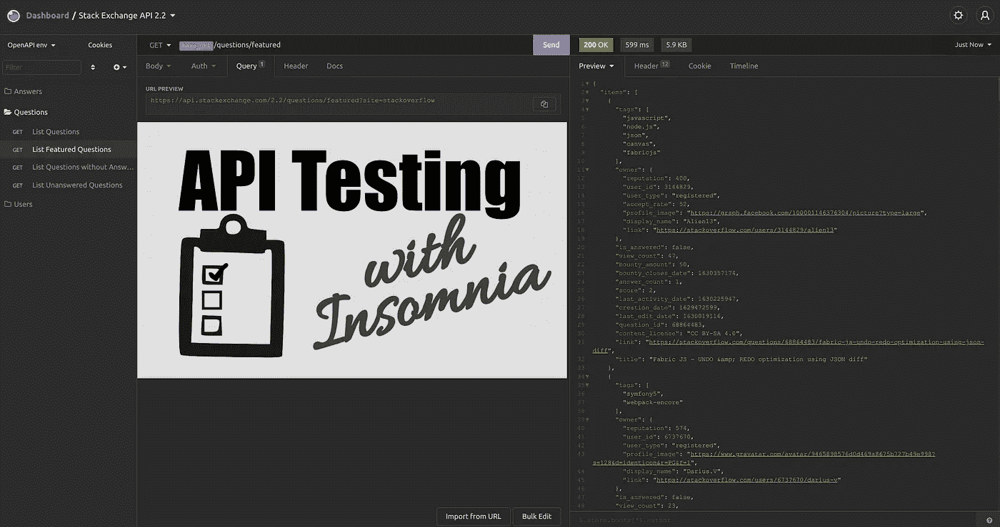
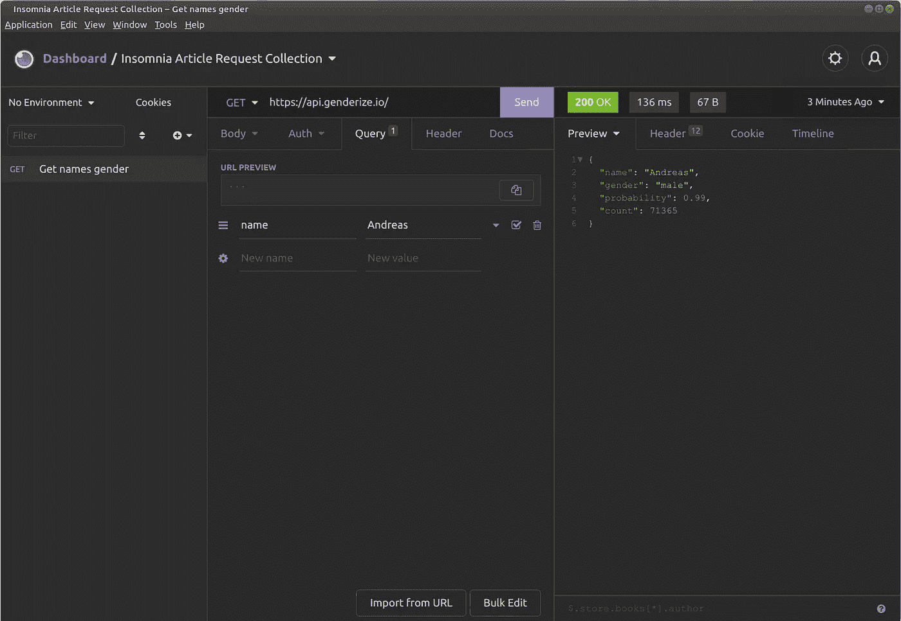

# 失眠时的 API 测试

> 原文：<https://levelup.gitconnected.com/api-testing-with-insomnia-a090db3dbde6>

## 提高您的生产力，使测试更容易重现

失眠概述。例如，StackExchange API 是通过这个 [OpenAPI 规范](https://github.com/openapis/api-specs/tree/master/stackexchange)导入的。截图由马丁·托马斯拍摄。

T2:测试是软件开发的关键部分。它有不同的风格，比如单元测试、压力测试、验收测试、冒烟测试。“试一试”可能是所有方法中最简单的一种，但是对于确信事情按照它们应该的方式运行是至关重要的。

看完这篇文章，你就知道如何使用失眠进行 API 测试了。我们将浏览失眠的请求收集接口，查看环境，以及请求链接。我们开始吧！

# 基础知识

如果您不知道什么是端点、HTTP 方法或状态代码，请随时刷新您的知识:

 [## 使用 HTTPie 进行 API 测试

### 测试是软件开发的关键部分。它有不同的风格，比如单元测试、压力测试…

levelup.gitconnected.com](/api-testing-with-httpie-2d2d0dbe71ab) 

# 失眠入门

可以免费下载安装失眠([链接](https://insomnia.rest/download))。有一个附加功能的付费版本，但你现在不需要它。

首先，创建一个“请求集合”:

创建新的“请求集合”。如果你有一个 OpenAPI / Swagger 规范 YAML 文件，你可以在这里导入它。截图摘自马丁·托马斯《失眠》

# 创建获取请求

单击“新请求”或按 Ctrl + N，输入“获取姓名性别”作为请求名称。输入“https://api.genderize.io/”作为 URL，然后转到“查询”选项卡。输入“名称”作为“新名称”，输入“Andreas”作为值。点击紫色的“发送”按钮:

您可以在左侧看到请求的名称。它向您显示这是一个 GET 请求。查询参数也很容易看到。服务器的响应代码以亮绿色显示。旁边是响应时间和响应内容的大小。马丁·托马斯截图。

# 标题选项卡

点击“标题”选项卡查看回复标题:

响应头通常显示关于服务器及其配置的元数据，例如 nginx/1.16.1、日期和一些限速标签。“X-”表示这是一种可能不普遍的习俗。标题显示了关于内容的元数据，例如内容类型、内容长度。马丁·托马斯截图。

# 时间线标签

时间轴 ab 显示了请求和响应的顺序。我实际上从来没有用过这个:

截图由马丁·托马斯拍摄

# 响应历史概述

用不同的名字再发送几个请求。然后查看亮绿色的状态代码——在最右边，有类似“一分钟前”/“刚才”的内容。如果您点击它，您可以看到响应历史:

如果您一次又一次地测试同一个端点，那么响应历史是非常有用的。在这里，您可以看到响应是否变得异常缓慢，或者响应体是否增加了很多。马丁·托马斯截图。

如果您点击其中任何一个回复，您可以看到实际的回复、标题和时间表。

# 使用环境

既然您已经看到了 UI 的一些基础知识，那么是时候使用一个核心特性了:环境。如果你看左上方，就在“仪表板”下面，你可以看到“无环境”。让我们单击它，然后点击“管理环境”。或者，按 Ctrl+E。查看“子环境”，单击“+”，然后单击“环境”:

我们将环境命名为“Peter ”,并在其中添加了值为“Peter”的变量“name”。您可以看到这 3 行内容只是一个普通的 JSON 字典。截图由马丁·托马斯拍摄。

现在复制环境并创建一个“Karen”环境:

截图由马丁·托马斯拍摄。

关闭“管理环境”窗口。使用“Peter”环境:

截图由马丁·托马斯拍摄。

现在转到“查询”选项卡的“名称”键。该值可能是“Peter”——删除它。按 Ctrl +空格键。您应该会看到大量选项:

自动完成选项。截图由马丁·托马斯拍摄。

选择“_”。名”。您可以输入“_”。“名字也直接。现在，当您发送请求时，它使用您的环境中“name”变量的值。

这意味着如果你改变环境，你发送的请求也会改变。

这非常有用。您可能想要测试不同的运行时环境，例如开发、试运行、集成、预生产、生产。您可能想要测试不同用户的响应。只是为这些情况创造环境。

# 链接请求

大多数 API 都需要某种形式的认证。通常，这意味着您登录并收到一个不记名令牌。该令牌必须在所有进一步的请求中发送。

为此，请转到“标题”并输入密钥“认证”。作为一个值，您输入“Bearer”并按 Ctrl+Space。然后输入“响应→体属性”:

未填写响应正文属性。马丁·托马斯截图

当你点击红色方块时，你会看到这个:

马丁·托马斯截图

到目前为止，我们只有一个“请求”,没有需要身份验证的 API，但这对于演示来说已经足够好了。选择请求。在“过滤器”字段中，输入`$`。现在，您应该可以在实时预览中看到一些内容:

我们这里使用的语法叫做 [JSONPath](https://restfulapi.net/json-jsonpath/) 。如果输入`$.gender`，这个宏将得到的值将是“男性”。对于访问令牌，您可以使用类似于`$.access`的东西。这取决于服务器的响应和您想要重用的内容。

# 共享请求

失眠既可以导入又可以导出`curl`命令。`curl`是一个非常强大的发送 HTTP 请求的工具。它是免费的，几乎每个开发者都会知道。很多工具都依赖于它。

右键单击请求会显示“以 Curl 形式复制”和“生成代码”部分，以共享请求

尽管“Copy as Curl”是一个不错的选择，但是您的开发人员可能更喜欢其他的。例如，我喜欢 Python 代码和`requests`库。为此，请点击“生成代码”:

生成代码来发送刚刚由失眠症患者发送的请求。问问你的开发者他们更喜欢什么。在“Shell”下面是选项“HTTPie ”,这也很好。

# 摘要

您已经看到了如何创建定制请求。使用环境和请求链，您可以从单个请求中获得更多。我们已经研究了不同的元信息，比如请求时间表。最后，您已经看到了如何与开发人员共享请求。