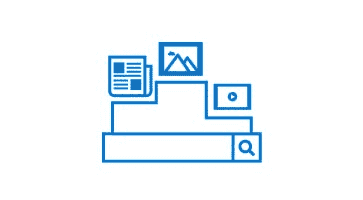
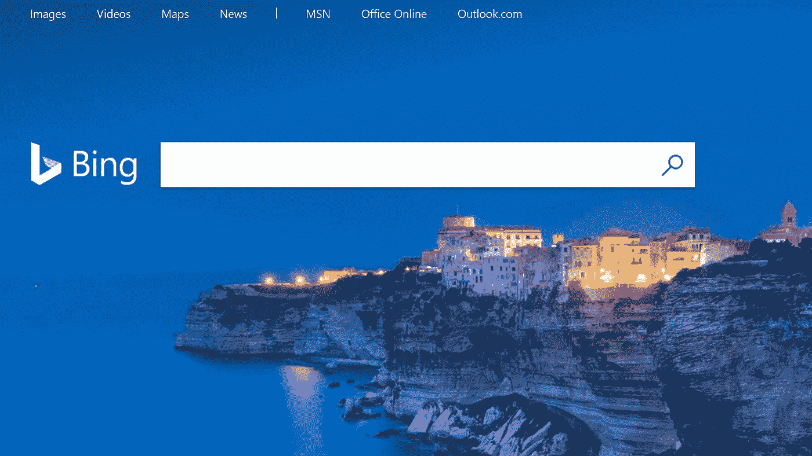
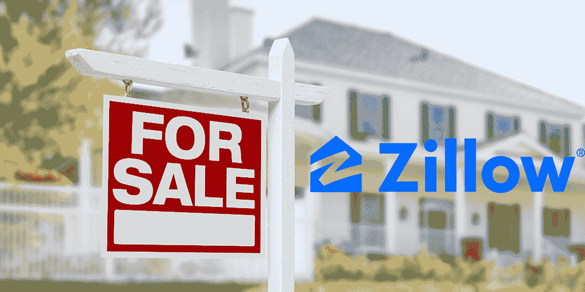
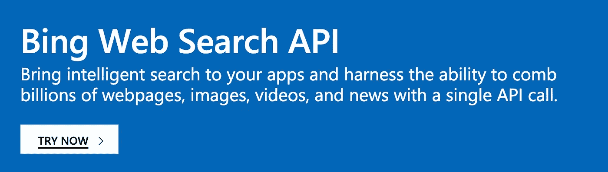
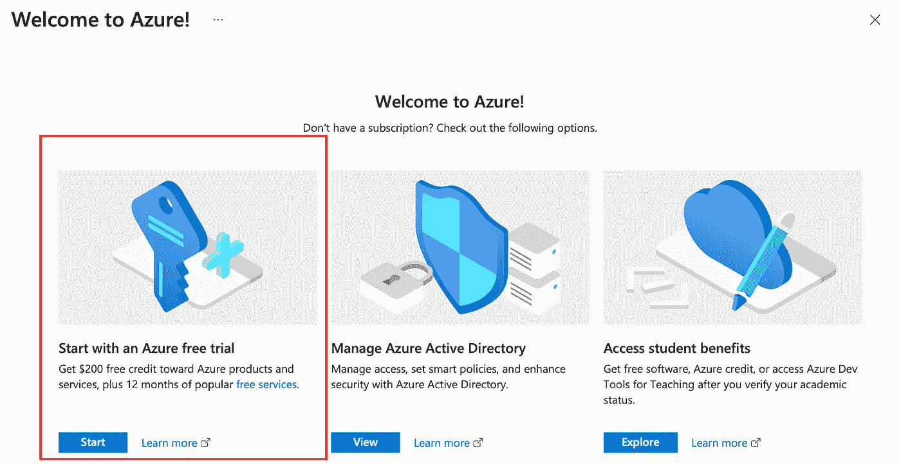
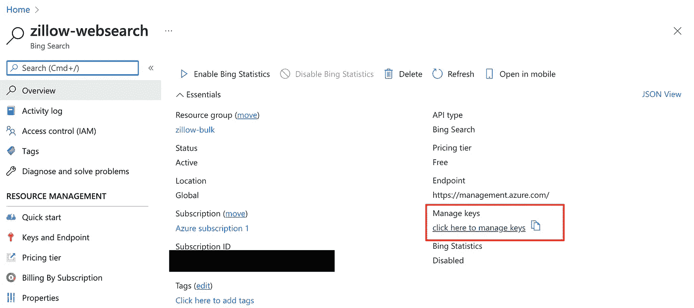
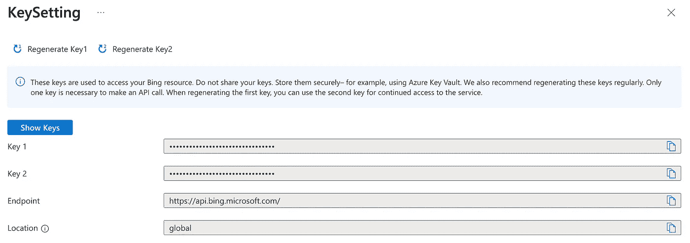
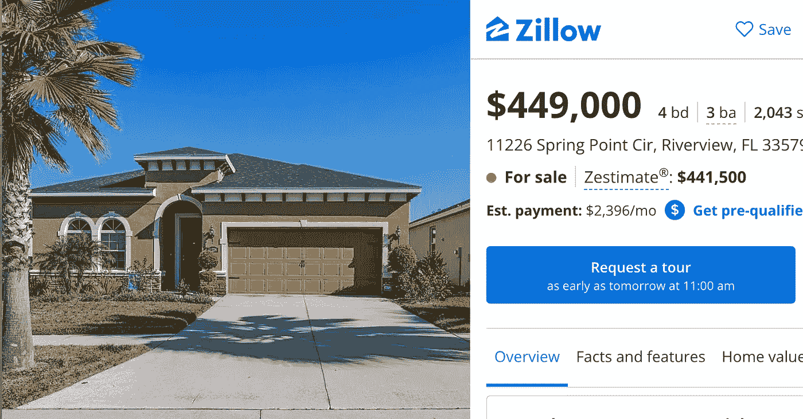

# API 教程:如何在 Python 中使用 Bing Web 搜索 API

> 原文：<https://levelup.gitconnected.com/api-tutorial-how-to-use-bing-web-search-api-in-python-4165d5592a7e>

## 关于如何获得网络搜索结果的 Python 教程



[网络搜索 API |微软必应](https://img-prod-cms-rt-microsoft-com.akamaized.net/cms/api/am/imageFileData/RE4Dd58)

需要快速获得网络搜索结果吗？微软 Bing 的网络搜索 API 正是这方面的合适应用。[必应的网络搜索 API](https://www.microsoft.com/en-us/bing/apis/bing-web-search-api) 通过一个 API 调用就能梳理数十亿的网页、图片、视频和新闻。

Bing Web 搜索 API 是一个 RESTful Web 服务，与大多数编程语言兼容。在本文中，我们将介绍如何使用 Python 调用 API。



[必应搜索](https://www.google.com/url?sa=i&url=https%3A%2F%2Fwww.pcmag.com%2Fnews%2F20-reasons-to-search-with-bing&psig=AOvVaw0HJAfTo3PHu1459B2sFsa4&ust=1648865784845000&source=images&cd=vfe&ved=0CAsQjRxqFwoTCNDY5-3l8fYCFQAAAAAdAAAAABAD)

## 用例



对于我们的用例，我们将从 Zillow 列出的属性中提取 ZPID 字段。ZPID 是 Zillow 网站上所列物业的唯一标识符。

房地产投资者和批发商需要财产细节来评估交易。通常使用场外物业，这些物业的信息可能有限。

> 场外房产是不出售的房屋，或者是出售但没有公开上市的房屋。— [平房](https://bungalow.com/articles/off-market-properties-what-are-they-and-how-to-buy)

这可能是一份丧失抵押品赎回权前的房主名单，他们有出售房屋的动机。投资者会收到一份丧失抵押品赎回权前的房产清单，但需要更多的房产细节。

像价格历史、地段大小和区域划分这样的房产细节可以在像 [Apify](https://apify.com/industries/real-estate) 这样的网络抓取工具中找到。

[](https://apify.com/petr_cermak/zillow-api-scraper#features) [## 刮 Zillow 房地产上市🏘️阿皮菲

### 我们免费的 Zillow scraper 可以让你使用 Zillow API 提取 Zillow 上待售和出租的房产数据，但是…

apify.com](https://apify.com/petr_cermak/zillow-api-scraper#features) 

为了获得地址的 Zillow 属性细节，ZPID 是必需的。这就是 Bing 网络搜索 API 的用武之地！:)

## 设置

要开始，您需要:

1.  [Bing 网络搜索 API](https://www.microsoft.com/en-us/bing/apis/bing-web-search-api) 订阅密钥

## 注册 Bing 网络搜索 API



[必应网页搜索 API](https://www.microsoft.com/en-us/bing/apis/bing-web-search-api)

*   进入 [Bing 网页搜索 API](https://www.microsoft.com/en-us/bing/apis/bing-web-search-api) ，点击**“立即试用”**
*   登录您的 Microsoft Azure 帐户或创建一个新帐户



*   选择“从 Azure 免费试用开始”
*   如果出现提示，请同意“订阅协议”
*   添加一种支付方式*(如果您在免费试用范围内，将不会被收费——每月 1000 次 API 调用)*
*   命名您的 Bing 搜索 API 资源



Azure API

*   在您的资源主页上，转到“管理密钥”



Bing 管理密钥

*   在“管理密钥”下，单击“显示密钥”并复制密钥 1
*   密钥 1 将成为您的**订阅密钥**

## 设置 Python 环境

为了调用 API，我们需要一个环境来编写 Python 代码。

我强烈建议使用 [Google Colab](https://research.google.com/colaboratory/faq.html) 。这是一个基于云的环境，可以免费使用。不需要本地设置。跟随[Google Colab 入门教程](https://towardsdatascience.com/getting-started-with-google-colab-f2fff97f594c)获取更多信息。

# Python 教程

查看[快速入门:使用 Python 调用 Bing Web 搜索 API](https://docs.microsoft.com/en-us/bing/search-apis/bing-web-search/quickstarts/rest/python) 获取更多信息。

## 一.安装包

```
!pip install requests
```

## 二。导入包

```
*# HTTP library -* [https://docs.python-requests.org/en/latest/](https://docs.python-requests.org/en/latest/)
**import** requests
```

## 三。局部变量和常量

创建一个变量，将您的 API 键存储为一个*字符串类型*对象*。*

```
*# subscription key*
bing_subscription_key = *<enter your key here>*
```

## 不及物动词功能

创建一个需要两个参数的函数:

1.  订阅密钥—特定于资源
2.  查询—您自己的 web 搜索字符串

```
**def** bing_web_search(subscription_key, query):
    # set parameters
    search_url = "https://api.bing.microsoft.com/v7.0/search"
    headers = {"Ocp-Apim-Subscription-Key": subscription_key}
    params = {
        "q": query,
        "textDecorations": True,
        "textFormat": "HTML"} # get response
    response = requests.get(search_url, headers=headers, params=params)
    response.raise_for_status()
    return response.json()
```

## 动词 （verb 的缩写）API 调用

我们想得到 ZPID。它位于属性 URL 的末尾:

[“https://www . zillow . com/home details/11226-Spring-Point-Cir-Riverview-FL-33579/125824629 _ zpid/](https://www.zillow.com/homedetails/11226-Spring-Point-Cir-Riverview-FL-33579/125824629_zpid/)”

该属性的 ZPID 是 125824629。



[Zillow Property](https://www.zillow.com/homedetails/11226-Spring-Point-Cir-Riverview-FL-33579/125824629_zpid/)

接下来，为家庭地址创建一个字符串对象。将*“zillow home details”*添加到字符串的末尾。这将把 Zillow 结果排在搜索列表的顶部。

用两个参数调用 API。

```
*# call API* home_address = '11226 Spring Point Cir, Riverview, FL 33579'
search_results = bing_web_search(
    subscription_key, 
    query= home_address + ' zillow home details')
```

在搜索结果中，选择 URL 列表中的第一个 URL。应该是 Zillow 属性链接。

```
url = search_results['webPages']['value'][0]['url']
```

接下来，通过分割 URL 获取列表中的最后一个元素来获取 ZPID。

```
zpid = [x for x in url.split('/') if 'zpid' in x][0].split('_')[0]
```

输出:

```
zpid = '125824629'
```

厉害！我们现在有了在 Bing Web 搜索 API 中搜索的酒店地址的 ZPID。

# 结论

Bing 的网络搜索 API 是接收搜索结果信息的绝佳资源。它是免费使用的高容量搜索定价层的选项。

查看 Bing 的资源页面，了解更多关于定价层级的信息:

[](https://www.microsoft.com/en-us/bing/apis/pricing) [## 必应搜索 API 定价|微软必应

### Bing 搜索 API v7 定价详细信息日本定价将适用于响应中的 BingAPIs 市场参数…

www.microsoft.com](https://www.microsoft.com/en-us/bing/apis/pricing)