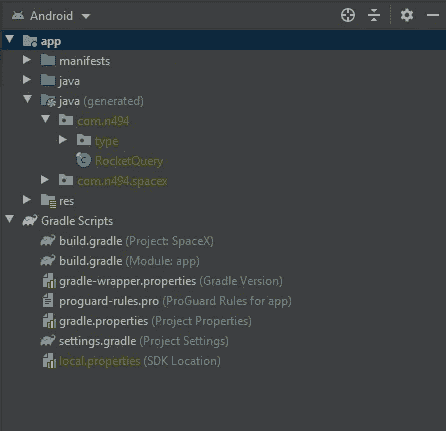

# Apollo 和 RxJava:正确使用 Android GraphQL

> 原文：<https://levelup.gitconnected.com/apollo-rxjava-android-graphql-the-right-way-a1f2b10a9ac8>


由 [SpaceX](https://unsplash.com/@spacex?utm_source=medium&utm_medium=referral) 在 [Unsplash](https://unsplash.com?utm_source=medium&utm_medium=referral) 上拍摄的照片

# 介绍

自诞生以来，GraphQL 已经发展成为构建后端 API 的一个非常流行的框架。然而，我仍然没有在 Android 上看到它经常使用。我认为原因是在 Android 上使用 GraphQL 的资源不多，确实存在的都是过时的或者没有利用新技术。在本文中，我想介绍一种在 Android 上设置 GraphQL 客户端的“最佳实践”方法。我们将制作一个简单的 Android 应用程序，它使用 SpaceX GraphQL API 来显示火箭列表。通过利用 [Apollo Android](https://github.com/apollographql/apollo-android) 和 [RxJava](https://github.com/ReactiveX/RxJava) ，我们将以正确的方式在 Android 上运行 GraphQL。

# 设置

在开始之前，我们必须准备好所有的依赖项。首先，将以下内容粘贴到您的项目级别`build.gradle`:

这将添加我们为 RxJava 需要的 apollo 插件和 maven repo。接下来，将这些依赖项和插件添加到您的应用程序级别`build.gradle`:

这里我们添加了两个与 Apollo 相关的依赖项，一个用于库本身，另一个用于 Rx 支持。我们还添加了 RxJava 的 Android 端口 RxAndroid，以及 RxJava 本身。我们显式地添加 RxJava，因为 RxAndroid 不经常更新，所以手动定义它可以让我们及时更新错误修复。不要忘记在你的 gradle 文件末尾添加`apply plugin: “com.apollographql.apollo”`，否则你以后会遇到编译问题。

# 编写 GraphQL 查询

创建目录`src/main/graphql/com/example`，但是用您自己的包名替换`example`。之后，运行以下命令获取一个 GraphQL 模式:

```
./gradlew downloadApolloSchema 
--endpoint="https://api.spacex.land/graphql/" 
--schema="src/main/graphql/com/example/schema.json"
```

> *如果你在 Windows 上用* `*gradlew.bat*` *替换* `*./gradlew*` *。*

该命令将在 SpaceX API 上运行自省，并为我们创建一个`schema.json`。接下来，我们将编写我们的 GraphQL 查询，我们将使用它来获取火箭列表。在与`schema.json`相同的目录下创建一个名为`rockets.graphql`的文件，并粘贴以下内容:

这是一个非常基本的 GraphQL 查询，它以`rockets`端点为目标，获取一个火箭列表，每个条目包含火箭的 id、名称和描述。API 实际上提供了比这更多的信息，但是我们只需要这三个数据点。因为 GraphQL 让我们只获取我们需要的东西，所以我们不必用不必要的信息来减缓我们的请求。‌如果你特别想了解更多关于 GraphQL 的知识，[这篇文章](https://medium.com/free-code-camp/so-whats-this-graphql-thing-i-keep-hearing-about-baf4d36c20cf)是一个很好的起点。

现在我们已经编写了查询，构建项目。Apollo 将读取我们创建的 graphql 文件，并自动生成用于对服务器进行查询的类。如果您将项目视图设置为 Android，您应该会看到以下内容:



见 java 中的 RocketQuery 类(生成)？

# 发出 GraphQL 请求

现在我们已经设置好了所有的 GraphQL，我们可以开始编写一些 Java 代码了。将所有与服务器相关的代码放在一个类中是很好的做法，我们称之为`Server`。下面是该类的外壳:

这个类使用单例模式创建一个`ApolloClient`实例。我们将在查询中使用这个助手方法，这样我们就不必为每个查询创建一个客户机。

接下来让我们为我们的`rockets`查询创建一个方法:

这段代码相当密集，所以让我们慢慢来。首先，我们用`RocketsQuery`创建一个`ApolloQueryCall`对象，这个类是从我们之前编写的 GraphQL 文件中生成的。该对象定义了我们想要对 SpaceX API 进行的 GraphQL 查询。‌

然后，我们使用助手类`Rx3Apollo`将调用转换成 RxJava 对象，这让我们可以在其上完成所有的 Rx 魔术。指定我们希望这个请求在后台线程上运行。对于`observeOn`，我们说我们希望在主线程上处理响应，因为我们将使用响应更新 UI。最后，我们添加一个过滤器来丢弃空响应，以防止任何空指针异常。

该方法返回一个`Observable`，我们可以在活动代码中使用它来处理加载和错误状态，并在得到响应时更新 UI。

现在我们将使用我们创建的`fetchRockets`方法来填充一个列表:

在这个代码片段中，我们首先显示加载指示器，因为我们将要获取数据。然后，我们使用我们的`Server`类进行 rockets 查询，并创建一个`DisposableObserver`来处理结果。这就是 RxJava 配合 Apollo Android 使用的好处之一。`DisposableObserver`有三种方法可以用来处理结果:`onNext`、`onError`和`onComplete`。当收到有效响应时调用`onNext`，如果出现错误则调用`onError`。不管结果如何，一旦请求完成，就会调用`onComplete`。这让我们可以分别定义加载、错误和数据状态，这大大简化了我们的代码。在这个代码片段中，我们将火箭附加到一个定制的适配器上([代码，这里是](https://github.com/Ninjaman494/Android-GraphQL-Example/blob/main/app/src/main/java/com/n494/spacex/RocketsAdapter.java))，然后隐藏装载指示器。请注意，加载部分是在`onComplete`中处理的，因为即使发生错误，我们也想隐藏它。

# 结论

在本文中，我们通过利用 Apollo Android 和 RxJava 库，介绍了在 Android 上使用 GraphQL 的正确方法。然而，我们所经历的例子是最简单的请求场景之一。对于更高级的场景，如并行和依赖请求，请查看本文的[配套报告](https://github.com/Ninjaman494/Android-GraphQL-Example)。你也可以阅读我的下一篇文章，在那里我们将仔细看看这个回购中的一些高级例子。

一如既往，感谢阅读并给我一个👏如果你喜欢这篇文章！我很想听听你的意见，所以请在评论区留下你的反馈。