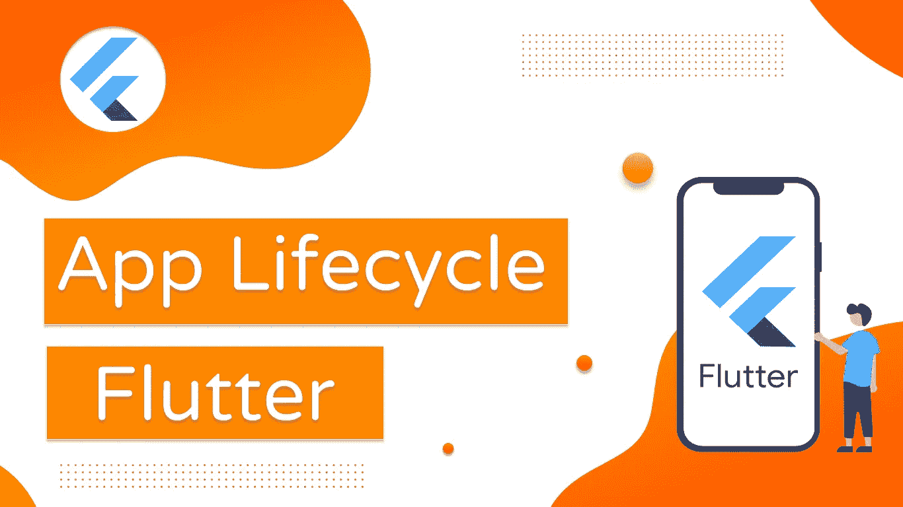
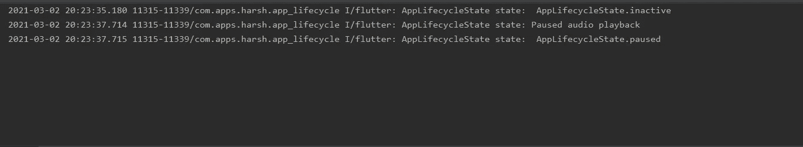
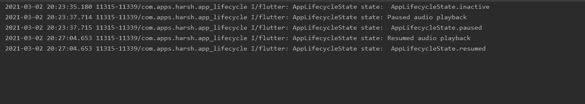

# 颤振中的应用生命周期

> 原文：<https://levelup.gitconnected.com/app-lifecycle-in-flutter-e4ba686d16fe>

探索具有可重用逻辑的应用生命周期方法

Flutter 应用生命周期

和所有的框架一样，Flutter 也有一个和每个应用相关的生命周期。在本文中，我们将看看 Flutter 中不同的应用生命周期方法。

我们还将探讨如何在我们的应用程序中观察方向变化。最后，我们将看到如何重用生命周期逻辑，以便所有的生命周期方法在我们的应用程序中都可用。内容太多了，让我们开始吧！

# 应用生命周期方法

下面是由[*applifecyclsate*](https://api.flutter.dev/flutter/dart-ui/AppLifecycleState-class.html)`enum`定义的 Flutter 中的 app 生命周期状态:

*   **分离的:**应用程序仍然托管在一个颤振引擎上，但是从任何主机视图中分离。这可能是当引擎已经启动但没有连接到任何视图时，或者当视图由于导航器弹出而被破坏时。
*   **不活动:**应用程序处于不活动状态，没有接收用户输入。在两个平台上打电话时，应用程序都进入这种状态。处于这种状态的应用程序应该假设它们可能随时被暂停。
*   **暂停**:应用程序当前对用户不可见，正在后台运行。这是你按下 Home 键的时候。
*   **恢复:**应用程序可见并响应用户输入。在这种状态下，应用程序在前台。

理论到此为止，是时候用代码来弄脏我们的手了。我们开始吧！

# 履行

为了从 widgets 层观察不同的生命周期状态，我们使用了 [WidgetsBindingObserver](https://api.flutter.dev/flutter/widgets/WidgetsBindingObserver-class.html) 类。

创建一个`StatefulWidget`和`WidgetsBindingObserver`为:

当使用这个类时，我们需要通过添加和删除观察者来适当地管理它，如下所示:

这里我们使用`addObserver`方法添加观察者，并通过传递当前上下文使用`removeObserver`方法移除观察者。

> ***为简洁起见，本文仅包含必要的代码，您可以在文章末尾找到 GitHub 到完整源代码库的链接。***

`WidgetsBindingObserver`类提供了各种方法，但是我们感兴趣的是`didChangeAppLifecycleState`，它将`AppLifecycleState`对象作为参数。在这里，我们可以检查前面提到的各种状态，并执行适当的操作。例如，我们可以在状态为`paused`时暂停音频回放，并在状态为`resumed`时再次继续回放。在这个例子中，为了简单起见，我们只使用 print 语句。

我们还使用`OrientationBuilder`来跟踪器件方向。我们还有一个`FlatButton`来导航到新的路线。本文后面将重点介绍它的用法。我们的构建方法如下所示:

当我们运行应用程序时，我们可以看到屏幕上显示的当前方向。

当您按下 Home 按钮时，您可以在日志中看到以下内容:

当您再次打开应用程序时，您可以看到以下日志:

如您所见，日志中正确地反映了这些状态。现在，使用按钮导航到新路线，并遵循上述步骤。令人惊讶的是，您在日志中看不到任何正在打印的内容。这是因为新路由没有实现`WidgetsBindingObserver`。让我们现在就解决这个问题。

一个简单但不太好的方法是在这里也实现`WidgetsBindingObserver`类。但是，假设您希望该类跨越应用程序中的所有路由。在这种情况下，你需要在每个类中实现它，这不是一个明智的决定。

另一种方法是创建一个新的小部件，并将其包装在`MaterialApp`小部件周围，这样它就可以在我们应用程序的任何地方被访问。这里我们将使用第二种方法。

让我们创建一个新的小部件`LifecycleManager`，并按照相同的步骤添加`WidgetsBindingObserver`和`didChangeAppLifecycleState`方法。添加一个类型为`Widget`的新参数`child`来显示应用程序中包含的小部件。

最终的`LifecycleManager`是这样的:

最后一步是用新创建的`LifecycleManager`小部件包装`MaterialApp`小部件，并将`MaterialApp`作为子小部件传递。最后的`main.dart`是这样的:

现在运行应用程序，并在两条路线上遵循相同的过程。您可以看到在两条路线上都打印了`AppLifecycleState`日志。我们现在可以在应用程序的所有屏幕上访问应用程序的生命周期状态，并相应地执行所需的操作。

# 结论

在本文中，我们探索了 Flutter 中不同的应用生命周期方法。我们还看到了如何通过创建一个单独的类来管理整个应用程序的生命周期状态，从而重用逻辑。

完整的源代码可以在下面的链接中找到:

 [## harsh shinde 07/Flutter-App-生命周期

### 通过在 GitHub 上创建帐户，为 harsh shinde 07/Flutter-App-life cycle 开发做出贡献。

github.com](https://github.com/harshshinde07/Flutter-App-Lifecycle) 

## 感谢您阅读这篇文章。如果你喜欢这篇文章或者学到了新的东西，尽可能多地鼓掌以示支持。👏

## 这真的激励我继续写更多！:)

## 如果有错误，请随时纠正。

## 我们来连线:

*   [GitHub](https://github.com/harshshinde07/)
*   [领英](https://www.linkedin.com/in/harshshinde07/)