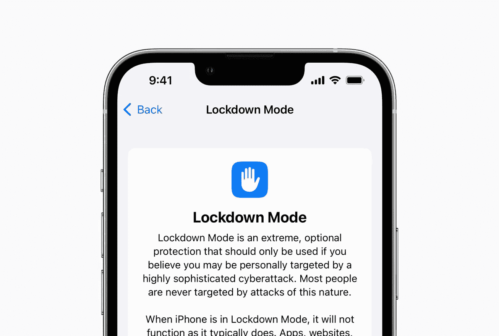

# 苹果锁定模式将保护您免受高度针对性的间谍软件

> 原文：<https://levelup.gitconnected.com/apple-lockdown-mode-will-protect-you-from-highly-targeted-spyware-77f2f47d3de0>

## 网络安全

## 针对网络攻击的极端保护



图片:苹果

苹果(Apple)正在预览一项改变游戏规则的安全功能，该功能为用户提供专门的额外保护，这些用户可能容易受到来自开发政府支持的雇佣军间谍软件的私营公司的高度针对性的网络攻击。

它旨在保护消费者，这些消费者可能成为一些最复杂的数字攻击的个人目标，例如由私营企业为国家支持的雇佣军恶意软件开发的攻击。锁定模式是该类型的第一个主要功能，是针对极少数数字安全面临严重、有针对性威胁的客户的一种极端、可选的防御措施，将于今年秋天在 iOS 16、iPadOS 16 和 macOS Ventura 中推出。

# 什么是锁定模式？

对于极少数可能成为一些最复杂的数字威胁的个人目标的个人，例如来自 NSO 集团和其他创建国家支持的雇佣军恶意软件的商业组织的个人，锁定模式提供了一种极端的、自主的安全级别。

iOS 16、iPadOS 16 和 macOS Ventura 中的锁定模式通过加强设备保护和严格限制某些功能，大大减少了可能被高度针对性的雇佣军间谍软件利用的攻击面。

## 特征

*   **邮件:**除图片外的大部分邮件附件类型都被阻止。一些功能，如链接预览，被禁用。
*   **网络浏览:**某些复杂的网络技术，如实时(JIT) JavaScript 编译，会被禁用，除非用户从锁定模式中排除了一个受信任的站点。
*   **苹果服务:**如果用户之前没有向发起者发送过呼叫或请求，包括 FaceTime 呼叫在内的传入邀请和服务请求都会被屏蔽。
*   iPhone 锁定时，与电脑或配件的有线连接会被阻止。
*   锁定模式打开时，无法安装配置描述文件，设备也无法注册到移动设备管理(MDM)中。

# 200 万美元的奖金计划

苹果表示，随着时间的推移，它将继续改进锁定模式，并为其添加新的安全措施。苹果还在苹果安全奖金计划中建立了一个新的类别，奖励发现锁定模式旁路的研究人员，并帮助改善其保护，以征求安全研究社区的反馈和合作。

锁定模式下符合条件的发现的奖金翻倍，最高可达 200 万美元，这是业界最高的奖金。

# 1000 万美元赠款

除了在对 NSO 集团提起的诉讼中获得的任何赔偿，苹果还将向调查、曝光和防止高度针对性网络攻击的组织提供 1000 万美元的资助，这些攻击包括由开发国家支持的雇佣军间谍软件的私营公司发起的攻击。

这笔赠款将提供给福特基金会的尊严和正义基金，该基金由福特基金会建立并提供咨询，福特基金会是一个致力于在全球范围内促进公平的私人基金会，旨在汇集慈善资源，在全球范围内促进社会正义。尊严和正义基金是一个 501(c)(3)公共慈善机构，由新风险基金提供财政支持。

# 思想

虽然它可能不是对每个人都有用。这对记者和活动人士非常有帮助，他们不仅面临黑客的威胁，还面临政府行为者的威胁。锁定模式功能将禁用许多攻击媒介。由于这个特性，像 Pegasus 这样的软件间谍软件现在会发现越来越难以捕食受害者。

在一个到处都是试图收集你信息的人的社会中，这个功能对很多人来说都是一个福音。虽然启用会禁用上面提到的一些功能。我认为这是一个公平的交易，也是我们应该愿意接受的交易，这样我们的信息才能安全。

现在苹果需要做的或者至少在不久的将来要做的就是给 iCloud 带来端到端的加密，以及所有的 iCloud 备份。我们将会看到苹果将会把什么带入它的旅程，使设备更加安全。你们觉得一级防范禁闭模式怎么样？

# 分级编码

```
Thanks for being a part of our community! More content in the [Level Up Coding publication](https://levelup.gitconnected.com/).Follow: [Twitter](https://twitter.com/gitconnected), [LinkedIn](https://www.linkedin.com/company/gitconnected), [Newsletter](https://newsletter.levelup.dev/)**Level Up is transforming tech recruiting** 👉 [**Join our talent collective**](https://jobs.levelup.dev/talent/welcome?referral=true)
```