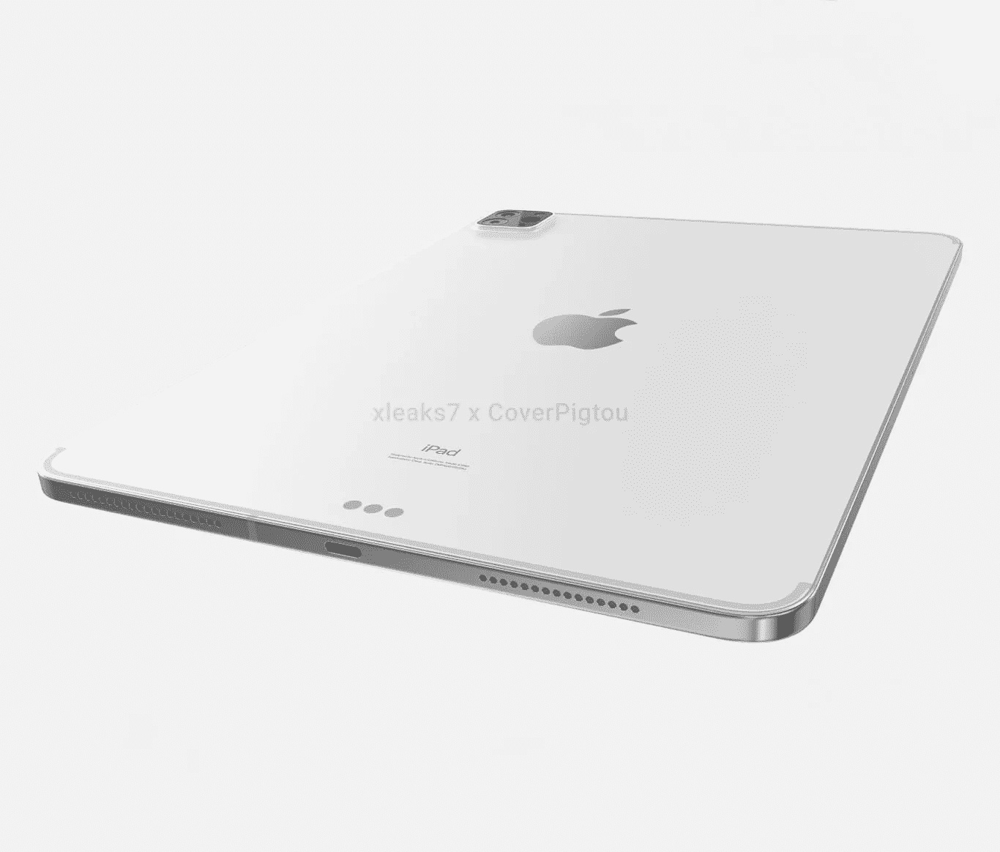

# 苹果新一代 iPad Pro 拥有 M1 SOC 的性能和其他令人兴奋的功能。

> 原文：<https://levelup.gitconnected.com/apple-next-gens-ipad-pros-get-the-performance-of-m1-socs-and-other-exciting-features-50b91c2ba3f9>

## 平板电脑，即将推出的 iPad Pro，可以与你的笔记本电脑媲美，甚至超越它。

猪头对泄露的 iPad pro 的渲染。信用:[猪头](https://coverpigtou.it/apple/ipad)。

M1 足球赛的[马克·古尔曼](/if-all-these-m1-macbook-rumors-are-true-then-other-laptops-are-in-for-hell-71a02eee9958#038;feature=emb_logo&xcust=1-1-334310-0-0-0|xid:fr1617038490654ieh&sref=https://www.macworld.com/article/334310/ipad-pro-refresh-m1-processor.html)的说法，A14X 在性能上将与 M1 不相上下。是的，所以 A14X 可以匹配 M1 的性能，但有一个问题。

M1 足球。信用:[苹果。](https://www.apple.com/mac/m1/)

iPad Pro 与采用 M1 芯片的 MacBook Air 属于同一类别。为什么？**它们都是被动冷却的**但我们不要忘记，与 iPad pro 相比，MacBook Air 的外形尺寸更大。在被动冷却世界中，冷却发生在处理器通过传导散热时。于是就有了这个普遍规律:**热量***(MacBook Air 的底部和 iPad Pro 的背面)***的*导体表面积越大，被动散热***越好。假设苹果决定基于 M1 SoC 设计 A14X，我们将看到在其他条件相同的情况下，其性能与 M1 不相上下。但当谈到持续的表现时，情况就不同了。

M1 MacBook Air。鸣谢: [ZDnet。](https://www.zdnet.com/product/apple-macbook-air-late-2020/)

处理器或 SOC 在冷却时往往会在很长一段时间内保持最佳性能。将 M1 MacBook Air 与 Pro 进行比较。两者都有相同数量的 CPU 内核，使用相同的 CPU，但 Pro 的性能明显优于 Air。由于主动冷却。虽然 A14X 将与 M1 不相上下，根据泄漏。长期来看，它的性能无法与 MacBooks 中的 M1 处理器相媲美。

处理器或 SOC 在冷却时往往会在很长一段时间内保持最佳性能。将 M1 MacBook Air 与 Pro 进行比较。两者都有相同数量的 CPU 内核，使用相同的 CPU，但 Pro 的性能明显优于 Air。由于主动冷却。虽然 A14X 将与 M1 不相上下，根据泄漏。长期来看，它的性能无法与 MacBooks 中的 M1 处理器相媲美。

猪头对泄露的 iPad pro 的渲染。信用:[猪头](https://coverpigtou.it/apple/ipad)。

苹果也很可能会尝试降低 SoC 的时钟，使其在很长一段时间内保持在巅峰状态。否则，这种 SoC 将受到严重的限制，因为它具有较小的外形，在使用 A14X 时，被动冷却可以很好地工作。我们都相信苹果的工程师知道他们在这里做什么，所以就交给他们吧。

## 关于 iPad Pro 的其他功能和泄漏。

*   **价格** —苹果对 11 英寸 iPad pro 和 12.9 英寸 iPad pro 的定价预计不会改变，因为根据 [*汤姆指南*](https://www.tomsguide.com/news/new-ipad-pro-2021-release-date-price-rumors-leaks-specs-and-m1-chips) 的说法，最近两代平板电脑的价格没有大幅上涨。
*   **迷你 LED 屏幕**——据[彭博](https://www.bloomberg.com/news/articles/2021-03-17/apple-nears-launch-of-new-ipads-after-stay-at-home-sales-boost?sref=10lNAhZ9)报道，iPad Pro 也将进行屏幕更新。苹果将从 LCD 面板转向全新的全迷你 LED 面板。与 LCD 面板相比，这种面板可以提供更精确的黑色和高对比度以及亮度。

上一代 iPad Pro。[汤姆的指南。](https://www.tomsguide.com/news/ipad-pro-2021-heres-why-mini-led-is-a-big-deal)

*   **Thunderbolt 连接器** —上一代 iPads 使用 USB-type C 连接器，这很好。但根据报道，苹果似乎将转向更通用的 Thunderbolt 连接器。如果是真的，iPad 将拥有更多功能的外设连接，包括外部驱动器、外部显示器，甚至外部 GPU(只是开玩笑，但那样会更有趣)。

renderd iPad pro 上的 Thunderbolt 连接器。信用:[猪头](https://coverpigtou.it/apple/ipad)。

苹果将于今年四月发布 iPad pro，在此之前，你对这一切怎么看？对于苹果来说，拥有一台性能与 M1 MacBook Air 不相上下的平板电脑值得吗？即使 iPad Pro 获得了 M1 的性能，iPad 能运行更强大的应用吗？请在评论区告诉我。

如果你喜欢这篇文章，你可以给我 50 次掌声👏👏👏，如果你对技术和软件开发感兴趣，也可以关注我的 [***媒体***](https://konaduakwasiakuoko.medium.com/) 和社交媒体。你可以在[***Twitter***](https://twitter.com/akuoko_konadu)上关注我，因为我们将讨论编码和通用技术世界，我的 DM 永远是开放的。加入我的[***YouTube***](https://www.youtube.com/channel/UCYKFy3oPn2b6gbjAzmgNgJg)让我们一起做一些编码。祝你有愉快的一天。下一次快乐编码。

*更新:2021 年 4 月 21 日星期三。*

昨天是苹果事件发生的时间。所有的谣言都是真的。

苹果在新 iPad pro 中使用了 M1 SoC，这款新 iPad 肯定会比微软 surface pro X 更好。苹果还为 iPad 带来了新的 mini LED，最重要的是 iPad pro 接受了期待已久的 thunderbolt 端口，这将是高级用户的一个很好的补充。

如果你想知道新 iPad 的性能和基准测试的结果，一定要关注我，因为当它们到来时，我会在这里谈论它们。

## 这些是我的热门文章:

 [## 如果所有这些关于 M1 MacBook 的传言都是真的，那么其他笔记本电脑就惨了。

### 一个 M1x 芯片出现在一个基准测试网站上，其多核性能是当前 M1 的两倍。

levelup.gitconnected.com](/if-all-these-m1-macbook-rumors-are-true-then-other-laptops-are-in-for-hell-71a02eee9958)  [## 程序员们，不要待在自己的舒适区里。

### 呆在我们的舒适区非常有趣，但后果是什么，我们如何才能阻止这种情况。

levelup.gitconnected.com](/programmers-dont-stay-in-your-comfort-zone-1b10e465b8cb)  [## 开源和 Linux 进入太空，推动了人类想象力的极限。

### 你可以获得在火星直升机上运行的软件框架，并将其用于你的项目。开源是多么的…

levelup.gitconnected.com](/open-source-and-linux-makes-it-to-space-pushing-the-limits-of-human-imagination-a05e032aa884)