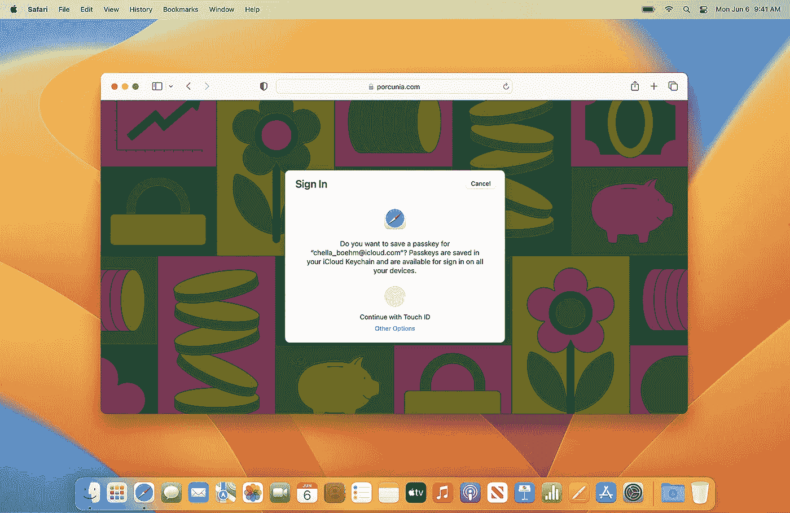
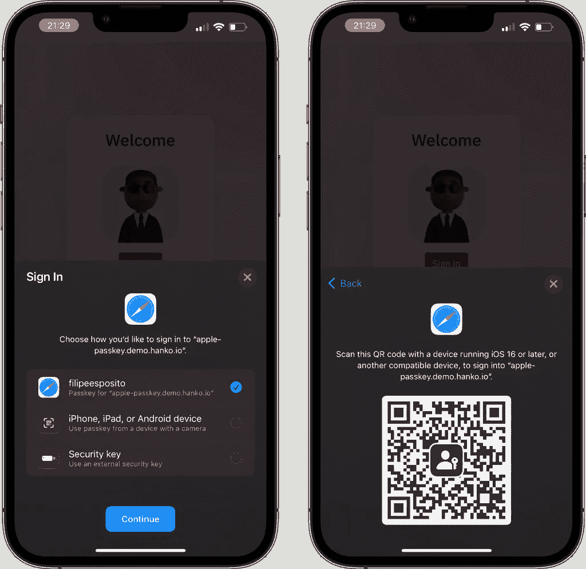
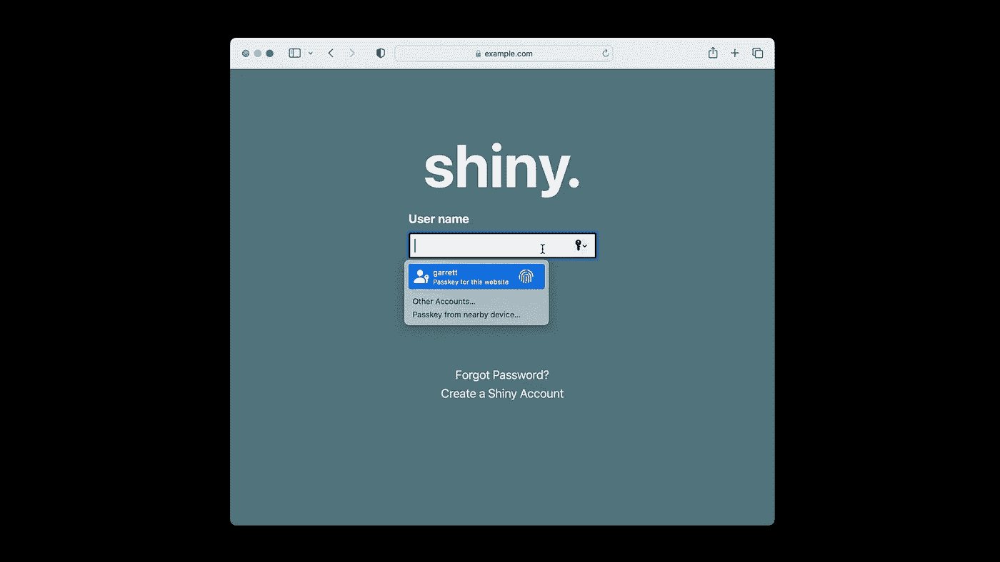
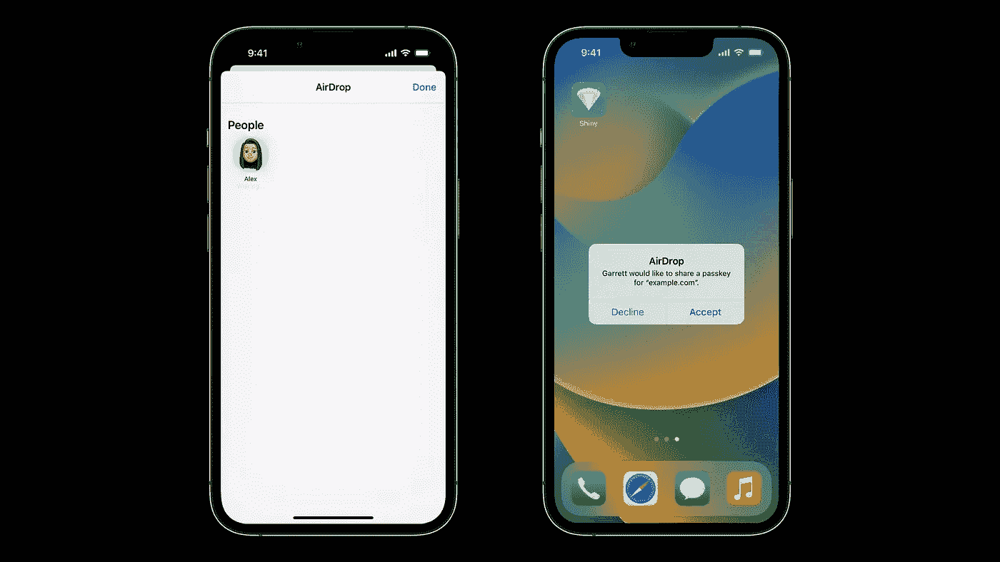

# 苹果密码:密码的终结

> 原文：<https://levelup.gitconnected.com/apple-passkeys-the-end-of-passwords-bfb7d22e4fb>

## 苹果的后密码世界计划

在 2022 年 WWDC 上，苹果宣布了一项名为 Passkeys 的 Safari 新功能。密钥是 WebAuthn 凭证，具有该标准提供的惊人安全性，以及在所有设备上备份、同步和工作的可用性。

这是一项新功能，将 WebAuthn 的安全性内置到每台 iPhone、iPad 和 Mac 中，因此它可以在任何地方作为密码的替代品使用。密码储存在 iCloud 钥匙串中。这些密钥是端到端加密的，除了你，没人能看到。

万能钥匙非常容易使用。在大多数情况下，只需轻点或点击即可登录。由于 WebAuthn 和 iCloud Keychain 的组合安全性，它们比当今大多数密码加第二因素的解决方案都更强大。

以下是你需要知道的关于苹果万能密码的一切。

# 万能钥匙

密钥是独一无二的数字密钥，保留在设备上，从不保存在网络服务器上，使黑客无法窃取或欺骗用户共享。使用密码可以轻松安全地登录触控 ID 或 Face ID 进行生物识别验证，使用 iCloud 钥匙串在 Mac、iPhone、iPad 和 Apple TV 上进行端到端加密。

它们还可以跨应用程序和网络运行，用户可以使用 iPhones 登录非苹果设备上的网站或应用程序。与当今几乎所有常见的身份验证形式相比，同时使用密钥更容易、更快、更安全。

万能钥匙不需要任何额外的硬件。它内置在你所有的苹果设备中。它整合了 WebAuthn 标准和 iCloud 钥匙串中的所有附加安全功能。因为它由 iCloud Keychain 备份，所以即使您丢失了所有 Apple 设备，您也可以恢复凭据。它与安全密钥一样，具有平台提供的强大的防钓鱼能力。

# 密钥将如何取代密码？

就拿任何一个通用的 app 来说吧。首先，您需要创建一个帐户。然后，一个受信任的系统表会显示一些关于凭证的信息，以及我可以在哪里使用它。点击继续使用 Face ID，就这样。现在，您拥有了该帐户的非常强的公钥/私钥凭证，它安全地储存在我的 iCloud 钥匙串中。

当您回到此应用程序并想要登录时，也一样简单。当表单出现时，你会被问一个非常明确的问题，包括你正在登录的应用程序的名称和我的帐户。你所需要做的就是点击继续，Face ID，就是这样！这是您创建和使用这些新凭据的全部步骤。

由于它们是由系统管理的公钥/私钥对，因此不会被重复使用或猜测，不会受到应用程序或网站的攻击，并且操作系统和浏览器内置了非常强大的网络钓鱼保护。

它们在你的 Mac 上甚至在网站上也非常相似。如果你在 Mac 上，它会自动填充你将要登录的网站的详细信息，并要求你在触控 ID 的帮助下进行验证。如果你使用的是非苹果设备，它会提示你在 FaceID 的帮助下使用 iPhone 登录。

# 如何使用密钥共享帐户？

使用密码，要与他人共享您的帐户，您需要共享您的帐户详细信息，包括您的密码。你也可以用密码做同样的事情。但是有点不一样。要与其他人共享密钥，您可以使用隔空投送。

现在，因为有了 Passkey，凭证不再是你输入的东西，它比给出一个密码更安全。若要共享您的帐户，请转到 iPhone 的帐户详细信息设置页面，该页面包含您的所有密钥和密码。从那里你可以很容易地选择哪些帐户的细节和谁发送使用隔空投送和人将收到密码。就这么简单。

# 下一代账户安全

密钥是取代密码的加密密钥对，基于 FIDO Alliance 和 W3C 标准。这些密钥对的安全性大大增强。资历令人印象深刻。每个密钥都非常强大。它们从来都是不可预测、不可重用或无效的。

服务器泄露不是问题。对于黑客来说，服务器不是很有价值的目标，因为它们只维护公共密钥。网络钓鱼不是问题。人们永远不会被误导使用他们的密码登录到欺诈性的应用程序或网站，因为密码与他们设计的应用程序或网站有着内在的联系。

iCloud Keychain 中的密钥是端到端加密的，这意味着即使是 Apple 也无法读取它们。密钥在用户和您的应用程序或网站之间建立安全的私人连接。

# 结论

密钥是后密码时代的绝佳替代品。它们更加安全、加密，并能抵御网络钓鱼攻击。因为它是基于 FIDO2 的，所以它基本上可以在任何设备上运行。虽然用密码共享账户有点噱头，但这是完全合理的，因为它使账户共享更加安全。

最终，这取决于开发者和组织在他们的网站或应用程序中实现密钥的能力。尽管如此，看看每个人接受万能钥匙的速度会有多快还是很有趣的。你们对密码和无密码的未来有什么看法？请在评论中告诉我！