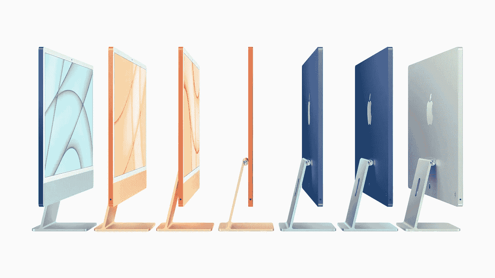

# 截至 2021 年 4 月面向开发者的苹果芯片

> 原文：<https://levelup.gitconnected.com/apple-silicon-for-developers-as-of-april-2021-f47f3a1757ee>

*最初发布于*[*https://fek . io*](https://fek.io/blog/apple-silicon-for-developers-as-of-april-2021)*。*

关于使用 M1 Mac 进行开发的多语言工程师频道

去年 11 月，我在 Youtube 上发布了一个关于苹果硅 M1 MAC 电脑是否可以并且应该被开发者和软件工程师使用的视频。这个视频比其他任何视频的点击率都高，除了一个关于我坏了的[空调](https://www.youtube.com/watch?v=HJer7aPM6tk)的视频。

当我写这篇文章的时候，苹果已经在 2021 年 4 月 20 日发布了他们的产品。他们宣布的产品之一是新的 M1 iMac。我还没有购买新的 M1 苹果硅苹果电脑，但我可能会购买这些 iMacs 中的一台。我现在写这篇文章的电脑是一台 27 英寸的 iMac，配有 I7 处理器。

我主要用我的 iMac 进行开发，所以我想看看我使用的开发工具对新 my iMac 的支持。当 M1 Mac 电脑首次发布时，通过通用应用程序或 Mac 电脑上一个名为 Rosetta 2 的程序，普通用户软件获得了很好的支持，该程序允许你在 M1 芯片上运行 x86_64 代码。让我们来看看我们目前在开发人员需要的工具方面的进展。

# 工具

家酿类似于 Linux 上的 apt-get 或 Windows 上的 Chocolatey 等包管理器。它是一个命令行工具，用于安装面向 Unix 等操作系统的应用程序和库。当最初的 M1s 发布时，对自制软件没有很好的支持。我的理解是，它已经完全[移植](https://www.imore.com/package-manager-homebrew-now-fully-supports-apple-silicon)到新的基于 ARM64 的架构。

# **集成开发环境和代码编辑器**

*   **Xcode** :这是 M1 MAC 上完全支持的通用应用。Xcode 也有基于 cli 的工具，用于为自制程序和其他工具编译代码。
*   安卓工作室:谷歌目前有一个在 M1 上运行的开发者预览版。有运行 Android 模拟器的基本支持，但你最好的成功将是尝试直接在设备上运行。
*   **Visual Studio 代码**:编辑器很受 Web 开发者欢迎，有广泛的语言支持。微软已经将其作为通用应用程序发布，因此它可以在基于 M1s 和 x86 的 MAC 上运行。
*   **JetBrains** :这个 IDE 很受 Java 开发者的欢迎，它现在完全支持 M1 处理器。
*   **Eclipse** :这是我近 20 年前停止使用的 Java IDE。目前 M1 处理器还没有这样的版本，但是你可以使用 Rosetta 2 运行它。

# **语言支持**

*   C、C++、Objective-C 和 Swift :所有这些语言都通过 Clang 和 Swift 编译器在 M1 MAC 上提供原生编译器支持。这些包含在 Xcode 工具中。
*   Java:Oracle open JDK 目前支持 M1 处理器。
*   **Node.js** :这个非常流行的 JavaScript 运行时现在可以在 Node.js v16 上本地运行。如果你正在寻找一个长期的支持版本，你将不得不从源代码编译或者在 Rosetta 2 下运行。
*   **Python** : Python 现在拥有了对 M1 处理器的原生支持。
*   不支持 R 编程语言。这是因为 R 是使用较新版本的 Fortran 构建的。Fortran 代码可以转换成 C，但是只能转换成 Fortran-77。r 是用较新版本的 Fortran 构建的。
*   **Go Lang**:M1 处理器现在完全支持 Go。
*   Rust:Rust 编译器是用 LLVM 构建的，与 Xcode 语言使用的编译器技术相同。现在 M1 处理器支持它。

# **Docker 和虚拟化**

*   Docker :去年发布了 Docker 的早期版本，但是几天前 Docker [发布了对 M1 处理器的全面支持。Docker 支持在 ARM 和 x86 上运行的映像。](https://www.docker.com/blog/released-docker-desktop-for-mac-apple-silicon/)
*   VMWare Fusion:VMWare 表示他们承诺推出 M1 版本，但是他们还没有宣布 M1 版本。希望他们很快会有所收获。
*   Parallels:截至 4 月 19 日，Parallels 刚刚[发布了用于 Mac 的](https://www.parallels.com/blogs/Parallels-Desktop-M1/) Desktop 16.5。
*   UTM:这看起来像是新来的。我认为它是基于 QEMU 的，但这个[应用](https://mac.getutm.app/)将允许你运行基于 Windows 和 Linux 的 ARM 操作系统。

# **框架**

*   **。网**:。预览版的. NET 6.0 有一个适用于 Macs 电脑的安装程序。如果您试图运行早期版本，您将需要 Rosetta 2。
*   **Electron** : Electron 是一个将基于 HTML 和 JavaScript 的应用程序转化为桌面应用程序的框架。Visual Studio 代码基于电子。电子现在在 M1 处理器上被本地支持。
*   **颤振**:这个在罗塞塔 2 下有效。还不知道它什么时候会出现在 M1 处理器上。

# 结论

当我第一次看到开发者对苹果芯片的支持时，M1 MAC 电脑刚刚发布，这种支持真的很差。到今天为止，支持看起来好多了。一些原生工具是预览版，不是正式版本。如果您正在进行 Android 开发，您可能希望继续使用基于 x86 的机器。对于大多数其他类型的开发来说，M1s 看起来比 2020 年 11 月时要安全得多。

请做好自己的功课做出自己的决定，但我希望我所做的研究能够有所帮助。