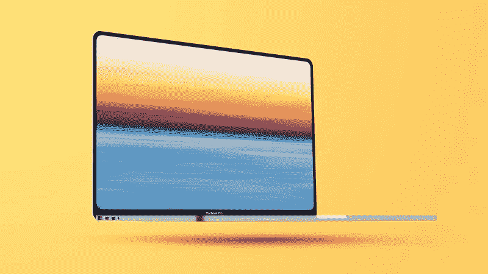
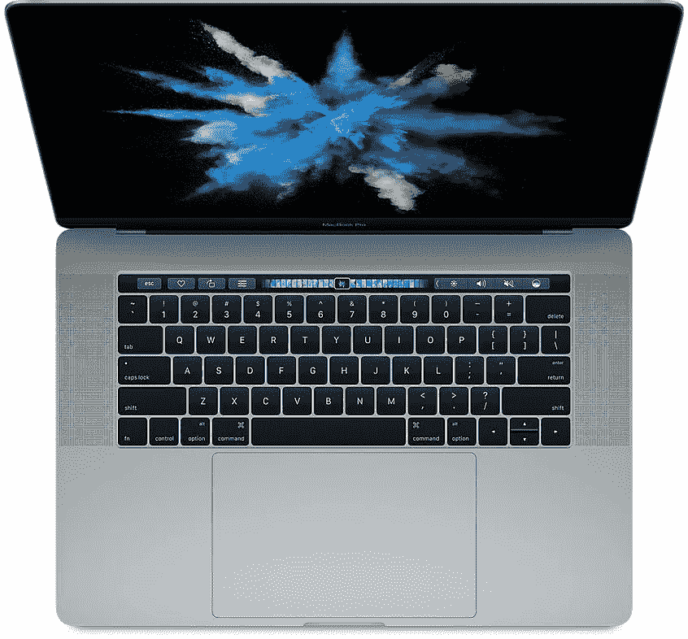
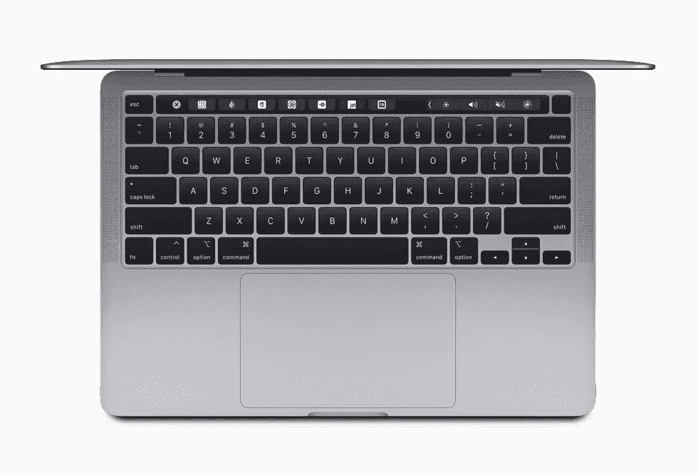
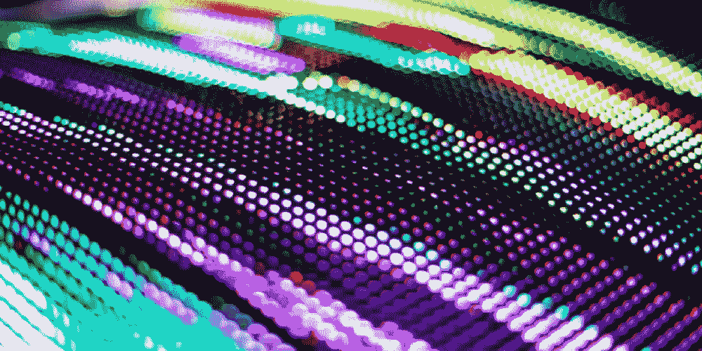
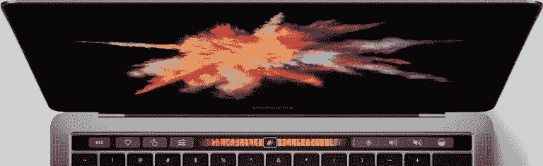
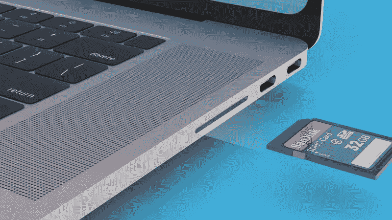

# 苹果，你怎么这么久才来。重新设计的 14 英寸和 16 英寸 MacBook Pro，2021 年。

> 原文：<https://levelup.gitconnected.com/apple-what-took-you-so-long-rumors-of-redesigned-14-inch-and-16-inch-macbook-pros-2021-59b8e89ff53f>

## 自 2016 年以来，MacBook Pro 没有重大的重新设计，这是五年前的事情。苹果你准备好听听用户群的意见了吗？

重新设计的 MacBook Pro。信用: [**MacRumors。**](https://www.macrumors.com/2021/02/25/14-16-macbook-pro-mini-led-display/)

在过去的五年里，每台 MacBook Pro 看起来都一样。它们都配有数字触摸条、thunderbolt 端口，没有 HDMI 或 SD 卡插槽。最令人讨厌的大概是屏幕较厚的水平和垂直边框。这是大多数人关心的问题，但不是所有人。

左:苹果 MacBook Pro 2016。右图:苹果 MacBook Pro 2020。没什么变化。功劳: [**苹果**](https://support.apple.com/kb/SP749?locale=en_US) **。**

根据像[**MAC rumors**](https://www.macrumors.com/2021/02/25/14-16-macbook-pro-mini-led-display/)[**Blomberg**](https://www.bloomberg.com/news/articles/2021-01-15/apple-macbook-pros-with-magsafe-return-in-the-works)这样的热门网站，以及像郭明志这样的人，看来苹果已经决定倾听他们的用户群一次了。苹果预计将在今年晚些时候发布 14 英寸和 16 英寸 MacBook Pro 的**。随之而来的是 MacBook 系列的新设计和新时代。**

## **有什么新鲜事？**

*   **据传闻，苹果正在重新设计 MacBook pro，看起来更像 iPhone 12。这意味着不再有弯曲或楔形设计。相反，MacBook Pro 的顶部和底部将采用平边设计。此外，当前 MacBooks 周围的厚挡板将被移除，以利于更薄的挡板。因此 MacBook Pro 将会更薄更轻。**

****

**更薄更轻的 MacBook。信用: [**MacRumors。**](https://www.macrumors.com/2021/02/25/14-16-macbook-pro-mini-led-display/)**

*   **改进的显示。据说即将推出的 macbook 将采用迷你 LED，而不是今天的 macbook 的 LCD retina 显示屏。迷你 LED 比液晶面板更节能。它还提供比 LCD 面板更好的黑色。同时价格也低于更复杂的 OLEDs。迷你 LED 为用户提供了 OLED 和 LCD 的优点。**

****

**迷你 LED 的。信用: [**9to5Mac。**](https://9to5mac.com/2021/01/08/what-is-mini-led-tech-ipad-macbook/)**

*   **触摸杆的拆卸。据说功能键会在这些新 MacBooks 中重新出现。苹果删除了最讨厌的功能，即首次出现在 2016 年 MacBook 上的 touch bar。我知道这对很多人都有好处。t 仍然是谣言，所以让我们祈祷等待苹果。**

****

**MacBook 上最讨厌的功能，touch bar。[功劳:**苹果。**](https://developer.apple.com/design/human-interface-guidelines/macos/touch-bar/touch-bar-overview/)**

*   **港口的回归。包括 USB-A、HDMI 和 SD 读卡器在内的所有端口都在 2016 年从 Macbook 上剥离。从那以后，他们再也没有回来过。但随着这些新的传言，HDMI 和 SD 卡读卡器的回归。从 2016 年开始，SD 卡和 HDMI 将是唯一回归的端口。这将吸引许多倾向于使用 SD 卡读卡器的摄影师。**

****

**端口正在回归 MacBook Pro。功劳: [**MacRumors。**](https://www.macrumors.com/2021/02/22/2021-macbook-pro-sd-hdmi-port-kuo/)**

## **最后**

**苹果现在已经听取了用户群的意见，推出了更薄更轻的 MacBook pro，这很受欢迎，SD 读卡器和 HDMI 也是一个很好的补充，因为它可以减少使用 USB type C 加密狗和安全资金的渴望。MagSafe 功能也是一个非常好的补充，因为它有助于保护 MacBooks。新的 MacBooks 可能会采用传闻中的 [**M1x 芯片。**](/if-all-these-m1-macbook-rumors-are-true-then-other-laptops-are-in-for-hell-71a02eee9958?source=your_stories_page-------------------------------------)**

**如果你喜欢这篇文章，你可以给我 50 次掌声👏👏👏，如果你对技术和软件开发感兴趣，你也可以关注我的 [***媒体***](https://konaduakwasiakuoko.medium.com/) 和社交媒体。您可以关注我的[***Twitter***](https://twitter.com/akuoko_konadu)因为我们将讨论编码和一般的技术世界，所以我的 DM 一直是开放的。加入我的[***YouTube***](https://www.youtube.com/channel/UCYKFy3oPn2b6gbjAzmgNgJg)让我们一起做一些编码。祝你有愉快的一天。下一次快乐编码。**

**如果你希望有人为你写科技文章，我很乐意为你写一篇**低至 5 美元的******。******

## ****我的头条新闻。****

**** [## 如果所有这些关于 M1 MacBook 的传言都是真的，那么其他笔记本电脑就惨了。

### 一个 M1x 芯片出现在一个基准测试网站上，其多核性能是当前 M1 的两倍。

levelup.gitconnected.com](/if-all-these-m1-macbook-rumors-are-true-then-other-laptops-are-in-for-hell-71a02eee9958)  [## 开源和 Linux 进入太空，推动了人类想象力的极限。

### 你可以获得在火星直升机上运行的软件框架，并将其用于你的项目。开源是多么的…

levelup.gitconnected.com](/open-source-and-linux-makes-it-to-space-pushing-the-limits-of-human-imagination-a05e032aa884)  [## 程序员们，不要待在自己的舒适区里。

### 呆在我们的舒适区非常有趣，但后果是什么，我们如何才能阻止这种情况。

levelup.gitconnected.com](/programmers-dont-stay-in-your-comfort-zone-1b10e465b8cb)****