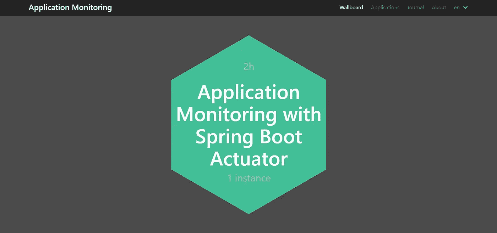
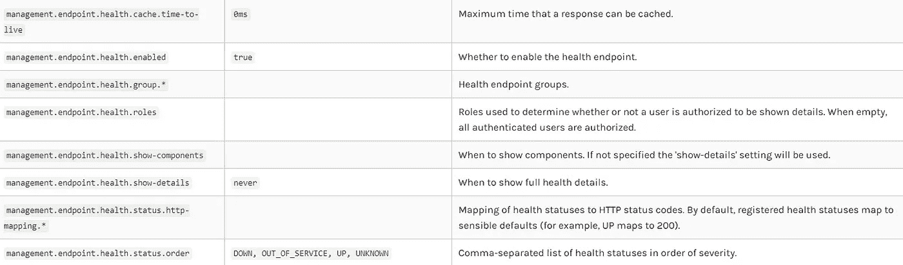
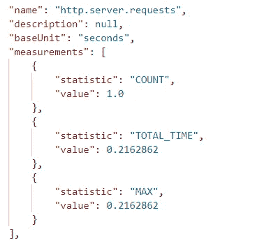
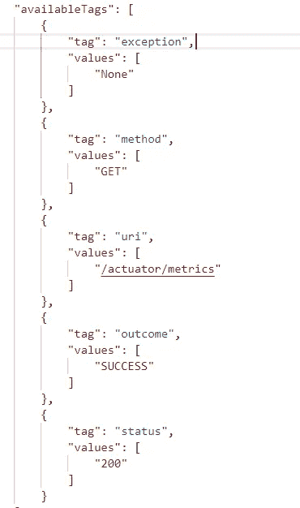

# 使用 Spring Boot 执行器的应用监控(第一部分)

> 原文：<https://levelup.gitconnected.com/application-monitoring-using-spring-boot-actuators-part-1-dab8576f4db6>



在本系列中，我们将创建两个 Spring Boot 应用程序，一个是带有 REST APIs 的客户端应用程序，另一个将提供随时可用的 UI 来监控客户端应用程序的使用情况、指标和性能。

在本文中，我们将创建包含 REST APIs 的客户端应用程序，并探索 Spring Boot 执行器来监控应用程序的连接、使用和 API。让我们从使用 [Spring Initializer](https://start.spring.io/) 创建一个应用程序开始。

*   **使用 Spring Boot 执行器的应用监控(第一部分)**
*   [**应用程序监控使用 Spring Boot 管理(第二部分)**](https://medium.com/@patelromil/application-monitoring-using-spring-boot-admin-part-2-ed14178c6964)
*   [**应用监控使用 Prometheus 和 Grafana(第三部分)**](https://medium.com/@patelromil/application-monitoring-with-prometheus-and-grafana-part-3-1c4ad5e1b042)

# 客户端应用程序(REST APIs)

我们将使用以下依赖关系来监控客户端应用程序

```
***For Maven Project***<dependency>
<groupId>org.springframework.boot</groupId>
<artifactId>**spring-boot-starter-actuator**</artifactId>
</dependency>***For Gradle Project***compile group: 'org.springframework.boot', 
name: '**spring-boot-starter-actuator**', version: '2.2.5.RELEASE'
```

## Spring Boot 执行器

执行器端点有助于我们监控应用并与之交互。它提供了内置端点的数量。对于 *web* **/health** 和 **/info** 是默认的暴露端点。

为了 ***暴露并启用*** 其他端点，我们必须在**应用属性**或 **application.yml** 中设置以下属性

```
-> To enable the endpoint**management.endpoint.<id>.enabled = true** management.endpoint.metrics.enabled = true-> To expose the endpoint**management.endpoints.web.exposure.include = <id>** management.endpoints.web.exposure.include = metrics-> To expose all endponits (be aware before exponsing all endpoints for producation)**management.endpoints.web.exposure.include = ***
```

`[**http://localhost:8080/actuator**](http://localhost:8080/actuator)`

*   **健康**:显示应用健康信息`(DOWN, OUT_OF_SERVICE, UP, UNKNOWN)`
*   **信息:**显示任意应用程序信息(为提交 id、配置文件等配置 git 插件。)
*   **度量**:提供 tomcat、API、JVM 等的度量细节。
*   **env** :显示应用程序的配置，如端口、活动概要、JVM 细节等。
*   **映射**:显示整个应用程序的所有`@RequestMapping`路径的列表
*   **预定任务:**显示应用程序的预定任务，如`cron, fixedDelay, fixedRate, custom`
*   **bean**:显示应用程序中所有 Spring beans 的完整列表

其他有用的内置端点有**会话、关闭、缓存、条件、HTTP 跟踪、记录器、liquibase、线程转储、flyway。**

## 监控应用程序的运行状况

为了检查我们的应用程序是否正常运行，我们可以使用 **/health** 端点。让我们点击一下来检查我们的应用程序的健康状况。

```
{
    **"status": "UP"**
}
```

默认情况下，它将只显示应用程序的状态`DOWN, OUT_OF_SERVICE, UP, UNKNOWN.`要获得更多细节，如数据库连接状态、磁盘空间状态，我们必须将以下内容添加到我们的 *application.properties* 文件中，并再次访问同一个端点。`**management.endpoint.health.show-details = always**`

```
{
    "status": "UP",
    "components": {
        "**db**": {
            **"status": "UP",**
            "details": {
                "database": "MySQL",
                "result": 1,
                "validationQuery": "/* ping */ SELECT 1"
            }
        },
        "**diskSpace**": {
            **"status": "UP",**
            "details": {
                "total": 467848392704,
                "free": 8225312768,
                "threshold": 10485760
            }
        },
        "**ping**": {
            "status": "UP"
        }
    }
}
```



健康配置

## 使用指标监控 REST APIs、JVM、光和 Tomcat 连接

这里我们将关注**/指标**端点将为**REST API、JVM 进程、光连接、JDBC 连接、Tomcat 会话等提供指标。**

我们可以在`**host:port/actuator/<id>**` **访问端点。**要查看指标，让我们向`localhost:8080/actuator/metrics.`发出一个请求，我们将使用**“http . server . requests”**来监控 REST APIs，并将与 Spring Boot 管理员一起探索其他指标。

```
{
"names": [
"jvm.memory.max",
"jvm.threads.states",
"jdbc.connections.active",
"jvm.gc.memory.promoted",
"jvm.memory.used",
"jvm.gc.max.data.size",
"jdbc.connections.max",
"jdbc.connections.min",
"jvm.gc.pause",
"jvm.memory.committed",
"system.cpu.count",
"logback.events",
"jvm.buffer.memory.used",
"tomcat.sessions.created",
"jvm.threads.daemon",
"system.cpu.usage",
**"http.server.requests"**,
"jvm.gc.memory.allocated",
"hikaricp.connections.idle",
"hikaricp.connections.pending",
"jdbc.connections.idle",
"tomcat.sessions.expired",
"hikaricp.connections",
"jvm.threads.live",
"jvm.threads.peak",
"hikaricp.connections.active",
"hikaricp.connections.creation",
"process.uptime",
"tomcat.sessions.rejected",
"process.cpu.usage",
"jvm.classes.loaded",
"hikaricp.connections.max",
"hikaricp.connections.min",
"jvm.classes.unloaded",
"tomcat.sessions.active.current",
"tomcat.sessions.alive.max",
"jvm.gc.live.data.size",
"hikaricp.connections.usage",
"hikaricp.connections.timeout",
"jvm.buffer.count",
"jvm.buffer.total.capacity",
"tomcat.sessions.active.max",
"hikaricp.connections.acquire",
"process.start.time"
   ]
}
```

现在让我们点击`**http.server.requests**` ，它将为 REST APIs 提供度量、统计和其他标签细节。

*   `localhost:8080/actuator/metrics/http.server.requests`



原料药的测量

*   **计数:**应用程序处理的请求数
*   TOTAL_TIME:处理所有请求所花费的时间
*   **MAX:**API 在特定时间间隔内花费的最长时间



API 的标签

*   **异常**:应用程序产生异常
*   **方法**:请求 API 的方法
*   **uri** :请求的 API 的端点
*   **结果**:API 的响应，如 SUCCESS、CLIENT_ERROR 等。
*   **状态**:API 的 Http 状态

现在，让我们快速创建带有所需响应、状态代码和异常的 API。

**User.java**

```
@Entity
@Data
@Table(name = "user")
public class **User** {@Id
@GeneratedValue
private Long id;
private String firstname;
private String lastname;
private String contact;}
```

【UserController.java 

这里，我创建了带有 GET、POST 和 DELETE 的 API，其中“/user/{id}”对无效的用户 id 生成 400 错误请求。还有两个 get 映射生成了 parse 和 io 异常。

好吧！让我们向 API 发出一些请求，用不同的状态代码、异常和方法生成响应，并使用执行器监控行为。

这显示了一个应用程序的所有 API 的详细信息，如果我们想获得特定 API 的详细信息，我们可以监控单个 API 的行为吗？是的，我们可以。为了过滤响应度量，我们可以使用**可用标签**，例如**方法**、 **uri** 、**异常**、**状态、**和**结果**。我们可以使用`**?tag=<tag_name>:<tag_value>.**` 过滤指标，以使用`**?tag=<tag_name_1>:<tag_value_1>&tag=<tag_name_2>:<tag_value_2>**`基于*多个*参数进行过滤

## 获取单个 API 的指标

*   `**tag=uri:<endPoint>**`

```
**localhost:8080/actuator/metrics/http.server.requests
?tag=uri<endPoint>**localhost:8080/actuator/metrics/http.server.requests?tag=uri:/users/user/{id}
```

## 根据响应的状态代码获取 API 的指标

*   `**tag=status:<HTTP Status Code>**`

```
**localhost:8080/actuator/metrics/http.server.requests
?tag=status:<Http Status Code>**localhost:8080/actuator/metrics/http.server.requests?tag=status:200
localhost:8080/actuator/metrics/http.server.requests?tag=status:400
```

## 基于请求方法获取 API 的指标

*   `**tag=method:<HTTP Method>**`

```
**localhost:8080/actuator/metrics/http.server.requests
?tag=method:<HTTP Method>**localhost:8080/actuator/metrics/http.server.requests?tag=method:GET
localhost:8080/actuator/metrics/http.server.requests?tag=method:POST
```

## 基于多个标签获取 API 的指标

*   `**tag=uri:<endPoint>&tag=method:<HTTP Method>**` **(端点，方法)**

```
localhost:8080/actuator/metrics/http.server.requests
?tag=uri:/users/user/{id}&tag=status:200
```

## 获取环境详细信息

获取系统配置、JVM 细节、属性配置(如数据库、安全性、管理等)的已部署应用程序。

来自`/env` 的回应(为更加清晰起见，删除了一些细节)

## 获取应用程序的预定任务

我们可能已经创建了向用户发送通知的调度任务、缓存管理任务等。我们可以使用`[http://localhost:8080/actuator/scheduledtasks](http://localhost:8080/actuator/scheduledtasks)`获得相同的详细信息。这里我创建了三个计划任务进行演示。

## 一切都好！

Spring Boot 执行器监控应用程序，并以 JSON 格式返回信息。为了进行监控，我们需要 UI 来进行分析。我们可以使用 [**Spring Boot 管理**](https://medium.com/@patelromil/application-monitoring-using-spring-boot-admin-part-2-ed14178c6964) ，它使用来自执行器的信息，并提供图形、REST APIs 分析、日志配置等等。[在下一篇文章中，我们将探索 *Spring Boot 管理员、普罗米修斯和格拉夫纳。*](https://medium.com/@patelromil/application-monitoring-using-spring-boot-admin-part-2-ed14178c6964)

## 下载源代码:

[客户端应用](https://github.com/romilptl/spring-boot-actuator)，[服务器应用](https://github.com/romilptl/spring-boot-admin)