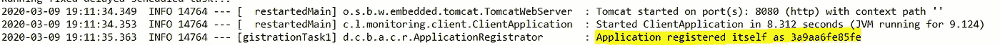
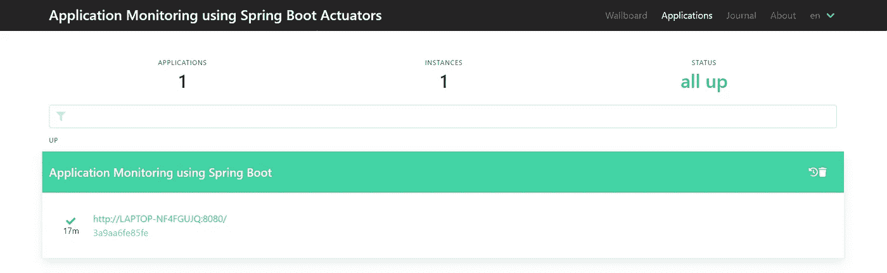
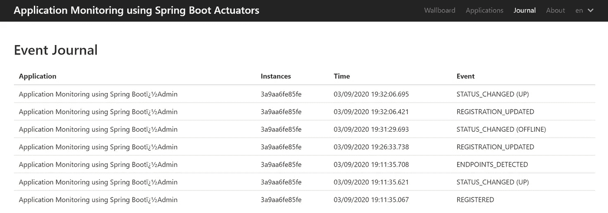
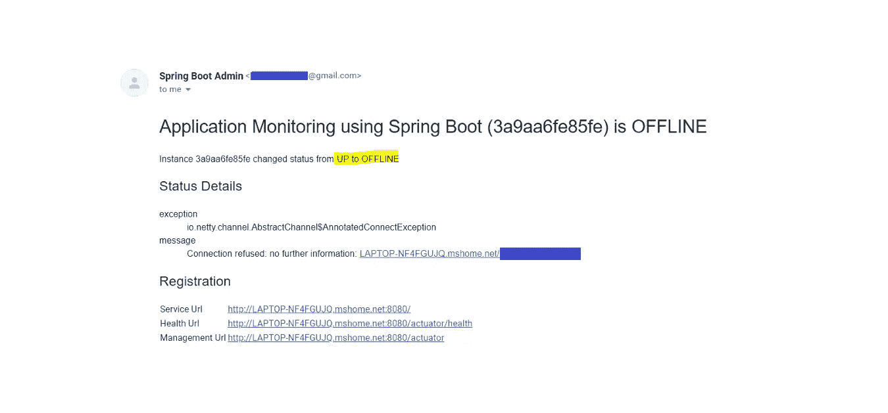
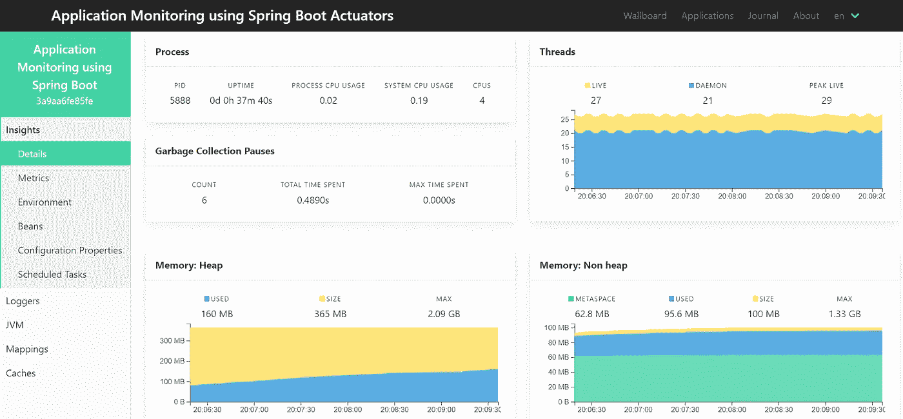
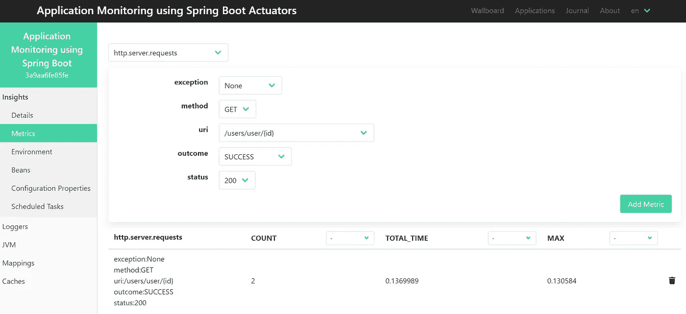
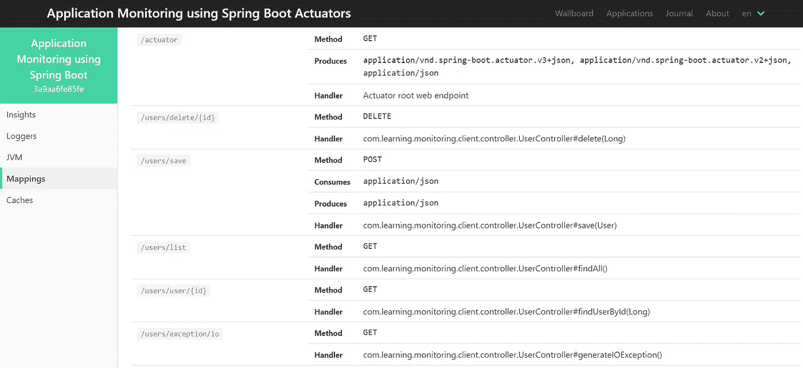
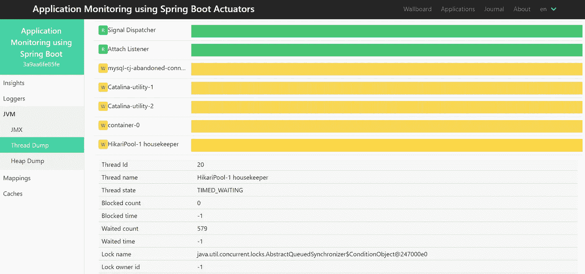
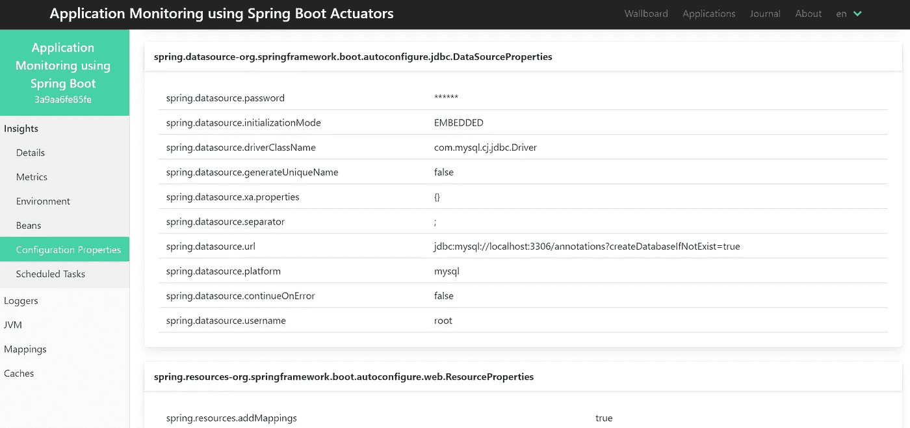
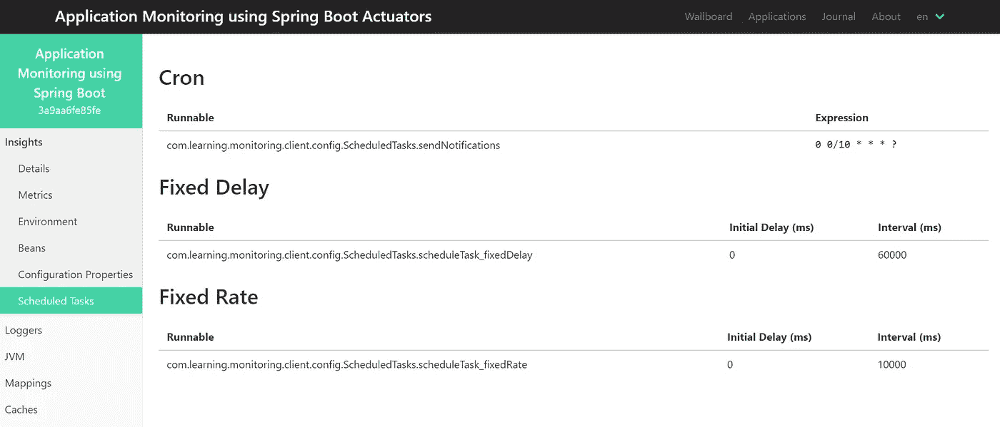

# 使用 Spring Boot 管理监控应用程序(第 2 部分)

> 原文：<https://levelup.gitconnected.com/application-monitoring-using-spring-boot-admin-part-2-ed14178c6964>

在[上一篇文章](https://medium.com/@patelromil/application-monitoring-using-spring-boot-actuators-part-1-dab8576f4db6)中，我们已经创建了客户端应用程序，并探索了 [**Spring Boot 执行器**](https://medium.com/@patelromil/application-monitoring-using-spring-boot-actuators-part-1-dab8576f4db6) ，它们提供了很好的指标和内置端点来监控**健康、API、环境、缓存管理、JVM 进程、Tomcat & JDBC 连接、调度任务、线程等等。**

在本文中，我们将创建一个服务器应用程序，它将与客户机应用程序交互，从执行器获取信息，并提供随时可用的 UI 进行监控。让我们从使用 [Spring 初始化器](https://start.spring.io/)创建一个项目开始。

*   [**应用监控使用 Spring Boot 执行器(第一部分)**](https://medium.com/@patelromil/application-monitoring-using-spring-boot-actuators-part-1-dab8576f4db6)
*   **使用 Spring Boot 管理进行应用程序监控(第 2 部分)**
*   [**应用监控使用 Prometheus 和 Grafana(第三部分)**](https://medium.com/@patelromil/application-monitoring-with-prometheus-and-grafana-part-3-1c4ad5e1b042)

# 服务器应用程序(Spring Boot 管理)

我们将使用以下依赖项来监控客户端应用程序，并在应用程序出现问题时发出警报通知。

```
<properties>
**<spring-boot-admin.version>2.2.1</spring-boot-admin.version>**</properties><dependency>
<groupId>org.springframework.boot</groupId>
<artifactId>**spring-boot-starter-mail**</artifactId>
</dependency><dependency>
<groupId>de.codecentric</groupId>
<artifactId>**spring-boot-admin-starter-server**</artifactId></dependency>
```

让我们在**应用程序.属性**文件中添加配置属性

```
**server.port = 9090**
spring.boot.admin.server.url = [http://localhost:8080](http://localhost:8080)**#Customize UI**
spring.boot.admin.ui.title = Customized Title
spring.boot.admin.ui.brand = Customized Brand**#Mail Configuration for gmail**
spring.mail.host = smtp.gmail.com
spring.mail.port = 587
spring.mail.username = email@gmail.com
spring.mail.password = password #Generate Your APP Password
spring.mail.properties.mail.smtp.auth = true
spring.mail.properties.mail.smtp.starttls.enable = true**#SBA Mail Configuration**
spring.boot.admin.notify.mail.enabled = true
spring.boot.admin.notify.mail.from = email@gmail.com
spring.boot.admin.notify.mail.to = emailTO@gmail.com
```

现在将`@EnableAdminServer`添加到开始执行的主类中。

```
@SpringBootApplication
**@EnableAdminServer**
public class **ServerApplication** {public static void main(String[] args) {
      SpringApplication.run(ServerApplication.class, args);
    }
}
```

我们已经准备好我们的 Spring Boot 管理应用程序，它将与客户端应用程序通信。它将使用致动器提供信息。我们为 Gmail 添加了**spring-boot-starter-mail**和**配置的邮件属性**，为**Spring Boot 管理添加了警报管理，以防应用程序关闭。**

## 客户端和服务器应用程序之间的通信

为了使我们的 Spring Boot 管理服务器能够与客户端通信，我们必须在客户端应用程序上添加所需的配置。

让我们向客户机应用程序的 pom.xml 添加以下依赖项。为了避免冲突和错误，请确保您为客户端和服务器使用相同版本的**spring-boot-admin . version**。

```
<properties>
   **<spring-boot-admin.version>2.2.1</spring-boot-admin.version>**
</properties><dependency>
   <groupId>de.codecentric</groupId>
   <artifactId>**spring-boot-admin-starter-client**</artifactId>
</dependency>
```

现在，我们将添加所需的配置属性

```
**server.port = 8080**
spring.application.name = Application Monitoring using Spring Boot**#SBA Client Configuration**
**spring.boot.admin.api-path = /instances
spring.boot.admin.client.url =** [**http://localhost:9090**](http://localhost:9090)#Datasource, JPA, Management and other properties
```

## 准备出发！

*   启动将在端口 9090 上运行的服务器应用程序
*   启动将在端口 8080 上运行的客户端应用程序



在控制台中，我们可以看到我们的客户端应用程序已经成功地向 Spring Boot 管理员注册为 3a9aa6fe85fe。现在让我们对 REST APIs 进行一些修改来生成信息。

让我们访问`[**http://localhost:9090/applications**](http://localhost:9090/applications)` 我们可以看到注册到服务器的应用程序数量及其状态



`[http://localhost:9090/applications](http://localhost:9090/applications)`

## 应用程序运行状况历史记录

要获取客户端应用程序的健康状态历史，请转到**日志**选项卡或访问`[**http://localhost:9090/journal**](http://localhost:9090/journal)`



## 关于健康状态更改的通知

记住，我们已经使用 starter-mail 依赖项和邮件配置配置了警报通知，以便在客户端应用程序更改其健康状态时获取邮件。您将使用`**spring.boot.admin.notify.mail.to**`在指定的电子邮件地址收到邮件



## 数据库状态、CPU 进程、内存详细信息、图表

主页由进程、内存、线程、数据库健康状态、垃圾收集详细信息等组成。

在侧边栏上，我们可以看到执行器提供的端点，这些端点可以在`[**http://localhost:8080/actuato**](http://localhost:8080/actuato)**r.**` 上访问。更多细节请参考到[**Spring Boot 执行器(第一部分**](https://medium.com/@patelromil/application-monitoring-using-spring-boot-actuators-part-1-dab8576f4db6) **)** 。



## 度量:REST APIs 分析

*   转到 Metrics 选项卡，从下拉列表中选择**“http . server . requests”**
*   选择 **uri、方法、结果、状态和异常**
*   添加公制，我们就可以了！

我们用不同的方法创建了 REST APIs，用适当的状态代码响应，其中一些会生成异常，所有这些都可以通过选择合适的选项使用指标来查看。



我们可以在 **Mappings** 选项卡中获得所有的映射和 URL 模式。您可能会看到 REST APIs 的端点，如`/users/**`



## 虚拟机（Java Virtual Machine 的缩写）

JVM 选项卡包括 JMX、线程转储和堆转储，我们也可以下载同样的数据。



## 配置属性

使用该选项卡，我们可以获得应用程序的所有配置信息。



## 计划任务

我们可能有预定的任务向用户发送通知，用于缓存管理，验证一些进程，等等。我们可以在这里看到我们的玉米类型、固定延迟和固定费率的预定任务。



## 下一步是什么？普罗米修斯和格拉夫纳。

我们还可以使用 Spring Boot 管理来管理**记录器、缓存、bean**和其他信息。如上所述，度量提供了关于数据库连接、JVM 进程、Tomcat 连接、光& JDBC 连接等的大量信息。在下一篇文章中，我将演示如何使用 Prometheus 和 Grafana 将这些信息转换成图形格式，以便更好地监控、分析和警告机制。

## 下载源代码:

[客户端应用](https://github.com/romilptl/spring-boot-actuator)，[服务器应用](https://github.com/romilptl/spring-boot-admin)