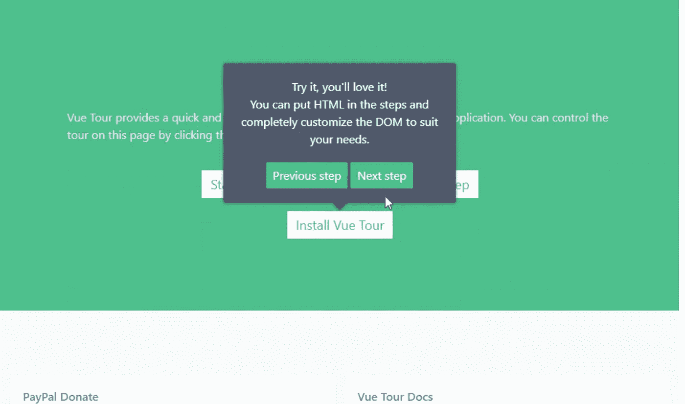
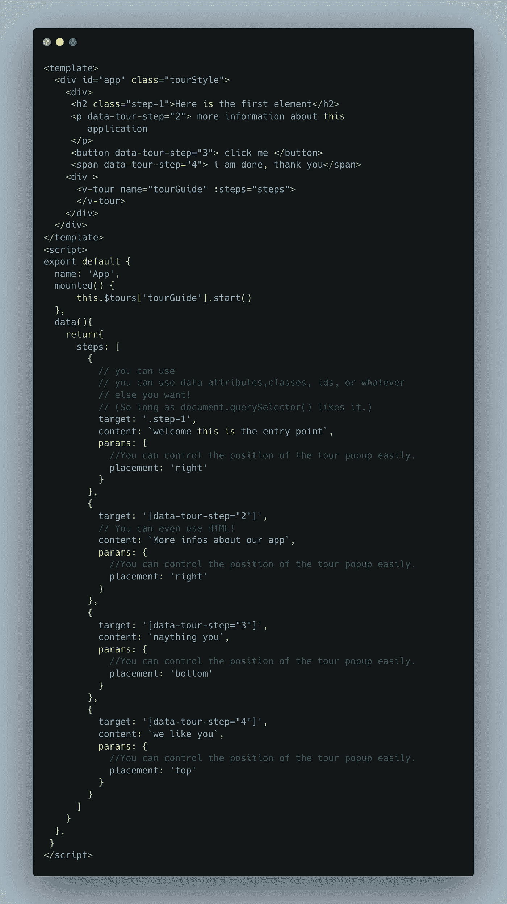
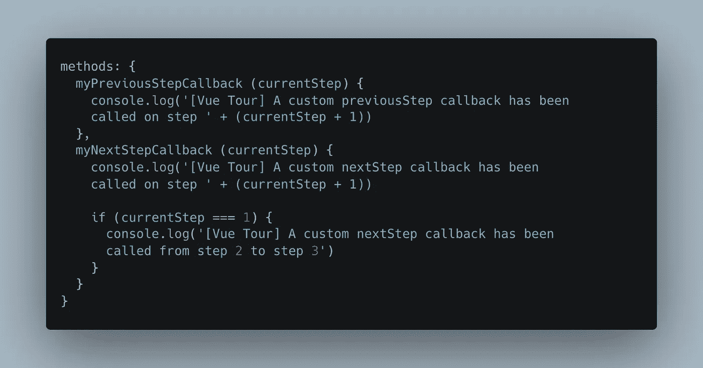
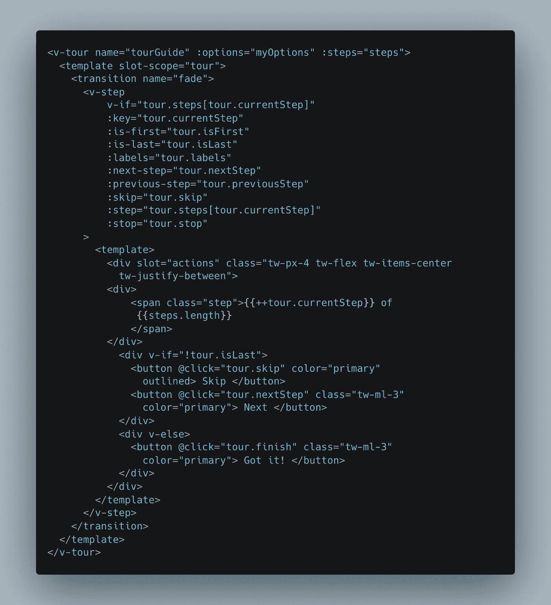

# 使用 Vue.js 和 vue-tour 的应用程序指南

> 原文：<https://levelup.gitconnected.com/application-tour-guide-using-vue-js-and-vue-tour-a79fd4f41406>

您是否曾经遇到过需要在应用程序中实现导游的情况？在本文中，我将向您展示如何在 VueJS 中实现这一点。



自 2014 年问世以来， **Vue** 已经成为一个首选框架，因为它的采用者保持指数级增长，公司正在用它构建生产级系统。考虑到其浅的学习曲线，选择它作为工具并不奇怪。这是一个不断发展的框架，仍然有很多可以提供给未来。

本文的相关问题是:

"*您将如何在 VueJS 中实现用户友好的导游？*”。

最简单的方法是添加一个弹出并解释每个步骤的小导游组件。除了这些弹出窗口很难实现。

谢天谢地，既然你用的是 *Vue.js* ，那么 *vue-tour* 已经涵盖了。这是一个超级简单的库，让写导游变得尽可能简单。让我们开始吧。

# 属国

如果您还没有项目，请使用[*vue-CLI 3.0 beta*](https://www.digitalocean.com/community/tutorials/vuejs-using-new-vue-cli-3)启动一个项目，并遵循默认选项。按几次回车键就足够了。

然后，您将希望使用 npm 安装`vue-tour`:

```
$ npm install vue-tour

# or if you prefer Yarn:
$ yarn add vue-tour
```

接下来，在应用程序入口点导入插件(如果您使用 *vue-cli* 来搭建您的项目，默认为 *main.js* )并指示 **Vue** 使用它。

*main.js*

```
import Vue from 'vue';
import App from './App.vue';
import VueTour from 'vue-tour';
require ('vue-tour/dist/vue-tour.css');Vue.use(VueTour);new Vue({
  el: '#app',
  render: h => h(App)
});
```

现在我们可以添加样式，为此，我们有两个选项:

1.  vue-tour 附带的默认样式
2.  使用由您的产品团队设计的自定义样式:)

现在我们都设置好了，这四个步骤将指导你如何使用 *vue-tour* 。

*   向您希望漫游步骤针对的任何元素添加唯一的类或属性。

```
<div>
   <h2 classes="step-1">Blog Post Title</h2>
<div>
```

*   将您的步骤定义为组件的数据属性(或任何其他位置)中的对象数组，每个对象包含一个`target`属性，该属性是第一步中相关元素的 CSS 选择器。在`target`旁边添加一个`content`属性，其中包含您希望该步骤向用户显示的文本/消息。

```
steps: [
         {
          target: '[data-tour-step="1"]',
          content: `This button doesn't actually do anything.`
         },
         {
          target: '[data-tour-step="2"]',
          content: `This link will take you to`
         },
         {
          target: '[data-tour-step="3"]',
          content: `This is a header element. It's big.`
          params: {
           // tour popup position.
           placement: 'bottom'
           }
         }
       ]
```

*   在你的应用程序中的某个地方添加一个`<vue-tour name="anyNameYouLike" :steps="mySteps"></vue-tour>`组件(通常在你的 *app.vue* 中，因为它是你想要做的应用程序的入口点)。
*   在你安装的钩子上运行`this.$tours[‘anyNameYouLike’].start()`，或者在你想要旅程开始的任何时候运行。不要在创建时运行它，因为 DOM 需要在初始化之前注册。

这可能不清楚。下面是代码形式的指南:

*App.vue*



# 复试

Vue-tour 提供回调，允许你在旅程的不同时刻执行自定义操作。这种行为的一个例子可能是当用户进入你的旅程的第二步时你调用一个 API 或者触发一个 Google Analytics 事件，等等。

要使用回调，请向 v-tour 组件添加回调道具:

```
<v-tour name="myTour" :steps="steps" :callbacks="myCallbacks">
```

然后在包含您的方法的对象中定义您的回调方法 *myCallbacks*

```
data: () => ({
  myCallbacks: {
    onPreviousStep: this.myPreviousStepCallback,
    onNextStep: this.myNextStepCallback
  }
})
```

然后声明您的方法:



# 自定义模板

现在 *vue-tour* 附带了一个默认的模板设计和 CSS，它们的焦点可能不适用于您或您的项目，它们广泛使用了 **Vue.js** [*插槽功能*](https://vuejs.org/guide/components/slots.html) 来允许您定制您的旅行步骤的几乎每个方面。

*vue-tour* 的组件包含一个默认插槽，该插槽在作为道具传递的步骤上包装一个 *v-for* 循环。

步骤本身包含三个槽:`header`、`content`和`actions`。要覆盖这些步骤的 DOM，可以通过覆盖这些槽来实现，如下所示:



这里我们覆盖了默认的动作槽来实现我们喜欢的按钮。

您可以通过用您选择的类的 div 包装 *vue-tour* 组件并编写您的 CSS 来选择更改弹出窗口的默认 CSS。像这样:

```
.tourStyle{
    .step{
        font-family: 'DM Sans';
        font-style: normal;
        font-weight: 400;
        font-size: 14px;
        line-height: 24px;
        color: #000000;
    }
    .v-step[data-v-54f9a632] {
        font-family: 'DM Sans';
        font-style: normal;
        font-weight: 400;
        font-size: 14px;
        line-height: 28px;
        color: #000000;
        background: #FFFFFF;
        border-radius: 16px;
        width: 25rem;
    }
}
```

# 重叠/模糊问题

重要的是要注意，你会有一个覆盖的问题，因为 *vue-tour* 没有背景覆盖，即让背景变得模糊，但不要担心我会覆盖你。

```
.v-tour__target--highlighted {
    box-shadow: 0 0 0 9999px rgba(0,0,0,.5);
}
```

把它添加到你的 CSS 文件中，你应该没问题，也可以选择把它添加到初始 CSS 中，就像这样:

```
.tourStyle{
    .step{
        font-family: 'DM Sans';
        font-style: normal;
        font-weight: 400;
        font-size: 14px;
        line-height: 24px;
        color: #000000;
    }
    .v-step[data-v-54f9a632] {
        font-family: 'DM Sans';
        font-style: normal;
        font-weight: 400;
        font-size: 14px;
        line-height: 28px;
        color: #000000;
        background: #FFFFFF;
        **box-shadow: 0 0 0 99999px rgba(0,0,0,.4) !important**;
        border-radius: 16px;
        width: 25rem;
    }
}
```

现在，我们已经使用 **Vuejs** 和 *vue-tour* 成功实现了应用程序导游功能

所以帮你的用户一个忙。使用 vue-tour 来清楚地说明您和您的团队构建的精彩应用程序的用法。

咻！这是一个很长的阅读，我保证随后的会更短，肯定会更短:)

谢谢朋友们，请随时发表评论。