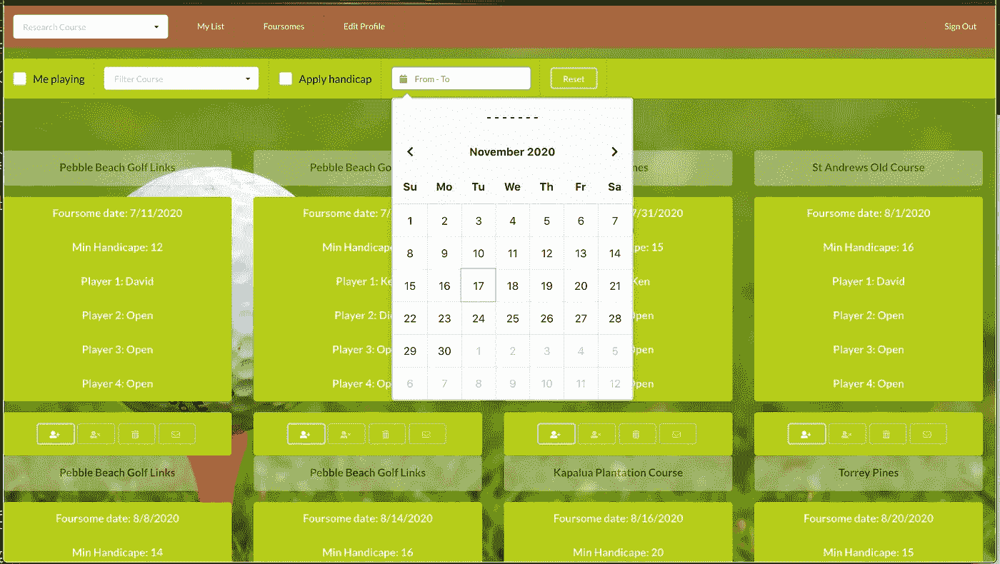
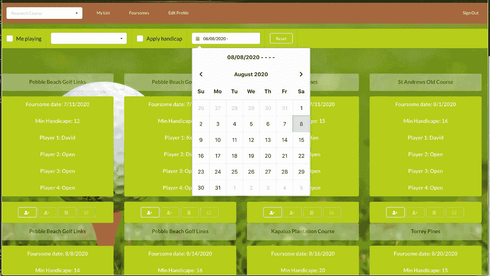
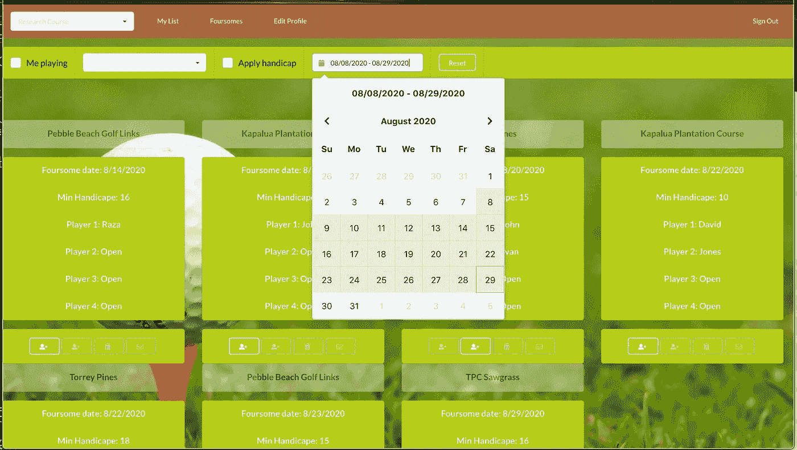
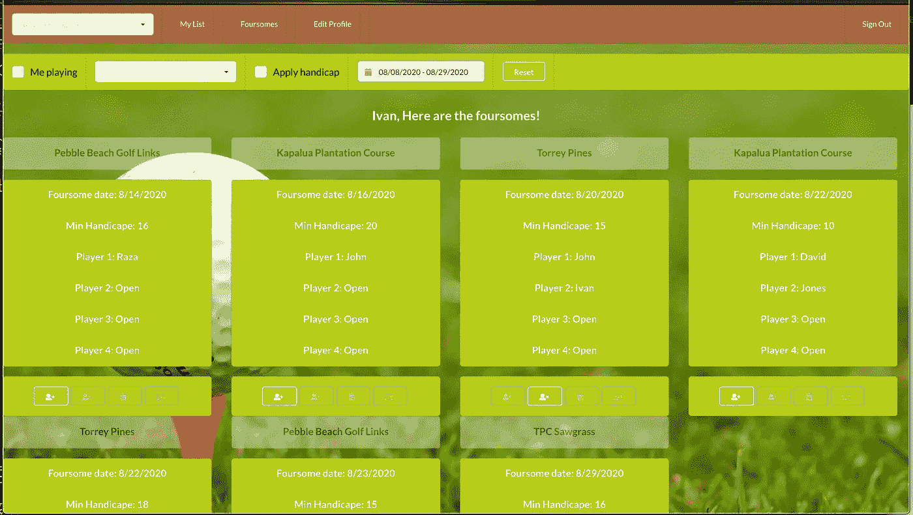
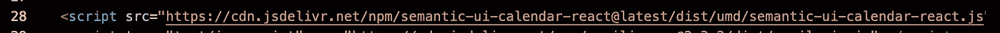
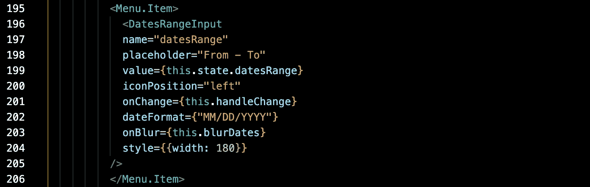
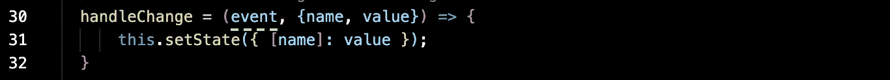
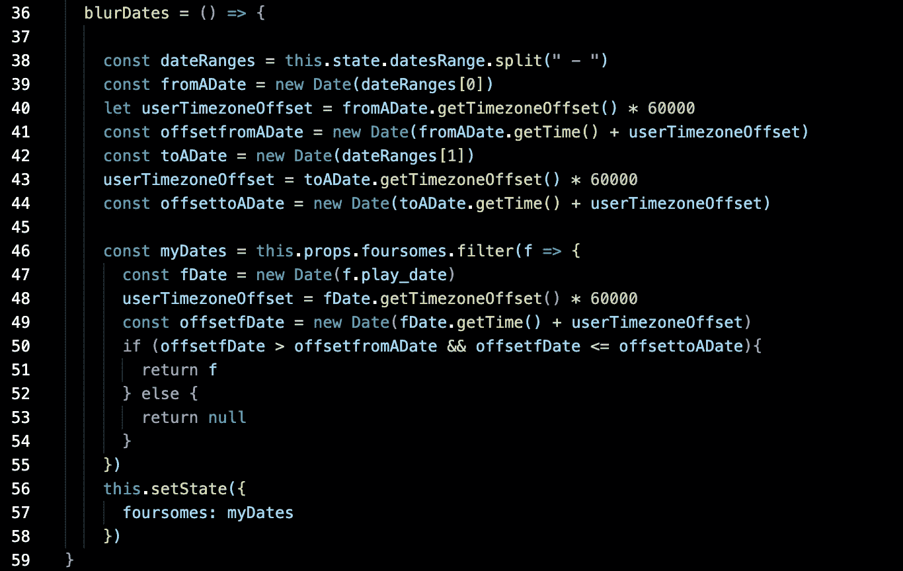

# 将日期范围过滤器应用于 React 应用程序

> 原文：<https://levelup.gitconnected.com/applying-a-date-range-filter-to-a-react-app-a546c5493830>

如果您需要实现一个日期范围选择器来根据日期范围执行一些数据过滤，有很多工具可以让您非常简单地完成这个任务。我使用语义 UI Calendar React 来完成这项工作。以下是预期的行为。

日期范围选择器是一个菜单栏项。

首先，我们选择开始日期。

然后，我们选择截止日期。

只要我们将鼠标指针从 calendar 元素上移开，就会执行选择，应用日期范围并过滤掉日期范围之外的所有数据元素。

下面是使用的步骤。

为了使用语义 UI Calendar React，快速的方法是将它添加到 index.html 文件中。

我们现在需要将 DateRangeInput 导入到使用日期范围选择器的组件中。

现在，我们准备对元素进行编码。让我们先看看 JSX。

日期范围输入与菜单栏放在一起，因此包含在菜单项中。占位符是框显示初始值的方式。请注意“From — To”格式，因为这是我们提取日期的基础。value 属性通常由本地状态设置。我们这里有两个事件处理程序来处理用户事件。当然，onChange 将处理值选择的变化。onBlur 是将导致函数执行的事件。只要我们将鼠标指针从显示的日历上移开，就会执行 blurDates 函数。

我们在之前的帖子中已经检查过 onChange 函数。这是我实现的通用函数，用于处理多个元素的更改。

现在让我们看一下 onBlur 函数。

还记得初始化中的“From — To”格式吗？在用户选择之后，日期范围被格式化为类似“01/01/2020–01/30/2020”的值，这是存储在我们本地州中的字符串值。我使用 split 方法将 from date 和 to date 提取到一个名为 dateRanges 的数组中，用破折号(“-”)括起来。dateRanges 数组现在包含两个条目，第一个(数组条目 0)是开始日期，第二个(数组条目 1)是结束日期。有了这两个日期，我现在可以在我的筛选方法中相应地应用它们，剔除日期在这两个日期范围之外的数据元素(我选择的选项不包括开始日期，但包括结束日期)。

希望这对您有所帮助。