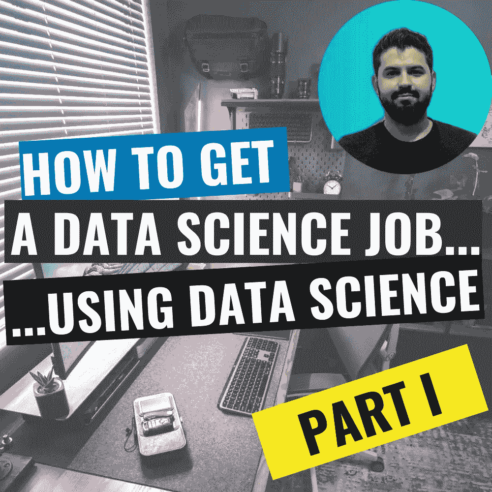
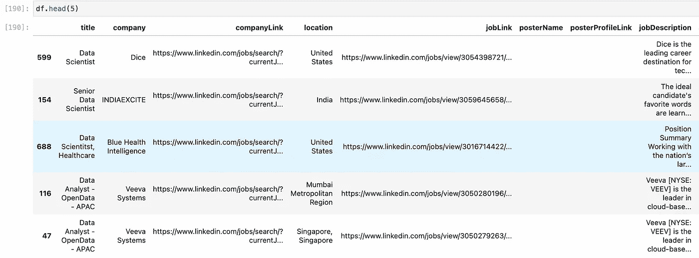

# 如何获得一份数据科学工作…使用数据科学-第一部分

> 原文：<https://levelup.gitconnected.com/applying-data-science-and-web-scraping-to-find-a-job-on-linkedin-part-i-7192cff6d05b>



找工作是一项全职工作。你不得不花费无数的时间搜索和阅读招聘网站，**写求职信**，**一遍又一遍地填写你的简历**(即使你已经上传了简历)**结果却发现你并不适合这个职位。**


当他们在你上传简历后告诉你输入你的工作经历时

但是等等！我们是数据科学家，一定有更好的方法来找到我们的理想工作，而不必阅读那里的每一个工作岗位。如果我们可以建立一个职位发布数据库，然后找到最符合我们资质的职位，那会怎么样？比如资历，编程语言，框架等。然后对每项工作进行评级，这样我们就可以**优先考虑与**更匹配的工作。那会很酷，不是吗？

今天，我们将利用这个现实生活中的问题来介绍一些**网络搜集技术**以及学习如何应用**数据科学**思维方式来解决问题……**因此，我们将利用数据科学来获得一份数据科学工作！**

# 这个计划

在开始编码之前，让我们先在纸上解决问题，然后**把它分成几个步骤。**

1.  找到数据来源——有很多招聘网站，但目前最受欢迎的是 LinkedIn，所以这将是我们的数据来源。
2.  **收集数据** —我们将在 Jupyter 上编写一个 Python 脚本来访问 LinkedIn，用关键词“数据科学”搜索工作，然后在我们从每个帖子中提取信息的同时抓取页面。
3.  清理收集的数据——这对于任何 ETL 来说都是非常重要的一部分。将数据以尽可能好的形式呈现，使其易于理解和搜索。由于我们将处理非结构化数据，即人类编写的文本，我们将不得不清理文本并删除评分部分不必要的单词。
4.  **创建一个评分函数** —我们需要的是创建一个函数来评分我们与每个职位的匹配程度。简单地说，该函数将获取我们的简历和一个职位，输出将是一个介于 0 和 1 之间的数字:f(简历，职位)=分数

# 代码

## 登录 LinkedIn

当天的第一个任务是**安装硒库**。我们将使用这个库用 Python 代码打开并**控制一个 Google Chrome 窗口。我们还需要**从以下网址下载 from 驱动程序**:**

[https://chromedriver.chromium.org/downloads](https://chromedriver.chromium.org/downloads)

确保 chromedriver 版本与您电脑上安装的 Google Chrome 版本相匹配。你可以打开谷歌浏览器，点击右上角的 3 个点来查看版本，然后进入帮助和关于浏览器。

一旦我们在项目文件夹中安装了 Selenium 和 chromedriver，我们就可以开始编码了。我们将导入库:熊猫、硒和时间。后者是一个预安装的库，我们将使用它来**增加等待时间，让浏览器在下一步之前完全加载**一个页面。这是一个重要的考虑时，做网页抓取。然后**我们将创建一个浏览器实例，并使用该实例进入 LinkedIn 登录页面。**

```
#Create browser instance by giving the address to chrome webdriver
browser = webdriver.Chrome('./chromedriver')
# Navigate to LinkedIn Login page
browser.get('[https://www.linkedin.com/login/es?fromSignIn=true&trk=guest_homepage-basic_nav-header-signin'](https://www.linkedin.com/login/es?fromSignIn=true&trk=guest_homepage-basic_nav-header-signin'))
```

你会看到一个谷歌浏览器窗口打开，并自动导航到 LinkedIn。


我们现在将添加几行代码，让**自动插入我们的 LinkedIn 用户和密码**。要插入用户名，我们使用下面一行:

```
browser.find_element([By.ID](http://by.id/),'username').send_keys('erichhohenstein@gmail.com')
```

**我们把这行代码**打散。首先我们有一个浏览器实例，我们将其命名为**“browser”**，然后我们有方法**“find _ element”**我们将如何找到浏览器元素，在本例中为**[**by . id**](http://by.id/)**，然后我们传递 id **“用户名”**。我们使用 Selenium 的方式是在浏览器屏幕上找到元素，然后通过发送字符串、点击和其他命令与它们进行交互。如果你输入" By "然后点击 tab，你可以看到所有可能的方法来找到元素。在本例中，我们传递了“用户名”id。**我是用 Chrome DevTools 找到这个 id 的:在浏览器上右击→Inspect→Select and element to Inspect**(这让你在页面上点击一个元素，然后显示元素背后的代码)****

****如何使用 Chrome 开发工具在网站上找到元素****

****我们同样发送密码，然后使用下面的**代码点击登录按钮。******

```
**browser.find_element(By.CLASS_NAME,’btn__primary — large’).click()**
```

****注意，在这种情况下，我使用类名找到了元素，并使用了**。click()方法**点击按钮**…我们就进去了！******

********

*****黑客之声*我加入****

****为了保持代码的整洁，我们将为每个特定的任务使用函数。因此，登录函数的最终代码如下:****

```
**def loginLinkedIn(browser,usr,psw):
    # Go to LinkedIn Login page
    browser.get('[https://www.linkedin.com/login/es?fromSignIn=true&trk=guest_homepage-basic_nav-header-signin'](https://www.linkedin.com/login/es?fromSignIn=true&trk=guest_homepage-basic_nav-header-signin'))
    time.sleep(4)
    browser.find_element(By.ID,'username').send_keys(usr)
    time.sleep(1)
    browser.find_element(By.ID,'password').send_keys(psw)
    time.sleep(1)
    browser.find_element(By.CLASS_NAME,'btn__primary--large').click()
    return browser**
```

****注意，我添加了 **time.sleep(1)** ，所以程序在每一步之前会等待 1 秒钟。这样做是为了避免执行任务过快的错误，比如单击一个还没有呈现的按钮。****

## ****网络爬行****

****下一步是找工作。为此，我们将首先手动进行**搜索，以获取 URL 并理解部分内容**，如果是这样，我们可以使用它来抓取 LinkedIn。****

****我在全球范围内搜索数据科学职位**远程职位**，得到了以下网址:****

```
**[https://www.linkedin.com/jobs/search/?f_WT=2&geoId=92000000&keywords=data science&location=Worldwide&sortBy=R](https://www.linkedin.com/jobs/search/?f_WT=2&geoId=92000000&keywords=data%20science&location=Worldwide&sortBy=R) and when I go to the next page 2, the link changes to [https://www.linkedin.com/jobs/search/?f_WT=2&geoId=92000000&keywords=data](https://www.linkedin.com/jobs/search/?f_WT=2&geoId=92000000&keywords=data)science&location=Worldwide&sortBy=R&start=25**
```

******分析 URL** 我们看到这里发生了 3 件重要的事情:****

1.  ******"f_WT="** "后的数字搜索**现场、远程或混合**。其中 2 表示远程。****
2.  ****在 **"keywords="** 之后是我们要搜索的内容，用“%20”替换空格****
3.  ****在**之后，“start="** 是工作岗位的数量。每页从 25 的倍数**开始。******

****有了这些知识，我们现在可以使用某种类型的循环来遍历所有的结果页面。那么我们抓取搜索结果的代码将如下所示。****

```
**#PARAMETERS
jobtype = '2' #Remote 
keyword = 'data%20science' # "%20" = space 
page = '0' #start at 0\. Goes in multiples of 25 
#URL
URL = '[https://www.linkedin.com/jobs/search/?f_WT='+jobtype+'&geoId=92000000&keywords='+keyword+'&location=Worldwide&sortBy=R&start='+page](https://www.linkedin.com/jobs/search/?f_WT=%27+jobtype+%27&geoId=92000000&keywords=%27+keyword+%27&location=Worldwide&sortBy=R&start=%27+page)**
```

## ****LinkedIn 招聘信息的网络抓取****

****接下来我们需要解决的是如何处理每个帖子。**当我们点击一个职位时，整个描述会显示出来**。所以我们需要写一个函数，这样每次我们的程序点击一个职位，里面的信息就被提取出来。我们想要得到的信息是:**职位名称，公司，公司简介链接，地点，职位链接，海报姓名，海报简介链接，职位描述**。我们现在将编写一个函数，该函数将接收 Selenium 浏览器实例并返回该信息。代码如下:****

```
**def getLinkedinJobs(browser,keyword,jobType,maxPageNumSearch):
    actions = ActionChains(browser)
    jobtype = str(jobType) #2 = Remote
    keyword = keyword.replace(' ','%20') # %20 = space
    jobData = [['title','company','companyLink','location','jobLink','posterName','posterProfileLink','jobDescription']]
    for p in range(maxPageNumSearch):
        page = str(p*25)
        #print(page)
        browser.get('[https://www.linkedin.com/jobs/search/?f_WT='+jobtype+'&geoId=92000000&keywords='+keyword+'&location=Worldwide&sortBy=R&start='+page](https://www.linkedin.com/jobs/search/?f_WT='+jobtype+'&geoId=92000000&keywords='+keyword+'&location=Worldwide&sortBy=R&start='+page))
        time.sleep(3)
        #Search for all job postings shown
        jobs = browser.find_elements(By.CLASS_NAME,'jobs-search-results__list-item')
        i=0
        for j in jobs:
            #print(i)
            i+=1
            time.sleep(2)
            actions.move_to_element(j).perform()
            j.find_element(By.TAG_NAME,'img').click() #Click on the image so it doesnt misclick a URL
            jobData.append(getJobInfo(browser))
    df = pd.DataFrame(jobData[1:],columns=jobData[0])
    #Drop any duplicate
    df.drop_duplicates(subset = ['jobLink'],inplace=True)
    return df**
```

****这里发生了很多事情，所以**我们来分解一下**。我们的函数接受以下**输入**:一个浏览器实例，要搜索的**关键字**(例如。“软件开发人员”)、一个**作业类型**(例如:远程作业为 2)和 **maxPageNumSearch** 。当我们在 LinkedIn 上进行**搜索时，结果被分成几页，这个数字代表我们想要抓取结果的页面。该函数将遍历所有结果页面(直到 maxPageNumSearch ),并且对于每个页面，将**点击每个帖子以在屏幕上显示职位描述。**点击一个作业后，它调用函数 **getJobInfo(browser)** ，该函数**提取我们想要的所有信息**并将其作为列表返回。最后，所有的列表被放入一个返回的 **Pandas 数据帧中。****getJobInfo()**的代码如下:******

```
def getJobInfo(browser):
    title = ''
    company = ''
    companyLink = ''
    location = ''
    jobLink = ''
    posterName = ''
    posterProfileLink = ''
    jobDescription = ''
    try:
        title = browser.find_element(By.CLASS_NAME,'jobs-unified-top-card__content--two-pane').text.split('\n')[0]
    except:
        pass
    try:
        company = browser.find_element(By.CLASS_NAME,'jobs-unified-top-card__company-name').text
    except:
        pass
    try:
        companyLink = browser.find_element(By.CLASS_NAME,'jobs-unified-top-card__company-name').find_element(By.TAG_NAME,'a').get_attribute('href')
    except:
        pass
    try:
        location = browser.find_element(By.CLASS_NAME,'jobs-unified-top-card__bullet').text
    except:
        pass
    try:
        jobLink = browser.find_element(By.CLASS_NAME,'jobs-unified-top-card__content--two-pane').find_element(By.TAG_NAME,'a').get_attribute('href')
    except:
        pass
    try:
        posterName = browser.find_element(By.CLASS_NAME,'jobs-poster__name').text
    except:
        pass
    try:
        posterProfileLink = browser.find_element(By.CLASS_NAME,'jobs-poster__name-link').get_attribute('href')
    except:
        pass
    try:
        jobDescription = browser.find_element(By.CLASS_NAME,'jobs-box__html-content').find_element(By.TAG_NAME,'span').text.replace('\n',' ')
    except:
        pass
    return [title,company,companyLink,location,jobLink,posterName,posterProfileLink,jobDescription]
```

**尽管它看起来很复杂，但这个函数遵循的是我们在开始时讨论过的相同原则。使用 **Chrome 开发工具**找到一个元素名，然后使用 selenium**“find _ element”**通过使用 **ID，或者类名，或者任何其他对我们有用的方法**找到元素。注意我是如何将每个 find 元素实例包含在一个 **try-pass** 中的。当有些元素并不总是显示时，这是一个很好的实践。例如，有时“位置”元素不包含在职位信息中，所以我们可以安全地跳过“尝试通过”。**

# **1000 份从 LinkedIn 上抓取的工作！...现在怎么办？**

**我运行代码，使用我们的函数搜索远程数据科学工作:**

```
getLinkedinJobs(browser,'data science','2',40)
```

**我得到了一个数据框，里面有 1000 份招聘信息和所有数据。**

****

**LinkedIn 数据科学工作搜集数据**

**要看的招聘信息太多了！我们现在需要做的是找到一种方法来处理所有这些职位，这样我们就可以**找到更适合我们的工作，并对我们的申请流程进行优先排序。这正是我们在下一篇博文中要做的。**我们将应用数据科学将每个职位描述与我们的简历**进行比较。我们将学习如何**用 **Python** 阅读 pdf**，然后如何进行**文本比较，根据我们的简历给每个职位打分**，找到最适合我们的工作。****

第二部分在这里:[https://medium . com/@ erichhohenstein/applying-data-science-and-web-scraping-to-find-a-job-on-LinkedIn-part-II-f 5 F5 caabd 371？source = friends _ link&sk = 3 E3 a 80 f 0561 C4 b 40358 df 1 f 7 a 36 f 9 af](https://medium.com/@erichhohenstein/applying-data-science-and-web-scraping-to-find-a-job-on-linkedin-part-ii-f5f5caabd371?source=friends_link&sk=3e3a80f0561cc4b40358df1f7a36f9af)

代号:[https://github.com/erichho/LinkedIn-Job-Webscraper](https://github.com/erichho/LinkedIn-Job-Webscraper)