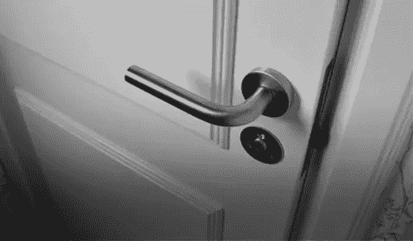

# Decorator 模式下开闭原则在打字稿中的应用

> 原文：<https://levelup.gitconnected.com/applying-open-closed-principle-with-decorator-pattern-in-typescript-79c71aa90494>

这是我第一次用英语写帖子，所以你给我的任何反馈都非常重要。我会很感激的。

# 前言

最近几天，我的一些研究重点是坚实的原则，干净的架构和一些相关的主题，如设计模式，我需要承认，自从大学以来，我一直在以错误的方式使用 OOP 技术，我意识到我所写的只是用类和方法分隔在不同文件中的过程代码，这样使用 OOP 没有任何好处，所以我决定改变。

# 设计原则

每种范式都有自己的原则，在 OOP 世界中，这些原则是坚实的(还有一些，但这些是最著名和最常用的)。那么这意味着什么，这些坚实的关键词？它们代表:

*   单一责任；
*   **O** 笔-关闭；
*   **L** 伊斯科夫换人；
*   **I** 界面偏析；
*   **D** 依赖倒置；

基本上，如果你遵循所有这些原则来构建你的应用程序，你的代码库将会更加灵活、抽象和可维护，软件的发展将会更少痛苦和昂贵，给你更多的时间去实现新事物。

# 开闭原理

开闭原则认为，我们的类必须对扩展开放，对变化封闭。基本上，我们必须能够在执行时改变实现行为，为了达到这一点，我们不需要改变类代码库，我们只需要组合的帮助。

有一个著名的口授说，我们需要优先于继承作文，这是非常重要的。当我们决定使用继承时，会有一些问题，首先是我们打破了封装的 OOP 基础，因为孩子知道关于父母的一切。第二个是静态继承，即使在执行时，我们也不能改变子进程的行为，我们需要改变代码库本身才能改变行为，打破了开闭原则。

当我们有了组合，我们不再有“是”关系(例如:SavingsAccount **是一个帐户**并且我们传递了“有”关系(例如:AuthorizationClient **有一个 HttpClient**),因此，按照这个例子，AuthorizationClient 的行为就像一个普通的 http client，但是他可以改变您的默认行为，例如添加一个 authorization 头。

# 例子

想象以下场景，假设我们有一个用 React 编写的前端客户端应用程序，我们正在使用一个 API，并且需要传递一个身份验证令牌(例如一个 jwt)。我们决定创建一个负责发送 HTTP 请求的接口，因此，在数据层我们创建了 HttpPostClient 协议(只有 post 请求，遵循接口分离原则，主题为另一个 POST)。

HttpPostClient 协议

之后，我们基于 axios 库为该协议创建了一个实现。

AxiosHttpClient 具体类

现在我们有了我们的协议(HttpPostClient)和我们的实现(AxiosHttpClient)，为什么不能只是在方法调用中正常传递授权头呢？我们需要考虑这个头需要在许多请求中传递，并且总是相同的:从 localStorage 或另一个服务中捕获令牌，并传递给执行请求的方法。如果我们只是复制和粘贴这个实现，我们将打破干燥(不要重复自己)的原则，所以我们需要想一个聪明的方法来做到这一点。这就是装饰模式的由来。

装饰模式基本上是一个对象的包装器。这个包装器必须具有相同类型的被包装对象，即实现相同的接口，因此，它们可以以客户端类不会注意到这种变化的方式进行交换(Liskov 替换)。

这个模式的目标是给装饰对象添加一个行为。

回到我们的例子，我们需要一个 Decorator 来实现 HttpPostClient 接口，并在不改变类实现的情况下向 AxiosHttpClient 添加所需的行为。

这个装饰类将被称为 AuthorizationHttpPostClientDecorator。

授权 HttpPostClientDecorator

一些需要注意的重要事项:

*   我们的 Decorator 类具有与被修饰对象相同的接口。
*   他在构造函数上接收被包装的对象(依赖倒置原则)
*   运行一些逻辑，然后从被修饰的对象调用方法

这是一个如何在不改变实现代码情况下向类添加行为的例子。

# 结论

每当我们选择一个新的编程范例时，我们都需要了解他的基础和原则，只有了解了这些知识，我们才能深刻理解如何正确地使用那个范例并充分利用它。

在这个例子中，我试图用一种简单的方式，用一个简单的例子来演示开闭原理，这样你就能意识到它的重要性。我选择 decorator 模式是因为你的开-闭应用是最常见的模式之一，但是我也可以实现 Proxy 模式，他也是一个结构化的模式，工作方式非常相似。