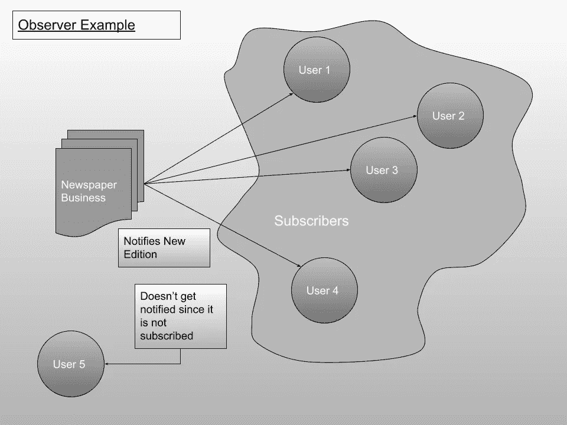
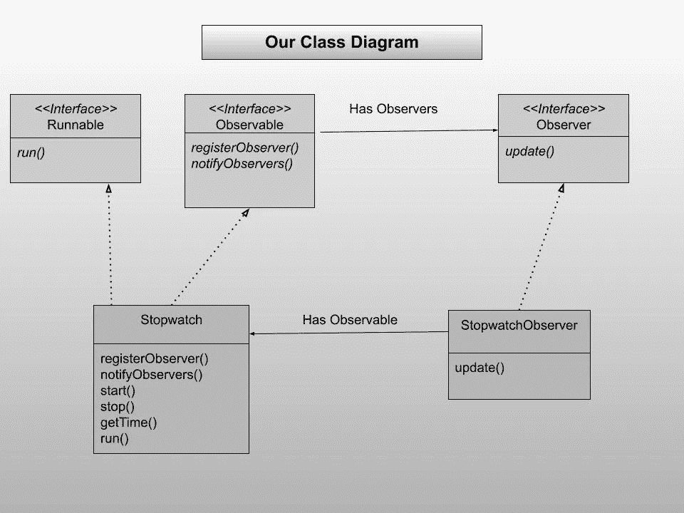
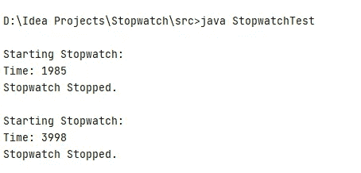

# 应用观察者模式(第 3 部分)

> 原文：<https://levelup.gitconnected.com/applying-the-observer-pattern-part-3-e46ce30c2d32>


礼貌:timeanddate.com

欢迎回到本系列的第三个教程。正如在前面的教程中所指出的，我们在秒表中有一个逻辑问题。为了查看秒表的时间，我们只是打印出时间，但在大多数应用程序中，我们不希望时间在控制台上打印出来，(事实上，现在没有应用程序有控制台)。我们希望秒表将时间异步返回给客户端，这样客户端就可以对时间做任何想做的事情。看起来是个不错的设计问题，对吧？

*观察者模式来营救*。

# 之前的教程

如果您是第一次阅读这一部分，那么您一定要看看本系列的第 2 部分。

*   [**代号**](https://github.com/rajtilakls2510/Stopwatch/tree/S2_Encapsulating_Thread_logic_in_stopwatch) 直到现在。
*   [第二部分](https://rajtilakls2510.medium.com/encapsulating-the-thread-logic-in-stopwatch-part-2-746d2e051abd)

我们去看看我们说的这个观察者模式是什么。

这里涉及到两个主要的身份:

*   可观察量
*   观察者

**可观察**是需要别人观察的人。当它的内部状态改变时，它应该通知所有正在观察这个家伙的**观察者**。我们举个例子把这个具体化。

我们都知道报纸订阅是如何运作的，对吗？(示例:头部优先设计模式)

*   报纸出版商开始经商，开始出版报纸。
*   你订阅了一个特定的出版商，每次有新的版本就会送到你手中。只要你还是订户，你就能得到新报纸。
*   当你不想要报纸时，你可以退订，这样报纸就不会被投递了。
*   当出版商仍在经营时，人们、酒店、航空公司和其他企业不断地订阅和取消订阅报纸出版物。

在本例中，报纸发行物是可观察的**，顾客是观察者**。****

********

****观察者模式的正式定义是:****

********观察者模式*** *定义了对象之间一对多的依赖关系，这样当一个对象改变状态时，它所有的依赖对象都会被自动通知和更新。******

*****如何用代码实现这一点？看一下一般的类图:*****

**********

*****主要有两个接口:**可观测者**和**观测者**。Observable 接口有三个方法:registerObserver()、removeObserver()和 notifyObservers()。*****

*   *****registerObserver()负责为这个可观察对象订阅一个观察器。*****
*   *****removeObserver()负责观察者的取消订阅。*****
*   *****notifyObservers()负责通过调用每个观察器的 update()方法来通知所有观察器状态的变化。*****

*****Observer 接口只有一个方法:update()。这个方法负责接收观察对象的更新状态，并对其进行处理。*****

*****与我们的示例相比，我们可以让我们的**秒表**类实现**观察器**，因为客户端想要观察秒表的时间，并且所有客户端都将实现**观察器**。我们的应用程序的类图将如下所示:*****

**********

*****注意，这里我们没有在 Observable 接口中实现 removeObserver()方法，因为这是一个非常简单的方法，您可以自己找出删除逻辑。*****

*****让我们从制作两个接口开始:*****

*****Observable.java*****

```
***public interface Observable {
    public void registerObserver(Observer o);
    public void notifyObservers();
}***
```

*****在 observable 的 registerObserver()方法中，一个 Observer 被传递给 Observable，当我们编写具体的类时，我们将使用 ArrayList 在内部存储它。*****

*****Observer.java*****

```
***public interface Observer {
    public void update(long time);
}***
```

*****在观察者的 update()方法中，更新的时间是从可观察对象传递过来的，然后观察者可以用它做任何事情。*****

*****接下来，我们从在秒表类中实现 Observable 接口及其方法开始。*****

```
***public class Stopwatch implements Runnable, Observable
{
    ... @Override
    public void registerObserver(Observer o) {

    }

    @Override
    public void notifyObservers() {

    }}***
```

*****让我们创建一个数组列表来存储我们的观察者，并在构造函数中初始化它(不要忘记导入它)。*****

```
***import java.util.*;
public class Stopwatch implements Runnable, Observable
{
    ...
    private ArrayList<Observer> observers; public Stopwatch()
    {
         ...
        observers = new ArrayList<>();
    }}***
```

*****当调用 registerObserver()时，我们希望将它添加到 ArrayList 中。*****

```
***@Override
public void registerObserver(Observer o) {
    observers.add(o);
}***
```

*****现在，我们编写 notifyObservers()方法。我们将遍历所有的观察器，并调用它们的 update()方法。但是我们将遵循另一个你会经常遇到的小设计模式:迭代器模式。使用迭代器的优势是巨大的，但是现在，要明白迭代器就像一个保存迭代状态的光标，有非常方便的方法:hasNext()和 Next()，它们隐藏了底层数据结构的内部实现，帮助我们遍历数据结构，甚至不用担心它是由什么组成的。不要忘乎所以，这很容易理解。只看代码。*****

```
***@Override
public void notifyObservers() {
    Iterator<Observer> iter = observers.iterator();
    while(iter.hasNext())
    {
        Observer o = iter.next();
        o.update(getTime());
    }
}***
```

*****这里，observers 数组列表有一个方法 iterator()，它返回迭代器对象。然后，我们可以只使用“iter”对象的 hasNext()和 Next()方法遍历观察者列表。如果有更多的观察者，hasNext()返回“the next()返回数组列表中的下一个观察者。然后我们调用每个观察者的 update()方法，并使用 getTime()方法来传递时间。*****

*****秒表类中剩下的最后一件事是更新 run()方法，该方法当前打印出时间，通知所有观察者。每隔 10 ms，线程应该通知所有的观察者。那是我们的目标，对吗？*****

```
***@Override
public void run() {
    while(!isStopped)
    {
        notifyObservers();
        try {
            Thread.*sleep*(10);
        } catch (InterruptedException e) {
            e.printStackTrace();
        }
    }
}***
```

*****对于可观察的部分，您可能会想:让 StopwatchTest 类实现可观察的。在某种程度上你是对的，但是由于静态 main()方法的存在，我们可能不得不绕道而行。只有当您自己实现它并得到一个编译时错误时，您才会理解为什么这是一个问题。*****

*****我们将为观察者创建一个单独的类，它只负责打印时间。我们又做了同样的印刷，但是，相信我，当我们加入 Swing 时，这种设计模式会给我们很大帮助。*****

*****我们创建了一个名为 StopwatchObserver.java 的新文件，它实现了观察者接口。*****

```
***public class StopwatchObserver implements Observer{

    @Override
    public void update(long time) {
        System.*out*.print("\rTime: "+time);
    }
}***
```

*****这是秒表观察器的完整代码。就是这样。*****

*****现在，我们修改我们的 StopwatchTest 类来测试这个新设计的秒表。我们只需要再添加两行:创建一个观察者并注册该观察者。所有的打印都将由观察者自己处理。*****

```
***public class StopwatchTest {
    public static void main(String[] args) {
        Stopwatch sw = new Stopwatch();
        StopwatchObserver ob = new StopwatchObserver();
        sw.registerObserver(ob);

        *// Rest of the start and stop methods remain same
    }
}****
```

*****就是这样。我们正努力履行我们的承诺，尽可能减少客户端代码。在这里，客户端只需要实现观察者接口，然后工作就完成了。现在，让我们来看看输出。*****

**********

*****输出保持不变，但是输出到屏幕上的方式每次都在变化。随着更强大的设计模式的使用，它变得越来越好。*****

*******太好了！现在我们的秒表类已经完全可以用于商业用途了。现在是构建使用这个秒表的应用程序的大好时机。从下一个教程开始，我们将从我们的 Swing 应用程序开始，制作一个合适的秒表应用程序。下一集见。*******

# *****下一个教程:*****

*****[从 Swing App 开始](https://rajtilakls2510.medium.com/starting-with-the-swing-app-part-4-7b9395a5960c)*****

# *******全码*******

*****完整的代码在这里。*****

*****Observable.java*****

```
***public interface Observable {
    public void registerObserver(Observer o);
    public void notifyObservers();
}*** 
```

*****Observer.java*****

```
***public interface Observer {

    public void update(long time);
}***
```

*****Stopwatch.java*****

```
***import java.util.ArrayList;
import java.util.Iterator;

public class Stopwatch implements Runnable, Observable
{
    private long offset, currentStart;
    private boolean isStopped;
    private Thread th;
    private ArrayList<Observer> observers;

    public Stopwatch()
    {
        offset = 0L;
        currentStart = System.*currentTimeMillis*();
        isStopped = true;
        observers = new ArrayList<>();
    }

    public void start()
    {
        if(isStopped)
        {
            th = new Thread(this);
            th.start();
            currentStart = System.*currentTimeMillis*() - offset;
        }

        isStopped = false;
    }

    public void stop()
    {
        if(!isStopped)
        {
            th = null;
            offset = System.*currentTimeMillis*() - currentStart;
        }
        isStopped = true;
    }

    public long getTime()
    {
        if(!isStopped)
            return System.*currentTimeMillis*() - currentStart;
        else
            return offset;
    }

    @Override
    public void run() {
        while(!isStopped)
        {
            notifyObservers();
            try {
                Thread.*sleep*(10);
            } catch (InterruptedException e) {
                e.printStackTrace();
            }
        }
    }

    @Override
    public void registerObserver(Observer o) {
        observers.add(o);
    }

    @Override
    public void notifyObservers() {
        Iterator<Observer> iter = observers.iterator();
        while(iter.hasNext())
        {
            Observer o = iter.next();
            o.update(getTime());
        }
    }
}***
```

*****StopwatchObserver.java*****

```
***public class StopwatchObserver implements Observer{

    @Override
    public void update(long time) {
        System.*out*.print("\rTime: "+time);
    }
}***
```

*****StopwatchTest.java*****

```
***public class StopwatchTest {
    public static void main(String[] args) {
        Stopwatch sw = new Stopwatch();
        StopwatchObserver ob = new StopwatchObserver();
        sw.registerObserver(ob);

        System.*out*.println("\nStarting Stopwatch: ");
        sw.start();
        *sleep*(2000);
        sw.stop();
        System.*out*.println("\nStopwatch Stopped. ");

        *sleep*(2000);

        System.*out*.println("\nStarting Stopwatch: ");
        sw.start();
        *sleep*(2000);
        sw.stop();
        System.*out*.println("\nStopwatch Stopped. ");

    }

    public static void sleep(int time)
    {
        try {
            Thread.*sleep*(time);
        } catch (InterruptedException e) {
            e.printStackTrace();
        }
    }

}***
```

# *****参考资料:*****

*   *****书: [Head First 设计模式](https://www.oreilly.com/library/view/head-first-design/0596007124/)，作者埃里克·弗里曼、伊丽莎白·罗布森、伯特·贝茨、凯西·塞拉。*****