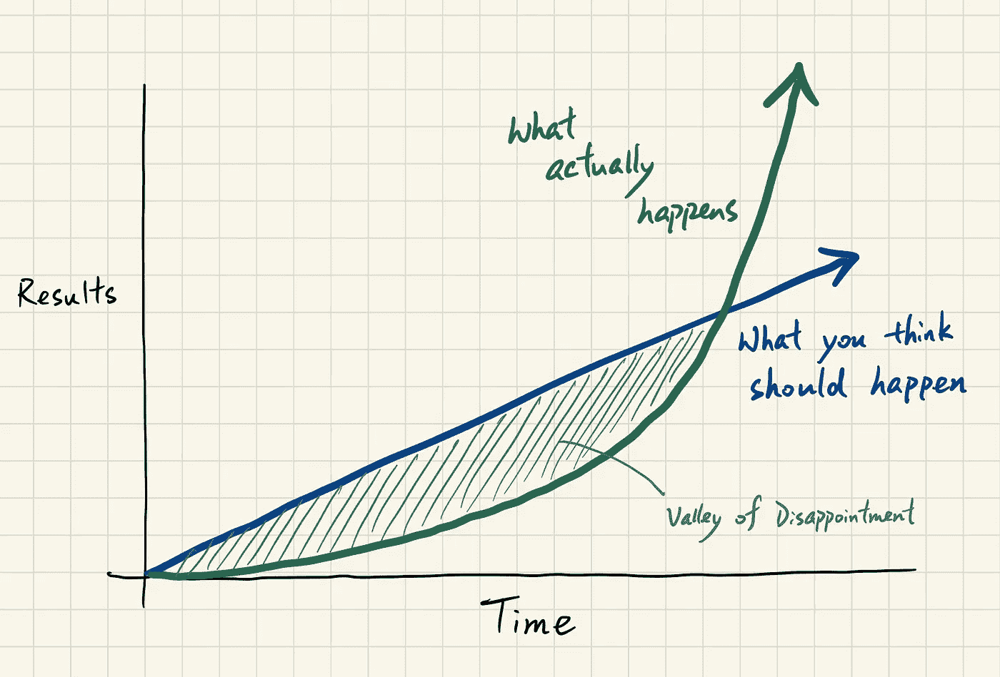
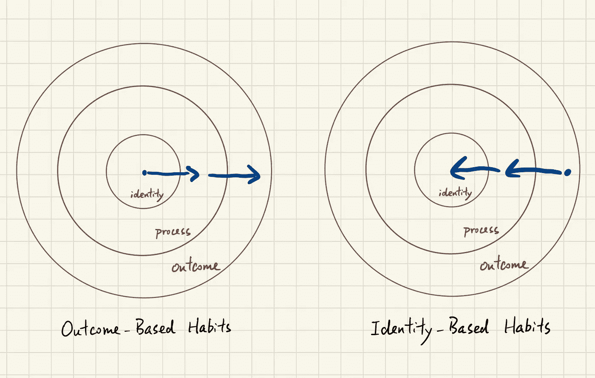
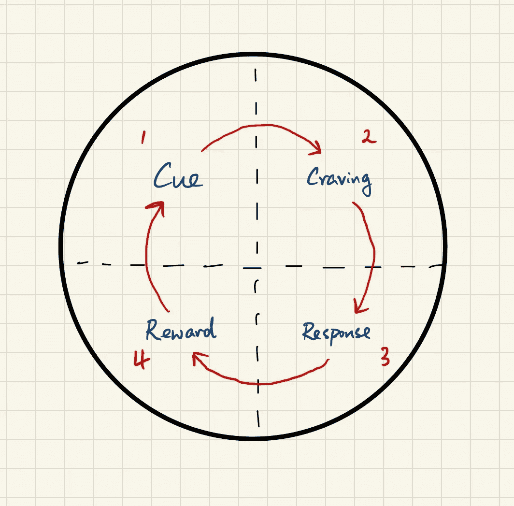
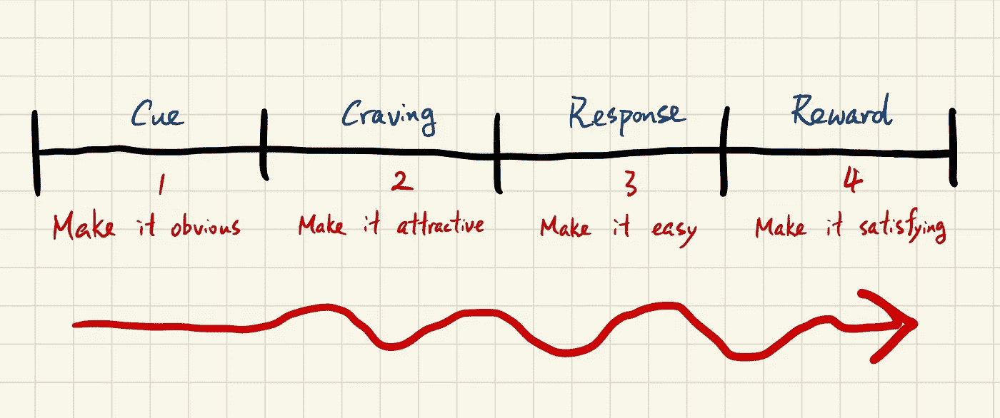

# 将我在原子习惯中学到的东西应用到编码中

> 原文：<https://levelup.gitconnected.com/applying-what-ive-learnt-in-atomic-habits-into-coding-cb268137ea35>

## 培养持久的习惯，成为更好的程序员

何塞·米兹拉希在 [Unsplash](https://unsplash.com?utm_source=medium&utm_medium=referral) 上的照片

***原子习惯*** 作者 James Clear 一直是高成就者的必读书籍之一。今天，我已经完成了这本书，并提出了最鼓舞人心的亮点和要点。作为一名软件工程师，我认为我在这本书中学到的东西可以激励我建立长期的习惯，成为一名更好的程序员。

# 我学到了什么

## 基本原则

原子习惯的力量会让每个人感到惊讶，因为微小的变化会带来很大的不同。

为了建立良好的习惯，我们必须改变我们的心态，并注意四点。他们每天都有 **1%的进步**，**潜在潜力的高原**，**关注系统而不是目标**和**建立基于身份的习惯**。

**每天提高 1%**

这大概是本书的关键亮点:

> 0.99³⁶⁵ = 0.03
> 
> 1.01³⁶⁵ = 37.78

所以每天做得好 1%可以在一年后带来显著的变化。

**潜在的高原**

你认为应该发生的和实际发生的

**关注系统而不是目标**

目标:你想要达到的结果

系统:引导你走向结果的过程/步骤

大多数人只关注目标而忽略了系统。但实际上，**目标**只适用于设定方向。**系统**最有利于进步。

**建立基于身份的习惯**

基于结果的习惯与基于身份的习惯

内在动力的最终形式是当一个习惯成为你身份的一部分。如果你想建立阅读习惯，你的目标不是读书，而是成为一个读者。如果你想养成跑步习惯，你的目标不是跑马拉松，而是成为跑者。

## 关于习惯如何起作用的科学

**习惯循环**

1.  提示
2.  渴望
3.  反应
4.  报酬

暗示->渴望->反应->奖励

**提示**触发**渴求**。然后它激发了一个**反应**。并且它提供了一个**奖励**，满足了渴求，最终与线索产生关联。

## 如何培养良好习惯的总结

提示:让它显而易见；渴望:让它有吸引力；应对:化繁为简；奖励:让它令人满意

**第一定律:显而易见**

*   **填写习惯记分卡**

把你的日常习惯列成一个清单，让自己更加注意自己的行为。旁边写“+”表示好习惯。如果这是一个坏习惯，写下“—”。如果是中性习惯，写“=”。

 [## 习惯记分卡:用这个简单的练习来发现你应该改变哪些习惯

### 这篇文章摘自我的《纽约时报》畅销书《原子习惯》。日本的铁路系统是…

jamesclear.com](https://jamesclear.com/habits-scorecard) 

*   **使用实施意向**

> 我将在[时间][地点]进行[行为]。

*   **使用习惯堆积**

> 在我[现有习惯]之后，我会[新习惯]。

**第二定律:让自己更有吸引力**

*   **使用诱惑捆绑**

将你想做的动作和你需要做的动作联系起来。

 [## 如何通过使用“诱惑捆绑”来停止拖延和增强你的意志力

### 罗南·伯恩是爱尔兰都柏林的一名电气工程学生，他喜欢看网飞，但他也知道自己…

jamesclear.com](https://jamesclear.com/temptation-bundling) 

*   **加入一种文化**

我们倾向于模仿三种社会群体的习惯:*亲近的*(家人和朋友)*男人* y(部落)*有权有势的*(有地位和威望的人)

**第三定律:让事情变得简单**

*   **减少摩擦**

减少你和好习惯之间的步数。

*   **灌注环境**

准备环境，使未来的行动更容易。

*   使用两分钟规则

> 当你开始一个新习惯的时候，应该不到两分钟。

缩小行动的规模，这样你就可以在 2 分钟或更短的时间内开始和完成。然后，可以考虑逐步升级动作。

 [## 如何利用“两分钟规则”停止拖延

### 最近，我一直在遵循一个简单的规则，帮助我停止拖延，让我更容易…

jamesclear.com](https://jamesclear.com/how-to-stop-procrastinating) 

*   让你的习惯自动化

投资于技术和锁定未来行为的一次性购买。

**第四定律:让自己满意**

*   **使用钢筋**

当你完成你的习惯时，立即给自己一个奖励。

*   **使用习惯跟踪器**

记录你的习惯。

*   **绝不失手两次**

当你忘记做一个习惯时，确保你立即回到正轨。

# 如何将其应用到编码中

作为一名软件工程师，我真的想把我在这本书中学到的东西应用到培养良好的习惯上，帮助我马上写出更好的代码。我想养成两个习惯，并真心希望它们能持续下去，从而提高我解决问题的技能，更好地编码。

## 想要的习惯 1:看书

一本好书总会让你对某个领域有所洞察。这无疑有助于我在编码时发展思维。比如*清洁代码*、*清洁架构*、*设计模式*等。

照片由 [Unsplash](https://unsplash.com?utm_source=medium&utm_medium=referral) 上的 [AltumCode](https://unsplash.com/@altumcode?utm_source=medium&utm_medium=referral) 拍摄

**让它显而易见**

*   实施意图

> 我每天早上 8 点会在我的客厅里读 10 页

*   习惯堆积

> 上了火车后，我戴上耳机开始阅读

*   设计我的环境

我会在前一天晚上把我的 iPad 放在客厅，这样我就可以开始阅读了。

**让它更有吸引力**

*   诱惑捆绑

一边看书一边听我最喜欢的音乐。我会选择器乐版本，因为它有助于我集中注意力，而不仅仅是听音乐。

**让事情变得简单**

*   两分钟规则

先从阅读 2 页开始，这样容易上手。

*   减少摩擦

在我读完之前，把我的手机放在抽屉里。

**让它令人满意**

*   加强

吃我最喜欢的小吃。当然，不要吃太多。

*   习惯跟踪器

我可以在“书籍”或“Kindle”应用程序上跟踪阅读电子书的进度。此外，我可以在阅读完每一章后用概念来写章节摘要。

## 期望的习惯 2:练习 Leetcode

Leetcode 是一个很好的工具，可以提高我解决问题的能力，为技术面试做准备。

路易斯·康的照片[恩古吉](https://unsplash.com/@ngeshlew?utm_source=medium&utm_medium=referral)在 [Unsplash](https://unsplash.com?utm_source=medium&utm_medium=referral)

**让它显而易见**

*   实施意图

> 我将在晚上 9 点在我的办公桌上解决一个中等 Leetcode 问题

*   习惯堆积

> 在办公室吃完午饭后，我回到座位，花 20 分钟解决一个 Leetcode 问题

**让它变得有吸引力**

*   加入一种文化

我们倾向于采纳被我们的文化称赞和认可的习惯，因为我们有强烈的愿望去融入和属于这个部落。我可以加入 discord 社区，或者与同事一起组建一个编码挑战社区。

*   重构思维模式

> 👎我必须练习电码
> 
> 👍我提高了解决问题的能力，在编码方面表现得更好

**让事情变得简单**

*   两分钟规则

花 5 分钟阅读一个 Leetcode 问题，让它容易上手。

使它令人满意

*   加强

解决一个问题后，看网飞 30 分钟。

*   习惯跟踪器

跟踪 Leetcode 上解决的问题数量。

> 没有任何变化。成效显著。

在读完《原子习惯》之后，我确实把我学到的东西应用到了每天养成我想要的习惯上。每天做一点工作可能不会立即显示出显著的变化。但我相信一年后会有明显的改善。如果你也在努力提高你的编程技能，让我们试试方法，从今天开始改变。

# 分级编码

感谢您成为我们社区的一员！更多内容请参见[升级编码出版物](https://levelup.gitconnected.com/)。
跟随: [Twitter](https://twitter.com/gitconnected) ， [LinkedIn](https://www.linkedin.com/company/gitconnected) ，[迅](https://newsletter.levelup.dev/)
**升一级正在改造理工大招聘➡️** [**加入我们的人才集体**](https://jobs.levelup.dev/talent/welcome?referral=true)