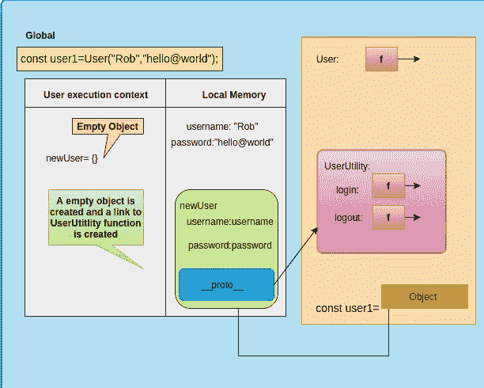

# 欣赏 Javascript 中的“新”关键字

> 原文：<https://levelup.gitconnected.com/appreciating-new-keyword-in-javascript-63d517459e9c>

我回到了我的第二个博客😃在这一篇中，我将尝试解释我们如何利用“新”来编写更高效的代码。因为清晰度问题，这次我不会用手绘的图表，但是我会用很多图表😝

我们中许多熟悉编写静态类型语言的人，如 **C++/JAVA** ，对构成内存分配的**‘new’**关键字有着完全不同的理解。让我们快速修改一下 C++中“new”关键字的概念，这样我们就可以完全理解两种语言中**“new”**关键字用法的不同。

*   **new'** 从空闲存储器中为一个对象分配内存，并返回一个适当类型的非零指针指向该对象。
*   在我们的示例中，堆中的新内存地址( **0x556e76d5fe7** 0)被分配给一个“指针”，用于存储值“ **13”。**
*   如果不成功或无法分配内存，则 **new** 返回零或抛出异常。

既然我们已经理解了在 C++中' **new'** '是如何工作的。“博客结束”。回家吧，伙计们！😛开个玩笑！！

好了，现在让我们暂时把“新”这个关键词放在一边。到那时，我们可以建立一些基础并分析一些场景，这样我们不仅可以理解它，还可以理解它为什么在函数式编程中有用。让我们举一个例子:

*   假设我们已经创建了一个**工厂**，用于为特定的应用程序或网站创建新用户。
*   我们的代码将数据和功能(用户名、密码和登录功能)捆绑在一起，就像用 C++/Java 编写面向对象的代码一样
*   一切看起来都很完美，除了这样一个事实:每一个新创建的用户都会有一个 ***【登录】*** *函数的副本，这并不好，因为它每次都会使用额外的内存来存储这个函数😟*

现在，我们将尝试使用一些有趣的方法来重构上面的代码，然后我们将使用 JavaScript 的一些特性来实现同样的目的。

*   让我们浏览一下代码😃

*   内存是在全局空间中为用户和用户工具分配的
*   调用功能用户并创建新的**‘执行上下文’**。
*   Object.create()用于创建一个空对象' **newUser'** 。将' UserUtility '作为 Object.create 中的一个参数传递，在 **'newUser'** (隐藏属性 **'__proto__'** ) 和 UserUtility 函数之间创建了一个隐藏链接。
*   返回新对象' **newUser'** 。

*就是这样。我们已经实现了我们所期待的。* ***干净世故！***

现在，当我们创建不同的用户时，我们不会为' **login'** 函数分配新的内存空间。每次我们创建一个新用户并尝试调用' **login '，**它将首先查看登录功能是否可用。如果没有，则检查' **__proto__'** 属性，该属性将链接到包含' **login'** 函数的 **'UserUtility'** 对象。

# 这种方法非常好，但是我们可以进一步改进

众所周知，Javascript 中的函数是**对象**。Javascript 中的每个函数都有一个名为“ **prototype** ”的属性。原型是 JavaScript 中的对象相互继承特性的一种方式。让我们利用这个'**原型**和**'新'**来自动化上面代码中的一些步骤。

*   我们将属性**‘登录’**附加到**‘用户’**原型。

*   一旦**‘执行线程’**在函数调用前遇到‘new’关键字，就会自动创建一个全新的空对象，并将其分配给 **this。**
*   属性被分配给这个空对象。(用户名和密码)
*   创建了一个从这个新对象的 **'__proto__'** 属性到 User.prototype 的隐藏链接。
*   最后，这个新创建的对象被自动返回。

就这样了，伙计们。这就是' **new'** 关键字为我们做的一切。因此，我们通过利用 javascript 的一些特性，使我们的代码可读性更强，更容易理解。

# **今天就到这里😃**

我将继续撰写与 JS 相关的其他重要概念。也可以在评论里提建议。感谢反馈。

这里有一个我之前博客的链接，如果你还没有读过的话 JavaScript 中的[闭包](/what-exactly-is-a-closure-in-javascript-1dc6b5e6e375?source=---------2------------------)

你也可以和我联系，[奥姆卡·纳特·曼德尔](https://www.linkedin.com/in/omkar-nath-mandal/):)