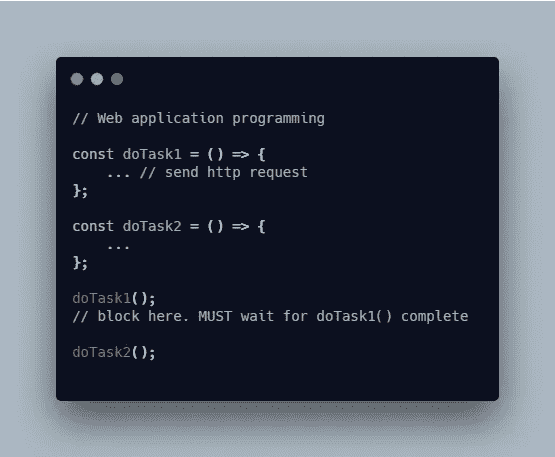
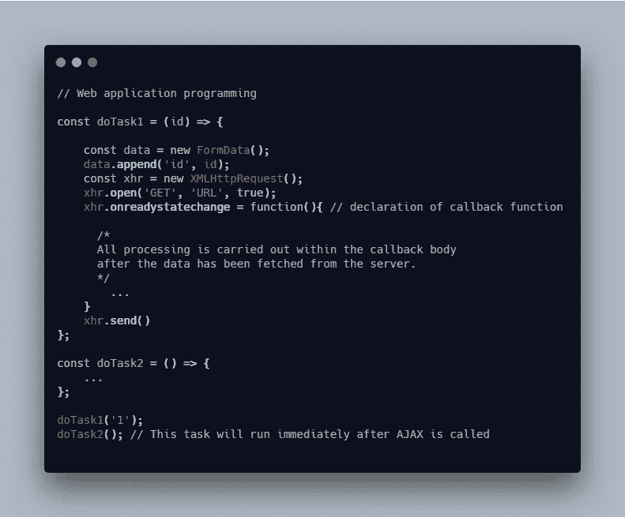
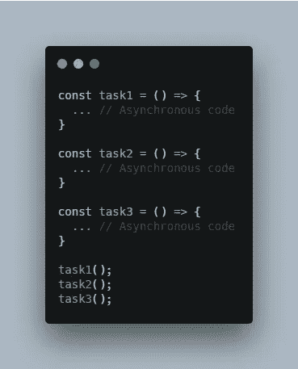
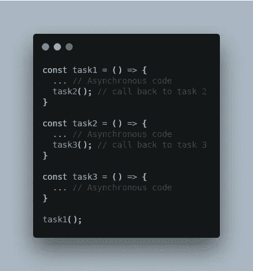
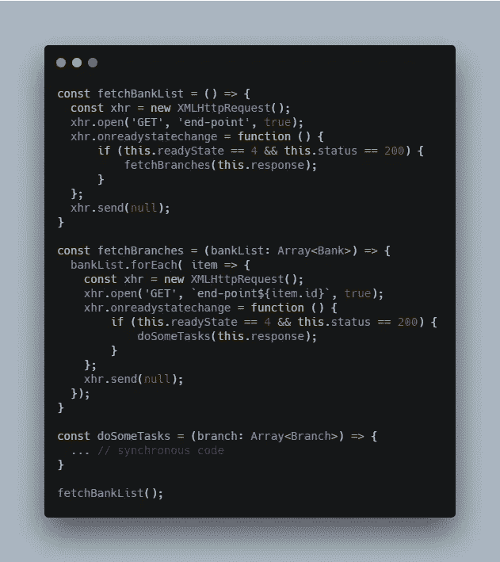
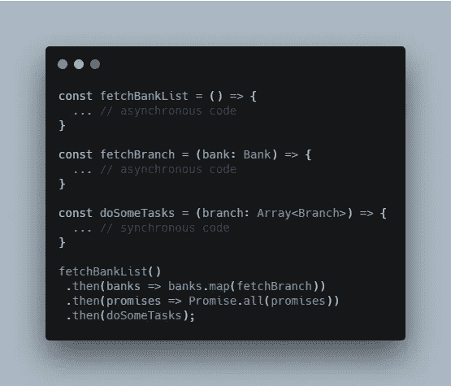

# 现代 Web 应用程序中的反应式编程

> 原文：<https://levelup.gitconnected.com/approach-reactive-programming-in-modern-web-application-b20f59b7699d>

## Rxjs

## 了解如何在现代 web 应用中处理异步代码，以及用于管理它的不同理念——从回调和承诺到 RxJS

杰森·贝茨在 [Unsplash](https://unsplash.com/s/photos/coffee?utm_source=unsplash&utm_medium=referral&utm_content=creditCopyText) 上的照片

在本文中，我们将讨论反应式编程的 3 个方面:

1.  同步和异步问题
2.  承诺
3.  反应式编程

【https://betterfullstack.com 查看 [*更多类似内容*](https://betterfullstack.com)

# 同步和异步问题

本节将涵盖 3 个要点:

*   解释同步与异步
*   同步发行
*   回调和异步问题

## 解释同步和异步代码

当讨论现代应用程序时，同步和异步是经常使用的两个词。这些概念对于理解是必不可少的，但对于初学者来说可能是一个挑战。

那么，怎样才能快速理解呢？我在**stackoverflow.com**上找到了一个关于它的最有趣的答案:

**“同步**就像你晚餐想吃披萨，而你又没有冷冻的那种。所以你必须停止玩 PUBG，这会让你的朋友不开心。你去厨房，做面团，涂上酱汁，加入奶酪，然后裹上你最喜欢的培根。你刚刚花了 20 分钟做披萨，又花了 10 分钟在烤箱里。计时器发出哔哔声，你把热馅饼拿出来。你可以坐下来，吃披萨，继续玩。

**异步**就像你一边玩 PUBG 一边想晚餐吃披萨。你打开一个浏览器窗口。你打开披萨网站，点了一份额外的奶酪培根披萨，外加培根油大蒜酱。你继续玩，20 分钟后门铃响了。你去拿披萨。你坐下来，吃披萨，享受夜晚。

**在同步解释中，你必须停下手头的工作，自己动手做披萨，按顺序完成所有步骤。在异步解释中，你继续玩游戏，而披萨是并行制作的。当你在等待和做其他事情的时候，披萨已经完成并送到了，当它准备好了，你就可以享受最终产品了。**

**所以，简单来说，这里的主要区别是*等待时间*。**

**同步代码一步一步地处理任务，并防止在完成当前操作之前进入下一个操作。**

> **“这样做；那就这么做。那就这么做。那就这么办吧……”**

**在异步代码中，我们有自己不能处理的操作。例如，当我们发出一个 API 请求时，在得到响应之前需要等待一段时间。当我们等待 API 返回时，我们能够执行其他代码。一旦 API 调用完成，我们就可以处理响应。**

> **“这样做；(等待时间)做其他任务；然后在第一个完成时处理响应。**

## **同步发行**

****同步**当每个代码块必须等待前一个代码块完成后才能继续执行时，就会发生同步执行。**

**JavaScript 是单线程的。任何长时间运行的任务，比如等待 HTTP 请求响应，都不应该同步完成，因为响应时间是未知的。如果我们停止程序等待，对缓慢的请求可能会有 3-5 秒的无响应时间。**

**这将阻止下一个代码运行，因为整个应用程序都处于空闲状态，等待当前任务完成。等待这个过程完成会给用户带来可怕的体验。**

****

**同步调用两个进程的程序**

**在上面的例子中，`doTask1()`在等待 API 响应的过程中运行并阻止下一个代码运行。**

**更好的方法是在等待响应时调用 HTTP 调用并执行其他操作。**

**因此，JavaScript 提供了回调函数来处理这个问题。当请求完成时，我们可以提供一个函数在请求完成后执行。**

**这通过将我们的代码转换成异步的来解决最初的问题(我们在响应准备好的时候处理它)。几年前 JavaScript 就是这样处理异步的。然而，回调也有自己的问题。**

## **回调和异步问题**

**JavaScript 中有很多东西是由回调函数处理的，比如鼠标事件、文件 I/O 和 HTTP 请求。**

****

**JavaScript 中的回调函数**

**对异步(AJAX)请求使用回调会创建一个**控制反转**，允许您的应用程序继续执行下一行代码。**

****控制反转**在这个意义上，指的是代码的某些部分从运行时系统接收控制流的方式。**

****异步**代码允许应用程序保持响应，但它有一个缺点，即当代码解析时，很难预测应用程序的未来状态。**

**通常，**应用程序状态**只是存储在变量中的所有信息在任一时间点的快照。因为同步代码是一个接一个执行的，所以当我们编写更多代码并进行调试时，预测应用程序的状态将会更加容易。但是，异步代码是不可预测的，因为应用程序会在响应的**等待时间**内继续运行。**

****

**异步代码示例**

**上面的示例代码在这些方法相互独立的情况下没有问题。**

**但是如果他们是依赖的，会发生什么呢？这些任务共享全局状态。他们需要依次跑`task1`到`task2`到`task3`。我一直把这些 ***副作用叫做*** 。有副作用的函数不可靠。**

*****等待时间*** 也是另一个问题。为了确保这些函数按顺序执行，你必须通过使用回调将这些函数组合在一起，即`task1`的输出将成为`task2`的输入，而`task2`的输出将成为`task3`的输入。**

****

**按顺序处理异步代码**

**这段代码将更难阅读和调试，有时我们会陷入一种被称为“回调地狱”的状态。**

# **承诺**

**JavaScript ES6 承诺表示异步操作的最终完成(或失败)及其结果值。**

**您可以使用未来值将一组承诺行为链接在一起，形成一个延续。**

**让我们来看一个现实世界的问题:我们需要获取一个银行列表，对于每一条银行信息，我们需要获取它们所有的分支机构。一旦我们有了这些数据，我们就需要根据这些信息执行一些额外的任务。**

> **注意:本节中的所有代码都是我在 [carbon](https://carbon.now.sh) 上写的草稿代码，只是作为一个教育示例。**

****

**用回拨处理问题**

**上面这段代码很难读懂。下面我们将应用承诺链:**

****

**答应处理这个问题**

**使用`then`显式地指导代码处理任务的顺序。在失败的情况下，我们可以使用`catch`来处理错误。**

**使用承诺的缺点是:**

*   **无法处理生成多个值的数据源**
*   **缺乏从失败中重试的能力**
*   **承诺是不可改变，不能取消的**

## **承诺和回访的区别**

*   **我们将使用一个**回调**来告诉函数的执行在异步任务完成时做什么。**
*   **执行函数将返回一个**承诺**对象，我们将告诉承诺当异步任务完成时做什么。**

## **承诺和事件发射器之间不同**

*   **承诺是针对像 HTTP 请求这样的单值返回的**
*   **事件发射器用于多值返回，就像鼠标点击处理程序一样**

# **反应式编程**

**[RxJS](https://rxjs-dev.firebaseapp.com/) 是一个通过使用可观察序列来组成异步和基于事件的程序的库。**

> ***把 RxJS 想象成事件的 Lodash。***

**它将[观察者模式](https://en.wikipedia.org/wiki/Observer_pattern)与[迭代器模式](https://en.wikipedia.org/wiki/Iterator_pattern)和[函数式编程与集合](http://martinfowler.com/articles/collection-pipeline/#NestedOperatorExpressions)相结合，以满足管理事件序列的理想方式的需求。**

**RxJS 是回调或基于承诺的库的完美替代，它使用单一的编程模型来处理任何无处不在的事件源，如读取文件、发出 HTTP 调用、单击按钮、移动鼠标或共享应用程序状态。**

**与承诺相比，反应式编程有一些优势:**

*   **容易取消**
*   **失败时易于重试**
*   **能够处理具有多个值的数据源**

**您可以从我的文章中阅读使用 RxJS 的示例:**

*   **[Angular 和 RxJS 模式——使用反应式编程在 Angular 应用程序中编写和管理数据](/angular-and-rxjs-patterns-use-reactive-programming-to-compose-and-manage-data-in-angular-apps-2e0c4ce7a39c?source=friends_link&sk=be4b4ec70b1564b9802d1e5afac805a8)**
*   **[使用 mergeMap 和 forkJoin 处理 Angular 中的多个 API 请求，以避免嵌套订阅](/handle-multiple-api-requests-in-angular-using-mergemap-and-forkjoin-to-avoid-nested-subscriptions-a20fb5040d0c?source=friends_link&sk=f7105b524d60af631c8c5ec19d59d4f7)**
*   **[使用 RxJS 在角度组件之间进行通信](/communicate-between-angular-components-using-rxjs-7221e0468b2?source=friends_link&sk=925501345e5562179adaff0700216fba)**

**RxJS 有助于解决这些问题:**

*   **控制事件如何流经你的观察对象。**
*   **使用纯函数产生值的能力。这意味着你的代码不容易出错。**
*   **转换通过你的观察值传递的值。**
*   **错误处理策略变得很容易。我们可以很容易地实现出错时重试的逻辑。**
*   **非常简单地抑制用户与任何 UI 组件的交互。**
*   **通过`unsubscribe()`处理取消。**
*   **避免回调地狱。**

# **摘要**

**这篇文章提供了为什么我们从回调和承诺转向现代 web 应用程序的反应式编程的基础知识。**

**RxJS 的强大之处在于建立在函数式和反应式编程之上，以及一些众所周知的设计模式，如 observer 和 iterator。**

**我希望这篇文章对你有用！你可以在[媒体](https://medium.com/@transonhoang?source=post_page---------------------------)上关注我。我也在[推特](https://twitter.com/transonhoang)上。欢迎在下面的评论中留下任何问题。我很乐意帮忙！**

** [## 故事-更好的全栈

### 关于 JavaScript、Python 和 Wordpress 的有用文章，有助于开发人员减少开发时间并提高…

betterfullstack.com](https://betterfullstack.com/stories/)**