# 近似互换试验

> 原文：<https://levelup.gitconnected.com/approximate-swap-test-108c8febd756>

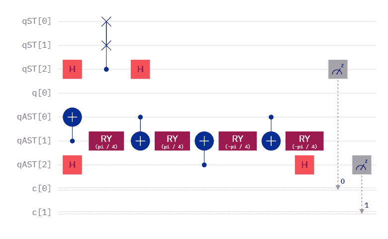

规范互换测试(上图)与近似互换测试(下图)

# 生命的意义，显然是 44。

我的灵感来自于[内藤宗顺如何创造了最浅的 C14X 门](https://youtu.be/nILB4d7ONtk?t=2317)，一个有 14 个控制量子位和 1 个目标量子位的门，赢得了最近的[编码竞赛](https://www.classiq.io/competition)的 [MCX 挑战赛](https://www.classiq.io/insights/competition-results-mcx)。因为四项挑战中的许多顶级竞争者使用了[相对相位 Toffoli 门](/classiqs-toffoli-problem-54b7e5084833)，所以我尝试使用 [RCCX 门](/new-gates-on-the-block-9cad1bc583fd)来构建我所谓的[相对相位交换测试](/relative-phase-swap-test-f4a718f4f4b5)。结果是，在特定情况下，门可能比 [Hadamard 测试](https://bsiegelwax.medium.com/the-simplest-way-to-compare-single-qubit-quantum-states-8ddbefa5a93e)更有用，但远不如[规范交换测试](/comparing-quantum-states-c6445e1e46fd)通用。

不过，Soshun 通过使用近似的 Toffoli 门赢了。那么，如果我用一个近似的托夫里门代替交换测试的托夫里门，会发生什么呢？对于那些不知道的人来说，规范互换测试的弗雷德金门可以分解为两个 CX 门和一个托夫里门。最终的 CX 甚至可以移除，测量结果将保持不变。但是，不管怎样，弗雷德金门是建在托夫里顶上的。

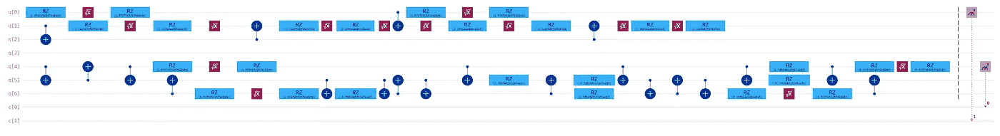

transpiled 近似交换测试(上)与 transpiled 规范交换测试(下)

## 蒸腾作用

需要注意的是，transpiler 将近似交换测试(之前显示在电路底部)映射到前三个量子位(在电路顶部)，将规范交换测试(之前显示在电路顶部)映射到底部三个量子位(在电路底部)。讽刺的是，运输者调换了它们。但是，如果你一直向右看测量，你会看到底部实际上测量到第 0 个经典位，顶部测量到第 1 个经典位。回头看看这篇文章的顶部，第 0 个经典位是规范交换测试，第 1 个经典位是近似交换测试。

对于那些倾向于计数的人来说，规范交换测试显示了 17 个 CX 门和 26 个电路深度。同样，拖尾 CX 门可以被移除而不影响测量结果，但是电路深度将保持为 26。相比之下，即使电路深度仅下降到 20，近似交换测试仅使用 4 个 CX 门。两个量子位的 CX 门比单个量子位的操作更容易出错，所以标准交换测试应该比近似交换测试噪音大得多。

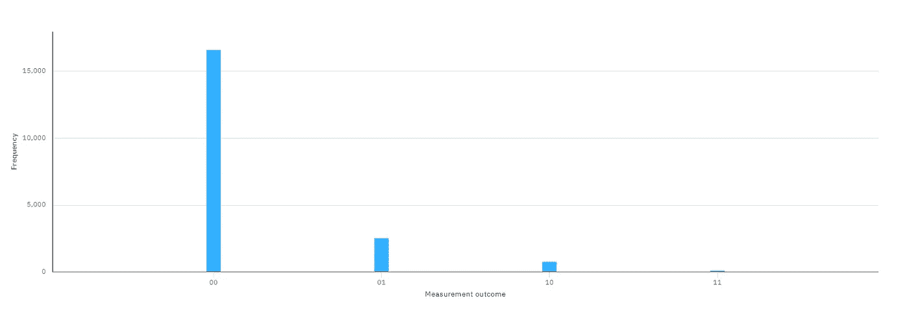

典型交换检验与近似交换检验

## 嘘…

不过，这两者并没有根本的不同。此电路将|0 >与|0 >进行了比较，因此结果应该是 0，概率为 100%。因为错误，事实并非如此。但是，近似交换测试的错误更少，因此它比规范交换测试更经常测量 0。

## 规范互换测试

规范交换测试，又名“内积”，又名“距离度量”，又名“核方法”，比较两个量子态。它们可以是单量子位或多量子位量子态。如果这些量子态是相同的，那么它们以 100%的概率测量为 0。如果它们最大程度地相反，那么它们以 50%的概率测量为 0。但是，结果不限于这两种结果。通过重复测量，距离较近的量子态将测量到更接近 100%的 0，距离较远的量子态将测量到更接近 50%的 0。因此，您可以确定相似程度，而不仅仅是两个状态是否相同。

比较|0 >和|0 >

## 近似互换试验

处于|0 >状态的两个量子位是相同的，因此它们测量到 0 的概率应该是 100%。我们有了一个好的开始。

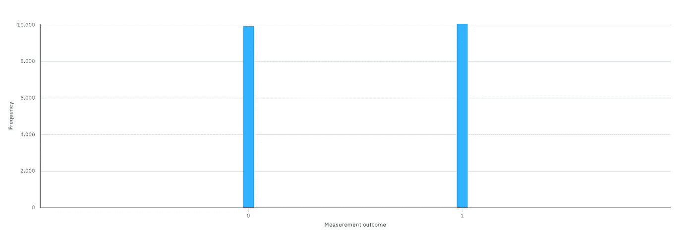

比较|0 >和|1 >

|0 >和|1 >的量子位最大程度上是相反的，因此它们应该有 50%的时间精确地测量 0。到目前为止，一切顺利。

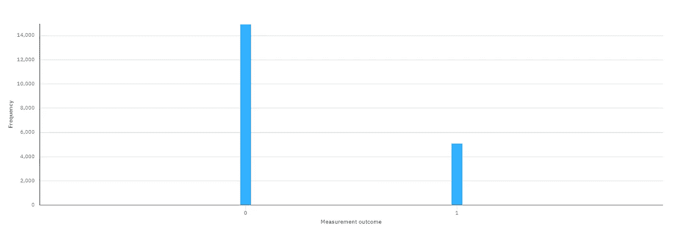

比较|0 >和|+>

|0 >和|+>的量子位在中间。他们既不是完全相同的，也不是截然相反的。因此，他们应该以 75%的概率测量 0。我们正式开始了！现在什么都不会出错了！

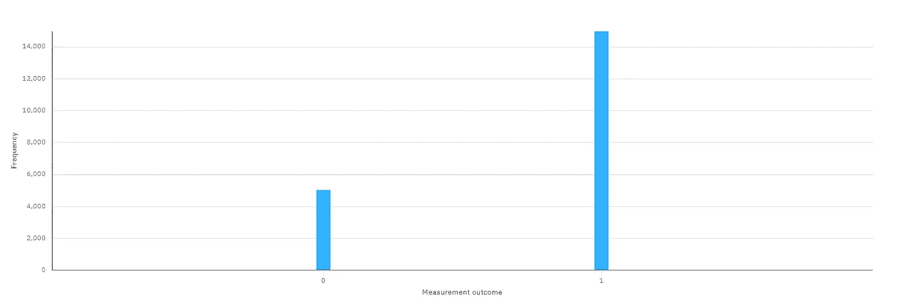

比较|+>和|->

## 我打字太快了。

这不应该发生的。在规范互换测试中，0 的概率永远不会低于 50%。但是，这里我们看到 0 的概率只有 25%，而 1 的概率是 75%。好的，这将需要比我最初计划的更多的测试。

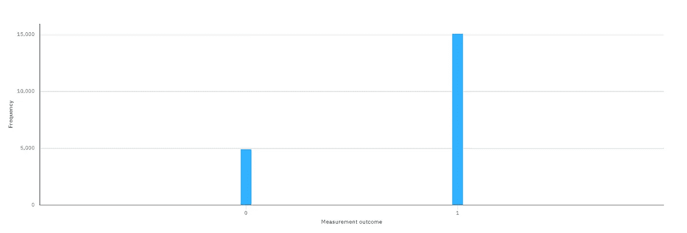

比较|i >和|-i >

又来了。像|+>和|-->，|i >和|-i >是极性相反的。他们应该以 50%的概率测量 0，但他们却以只有 25%的概率测量 0。

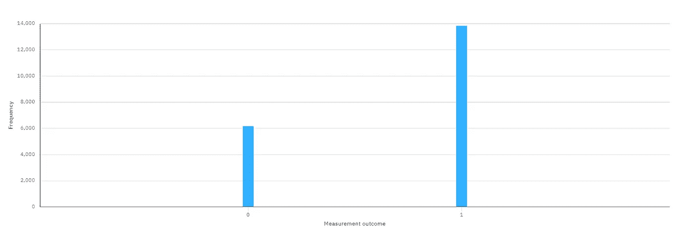

比较 u(pi3，0，0)和 u(2/3*pi，pi，0)

暂时关掉轴，让我们试着比较一下大致在布洛赫球相对两侧的量子态。正常情况下，我会期望以接近 50%的概率测量 0。相反，就像用|+>和|-->然后用|i >和|-i >一样，我们以接近 25%的概率测量 0。

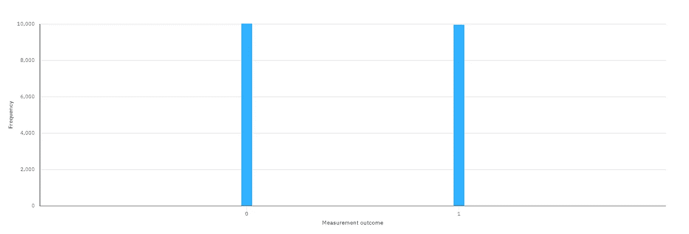

比较 u(pi/4，pi/4，0)和 u(3/4*pi，3/4*pi，0)

## 相加 25%？

这里有两个量子态，大约相距半个布洛赫球。就像我们的|0 >和|+>比较一样，我希望以 75%的概率测量 0。相反，我们看到一个 50/50 的分割，一个 25%的阶段“惩罚”。

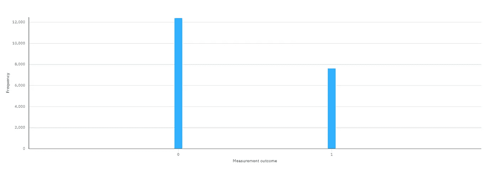

比较|+>和 u(pi/2，pi/3，0)

这里有两个状态是相隔π/3 绕 z 轴旋转，这意味着它们应该以 87.5%的概率测得 0。相反，这种可能性接近 60%，仍然减少了约 25%。

## 部分结论

前三个测试，所有围绕 y 轴的旋转，都像规范交换测试一样。一旦我们开始绕 z 轴旋转，测到 0 的概率似乎下降了 25%。否则，近似互换测试似乎仍然是一种距离度量。

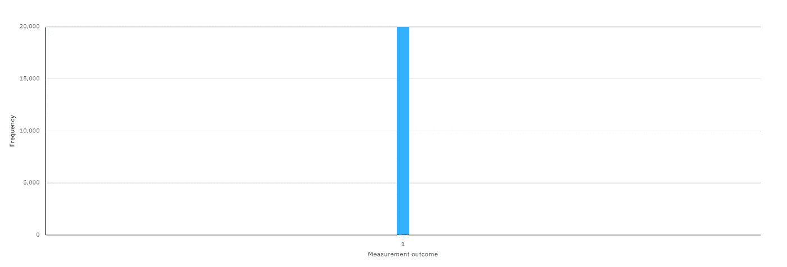

比较|1 >和|1 >

## 这到底是什么？

我认为只有 25%的时间测量 0 是不可思议的，但是我比较了|1 >和|1 >。因此，很明显，测量概率为 0%的 0 表示我们正在比较|1 >和|1 >。

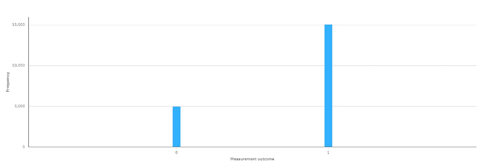

比较|+>和|1 >

但是，等等，还有呢！比较|+>和|1 >也偏向于测量 1，错误地暗示我们在比较极性相反的相位。

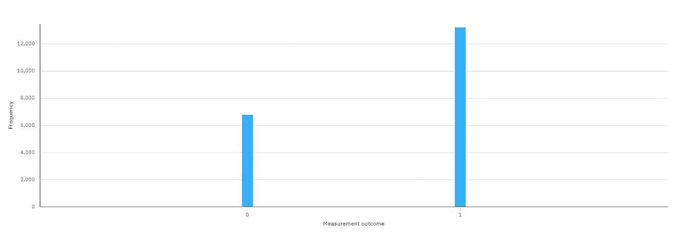

比较 u(2/3*pi，0，0)和 u(2/3*pi，pi/3，0)

## 那么，如果我们把两者结合起来呢？

如果我们旋转到更接近|1 >的位置，然后添加一个相位旋转，我们似乎会得到双重效果。这两个状态围绕 z 轴的旋转距离只有π/3，但它们都围绕 y 轴旋转了 2/3 *π。而不是以 87.5%的概率测得 0，概率只有 34%，好像概率大概减少了 25%，然后又大概减少了 25%。

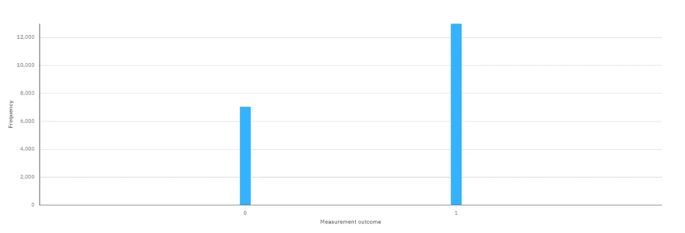

比较 u(2/3*pi，pi/3，0)和 u(2/3*pi，2/3*pi，0)

这是相同的比较，除了两个状态都围绕 z 轴旋转了额外的π/3。测量结果大致相同，包括| ^ 1 >和相位损失。

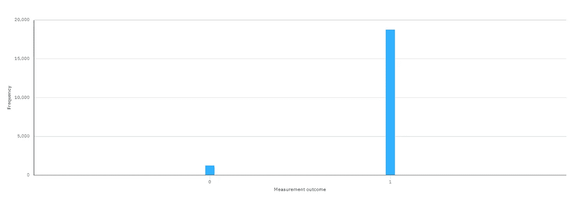

比较 u(2/3*pi，pi/3，0)和 u(2/3*pi，4/3*pi，0)

## 它们是累积的！

这两种状态是在绕 y 轴旋转 2/3 *π之后，相隔一整圈绕 z 轴旋转。这就好像我们正在使用规范互换测试，这些遥远的状态以刚刚超过 50%的概率测量为 0。但是，对于 x-y 平面以下的两个状态，我们扣除 25%,对于使用相位，我们再扣除 25%。因此，在标准互换测试中，概率超过 50%,而在近似互换测试中，概率超过 0%。

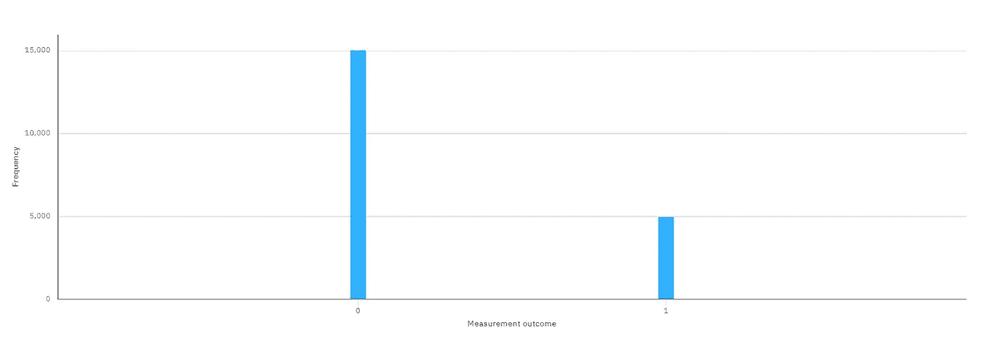

比较|+>和|+>

## 这是不对的。

比较两个相同的状态，在本例中是|+>和|+>，应该以 100%的概率测得 0。但是，由于在 x-y 平面上，比较|+>和|+>会有 25%的偏差。那么，如果我们比较其他相同的状态，会发生什么呢？

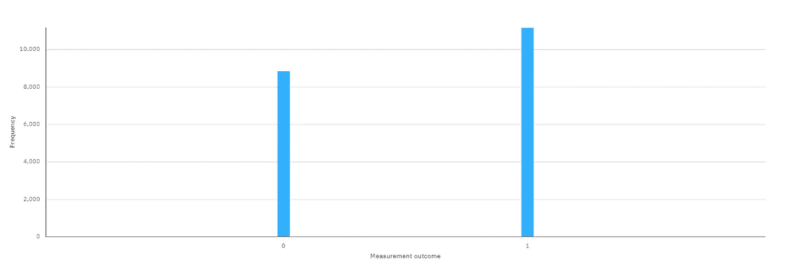

比较 u(2/3*pi，2/3*pi，0)和 u(2/3*pi，2/3*pi，0)

## 人生的意义是 44？

两个相同的状态无论在布洛赫球上的什么位置，都应该有 100%的概率测到 0，但这里测到 0 的概率只有 44%。但是你知道更奇怪的是什么吗？我对相同的状态进行了几次比较，结果都是 0，概率为 44%。如果是 42%，那就太搞笑了。但是没有。非穷举测试始终是 44%。或许《银河系漫游指南》有个错别字？

## 定论

尽管有其特质，近似交换测试似乎仍然可以比较量子态:

1.  不是用 100%到 50%范围内的概率来度量 0，而是范围是 100%到 0%。
2.  如果量子态有相位，测到 0 的概率下降 25%。
3.  如果两个状态都在 x-y 平面以下，测量 0 的概率下降 25%。
4.  这些“惩罚”似乎是累积的。
5.  但是，除了比较|1 >和|1 >之外，其他 50%似乎确实与规范交换测试类似地比较状态。
6.  在 y 轴之外，相同的状态似乎以 44%的概率测量为 0，而不是 100%。这很奇怪，但如果是一致的，就有用。

虽然[相对相位交换测试](/relative-phase-swap-test-f4a718f4f4b5)似乎只在没有相位旋转的情况下工作，但近似交换测试似乎更像规范交换测试，尽管有某种惩罚系统的模糊性。这个故事的寓意是，噪音是该死的，没有什么可以替代[规范互换测试](/comparing-quantum-states-c6445e1e46fd)的多功能性和相对简单性。但是，我还是会继续尝试…

愿 44 号与你同在。

## 内藤宗顺