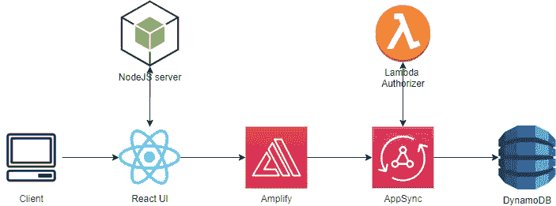
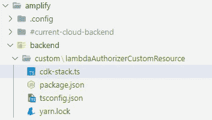
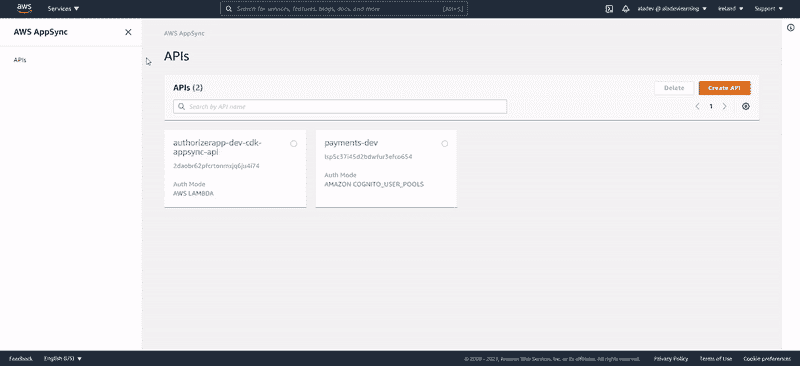
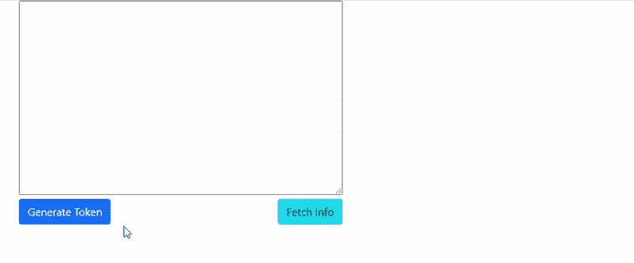

# AppSync Lambda 授权器通过新的 Amplify 定制资源

> 原文：<https://levelup.gitconnected.com/appsync-lambda-authorizers-via-new-amplify-custom-resources-5a32f41a6332>

[Amplify](https://aws.amazon.com/amplify/) 和 [AppSync](https://aws.amazon.com/appsync/) 允许客户在几分钟内使用完全托管的 GraphQL API 端点，并优雅地处理授权。本文展示了如何利用最近新引入的 [AWS 定制资源](https://docs.amplify.aws/cli/custom/cdk/)通过 CDK 添加新的 [AWS Lambda](https://aws.amazon.com/about-aws/whats-new/2021/07/aws-appsync-supports-custom-authorization-with-aws-lambda-graphsql-apis/) 授权模式。我们将把这个端点与一个非常简单的 React web 应用程序集成起来。



# 有趣的事实

本文的第一个版本基于通过 CDK 在自己的文件夹/项目中独立提供所需的 AWS 资源。然而，在[AWS Community Builders](https://aws.amazon.com/developer/community/community-builders/)Slack 频道，我了解到[AWS Amplify 团队正在发布一个相关的特性](https://docs.amplify.aws/cli/custom/cdk/#reference-amplify-environment-name)，这让我重温了这篇文章，其中的实现略有不同，但更加简洁。这综合了节目的精彩之处。在 GitHub 中可以找到之前的[和](https://github.com/aladevlearning/appsync-lambda-authorizers/tree/before-custom-resources)之后的[自定义资源实现。](https://github.com/aladevlearning/appsync-lambda-authorizers/tree/after-custom-resources)

# 添加自定义资源

有了最新的 Amplify，你可以通过定义 CDK 堆栈来添加自定义资源。在此之前，典型的方法是将你的 CDK 分离到你的项目中的 *cdk* 或 *infra* 文件夹中。现在你可以在 Amplify 后端拥有它。发出以下命令:

```
npm i -g @aws-amplify/cli
amplify add custom
```

目前，您可以通过 *CDK* 或*云信息*模板来定义自定义资源，我们将选择第一个选项，并为自定义资源提供一个名称，例如*lambdaAuthorizerCustomResource*。这将在*amplify/back end/custom/<custom-resource-name>*路径下生成一个骨架 CDK 堆栈。



在我们修改预先生成的 *cdk-stack.ts 文件*并创建一个 *cdk.ts，*之前，让我们在下一节看看 cdk 堆栈的内容。

# 通过 CDK 提供 GraphQL

作为[基础设施作为代码](https://docs.aws.amazon.com/whitepapers/latest/introduction-devops-aws/infrastructure-as-code.html)原则的忠实粉丝，我决定通过使用 AWS CDK 为 Typescript 语言创建 GraphQL 端点。本质上，CDK 以一种编程的方式抽象云形成栈。下面的堆栈将提供:

*   基于定义模型和 Lambda 授权器配置的 [*schema.graphql*](https://github.com/aladevlearning/appsync-lambda-authorizers/blob/main/cdk/graphql/schema.graphql) 的 AppSync GraphQL 端点。
*   一个*授权者* Lambda 函数及其必要的 IAM 策略。
*   一个与业务相关的*支付* Lambda 函数，包含通过其 [GraphQL 解析器](https://graphql.org/learn/execution/)对已定义模型(此处为*支付*模型)的 CRUD 操作。这个 Lambda 作为[数据源被附加到 AppSync](https://docs.aws.amazon.com/AWSCloudFormation/latest/UserGuide/aws-resource-appsync-datasource.html) 。
*   持久化模型的 DynamoDB 表。

输出 GraphQL 端点的完整代码，可以在这里找到[。](https://github.com/aladevlearning/appsync-lambda-authorizers/blob/after-custom-resources/authorizer-app/client/amplify/backend/custom/lambdaAuthorizerCustomResource/cdk-stack.ts)

需要注意的是，现在您可以使用 Amplify 项目元数据，如 ***项目*** 和 ***环境*** 名称，在运行时定义您的资源。

在撰写本文时，我必须创建一个 *cdk.ts* 文件，以便初始化堆栈并将其与应用程序相关联:

最后，让我们构建和部署变更:

```
amplify build
cdk deploy --app "npx ts-node cdk.ts" --parameters env=dev
```

以上步骤可以在 AWS 控制台手动执行，但步骤较多，容易出错。下面我们展示了 CDK 的视觉输出:



# 兰姆达斯上的镜头

我们提供了两个 Lambda 函数:一个“*粘合*”app sync，DynamoDB 作为*数据源*，另一个执行授权检查。**重要提示:**请注意，它们的前缀是来自我们的 CDK 堆栈的数据: **authorizerappdev。**

## 数据源λ

*数据源* Lambda 利用 AWS SDK 在 DynamoDB 表上执行 CRUD 操作。下面的片段展示了付款清单，其余的可以看看 [Github 回购](https://github.com/aladevlearning/appsync-lambda-authorizers/tree/main/cdk/resources/payments)。

## 授权人λ

AppSync 通过提供身份验证令牌将任何客户端请求转发到此函数。对于这个 PoC，我利用 RSA 密钥对来验证传入的 JWT 令牌的有效负载及其通过之前生成的公钥的签名。这是通过使用 [jsonwebtoken](https://github.com/auth0/node-jsonwebtoken) 包来完成的。

在这个阶段，我们只需要一个使用 GraphQL 端点的客户机，所以让我们在下一节中详细了解它。

# 集成放大器

在撰写本文时(2021 年 11 月)，新的 Lambda 授权器尚未通过 Amplify CLI 提供。这意味着我们需要手动设置与 AppSync 的集成，尽管这非常简单。

假设您已经在项目中配置了[*和*启动了* Amplify*](https://docs.amplify.aws/cli/start/install/) *，您需要做的就是手动添加这个代码片段作为 Amplify *configure* 方法的一部分，通常位于您的 App.js/ts 文件中——如果使用 React 的话。*

*为了演示 JWT 验证，我创建了一个非常愚蠢的 [React UI](https://github.com/aladevlearning/appsync-lambda-authorizers/blob/main/authorizer-app/client/src/App.js) 。*

**

*通过调用本地[*Fastify*](https://www.fastify.io/)*NodeJs 服务器*暴露 *generate-token* 端点来生成 JWT 令牌。详情可以在这里找到[。端点使用私钥对生成的 JWT 令牌进行签名，如前所述，该令牌随后将由λ授权器功能进行验证。在这种情况下，我们只是发送了一个简单的 foo/bar 有效载荷，但是在现实生活中肯定要复杂得多，并且遵循](https://github.com/aladevlearning/appsync-lambda-authorizers/blob/after-custom-resources/authorizer-app/backend/server.js) [Oauth 声明](https://tools.ietf.org/id/draft-spencer-oauth-claims-00.html)更加严格。该调用通过调用 API 端点并提供 GraphQL 查询和 JWT 令牌来执行。*

# *摘要*

*Lambda 授权器是 AppSync 武库中的另一个武器，为大量用例以及单个和多个授权器的组合和第三方集成打开了大门。本文旨在为客户提供一个开始使用 Lambda Authorizer 特性的起点，并且只是展示了一个非常简单的实现，然后可以对其进行扩展以进行更进一步的改进。*

# *参考*

*[](https://aws.amazon.com/about-aws/whats-new/2021/07/aws-appsync-supports-custom-authorization-with-aws-lambda-graphsql-apis/) [## AWS AppSync 现在支持使用 AWS Lambda 为 GraphQL APIs 进行自定义授权

### 发布于:今天我们发布了一种灵活而简单的方法来实现 AWS Lambda 的自定义授权逻辑…

aws.amazon.com](https://aws.amazon.com/about-aws/whats-new/2021/07/aws-appsync-supports-custom-authorization-with-aws-lambda-graphsql-apis/) [](https://aws.amazon.com/blogs/mobile/building-scalable-graphql-apis-on-aws-with-cdk-and-aws-appsync/) [## 使用 CDK、TypeScript、AWS AppSync、Amazon DynamoDB 和 AWS 在 AWS 上构建可扩展的 GraphQL APIs

### 2021 年 9 月 14 日:亚马逊 Elasticsearch 服务更名为亚马逊 OpenSearch 服务。见详情。AWS…

aws.amazon.com](https://aws.amazon.com/blogs/mobile/building-scalable-graphql-apis-on-aws-with-cdk-and-aws-appsync/)*