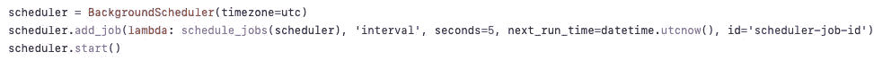
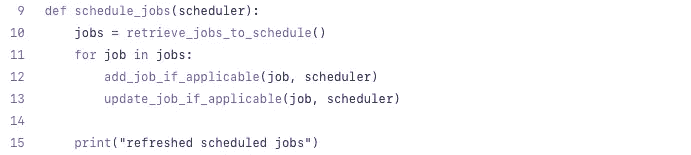
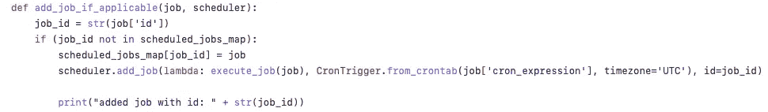
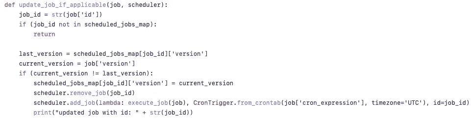

# APScheduler:Python 中的动态任务调度库

> 原文：<https://levelup.gitconnected.com/apscheduler-dynamic-task-scheduling-library-in-python-fc1e6eb33c85>

## 以编程方式管理和执行基于定制 Cron 的作业


照片由 [Djim Loic](https://unsplash.com/@loic?utm_source=medium&utm_medium=referral) 在 [Unsplash](https://unsplash.com?utm_source=medium&utm_medium=referral) 上拍摄

## **简介**

在本教程中，我们将创建自己的自定义任务调度程序。为了更好地理解上下文，让我们假设需要调度和执行一些任务——可能是发送通知、存档等等；然而，为了简单起见，让我们将本文的范围限制在管理和执行定制的基于 cron 的作业。

所以，不再多说——让我们利用`APScheduler` —一个可以处理上述场景的 python 库。

## **项目设置**

虽然很明显，我们可以在 *Flask* 、 *Django* 或任何其他 python 框架中完成这项工作——为了简洁起见，让我们只使用必要的库(`APScheduler`)来完成这项工作。

首先，让我们安装[日程安排器](https://apscheduler.readthedocs.io/en/3.x/userguide.html) :
`pip install apscheduler`

接下来，让我们快速浏览一下整个实现——然后让我们一次检查一件事情。

## **深潜**

从进口开始，我们有一个`Scheduler`和一个`Trigger`:


为了过度沟通，a `Scheduler`管理作业；而一个`Trigger`是启动每个作业的执行。虽然我们在这里使用的是`BackgroundScheduler`——当然也可以使用其他类型，比如`BlockingScheduler`；扳机也一样。

首先，让我们先创建一个具有 UTC 时区的调度程序。然后，让我们添加一个调度其他作业的作业(基于间隔，每 5 秒一次)。注意，我们定义了一个 next _ run _ time——也就是说，首先立即运行作业。



现在，让我们继续作业调度中的相关功能:



首先，让我们检查作业的检索——这肯定可以通过几种方式实现——比如从数据库、HTTP 请求、事件等中检索。对于一个简单的演示，我们从项目中的一个本地 JSON 文件中检索它:


接下来，让我们看看如何添加一个作业——这里，我们使用了调度器的`add_job`方法。值得指出的是，我们为该作业的`CronTrigger`显式设置了时区——因为对于基于 cron 的作业，它默认为系统的时区(即使调度程序本身也有时区)。



同样，对于更新作业，我们也将使用调度程序的对象来删除和添加更新的作业:



最后，为了执行一个作业——我们创建了一个简单的函数，我们之前将它传递给了`add_job`方法:


我们开始了——非常简单，对吗？

像往常一样，完整的源代码总是可以在 [GitHub](https://github.com/emyasa/medium-articles/tree/master/python-apscheduler) 上获得。

# 分级编码

```
Thanks for being a part of our community! More content in the [Level Up Coding publication](https://levelup.gitconnected.com/).Follow: [Twitter](https://twitter.com/gitconnected), [LinkedIn](https://www.linkedin.com/company/gitconnected), [Newsletter](https://newsletter.levelup.dev/)**Level Up is transforming tech recruiting** 👉 [**Join our talent collective**](https://jobs.levelup.dev/talent/welcome?referral=true)
```