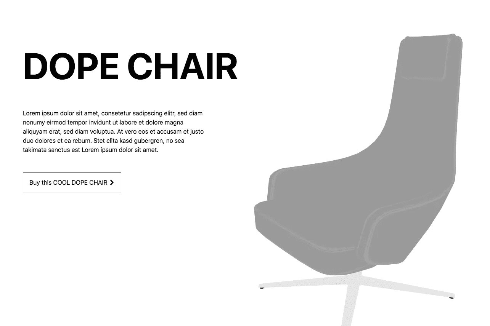

# Android 和 iOS 上 Web 中的 AR 模型

> 原文：<https://levelup.gitconnected.com/ar-models-in-the-web-on-android-and-ios-9a1313021c14>

## 使用 model-viewer，将简单的 3D 模型添加到您的网页中非常快速和简单！


【https://unsplash.com/photos/rcrYhAP2d_w 

在手机浏览器中显示 3D 模型是目前为 Chrome 和 Safari 开发的独特功能，但它需要不同的格式，我们将讨论这些格式。

这些功能的强大之处在于，只需添加**几行代码，它们就能让你在增强现实中看到 3D 模型！**

# 决赛成绩

最终结果将是这样一个页面:[dope-chair-model-viewer . glitch . me](https://dope-chair-model-viewer.glitch.me/)

[](https://dope-chair-model-viewer.glitch.me/)

精致的 3D 椅子

# 入门指南

将这些脚本添加到页面中，您将获得一个新的 HTML 元素`model-viewer`。这个元素是 Google 为了加速 AR 的采用而创造的。

1.  包括支持所有主流浏览器的依赖项:

```
<script type="module"
src="https://unpkg.com/@google/model-viewer/dist/model-viewer.js"></script><script 
nomodule src="https://unpkg.com/@google/model-viewer/dist/model-viewer-legacy.js">
</script>
```

2.添加一个带有`src`的`<model-viewer>`元素，你会在你的网页上看到一个 3D 模型。请记住，模型必须是 [**GLTF 格式**](https://www.khronos.org/gltf/) 的，扩展名为。glb“或”。gltf”。你可以在这里阅读更多关于 GLTF 标准的信息。

```
<model-viewer src="assets/model3d.gltf" 
              alt="this is a 3d model">
</model-viewer>
```

3.为了能够在 Android 上看到带有增强现实的模型，只需向元素添加属性`ar`。如果你想在 iOS **、**上看到它，你必须跳到下面的**部分**:

```
<model-viewer **ar** src="assets/model3d.gltf"
              alt="this is a 3d model">
</model-viewer>
```

# GLTF 是新的 JPG

GLTF 正在成为网络上最常见的 3D 格式，你可以从这里获得许多免费的 GLTF 模型进行测试:

*   [glTF-Sample-Models](https://github.com/KhronosGroup/glTF-Sample-Models/tree/master/2.0):[https://github . com/khronos group/glTF-Sample-Models/tree/master/2.0](https://github.com/KhronosGroup/glTF-Sample-Models/tree/master/2.0)

或者你可以在 [Sketchfab](https://sketchfab.com/) 上注册，在那里你可以免费下载数百个[https://sketchfab.com/](https://sketchfab.com/)的 GLTF 模型

如果你想从 GitHub 获得一个 3D 模型，你需要记住代理 CORS，但是不要在产品中这样做！在这种情况下，我使用 [**Glitch**](https://glitch.com/) 来托管 3D 模型。

```
<model-viewer **src="**[**https://cdn.glitch.com/ea8aad0f-c4ad-4fee-b2aa-0174986b2895%2Fchair.glb?v=1569230891112**](https://cdn.glitch.com/ea8aad0f-c4ad-4fee-b2aa-0174986b2895%2Fchair.glb?v=1569230891112)**"**alt="a 3D model of a chair" auto-rotate camera-controls background-color="#ffffff" ar magic-leap unstable-webxr></model-viewer>
```

# iOS 版 USDZ

要在 iOS 上的浏览器中直接展示 3D 模型，您需要一个 USDZ 文件。幸运的是，使用 [**设计器**](https://s3.amazonaws.com/designar-usdz-converter-landing) 是可能的:

*   注册或登录[**Designar**](https://s3.amazonaws.com/designar-usdz-converter-landing/index.html):[https://S3 . amazonaws . com/Designar-usdz-converter-landing/index . html](https://s3.amazonaws.com/designar-usdz-converter-landing/index.html)
*   拖放您之前使用的 GLTF。
*   下载 USDZ 文件并将其添加到您的项目中。

在 Github 上上传这个 3D 模型后，就可以像添加`ios-src=“the url to the usdz file /chair.usdz”`一样添加`ios-src`。

```
<model-viewer src="[https://cdn.glitch.com/ea8aad0f-c4ad-4fee-b2aa-0174986b2895%2Fchair.glb?v=1569230891112](https://cdn.glitch.com/ea8aad0f-c4ad-4fee-b2aa-0174986b2895%2Fchair.glb?v=1569230891112)"**ios-src="**[**https://github.com/Giorat/dope-chair-model-viewer/raw/master/model/chair.usdz**](http://crossorigin.me/https://github.com/Giorat/dope-chair-model-viewer/raw/master/model/chair.usdz)**"**alt="a 3D model of a chair" auto-rotate camera-controls background-color="#ffffff" ar magic-leap unstable-webxr></model-viewer>
```

## 其他选项

您可能还想使用许多其他选项。以下是一些例子:

*   `auto-rotate`:启用模型的旋转
*   `camera-controls`:允许用户通过触摸或点击来控制模型
*   `shadow-intensity`:阴影的不透明度[0..1].默认值为 0。
*   `autoplay`:启动模型中的第一个动画或指定动画
*   `animation-name`:按名称选择动画

查看[这个资源](https://googlewebcomponents.github.io/model-viewer/)以获得更多关于`[<model-viewer>](https://googlewebcomponents.github.io/model-viewer/)`的信息。

# 带<model-viewer>的操场</model-viewer>

# 参考资料和资源:

*   [https://googlewebcomponents.github.io/model-viewer/](https://googlewebcomponents.github.io/model-viewer/)
*   [https://github.com/Giorat/dope-chair-model-viewer](https://github.com/Giorat/dope-chair-model-viewer)
*   [https://S3 . Amazon AWS . com/designar-usdz-converter-landing/index . html](https://s3.amazonaws.com/designar-usdz-converter-landing/index.html)
*   [https://glitch.com/~dope-chair-model-viewer](https://glitch.com/~dope-chair-model-viewer)