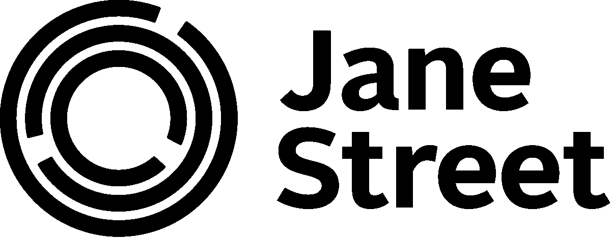
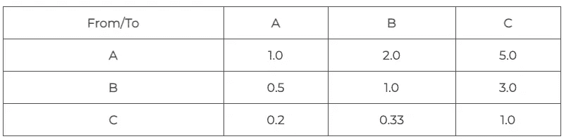
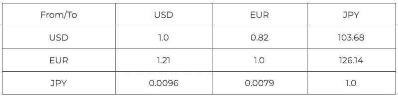
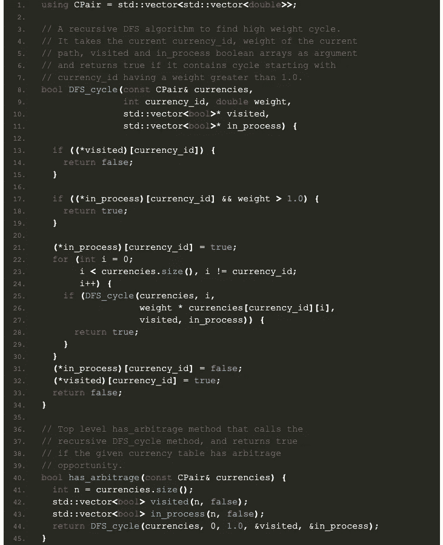
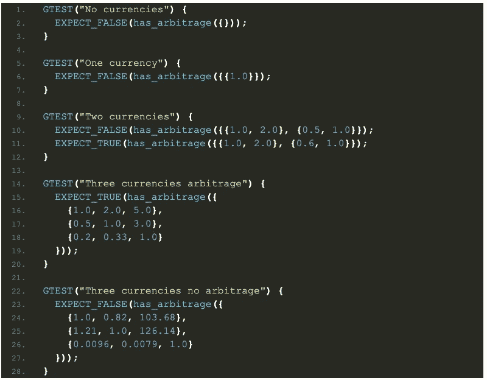

# 套利和图论

> 原文：<https://levelup.gitconnected.com/arbitrage-and-graph-theory-ecd26391908b>

图论在各行各业的面试官中非常受欢迎。这里有一个在金融科技公司 Jane Street 问的关于图论的面试问题。

*随意看看我们前面的一些***[*图*](https://cppcodingzen.com/?p=936) [*论*](https://cppcodingzen.com/?p=143) *的问题及其解决方法。***

# **问题**

**假设您有一个货币兑换率表，用 2D 数组表示。确定是否存在可能的套利:也就是说，你是否可以进行某种顺序的交易，从任何货币的某个金额 A 开始，这样你就可以以某个大于该货币的 A 的金额结束交易。**

**没有交易成本，你可以交易少量。**

# **解决办法**

**你应该经常问的第一个问题是，“我对这个问题的理解是否足以解决它？”。几乎在所有情况下，通过一个例子来解决问题比什么都清楚。**

***原问题是否包含实例？你了解他们吗？在这种情况下，它不会！这意味着你必须拿出一个例子，并通过它来工作。下面是一个包含三种货币的简单示例， **A、B、**和 **C、*****

****

**A、B 和 C 之间的货币换算表**

**能够解释和阅读例子也很重要；并且能够克服它。下面是我们如何阅读上表:一个单位的货币 **A** 可以兑换 2 个单位的货币**b**和一个单位的货币 **C** 可以兑换 0.2 个单位的货币**A**有了这个表，很容易建立套利:**

*   ****A**—>1 台**B**2 台**
*   **2 台**B**–>2 * 3 = 6 台 **C****
*   **6 个单位的**C**–>6 * 0.2 = 1.2 个单位的 **A****

**因此，我们可以从一个单位的 A 开始，通过两次交易(A-B 交易所和 B-C 交易所)，最终可以得到 1.2 个单位——增加了 0.2 个单位！**

**作为一个旁注，请记住，真正的货币永远不会出现像标准货币交易所这样的套利机会。这是美元、欧元和日元之间的货币兑换表**

****

**实际货币之间的货币转换**

**让我们仔细看看第一个例子。*为什么会有套利，如何发现？*一个关键的观察是将货币对表示为图形的边，汇率作为边的权重。因此，我们的图将包含一条权重为`2.0`的边`A --> B`。考虑一下`A --> B --> C --> A`的周期。这个循环的边上的权重分别为`(2.0, 3.0, 0.2)`。 ***权重的乘积因此是 1.2——大于 1。*** 因此，**

> ***如果相应的图有一个具有“高权重属性”的循环(循环边的乘积大于 1.0)，则货币兑换表包含一个套利机会。***

**可以通过简单的递归深度优先搜索(DFS)算法找到高权重循环，如下所示:**

*   **跟踪所探索的边的权重的当前乘积。**
*   **还要保存两个不同的哈希表:**
*   **`visited`表示包含给定货币的循环不具有高权重性质。**
*   **`in_process`表示包含给定货币的周期正在探索中。它们中的一个也可能具有期望的高权重属性！**
*   **每当我们访问`in_process`表中的货币时，当`weight`大于 1 时，我们就找到了期望的周期，从而找到了套利机会！**

**下面是上述 DFS 算法在 C++中的实现:**

****

# **复杂性**

**标准 DFS 算法的复杂度是 O(E + V)，其中 E 是图的边数，V 是图的顶点数。对于 N 种货币，V = N，E = N。因此，算法的复杂度为 O(N)。**

**我们也可以通过直接分析上面的代码来计算复杂度。在这段代码中，**

*   **我们在`visited`数组中插入一个`currency_id`正好一次。(对那个`currency_id`的所有其他引用在`visited`数组中查找，并在常数时间内返回)。**
*   **`visited`中的每次插入都执行 O(N)工作，遍历所有其他货币。**

**因此，总时间复杂度为 O(N) * O(N) = O(N)。**

# **测试**

**让我们写几个测试测试零，一和两种货币。我们也来测试一下上面的两个例子。**

****

**【https://cppcodingzen.com】原载于 2021 年 1 月 28 日**。****