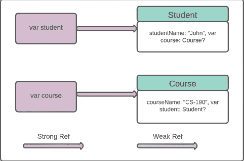
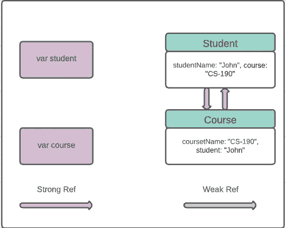
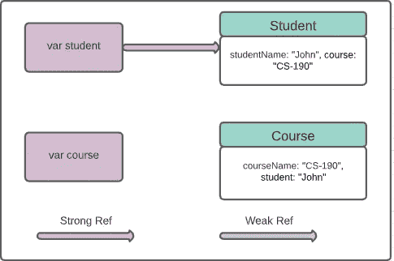
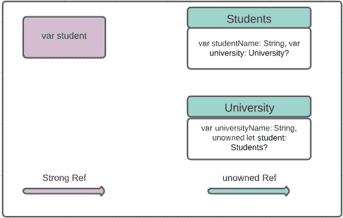

# swift 中的内存管理(第一部分)

> 原文：<https://levelup.gitconnected.com/arc-memory-management-in-swift-165fd0329f16>

描述如何在 Swift 中使用自动引用计数来管理应用程序内存。


瓦伦丁·塔纳索维奇通过[派克斯](https://www.pexels.com/@pixabay)拍摄的照片

# 概观

开发移动应用程序时，内存是一个大问题。不寻常的内存访问会降低应用程序的性能，导致应用程序意外崩溃。幸运的是，Swift 使用 ARC(自动引用计数)来管理您的应用程序内存。大多数情况下，ARC 会自己清理内存，但有时会因为某些关系而无法清理。在本教程中，我们将学习如何使用 ARC 来释放 Swift 的内存。

> *本教程使用* ***Swift 5，Xcode 12.1 编写。***

# 什么是 ARC？

当我们使用 init()创建一个类的实例时，会为它分配一些内存块。当不再使用这个实例时，调用 deinit()方法，ARC 释放该对象占用的内存。

但事情并不是每次都这么简单。有时由于某种关系，deinit()方法不执行，ARC 不能释放内存。您可能会注意到，在 iOS 开发中，有时变量使用弱关键字或无主关键字声明。这些关键字实际上与一个变量和一个类联系在一起。我们将学习如何聪明地处理它们并释放未使用的内存。

# “强”参考和保留周期

假设我们有一个简单的类 **Student** ，它有一个属性初始化器来初始化它的属性。

```
class Student {
    let studentName: String
    init(studentName: String) {
        self.studentName = studentName
        print("\(studentName) created")
    }deinit {
        print("Deinit student \(studentName)")
    }
}
```

学生类也有一个反初始化器。当一个类的属性被 ARC 从内存中取消初始化时，将调用 deinit()方法。

现在我们创建一个简单的变量**学生**的**学生**类。该变量将创建一个对 **Student** 类的强引用，Student 类的引用计数将变为 0 比 1。

```
var student: Student? = Student(studentName: “John”)**Console output:**
*John created*
```


我们可以通过将**学生**变量值设置为零来移除引用。 ***注意*** ***注意，通过将变量设置为零，我们不是删除变量，而不仅仅是删除引用。***

```
student = nil**Console output:** *Deinit student John*
```

该语句将删除**学生**变量与**学生**类的关系，执行 deinit()方法，并且**学生**类引用计数从 1 变为 0。


现在假设我们有两个不同的班级作为**学生**和**课程**

```
class Student {
    var course: Course?
    let studentName: String
    init(studentName: String) {
        self.studentName = studentName
        print("\(studentName) created")
    }
deinit {
        print("Deinit student \(studentName)")
    }
}class Course{
    var student: Student?
    let courseName: String
    init(courseName: String) {
        self.courseName = courseName
        print("\(courseName) generated")
    }
    deinit {
        print("Deinit course \(courseName)")
    }
}
```

我们初始化**学生** & **课程**班级如下

```
var student: Student? = Student(studentName: “John”)
var course: Course? = Course(courseName: “CS-190”)**Console output:** *John created
CS-190 generated*
```

现在这两个类的引用计数都是 1，因为我们为它们创建了两个单独的引用。



当我们分别为**学生**和**课程**类中的**课程**和**学生**属性设置值时，它们之间会创建一个强引用。两个类的引用计数都从 1 变为 2。

```
student?.course = course
course?.student = student**Console output:** *John created
CS-190 generated*
```


但是现在如果我们打破**学生**和**课程**变量的强引用，将它们设置为零，那么**学生** & **课程**的引用计数将不会像我们预期的那样从 2 下降到 0。这两个类的引用计数都是 1😮

```
course = nilstudent = nil**Console output:** *John created
CS-190 generated*
```

检查您的控制台输出。您将找不到任何关于取消初始化的内容，因为您的 **deinit()** 方法没有执行。虽然**课程** & **学生**被明确设置为 0，但是各班之间相互参照。



这种情况被称为**内存泄漏**。ARC 无法释放内存，因为这两个类之间都有一个**强**保留循环。

# “弱”引用以避免保留循环

根据 swift 文档，

> 弱引用不会在它所引用的实例上保留据点，当弱引用仍在引用它时，该实例有可能被释放。因此，当它引用的实例被释放时，ARC 自动将弱引用设置为 nil。

**弱**属性不保留据点，所以如果我们设置一个属性为**弱**，它不会增加相关类的引用计数。使用**弱**参考的时间，将**学生**内的**课程**变量设置为

```
weak var course: Course?
```

这将在很大程度上影响到**学生** & **课程**班级的关系。让我们看看它如何避免内存泄漏。


目前，**学生**类有两个强引用，而**课程**类有一个强引用，另一个弱引用。如果我们设置**进程**变量为 **nil，**它将解决**内存泄漏**😲 😲

是的，这背后的黑客是当我们将**课程**变量设置为 0 时，**课程** & **学生**类之间的强关系不复存在(自动移除，因为**课程**引用被移除)。

但是另一个弱引用呢？弱参考将在设置为**零**的过程后立即通过 ARC 设置为**零**。这就是弱关键字的力量😃

现在设置**航向**变量为**零**并看到你的控制台出来。

```
course = nil**Console output:** John created
CS-190 generated
Deinit course CS-190
```

**调用**课程**类中的 deinit()** 方法。这意味着 ARC 成功地从内存中删除了**航向**变量。



看不到更多的保留周期，没有更多的内存泄漏。现在，如果不再需要，您也可以将**学生**变量设置为**零**。

# “无主”引用

**无主**是另一种最小化引用计数的方法。类似于**弱**但两者略有区别。**弱**参考必须是可选类型。这就是为什么当不再需要引用时，ARC 可以将 nil 设置为弱引用。

无主的不能是可有可无的，并期望总有一些价值。所以 ARC 不能把一个未知的参考值设置为 nil。请考虑以下事实，注意使用 unowned。根据 swift 文档，

> 仅当您确定引用总是引用尚未被释放的实例时，才使用无主引用。
> 
> 如果您试图在实例被释放后访问一个无主引用的值，您将得到一个运行时错误。

我们来看一个与**无主相关的例子。我们有两个班级**学生** & **大学**。班级之间的关系与以前的班级略有不同。一个学生可能有也可能没有任何大学，但每个大学都必须有学生。这就是为什么我们把**大学**类里面的**学生**变量声明为**无主**不能再可选了。**

```
class Students {
    let studentName: String
    var university: University? init(studentName: String) {
        self.studentName = studentName
    }
    deinit { 
        print(“\(studentName) is being deinitialized”) }
    }class University {
    let universityName: String
    unowned let student: Students init(universityName: String, student: Students) {
        self.universityName = universityName 
        self.student = student
    } deinit {
        print(“\(universityName) is being deinitialized”) }
    }var student: Students?
student = Students(studentName: “John”)
student!.university = University(universityName: “ABC”, student: student!)
```

现在这两个阶级之间的关系就像下图一样


如果我们想释放你的内存，只需将**学生**变量设置为**零**。

```
student = nil**Console output:** John is being deinitialized
ABC is being deinitialized
```

检查你的控制台，ARC 成功地从内存中删除了对象的引用，酷😎其输出将如下所示。



但是等到**无主的时候**会出问题吗？将 **student** 对象设置为 **nil** 后，尝试如下访问 **University** 类的 **student** 属性。

```
student = nil
university.student //Run time error
```

根据 **unowned** 的定义，它必须有一个对该对象的非零引用。由于所有者对象已经被释放，它崩溃了。

我想现在您已经对使用 Swift 编程语言进行内存管理有了一些了解。如果你想了解更多，查看我的内存管理教程第二部分[这里](https://medium.com/@arifulislam14/memory-management-in-swift-part-02-b5b5f9fbb12b)。你会在 [Swift 的官方文档](https://docs.swift.org/swift-book/LanguageGuide/AutomaticReferenceCounting.html)中找到对它们的简短讨论。

**如果你觉得这篇文章有用，请分享并鼓掌**👏👏👏
在 [Medium](https://medium.com/@arifulislam14) 上查看我的其他文章，在 [LinkedIn](https://www.linkedin.com/in/arifparvez14/) 上帮我联系。

感谢您阅读&快乐编码🙂