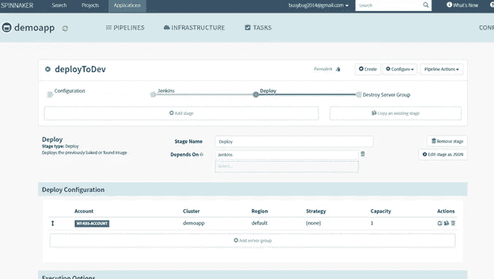

# 为基于容器和微服务的应用构建 CI/CD 管道

> 原文：<https://levelup.gitconnected.com/architecting-a-ci-cd-pipeline-for-container-and-microservice-based-applications-120f4b470681>


我最近有机会与一位客户合作，使用容器编排技术提供一个可管理、安全、可扩展和高度可用的架构，用于水平自动扩展和自我修复系统。

我们提出了使用 AWS 管理的 Kubernetes 服务(EKS)来轻松部署、管理和扩展容器化应用程序的架构。传统 DevOps 管道由 CI/CD 管道组成，其中包括代码存储库(位存储桶)、用于持续集成的自动化服务器(Jenkins ),用于部署。

虽然 Jenkins 管道从 CI 延伸到 CD，但现有的 CI/CD 自动化并没有利用不可变基础架构的优势。Jenkins 不是为在 Kubernetes 中部署而设计的，而且由于该团队不熟悉 kubectl 术语，因此需要一个易于管理的平台来进行可靠的部署。

我们使用 Jenkins 和 Spinnaker 推出了一个 CI/CD 管道，这是一个开源的多云连续交付平台，可以帮助客户交付代码，对客户没有任何影响。像临冬城的*琼恩·雪诺*一样，Spinnaker 被证明是合法的继承人，简化了库伯内特的建造和部署过程。

本文将带您了解 spinnaker 如何与各种工具和服务无缝集成，从而自动化示例应用程序的部署。你可以在这里【https://www.spinnaker.io/ 探索更多关于 Spinnaker 及其特性的信息。

> 当你张开大三角帆的时候，你就准备好随风飞翔了

# 安装三角帆

有几种方法可以安装 Spinnaker。我们将使用名为 Halyard 的命令行管理工具来部署和配置 Spinnaker。(可以参考官方安装指南:[https://www.spinnaker.io/setup/install/](https://www.spinnaker.io/setup/install/))。下面是推进这一部署的一些要求。

1.  一个 K8s 群集，具有足够的资源来支持大约 10 个机架的部署。
2.  Jenkins 服务器，可访问 AWS ECR 注册表以推送 docker 图像。

首先，让我们创建一个专用的 spinnaker 名称空间

```
kubectl create ns spinnaker
```

其次，让我们创建一个升降索部署来配置 Spinnaker。请放心使用最新稳定版本的升降索。

```
kubectl create deployment hal --image gcr.io/spinnaker-marketplace/halyard:1.15.0
```

我们将创建一个具有集群管理员角色的服务帐户，并将该帐户添加到 halyard 部署规范中。

```
kubectl create -f [https://raw.githubusercontent.com/SystemicEmotions/demoapp/master/spinnaker/accnt.yaml](https://raw.githubusercontent.com/SystemicEmotions/demoapp/master/spinnaker/accnt.yaml)
```

编辑升降索部署以添加服务帐户，如下所示:

```
spec:
  serviceAccountName: spinnaker-service-account
  containers:
  - image: gcr.io/spinnaker-marketplace/halyard:1.15.0
```

一旦升降索吊舱启动并运行，让我们启动一个 shell 会话来运行升降索命令

```
kubectl exec -it <halyard-pod> bash
```

## 配置持久性存储

我们将在 Spinnaker 中为持久化应用程序设置和已配置的管道配置 S3。我们需要创建一个桶和一个目录，如下所示。

```
hal config storage s3 edit --access-key-id <access-id> \
--region <region> \
--bucket <bucket-name> \
--root-folder <spin-folder> \
--secret-access-keyhal config storage edit --type s3
```

## 配置容器注册表(ECR)

```
hal config provider docker-registry enablehal config provider docker-registry account add my-ecr-registry \
--address [<](https://161764708719.dkr.ecr.us-east-1.amazonaws.com)aws-ecr-address> \
--username AWS \
--password-command “aws --region us-east-1 ecr get-authorization-token --output text --query ‘authorizationData[].authorizationToken’ | base64 -d | sed ‘s/^AWS://’”
```

## 启用 Kubernetes 提供程序并添加 ECR 注册表

Spinnaker 帐户映射到可以针对 K8s 集群进行身份验证的凭证。它还包括一个或多个 docker 注册帐户，用作图像源。这里，我们将用指定的帐户配置上一步中提到的 ECR registry。

```
hal config provider kubernetes enable
hal config provider kubernetes account add my-k8s-account --docker-registries my-ecr-registry
hal config deploy edit --type distributed --account-name my-k8s-account
```

注意最后一个命令中指定的分布式类型的使用。在分布式安装中，Halyard 分别部署 Spinnaker 的每个[微服务](https://www.spinnaker.io/reference/architecture)。强烈建议在生产中使用。

## 配置 Spinnaker 与默认的 k8s 集群进行交互

```
kubectl config set-cluster default --server=https://kubernetes.default --certificate-authority=/var/run/secrets/kubernetes.io/serviceaccount/ca.crtkubectl config set-context default --cluster=defaulttoken=$(cat /var/run/secrets/kubernetes.io/serviceaccount/token)
kubectl config set-credentials user --token=$token
kubectl config set-context default --user=user
kubectl config use-context default
```

## 将 Jenkins master 配置为从 Spinnaker 触发构建

```
hal config ci jenkins enable
hal config ci jenkins master add my-jenkins-master \
--address <Jenkins URL> \
--username <admin> \
--password
```

## 为 Gate (API 网关)和 Deck (UI)创建服务

```
kubectl create -f [https://raw.githubusercontent.com/SystemicEmotions/demoapp/master/spinnaker/svcs.yaml](https://raw.githubusercontent.com/SystemicEmotions/demoapp/master/spinnaker/svcs.yaml)
```

记下负载平衡器 DNS 端点

```
kubectl get svc -n spinnaker -o wide
```

我们希望为端口 9000 的外部 DNS 设置 UI (Deck ),为端口 8084 的外部 DNS 设置 API (Gate)。

```
hal config security ui edit --override-base-url http://< deck — external-IP>:9000
hal config security api edit --override-base-url http://< gate- external-IP>:8084
```

## 使用身份提供者配置身份验证

Spinnaker 支持多种身份验证和授权选项。我们将使用基于 SAML 的 IDP Okta 来实现单点登录(SSO)。让我们在 Okta 中创建一个应用程序，并复制 metadata.xml。为了在 Okta 中创建应用程序，我们将定义以下内容:

```
*Single Sign On URL — http://<gate-endpoint>:8084/saml/SSO
Audience URI — spinnaker-test
NameID format — EmailAdress*
```


在 Okta 创建 Spinnaker 应用程序

生成一个 keystore，并在一个新的 Java Keystore 中键入一些密码。

```
keytool -genkey -v -keystore saml.jks -alias saml -keyalg RSA -keysize 2048 -validity 10000
```

最后使用下面的 halyard 命令来配置认证

```
hal config security authn saml edit \
--keystore /home/spinnaker/saml.jks \
--keystore-alias saml \
--keystore-password <mypass> \
--metadata /home/spinnaker/metadata.xml \
--issuer-id spinnaker-test \
--service-address-url http://<gate-endpoint>:8084
```

## 选择 spinnaker 版本并应用部署

```
hal version list
hal config version edit --version 1.x.x
```

在运行最后一个命令之前，我们可以使用下面的命令查看自定义配置

```
hal config list
```

最后部署选定版本的 spinnaker。

```
hal deploy apply
```

## 在 Jenkins 中配置构建

在我们能够从 Spinnaker 部署应用程序之前，我们需要创建一个管道来构建映像并将其从 Jenkins 推送到 ECR。

我们将使用下面的存储库进行示例部署。

https://github.com/SystemicEmotions/demoapp

下面是存储库的内容

Dockerfile —使用 nginx 作为基本图像对静态 html 文件进行 dockerize。

Jenkinsfile —它定义了 Jenkins 中的各个阶段:克隆报告->构建映像->测试映像->将映像推送到 ECR

Index.html—一个静态的 html 页面

我定义了一个 webhook，用于在任何代码更改提交到 github 存储库时触发 spinnaker 管道。


在 github 存储库中定义 webhook

在 Jenkins 中创建一个管道项目，并定义存储库 URL 和脚本路径。


在詹金斯创建管道项目

此外，我们需要在 Jenkins 中为 ECR 创建凭证，并修改 Jenkinsfile 中的“Push image”阶段以使用该凭证。

```
stage(‘Push image’) { docker.withRegistry(‘https://xxxxxxxxx.dkr.ecr.us-east-1.amazonaws.com', ‘ecr:us-east-1:aws_ecr_cred’) {
app.push(“latest”)
}
}
```

现在，让我们继续手动触发构建。


Jenkins 的工作是构建映像并将其推送到 ECR

一旦管道成功执行，我们应该能够看到 ECR 中列出的 docker 映像。我们现在可以开始创建管道，以便在 Spinnaker 中自动化整个构建和部署过程。

## 在 Spinnaker 中为应用程序部署创建一个服务器组

我们将为应用程序部署创建一个服务器组。为了从公共网络访问网页，我们将首先从 Spinnaker 控制台创建一个负载平衡器。在创建新负载平衡器部分的高级设置下，将类型定义为负载平衡器。


从 Spinnaker 控制台创建负载平衡器

创建负载平衡器后，我们将使用在 Jenkins 构建期间构建并推送到 ECR 的映像，在基础架构部分下创建一个服务器组(一组 pod)。另外，指定我们在上一步中创建的负载平衡器。


创建服务器组来部署映像

一旦创建了服务器组，我们应该能够在 kubernetes 集群中看到正在运行的 pods。我们现在应该能够使用负载平衡器端点来访问示例网页，它应该看起来像下面这样。


部署在 kubernetes 集群中的示例网页

## 在 Spinnaker 中为持续部署创建管道

现在，让我们在 Spinnaker 中构建一个用于持续部署的管道。我们将在此管道中定义 4 个阶段。

1.  配置——这将包括一个触发器，用于获得 Github 代码库中任何代码更改的通知。


配置 webhook 以触发管道

2.Jenkins —在此阶段，我们将指定 Jenkins 主服务器并配置 Jenkins 作业，以触发阶段 1 之后的构建。


配置 Jenkins 主服务器以触发 Jenkins 作业

3.Deploy —这里我们将使用现有的应用程序部署配置模板，该模板是我们在开始创建服务器组时指定的。



创建部署配置

4.销毁服务器组—在此阶段，一旦我们的新 pod 启动并运行，我们将销毁之前的服务器组。


创建最后一个阶段来销毁之前的服务器组

一旦我们完成了管道的创建，让我们试着在 Github 中提交对 index.html 文件的修改。只要我们在 Github 中提交更改，Spinnaker 管道就会被触发。


Spinnaker 管道正在进行中

一旦所有四个阶段都完全成功，我们应该能够看到新的变化反映在我们的网页上。这里有一个我录制的视频的链接，作为 https://youtu.be/N4e3Zf1yFWY 的演示。

非常感谢您的反馈。