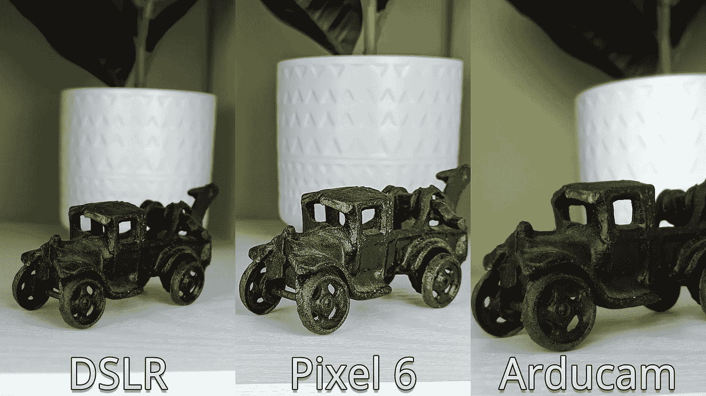

# Arducam 鹰眼:用于 Raspberry Pi 的 6400 万像素摄像头模块

> 原文：<https://levelup.gitconnected.com/arducam-hawk-eye-64mp-camera-module-for-the-raspberry-pi-4f451b95ed11>


鹰眼相机模块连接到树莓 Pi 4

如果你以前使用过普通的 Raspberry Pi 相机模块，你就会知道它还有很多不足之处。Pi 基金会发布的 HQ 相机后来解决了原始相机的一些问题，但是，笨重的镜头使它更难融入一些项目。

进入[鹰眼相机](https://www.arducam.com/product/64mp-af-for-raspberry-pi/)——一个小而强大的相机模块。Arducam 几个月前以 35 美元的价格开放了这款相机模块的预购，这是一笔令人难以置信的交易，因为普通相机模块的价格如此之高，更不用说 50 美元起的不带任何镜头的 HQ 相机了。现在鹰眼已经向公众发布，其价格已跃升至 60 美元。

# 设置

为了充分利用传感器的 64MP 功率，您需要一个 Raspberry Pi 4 或 Compute Module 4，而旧的 Pi 限制为 16MP。安装最新版本的 Bullseye(从 2022 年 1 月 28 日或更高版本)后，可以按如下方式安装摄像机驱动程序和自定义 libcamera 设置:

重新启动后，我们可以通过终端列出可用的摄像机来确认安装工作正常:

如果您遇到未检测到摄像头的问题，请先仔细检查您的摄像头电缆，然后尝试仅重新安装摄像头驱动程序并重新启动。如果您没有编辑配置文件并首先重新启动，您将需要再次重新安装相机内核驱动程序，因为在安装驱动程序之前必须加载配置更改。


鹰眼相机模块特写

# 测试

为了测试相机，我在办公室里设置了一些额外的照明，并拿了一些道具。为了拍摄出像样的照片，镜头需要大量的光线——即使是 F/1.8 的固定焦距比(F-Stop)。需要一个三脚架或某种支架，因为即使我的女朋友操作对焦和扳机，手持相机也很难对焦。

我们可以创建一个脚本来从相机中抓取图片，或者在设置镜头时将其用作实时视图。这将给我们一个像样的工作点和拍摄相机系统，虽然比你的标准现成的相机稍微简单一点。幸运的是，该应用程序包括 web 控件，因此我们可以发送命令来触发一些通过普通 V4L2 库不可用的操作，如自动对焦和捕捉。

我们首先需要安装 Arducam 发布的 V4L2 库，这是他们的相机无关驱动程序解决方案，用于他们的相机系列。我们还将安装`readchar`来简化热键的读取:

默认情况下，[脚本](https://github.com/makvoid/Blog-Articles/blob/main/Arducam-64MP-Raspberry-Pi-Camera/control.py)将捕获 4K 分辨率的图像(3840 x 2160)，但是，您可以在脚本顶部的配置中将分辨率提高到 9248 x 6944。代码准备好了，现在是时候将它与其他相机进行比较了，因为我们现在已经完全控制了照片的对焦、预览和抓取。

# 与其他相机的比较

为了更好地了解质量，我拿起我的 DSLR 和我的手机进行比较:

1.  佳能 T3i (600D)带佳能 24–105 F/4-L(18MP)
2.  谷歌 Pixel 6(非专业版)F/1.85 (50MP)


与 DSLR 相比，相机模块的质量令人印象深刻。当比较这张样本照片时，与 DSLR 相比，景深有点不足——但我认为考虑到镜头差异，这是可以预料的。像素的后期处理在这张照片上做了一点，在我看来，这导致了道具周围的一些奇怪的区域。



DSLR 似乎在这次测试中获得了更多的细节，但一些后处理肯定会有助于锐化 Arducam 图像。与 DSLR 相比，Arducam 在花盆背景中丢失了一些高光，但这也可以通过一些轻微的编辑来解决。


我还想看看相机如何处理小细节，比如打印在 CPU 上的文本。同样数量的细节是可见的，但是，当比较边缘点阵图案时，DSLR 似乎更清晰。

# 测试项目

这个相机模块是我计划的一个项目的组件之一，我想用树莓 Pi、OBD-2 模块和传感器为我的汽车建造我自己的[性能数据记录器](https://www.youtube.com/watch?v=1Xk35CAG6Lg)。我还需要音频和视频数据，所以我想要一个高质量的紧凑型相机模块，可以轻松地安装在我的挡风玻璃上。

为了录制音频，我按照[这个指南](https://learn.adafruit.com/usb-audio-cards-with-a-raspberry-pi/instructions)设置了一个 USB 音频设备，因为相机没有麦克风。为了实时结合音频和视频，我选择使用 [FFmpeg](https://ffmpeg.org/) ，因为它在社区中得到很好的支持，并且在我的经验中一直工作得很好(它也默认包含在 Raspbian 中)。

运行该命令后，将出现一个实时视图窗口，允许您检查视频帧和焦点(如果需要)。一旦您记录了所有需要的内容，您可以在终端中按下 **Ctrl+C** 退出命令，FFmpeg 会将文件保存到命令末尾指定的路径。

动态视频模式样本

这个样本是以 1080p 30fps 录制的，但是分辨率可以改变为例如 720p 60fps。在比较了一些测试捕获后，h264 模式(默认)捕获的质量最好，并且与 MJPEG 模式相比具有最小的压缩率。当提高 MJPEG 模式的质量时，帧速率受到影响，无法保持恒定的 30fps。YUV420 模式也可以工作，但是它的质量太高，相机模块在 1080p 下不能保持超过 5fps。


来自 h264 的帧抓取和高质量 PNG 捕获之间的质量比较

# 结论

这款 Arducam 摄像头模块以合理的价格将出色的质量、纯色表现和许多其他出色的功能集成到一个小封装中。虽然我在这次测试中只探索了一个摄像头，但你也可以使用 Arducam 出售的[四摄像头套件](https://www.arducam.com/product/64mp-quad-camera-kit/)同时连接两到四个摄像头。我对 Arducam 未来的发布感到非常兴奋，因为我只能想象再过一两年会发生什么！

# 资源

*   [GitHub 回购](https://github.com/makvoid/Blog-Articles/tree/main/Arducam-64MP-Raspberry-Pi-Camera)
*   [阿杜卡姆鹰眼相机模块](https://www.arducam.com/product/64mp-af-for-raspberry-pi/)
*   [相机模块快速入门指南](https://www.arducam.com/downloads/arducam_64mp_pi_camera_manual.pdf)

# 分级编码

```
Thanks for being a part of our community! More content in the [Level Up Coding publication](https://levelup.gitconnected.com/).
Follow: [Twitter](https://twitter.com/gitconnected), [LinkedIn](https://www.linkedin.com/company/gitconnected), [Newsletter](https://newsletter.levelup.dev/)Level Up is transforming tech recruiting👉[**Join our talent collective**](https://jobs.levelup.dev/talent/welcome?referral=true)
```