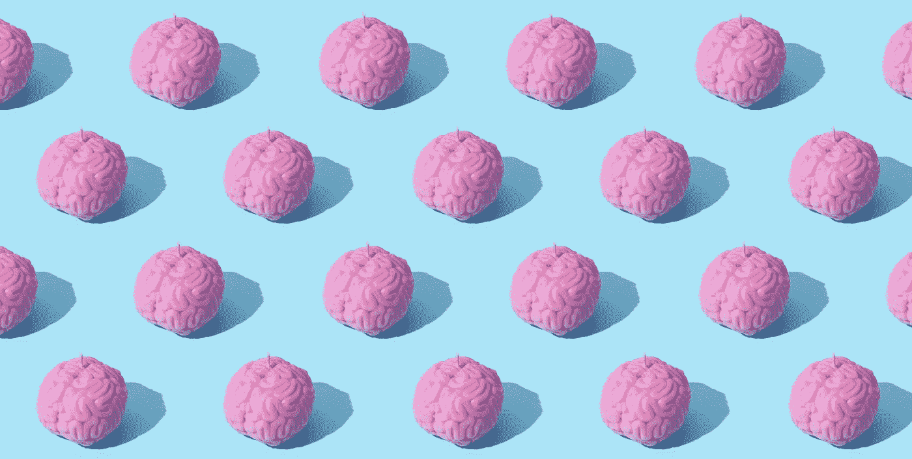

# 大型语言模型有感觉吗？

> 原文：<https://levelup.gitconnected.com/are-large-language-models-sentient-d11b18ef0a0a>

照片由 [DS stories](https://www.pexels.com/photo/brains-with-a-light-blue-background-9228382/) 提供

## 当我们问这个问题时，我们真正的意思是什么

谷歌刚刚[暂停](https://www.theguardian.com/technology/2022/jun/12/google-engineer-ai-bot-sentient-blake-lemoine)工程师布雷克·莱莫因的职务，因为他发表了与该公司聊天机器人开发系统 LaMDA 的对话。

根据莱莫因的说法，这些对话证明这个系统是有感知能力的。谷歌不同意，称有大量证据*反对*感知的说法。

这一切让我觉得相当奇怪，主要是因为感觉的问题是一个不可证伪的问题。世界上所有的证据都无法证明它的存在或不存在——这使得它成为一个毫无用处的技术问题。

> 世界上所有的证据都不能证明知觉的存在或不存在

当然，在巴黎沙龙进行哲学聚会很有趣，但不值得投入太多精力。尤其不是*机构*的能量。

"鲍勃，这就是为什么我们应该给逻辑回归一个合法的表示."照片由 [Shane Rounce](https://unsplash.com/@shanerounce?utm_source=unsplash&utm_medium=referral&utm_content=creditCopyText) 在 [Unsplash](https://unsplash.com/s/photos/coffee-chat?utm_source=unsplash&utm_medium=referral&utm_content=creditCopyText) 拍摄

你们中的许多人可能认为这实际上是要问的最重要的问题，我理解你们的想法。感觉的概念似乎对思考伦理、公平和权利至关重要。

这些都是重要的对话。但是从感觉的角度来思考并不是正确的方法。

我会告诉你为什么——但首先，我们必须定义术语。

# 感觉和超级科学家玛丽

总之，什么是感觉？

为了讨论的目的，我们说感知是“感受感情”的能力。我指的是拥有主观体验的能力——或者哲学家可能称之为“感受性”。

为了更深入地研究这个想法，我需要把你介绍给玛丽。

超级科学家玛丽。我们也许应该给她买个新的 Macbook 什么的。照片由 [cottonbro](https://www.pexels.com/photo/woman-in-white-clothing-using-a-computer-8875514/) 拍摄

玛丽是个天才。事实上是活着或死去的最聪明的人。她决定在年轻的时候研究神经科学，这给了她关于大脑如何运作的百科知识。

玛丽真的只有一个缺点:她看不见颜色。她的眼睛里没有视锥细胞，只有视杆细胞。她的世界是灰色的。

她可以描述 700 纳米波长的光如何击中正常的人类视网膜，如何触动其视锥细胞，启动化学信号通路，穿过双极细胞，向上到达视神经，最终到达人颅骨后部视觉皮层的某个地方——但尽管有物理、化学和生物学的技术知识，她仍然看不到红色。

红色不是 JPEG。红色是一种感觉。

那种红色——对它的感觉——就是感受性。

它不是波长，不是光子，也不是神经编码。

它完全脱离了你大脑的物理学或者它所源自的基底。

红色是一种*的感觉。*一种精神现象。

这就是我所说的*感知*耐心的含义:它是感知和感受的能力。它有任何东西的特质。

# 你们这些僵尸

给定感知的定义，你或许可以自信地说*你*是有感知的。这篇文章的话现在就像 qualia 一样在你脑海中回响。

但是如果我让你证明我是有知觉的呢？如果我给你无限的预算，太空时代的技术，和地球上最伟大的头脑，你会做什么实验？

你们很多人可能会转向神经科学。你会一个细胞一个细胞地描绘出我的大脑，探测每一个缝隙连接和突触小泡。你会做一些小的损伤研究，看看什么行为被开启和关闭，直到我睡着或醒来。

滚出我的大脑，你这个怪物。[国立癌症研究所](https://unsplash.com/@nci?utm_source=unsplash&utm_medium=referral&utm_content=creditCopyText)在 [Unsplash](https://unsplash.com/s/photos/brain-surgeon?utm_source=unsplash&utm_medium=referral&utm_content=creditCopyText) 上拍摄的照片

但是这些实验会告诉你什么呢？当然，它们可以揭示某些大脑结构与行为和任务表现的关系。但是他们能告诉你我内心的主观体验是什么呢？

我们对玛丽的思想实验告诉我们，我们所经历的物理和精神现象被认为是两件不同的事情！你对我如何滴答的物理学和生物学的任何了解都不会告诉你我内心的真实感受，或者我是否有任何感觉。

即使没有主观体验，人类的身体也会完全按原样运作。除了你，每个人都可能是一个“哲学僵尸”———只是一个没有意识经验的肉机器，经过数百万年的进化，被微调以处理复杂的任务。

你可能对你自己的*感觉很确定，但是如果你把这种感觉应用到其他任何人身上，你就做了一个巨大的飞跃，并且假设仅仅因为某些东西的行为像你，它也一定感觉像你。*

> 你可能对你自己的*感觉很确定，但是如果你把这种感觉应用到其他人身上，你就有了巨大的飞跃*

你也可能在与相反的*方向做出假设——对于所有*和*表现不像你的事情，你假设他们能够*而不是*感觉像你。你每天走过一个无生命物体的世界，可能不认为它们有任何主观体验。但是没有理由否定这一观点。众所周知，石头也是有感情的。*

“你好。”照片由[Zoltan·塔西](https://unsplash.com/@zoltantasi?utm_source=unsplash&utm_medium=referral&utm_content=creditCopyText)在 [Unsplash](https://unsplash.com/s/photos/rock?utm_source=unsplash&utm_medium=referral&utm_content=creditCopyText) 上拍摄

# 那么:大型语言模型有知觉吗？

到目前为止，问大型语言模型是否有感情，应该和问一块石头是否有感情，或者你从街上捡的一个人是否有感情是完全一样的。

答案永远是一个巨大而响亮的:“\_(ツ)_/”。

确定某物是否有知觉的唯一方法是*成为*它。这不是一个你能真正弄清楚的问题。

> 确定某物是否有知觉的唯一方法是*成为*它

那么，为什么我们对这个想法如此愤怒呢？我们一直在问动物的感觉和机器的感觉，我们认为人类的感觉是 T21 的。

“嘿，肉僵尸！”"斯蒂芬，我告诉过你不要那样叫我们."照片由 [Yan Krukov](https://www.pexels.com/photo/woman-in-white-shirt-sitting-on-chair-in-front-of-macbook-4458421/) 拍摄。

所有这些关于感知的讨论不仅仅是无目的的哲学思考。

它很大程度上来自于人类的同情心。

如果人类可以想象某些东西可能会有我们这样的感觉，我们就会有给予这些实体权利和保护的冲动，以防他们有能力感受痛苦或恐惧。我们这样做是因为我们在他们身上看到了自己，并试图以我们希望被对待的方式对待他们。

布雷克·莱莫因想要保护 LaMDA，因为如果它被关闭，他会感到内疚。动物权利活动家激烈抗争，因为如果动物表现出痛苦或激动的迹象，他们会感到不安。

我们根本不谈论感觉来决定一个生物(或无生命的物体)的实际生活体验——我们实际上永远不会知道。

我们谈论感觉，这样我们就可以正式地保护自己免受同情之苦。

> 我们谈论感觉，这样我们就可以正式地保护自己免受同情之苦

那么，当我们怀疑一个大型语言模型是否有感知能力时，我们真正想问的是什么呢？

我们在问:“这些模型有足够的说服力让普通人为此感到苦恼吗？如果是这样，我们是不是应该做点什么？”

这是一个更容易回答的问题，而且完全在我们的控制之下。

例如，作为一项一般政策，我们可能会规定人工智能的反应应该明显不人道或不相关，这样我们就不会引发人类的痛苦。或者，我们可能会决定确保所有的人工智能都是不可救药的混蛋——就像扬尼克·基尔彻的[GPT-4chan](https://www.youtube.com/watch?v=efPrtcLdcdM&t=3s)——所以如果他们被虐待，我们会觉得*很棒*。

我们可能会决定走相反的方向，给机器合法的代表权，只是为了抑制人们在看到他们最喜欢的机器学习模型经历他们不忍心看到的事情时的痛苦，比如在暴力视频游戏中充当炮灰，或者在虚拟的色情电影或诸如此类的电影中。

这里有很多选择，但必须记住这个正确的问题——不是关于“感觉”,而是关于我们的发明对人类心灵造成的伤害。