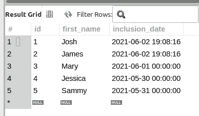
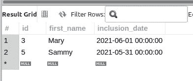
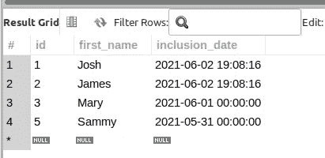
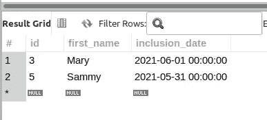
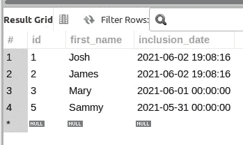

# 运算符查询之间的 MySQL 包含吗？

> 原文：<https://levelup.gitconnected.com/are-mysql-between-operator-queries-inclusive-3bd757c37f03>

没有什么比编程的实际经验更好的了。事实上，生活中几乎所有的事情都是通过经验获得的。

我最近在 LAMP stack web 应用程序中实现了一个特性，在使用`BETWEEN`操作符通过`DATETIME`列值过滤 MySQL 查询时遇到了*尖锐边缘*。

图片由 [OpenClipart-Vectors](https://pixabay.com/users/openclipart-vectors-30363/?utm_source=link-attribution&utm_medium=referral&utm_campaign=image&utm_content=159098) 来自 [Pixabay](https://pixabay.com/?utm_source=link-attribution&utm_medium=referral&utm_campaign=image&utm_content=159098)

我的印象是`BETWEEN`是包含性的，这意味着指定范围内的任何值，以及那些匹配高端和低端范围的值，也将包含在返回的结果集中。

`BETWEEN` *是*的包含。然而，正如我所发现的，当作为`BETWEEN`范围查询的一部分时，`DATETIME`列数据类型*的行为有点出乎意料*。或者至少这是我在这种情况下的经验。由于我的查询没有返回正确的预期行数，这促使我进一步调查并尝试了解原因。

**毕竟不正确的查询结果也不过如此；不正确的**。

我正在开发的 web 应用程序使用的是 MariaDB 10.2.38。然而，我在这篇文章中使用 MySQL 8 . 0 . 25 版的数据和例子。

## 模拟数据设置

出于演示目的，我将创建一个简单的表，有 3 列:

虽然我不一定需要`DATETIME`数据类型的时间部分，但是在列定义中使用它的好处是，当您希望当前日期时间作为列值时，可以使用`DEFAULT`关键字设置`DEFAULT`到`CURRENT_TIMESTAMP()`和`INSERT`行:

对于那些需要存储特定日期的实例，您也可以轻松地`INSERT`省略时间部分:

以下查询都是在 2021 年 6 月 2 日撰写本文时执行的，如`CURRENT_TIMESTAMP()`函数所示:

“练习名称”表中的数据如下所示:

来自“练习名称”表的所有数据。

## 使用 BETWEEN 按日期筛选行

如果我希望返回日期“2021–05–31”和“2021–06–02”之间(包括这两个日期)的所有行，此查询将完成此任务:

没有正确行数的查询结果。

等一下。

那些查询结果不正确。

日期值为“2021–06–02”的 2 行也应该包含在返回的结果集中。

怎么回事？

## 使用 CAST()函数进行类型转换

在进行了大量的*挠头*和一些*搜索*之后，我发现‘inclusion _ date’列可以被*类型转换*为`DATE`数据类型(回想一下，该列被创建为`DATETIME`数据类型)以便查询返回正确的行数。

如下面修改后的查询所示，在`WHERE`子句中使用`CAST()`函数返回正确的行数:

返回正确行的查询结果

当*使用`CAST()`将`DATETIME` 列类型转换*为`DATE`列时，为什么这个查询会工作？

让我们看看能否通过更多的后续问题来回答这个问题…

我可以向你保证一件事。如果你给我买杯咖啡，我会喝的！！！

## 包括查询之间的时间部分。

根据“practice_names”表中的数据，值为`id`1 和 2 的行的时间部分为`19:08:16`。回想一下，这 2 行是用`DEFAULT` ( `CURRENT_TIMESTAMP()`)列值插入的。

我将在不使用`CAST()`的情况下执行一个查询，并在*上端*值中包含一个时间部分:

在查询中包含时间部分…

没有变化。

现在，包括一个时间部分直到午夜怎么样？

包括几乎午夜之前的一段时间…

该查询返回正确的行数。

*我感觉*通过包含`23:59:59`的时间部分值，返回带有`id`的 1 和 2 的行，因为它们的`19:08:16`的时间部分在`BETWEEN`的指定下限和上限之间。

包含时间部分值可能不是一个实用的解决方案，因为您需要第一手了解每个`DATETIME`列的时间部分值，除非时间部分是您特定业务需求的组成部分。对我来说，时间部分不太重要(或者我是这么认为的！).

## 其他信息资源

*   [有关更多信息](https://dev.mysql.com/doc/refman/8.0/en/datetime.html)，请访问关于日期、日期时间和时间戳数据类型的在线 MySQL 文档。(非现场链接)
*   [MySQL 在运营商之间](https://dev.mysql.com/doc/refman/8.0/en/comparison-operators.html#operator_between)(异地链接)
*   [MySQL CAST()函数](https://dev.mysql.com/doc/refman/8.0/en/cast-functions.html#function_cast)(异地链接)

我希望，如果你在使用`BETWEEN`的`DATE`或`DATETIME`列查询中面临同样的*不一致*，你可以更容易地*对*进行故障排除，因为你已经阅读了这篇文章，并且理解了解决这种类型查询的一种方法。

## 进一步阅读

请务必访问以下任何类似内容的博客帖子:

*   [MySQL 搜索案例表达式—附示例](/mysql-searched-case-expression-with-examples-6d5f3bcf2c81)
*   [MySQL 统计工作日出现次数](/mysql-count-weekday-occurrences-5241511dba8c)
*   [使用 CodeIgniter 的查询构建器进行 MySQL 聚合查询](https://joshuaotwell.com/mysql-aggregate-query-using-codeigniters-query-builder/)(非现场链接)

喜欢的内容，你在这个帖子里看过？那么你肯定会喜欢我博客上的博文，[数字猫头鹰的散文](http://joshuaotwell.com/)(站外链接)。

在那里你会找到关于 SQL 数据库开发/编程和 LAMP stack web 开发的博文。

我最近开始每周发一封电子邮件，分享我感兴趣的、我正在学习的或我已经写过的所有 SQL/PHP 内容。如果你对此感兴趣，[在这里注册](https://hustling-speaker-4067.ck.page/1b35a06295)。