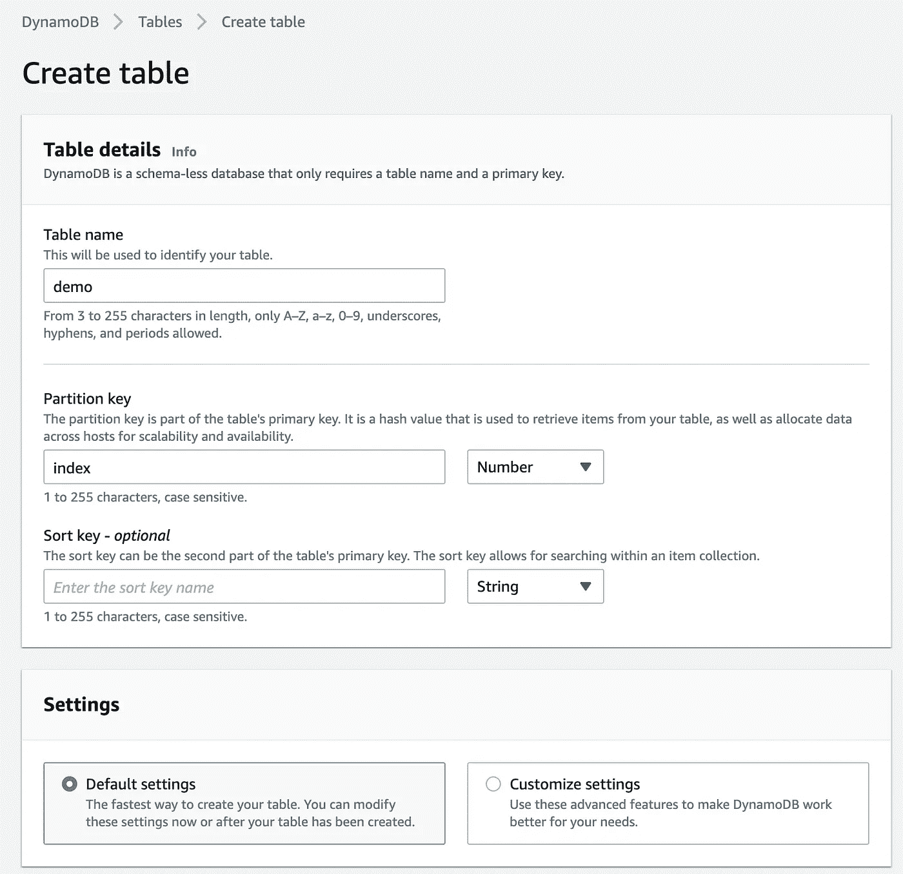
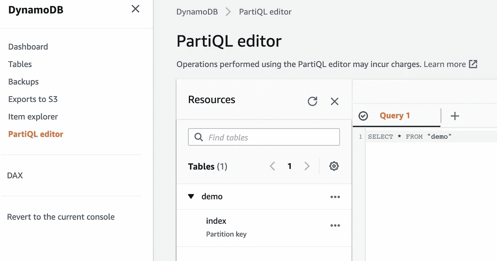
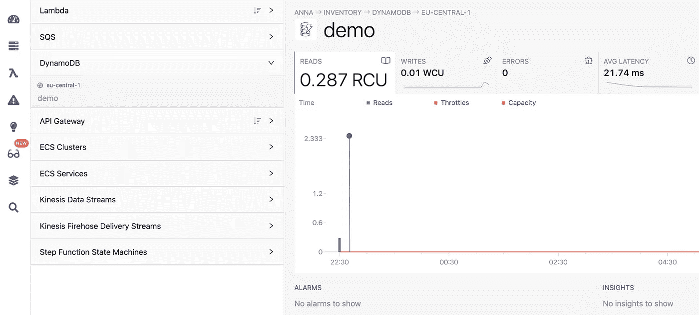
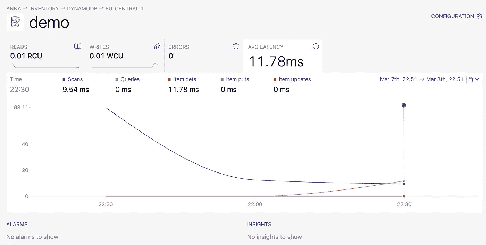

# NoSQL 数据库与数据工程相关吗？

> 原文：<https://levelup.gitconnected.com/are-nosql-databases-relevant-for-data-engineering-e631abe473f5>

## SQL 很棒，但有时您可能需要其他东西

照片由来自 [Pexels](https://www.pexels.com/photo/aerial-view-of-city-buildings-424184/?utm_content=attributionCopyText&utm_medium=referral&utm_source=pexels) | [品牌内容披露](https://www.annageller.com/disclosure)的 [Patricia Lazaro](https://www.pexels.com/@patricialazaro?utm_content=attributionCopyText&utm_medium=referral&utm_source=pexels) 拍摄

总的来说，数据工程师经常处理的数据类型是关系型的。数据仓库中的表，OLTP 数据库中的事务性数据—它们都可以使用 SQL 进行查询和访问。但是这是否意味着 NoSQL 与数据工程无关呢？在本文中，我们将研究数据工程师可能需要与 NoSQL 数据存储交互的用例。

# NoSQL 背后的原因

如今，数据存储的速度、容量和多样性让许多关系数据库系统无法跟上。从历史上看，这是大型科技公司开发自己的 NoSQL 解决方案来缓解这些问题的主要原因。2006 年，谷歌发布了他们的 **Bigtable** 论文，为开源的 **HBase** NoSQL 数据存储和 GCP 的**云 Bigtable** 奠定了基础。2007 年，亚马逊用迪纳摩纸提供了他们的替代解决方案。

从那时起，其他 NoSQL 分布式数据库系统不断涌现。他们都主要试图缓解规模问题( ***数据*** ***卷*** )，这是传统的垂直可扩展 RDBMS 难以实现的。他们不是纵向扩展(*为您的单个服务器*购买更多 RAM 和 CPU)，而是在横向可扩展的分布式集群上运行，允许他们通过简单地向集群添加更多节点来增加容量。

除了可伸缩性和处理庞大的数据量之外，许多分布式 NoSQL 数据库系统还处理来自许多不同格式的数据的挑战，这些格式在关系数据库中很难实现。在我的职业生涯中，当人们试图将非关系数据序列化和 blob 化到关系数据库时，我看到了许多创造性的解决方案。不过，这种自建系统往往难以大规模运营和管理。带有读取模式的文档数据库在这方面有更大的灵活性，比如 MongoDB。

最后，随着数据速度的不断提高，许多 NoSQL 数据库帮助解决了这个问题。例如， [Amazon Timestream](https://towardsdatascience.com/amazon-timestream-is-finally-released-is-it-worth-your-time-e6b7eff10867) 以非常直观和简单的方式处理来自各种物联网设备的数据流。

# 作为一名数据工程师，我为什么需要了解 NoSQL 数据商店？

数据工程师的职责之一是**整合**和**整合来自各种来源的**数据，并一致可靠地提供给数据消费者，以便这些数据可用于分析和构建数据产品。这意味着建立数据管道**从**(其中*)**NoSQL 数据库**中提取数据，并将其存储在数据湖或数据仓库中。由于上述数据**的多样性**，数据湖对于存储来自 NoSQL 数据存储的数据特别有用。*

# *数据工程的 NoSQL 用例*

*现在我们知道了为什么 NoSQL 对数据工程很重要，让我们看看我们可能遇到的典型用例。*

## *1.日志流分析*

*如今，许多应用程序正在向 Elasticsearch 发送日志，并且可以使用 Kibana 进行分析和可视化。得益于动态模式和索引，Elaticsearch 是数据工程工具箱中一个方便的 NoSQL 数据存储，尤其适用于容器监控、识别操作问题和日志分析。*

## *2.从物联网设备和实时应用中提取时序数据*

*关系数据库系统通常不打算同时与数千个打开的连接一起使用。想象一下，您管理着一大群服务器或物联网设备，这些设备将 CPU 利用率等指标传输到一些集中式数据存储，以便这些信息可以用于实时仪表板(*显示系统健康状况*)和异常检测分析。如果您为此使用关系数据库，您可能会遇到连接问题(*导致一些数据丢失*)，因为 RDBMS 不是为成千上万的短期连接设计的。相比之下，NoSQL 分布式数据存储，如 AWS Timestream 可以轻松处理这一问题。*

## *3.从 NoSQL 后端系统提取数据*

*NoSQL 数据库被用作许多应用程序的后端数据存储，包括电子商务、内容管理平台(博客)、移动应用程序、网站、网络分析、点击流、购物车等等。一旦您建立了数据管道，将这些数据提取或流入您的数据湖或数据仓库，所有这些数据都可以用于分析。*

## ***4。为快速检索缓存数据***

*如果您曾经使用一些 BI 工具(如 Tableau)构建过仪表板，那么如果数据集相当大，您可能更喜欢使用摘录而不是实时数据。与关系数据库建立连接并等待它们处理和检索数据通常太慢，无法构建真正高性能的仪表板(应用过滤器时不会挂起的*)。出于这个目的，内存中的 NoSQL 数据存储，如 **Redis** 非常有用。如果您使用这些来**缓存您的仪表板需要的最近数据**，您可以确保没有延迟并提供良好的用户体验。**

# **演示:从 NoSQL 提取数据**

**让我们演示如何从 DynamoDB 中提取数据，dynamo db 是 AWS 上最受欢迎的(*无服务器* ) NoSQL 数据存储之一。我用分区键`index`创建了一个名为`demo`的表。这个指数相当于我的熊猫数据框架的指数。**

****

**使用默认设置创建 DynamoDB 表-作者图片**

**现在我们可以使用`boto3`和`awswrangler`的组合来加载一个样本数据集。然后，从第 34 行开始，我们构建一个简单的 ETL 来检索从昨天开始插入的数据。**

**此外，我们可以使用管理控制台中的 PartiQL 查询编辑器来验证我们的 ETL 是否返回了正确的数据。**

****

**DynamoDB PartiQL 查询编辑器—作者图片**

# **如何关注你的 DynamoDB 资源？**

**为了监视我们的表所使用的读写容量单位，利用一个可观察性平台会很有帮助，它可以为您提供关于基础设施和应用程序健康状况的更多细节。使用 [Dashbird](https://dashbird.io/) ，您可以跟踪:**

*   **读取或写入数据时发生的任何**错误**，**
*   **您的读写操作的平均**延迟**，**
*   **是否为快速[时间点恢复](https://dashbird.io/blog/10-ways-protect-mission-critical-database/)启用连续**备份**，**
*   **以及您的资源消耗了多少**读取(RCU)和写入容量单位(WCU)** 。**

****

**[Dashbird](https://dashbird.io/) 中的“演示”DynamoDB 表—图片由作者提供**

****

**使用 [Dashbird](https://dashbird.io/) 观察到的读写操作的平均延迟—图片由作者提供**

# **NoSQL 数据库的缺点**

**前面的部分展示了 NoSQL 数据存储在数据工程中大放异彩的用例。但是现在到了弊端。**

**NoSQL 数据存储的主要缺点是没有一个成熟的 SQL 接口，开发人员需要学习一些专有词汇、API 或接口来访问数据。时标 DB 在他们的博客上说得很好:**

> **“SQL 又回来了。不仅仅是因为编写粘合代码来组装 NoSQL 工具很烦人。不仅仅是因为重新培训劳动力学习各种新语言很难。不仅仅是因为标准是一件好事。还因为这个世界充满了数据。[……]要么我们可以生活在一个脆弱的系统和一百万个界面的世界里。或者我们可以继续拥抱 SQL。”— [来源](https://blog.timescale.com/blog/why-sql-beating-nosql-what-this-means-for-future-of-data-time-series-database-348b777b847a/)**

**尽管许多 NoSQL 数据存储在顶层提供了 SQL 接口，但它们永远不会像成熟的关系数据库那样强大，在关系数据库中可以创建复杂的查询(*并不是说复杂的查询总是一件好事*)。**

**因此，纯粹从数据工程的角度来看，最好是与那些 NoSQL 系统合作，而不是与之对抗。当有一个用例清楚地证明 NoSQL 的规模和灵活性来自于读取模式时，使用它们。**

**如果数据的格式不适合存储在数据仓库中，我们总是可以提取它，将其存储在数据湖中( *ELT-approach* )，然后**以其原始格式**提供给分析人员。如今，许多工具允许我们理解存储在数据湖中的数据。当利用 Presto ( *或 AWS 版本:Amazon Athena* )或 BigQuery 等无服务器 SQL 查询引擎时，甚至可以分析半结构化的嵌套数据。**

# **结论**

**回答题目中的问题:是的，NoSQL 数据存储对数据工程很重要。尽管它们通常缺乏友好的类似 SQL 的接口来检索您需要的信息，但在各种用例中仍然非常有用。考虑到越来越多的供应商意识到需要一个 SQL 接口来进行数据检索(例如 AWS 的 PartiQL、the“good old”Hive、Spark SQL、Cassandra 的 CQL、Timestream 的 SQL 查询等)，我们应该预计这一趋势将会继续。有一天，我们可能能够编写 SQL 查询来以同样的方式检索数据，而不用考虑后台的数据存储。事实上，如果我们用 Presto 来看联邦查询，这个未来可能并不遥远。**

****感谢您的阅读！如果这篇文章有用，请关注我的******来看我的下一篇文章。******