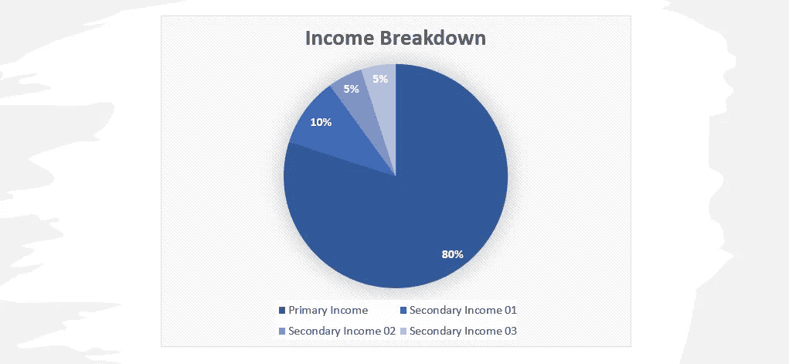

# 副业真的值得努力吗？

> 原文：<https://levelup.gitconnected.com/are-side-hustles-really-worth-the-effort-45d0d902aee6>

图片由[视觉故事||米歇尔](https://unsplash.com/@micheile?utm_source=unsplash&utm_medium=referral&utm_content=creditCopyText)在 [Unsplash](https://unsplash.com/?utm_source=unsplash&utm_medium=referral&utm_content=creditCopyText)

几年前，我开始考虑我的第二收入来源。在我的计划阶段，我读了很多关于各种选择的书，也研究了每一个方面好的、坏的和丑陋的一面。经过多次尝试，我现在对在当今竞争激烈的环境中什么行得通，什么行不通有了很好的认识。这篇文章是我回馈社区的方式，分享我在旅途中学到的东西。

# 为什么需要二次收入？

这个问题对不同的人有不同的意义。例如，对于一个企业家来说，这意味着启动另一个收入来源作为一个新的企业，通常这是对他们现有业务的补充。对于一个工薪阶层，这意味着渠道，可以为他们产生额外的现金，最好是每月一次。也有很多人希望把第二收入作为他们被动收入的来源，他们可以想象财务自由。我介于第二种和第三种类型的人之间。

在我看来，第二收入是探索你日常工作之外的领域的一个很好的方式。比如我热爱建筑设计。在我的空闲时间，我作为自由职业者工作，为我的客户提供 3D 模型和渲染。作为回报，我获得了巨大的满足感，同时也获得了金钱。

# 真正能赚多少钱？

如果你的日常工作是每月挣 10K，有一天你想离开你的工作，专注于其他收入渠道，那么这篇文章可能不会给你正确的描述。残酷的现实是，需要付出很多努力和毅力才能看到结果。超过 95%开始这一旅程的人在看到任何结果之前就离开了。

话虽如此，设立一些能产生你月收入 20%的收入流，是比较现实的事情。这通常适用于那些想继续全职工作，同时在第二收入流中投入一些时间的人。

# 如何挑选收入流？

在谷歌上简单搜索一下“被动收入”或“第二收入来源”，你会看到无限可能。有人可能会问，我该选什么？

更多的时候，我看到人们开始从事一种非常普通的收入流，只是意识到他们无法跟上需求的步伐。他们迟早会失去兴奋感，最终成为 95%人口的一部分。

在考虑选择之前，我建议你首先做好真正了解自己的功课。例如，我喜欢计算机编程、云计算、写作和翻译、校对、建立电子商务网站、3D 建模和渲染以及摄影(多种多样，不是吗？).这些都是我擅长的技能或者是我能与之共事的东西。

一旦你知道你拥有什么样的技能，排除掉任何让你不感兴趣的东西。现在你可以通过一次掌握一项技能来研究收入流。

例如，在我的电子商务网站中，一些收入流是:

*   作为一名自由职业者为客户建立网站，
*   创建我可以在市场上直接销售的网络模板(也是被动收入的好方法)，
*   为在这一领域开展业务的公司兼职，
*   自由职业者支持和维护现有客户的每小时的基础上。

一旦你没有了自己的想法，就开始搜索仍然专注于相同技能的东西。

虔诚地做这个练习会给你一个很好的草稿。就我而言，我想出了 13 个我喜欢的、看起来合理的潜在收入来源。

下一步就是按照最不感兴趣/可行性的顺序一个个划掉。你的目标应该是击中除了三个以外的所有东西。如果你刚开始，你不能在两个或三个以上的流上工作。

这三个流背后的意图是实现你每月收入的 20%来自二手来源。在一个典型的场景中，你的收入图表看起来是这样的:

样本——收入明细

# 潜在收入来源

有很多选择可以帮助你产生第二收入。下面是一些我个人有经验的。在我们详细讨论之前，有一个建议:不管你选择什么，开始赚钱都需要时间。不放弃的人是真正成功的人。我知道这是显而易见的，但我怎么强调都不为过。

***写作内容***

这是一个广泛的类别，你可以为学术界、博客、文章等写作。这能为你带来一些现金。例如，在 medium.com 写作会给你带来实实在在的金钱奖励。这个想法是确定你的利基，并寻找途径。例如，我的一个朋友擅长为学术界写参考资料，所以她在 Fiver/Freelancers 等网站上开始并找到了许多这样的自由职业工作。一个建议是，如果你正在写作，那就写得非常棒。质量比数量重要得多。

***为电子商务网站写作***

在当今世界，一切都在网上，这是一件好事。这也意味着对能写产品描述、评论、操作指南等的人有巨大的需求。这种类型工作的好处是，一个单位的工作可以很容易地在一天内完成，因此支出更频繁。

***数码产品***

如果你对写作有热情，创作你自己的书是一个惊人的想法。随着亚马逊 Kindle 采用自助出版，让你的书在全球范围内销售变得非常容易。这是被动收入来源的常见工具。

***视频***

YouTube，当然这是当今世界最好的收入来源之一。但是，只有当你的内容质量是一流的，并且你在填补空白时，它才会起作用。重复的内容对你没有帮助。此外，从 YouTube 获得有意义的收入是一个漫长的过程，你真的需要付出认真的努力才能拿回一分钱。

***投资股市***

这是迄今为止最常用的二次收入流模式。如果做得好，你可以赚很多钱。当然，这只有在你有风险偏好，了解金融界的情况下才能做到。股票、共同基金、ETF、SIPs 等。是增加财富的有效方法。

***网络课程***

如果你有一项技能可以与人分享，你可以考虑创建自己的课程。有了高质量的内容和视频编辑，你可以在 Udemy、SkillShare 等网站上出售你的课程。为了体面的被动收入。如果你做得好，如果你的内容填补了一个空白，它会为你创造奇迹。

***培训环节***

与上面类似，有许多公司按小时付费给你，让你为他们的客户进行培训。通常，这些培训是在线的，你可以在家里舒适地进行。我认识的几乎所有参加培训的人都是复读生。他们一直在为不同的客户群进行同样的培训，每次都带来越来越少的麻烦，同时赚取越来越多的额外收入。如果做得好，这可以产生高达 20%的月收入。(当然，条件适用:-))

# 最后

从小处着手，坚持不懈，永不放弃。关注大局。从你所知道的开始，然后从那一点开始成长。

我想让你明白的最重要的一点是，达到 20%的收入目标是完全可能的，只要你计划并努力让它成为现实。

没有比今天更好的时间开始实现你的目标了。

# 谢谢

感谢阅读这篇文章。我真诚地希望它能给你一些提示，让你思考你的目标。

请在下面发表评论，分享你的观点。快乐学习。

# 顺便说一下，👏🏻*鼓掌*👏🏻多次，如果你喜欢这个职位。它鼓励我继续写作，并帮助其他人找到它:)

 [## 用我的推荐链接加入 Medium 就是那个人

### 作为一个媒体会员，你的会员费的一部分会给你阅读的作家，你可以完全接触到每一个故事…

medium.com](https://medium.com/@thatstheguy/membership) 

# 万事如意！！！