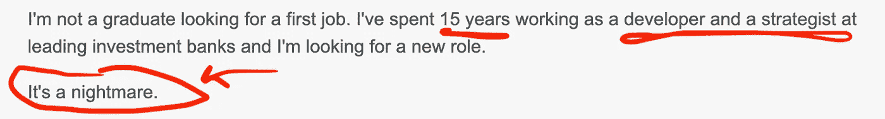
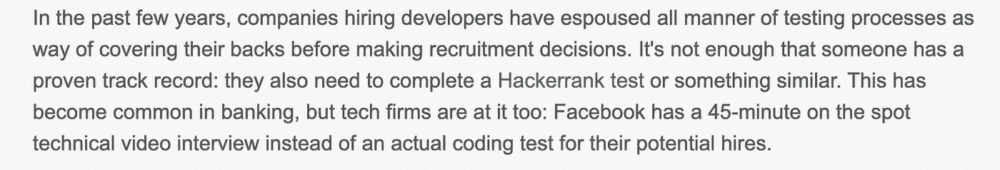
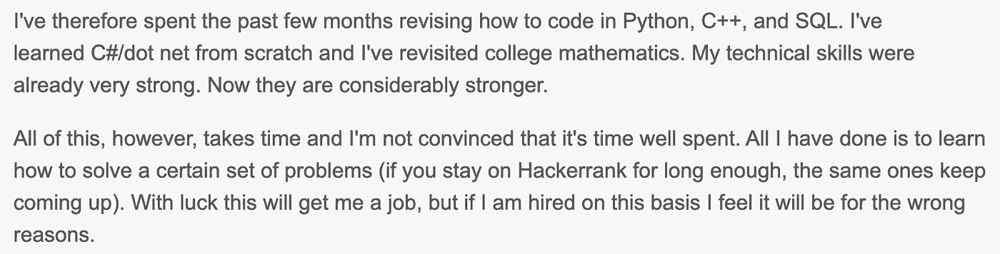
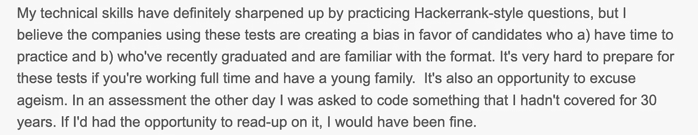
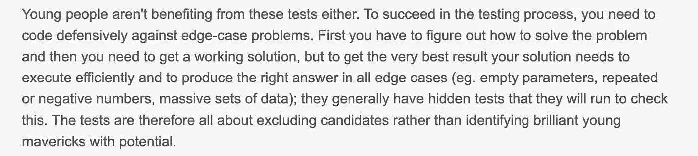
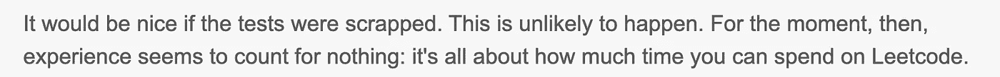

# 技术面试有那么烂吗？

> 原文：<https://levelup.gitconnected.com/are-tech-interviews-that-broken-bb464964e0cb>

这位经验丰富的开发人员/技术面试者不得不重新学习编码才能找到新工作。

照片由 e [ngin akyurt](https://unsplash.com/@enginakyurt?utm_source=medium&utm_medium=referral) 在 [Unsplash](https://unsplash.com?utm_source=medium&utm_medium=referral)

前几天，我看到了一篇非常有趣的*(但令人不安)*文章，这让我不禁思考，“求职过程真的中断了吗？”然而，我从来没有听到任何人谈到这个问题。这就是为什么，我想与你和我们技术社区的更多人分享这篇文章*(带着我的一点智慧)*，提出问题并收集人们对它的意见。

所以，事不宜迟，让我们看看这里的交易是什么。

所以当我第一次读这篇文章的时候，我心想，把找工作的过程称为**噩梦**可能有点太夸张了。当然，我们还不知道整个故事，所以让我们了解一下。

众所周知，他对在线技术测试的看法是正确的，因为它在今天如此普遍，我们有如此多的平台可以做同样的事情。HackerRank 是最受欢迎的一个，然后是 HackerEarth 等等。除此之外，还有无数的其他在线平台可以用来练习这些编码测试，举几个例子，LeetCode，GeeksForGeeks，CodeChef 等等。

现在，关于另一部分，我不知道这个人在过去 10 年左右的时间里去了哪里，但即使是中小型科技公司*(此外，科技巨头，如谷歌、亚马逊、苹果……)*现在已经进行这些编码测试和密集的技术访谈很久了。此外，这不仅适用于有经验的专业人士，也适用于应届毕业生。

> 给你一个真实的例子，我的一个朋友在 2019 年通过了 6 轮面试后进入了亚马逊！对，不是错别字！6!如果你认为这很疯狂，那就等着锦上添花吧！在他的最后一轮面试中，他被邀请到亚马逊在加拿大的一个地点进行持续六个小时的现场面试。是的，他被要求连续编码六个小时，然后解释他的解决方案，最后优化他以前的解决方案。

首先，称赞这个人进一步磨练了他的技术技能。其次，我有点同意他提出的另一点。我相信，只有少数公司明白，创建强大的算法，并不断改进代码以达到最佳解决方案，并不是区分优秀开发人员的唯一特征。从个人经验来说，大多数时候，一旦你真的得到了工作，你甚至不会用你学到的东西去破解编码面试。

很明显，这个人正在走出他的舒适区*(对他大声喊)*，试图学习新技术来转换工作，而他自己已经是一名面试官了！我非常喜欢他的观点。我认为，考虑到这个人过去曾做过面试官，他明白不同的人可以有不同的风格来处理相同的问题，如果你创建了一个系统并期望人们遵循这个特定的框架。你很有可能会失去一些敢于打破常规思考的人。

现在，作为一名刚毕业的学生，我知道*点“b ”,那些刚毕业并熟悉格式的学生“*”并不完全正确！破解这些考试的技巧和窍门不是你每天在学校学到的东西，我们的学校更侧重于传授理论知识，因此，为了准备这种考试，即使是最近的毕业生，比如我自己，也倾向于这些网络平台。虽然这需要花费很多时间和精力，但好的一面是当你是一名刚毕业的学生，你人生的全部目标就是找一份工作，那么时间就是你拥有的丰富资源，所以是的，我可以把这个给他，这是一个加分。总的来说，即使对一个刚毕业的学生来说，我认为这些面试过程需要做很多工作。

然而，我只能想象这个人在这段时间保持工作和生活的平衡有多难，我的意思是和孩子，一个家庭。最重要的是，在专注于当前工作的同时，他仍然愿意花时间为新工作学习新概念。我尊重他的勇气和进取心。

现在，我完全可以理解这一部分，但这真的很有趣，他是如何描述这种情况的。这听起来很痛苦，就像有人在追捕你，让你反复看*暮光之城*，直到你的眼睛流血(抱歉过度夸张)。这里的重点是，我实际上最近经历了这些测试，它们可能相当有压力。我知道你们大多数人已经经历过同样的情况，它给你带来的压力可能会很大！

可悲的是，这就是他的情况。总而言之，我喜欢这篇文章。我认为提出了一些非常好的观点，也强调了一些严峻的现实。然而，说实话，我不喜欢最后这个人希望这些测试被完全废除。如果这个系统不正确，我们应该对它进行修改，而不是完全抛弃它(至少在我看来是这样)。

因此，我首先想到的一个建议是，可以改变问题类型，引入更多基于智商的问题，这样受访者就不必花更多时间学习他们可能永远不会使用的新概念。

在我看来，总有改进的余地，但你怎么看？请在下面的评论区告诉我你的想法。让我知道你是否同意目前的面试模式，或者你有什么想改变的想法？感谢阅读。

参考资料:

1.  [https://www . e financial careers . co . uk/news/2020/12/coding-interests-hacker rank-nightman](https://www.efinancialcareers.co.uk/news/2020/12/coding-interviews-hackerrank-nightmare)

*最初发表于*[T5【https://www.theimmigrantprogrammers.com】](https://www.theimmigrantprogrammers.com/p/are-tech-interviews-that-broken)*。*