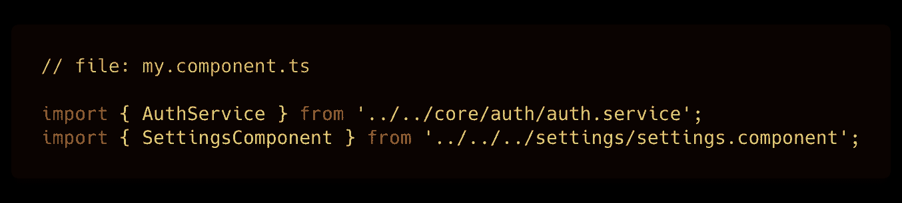
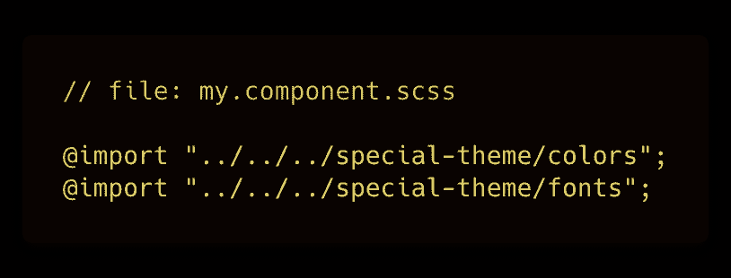
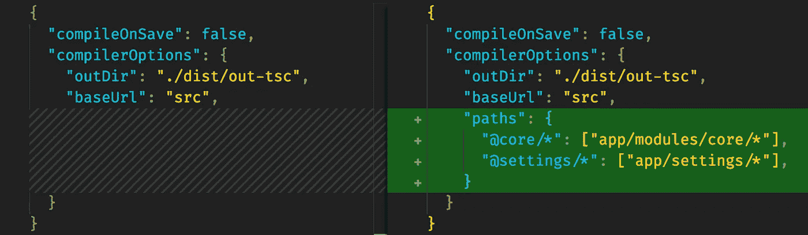
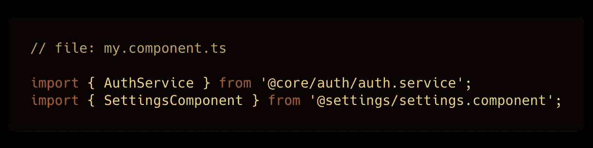
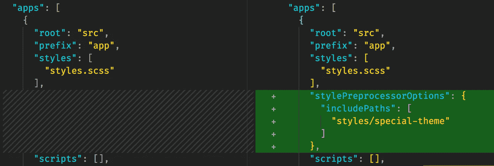
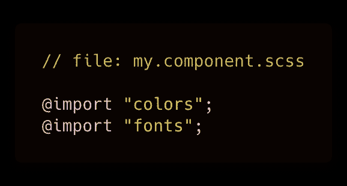

# "../../../are-we/there/yet”——或者如何改进 TypeScript & Sass 导入

> 原文：<https://levelup.gitconnected.com/are-we-there-yet-or-how-to-improve-typescript-sass-imports-bce09ecea164>

## 为你的 Angular 应用程序提供两个简单的配置选项来减轻嵌套路径的困扰。

# 问题是

如果您曾经开发过稍微大一点的 Angular 应用程序，您可能很清楚需要遍历目录结构来查找需要包含在 TypeScript 中的文件的问题。通常看起来是这样的:

看起来不太好，也不太适合重构或移动东西。

当导入 **scss** 时，可能会更烦人，因为这是您可能会在组件的样式表中经常做的事情。更糟糕的是，ide 中通常不支持自动导入…

# 解决方案

## TypeScript 导入

进入你的`**tsconfig.json**`文件。在`compilerOptions`部分添加一个`paths`设置。它将是一个对象，它的键是路径别名，您将能够在您的代码中使用，值是别名将被解析到的路径的数组。

更改应该是这样的:*(为了简洁起见，已经删除了大部分不相关的代码)*

只需将“路径”设置添加到您的“tsconfig.json”中

您可以随意命名您的别名，但如果您需要一些建议:

*   名字以`@`开头似乎是惯例
*   这也有助于限制与您可能在同一个项目中使用的一些 npm 库的名称冲突的危险
*   由于这种危险，有些人喜欢在所有路径前面加上前缀，使路径更加具体，例如`@abc/core/*`、`@abc/settings/*`等。

有什么效果？让我们来看改变后的第一个例子:

这可能看起来不太像，但请记住，这些导入现在在您的代码库中保持不变，无论您决定移动您的`my.component.ts`文件，还是这个“auth”和“settings”代码(在后一种情况下，您显然只需要更新`tsconfig.json`)。

这将如何与您的代码编辑器一起工作？当考虑目前最流行的 Angular 开发人员的 ide 时，Visual Studio 代码可以流利地使用 TypeScript，而且不费吹灰之力，Webstorm 在我编辑了`tsconfig.json`之后就做出了回应。当我回到我的打字稿文件时，它甚至建议我可以将我的“*导入缩短为*”干得好，伊德斯！

## **Sass/Less/Stylus 导入**

顺便说一下，TypeScript 解决方案并不特定于 Angular——您也可以在其他设置中使用它。另一方面，Sass(或任何其他 cli 支持的预处理器)解决方案将涉及添加 Angular CLI 的配置。没有 CLI，你仍然可以直接用 webpack 做类似的事情(你用 webpack 做了哪些*不能*做的事情？)，但我们现在不关注那个。

让我们进入`.angular-cli.json`(或`angular-cli.json`——您知道吗，您实际上可以更改文件名并省略第一个点，这样文件就不会那么“隐藏”了🤓)并查看更改:

“style preprocessor options . include paths”——非常具有描述性

经过这一简单的更改，我们的 Sass 代码现在将如下所示:

IDEs 呢？我无法让 Visual Studio 代码理解这一点，但至少它不会对我大喊无法识别的路径。WebStorm 需要一些鼓励:当我右击“included”目录(来自我的例子中的`styles/special-theme`)并选择:
“*将目录标记为* *资源根*”时，它就更新了。

# 实际应用

您可能已经有了一些想法，知道在哪里可以使用这些配置。尽管如此，这里还是有一些常用的场景:

*   我通常将我的 TypeScript 接口分成几个文件，我称之为“模型”你可以想象，它们是一个应用程序中最重要的导入文件之一，所以毫无疑问，我不得不经常这样做:
    `import { TileType } from '@models/tile.models'`
*   如果你用 Ngrx 工作，你也可以让你的动作和 reducers 更易访问:`import { Search, Add } from '@actions/tiles'`等。
*   对于我的风格，我通常至少把我的颜色保存在`src/styles/`目录下的一个单独的文件中。有了这一点点配置，我就可以从目录结构中的任何地方开始。

原来如此。这可能不会让你的开发人员的生活发生翻天覆地的变化，但是希望它能让你在日常的代码工作中获得稍微好一点的体验。祝你好运！

你学到新东西了吗？如果有，可以:
→鼓掌👏按钮 below️这样更多的人可以看到这个 **→** [**在 Twitter 上关注我**(@ sulco)](https://twitter.com/sulco)这样你就不会错过以后的帖子了！

