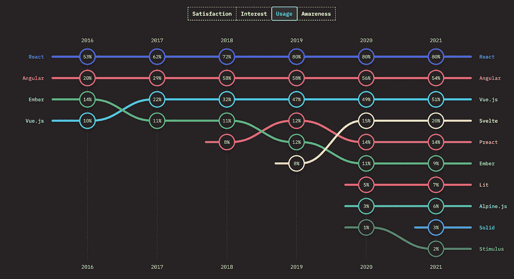
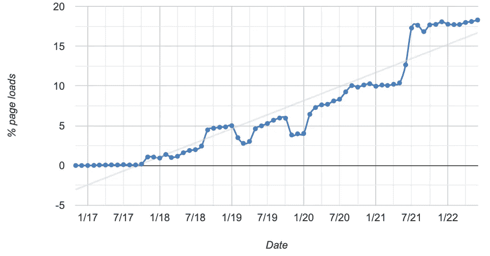

# Web 组件死了吗？

> 原文：<https://levelup.gitconnected.com/are-web-components-dead-12e404e0f4b0>


照片由来自 Pexels 的克里斯·J·米切尔拍摄

R 最近，我发表了一篇关于类似主题的不同问题的文章:[Web 组件会取代前端框架吗？我们大多数人会说**不**。但是对于更有争议的问题，即 **Web 组件**到底有没有未来，你的答案是什么？](https://medium.com/@mariusbongarts11/will-web-components-replace-frontend-frameworks-535891d779ba)

让我们放大并探究为什么有些人说 web 组件已经死亡，而另一些人认为它们是 Web 开发的未来。

# 介绍

2012 年，当 W3C 发布了 Web 组件的第一个规范[时，许多人预计 Web 组件将彻底改变前端开发。我们有充分的理由保持乐观。Web 组件承诺了许多非凡的事情:](https://www.w3.org/TR/2012/WD-components-intro-20120522/#decorators-vs-custom-elements)

*   具有普通 HTML、CSS 和 Javascript 的可重用组件
*   基于**官方网络标准**
*   **不需要框架**
*   在**所有 evergreen 浏览器中支持**

但是，在没有任何框架的情况下，基于官方 web 标准创建可重用的独立 HTML 组件的想法听起来好得难以置信。尽管有很好的优势，Web 组件仍然很难在整个行业得到采用。很多开发商说他们已经死了。

谁是对的？Web 组件的当前状态是什么？让我们详细地面对这些问题，并探索什么是 web 组件，在哪里可以找到它们，为什么开发人员不愿意使用它们，以及未来会如何。

[](https://web-highlights.com/) [## 网络亮点- PDF 和网络荧光笔

### Web Highlights 是一个在 Web 上突出显示文本的工具，可以更有效地组织您的研究。提升你的…

web-highlights.com](https://web-highlights.com/) 

# 什么是 Web 组件？

Web 组件是基于官方 web 标准的可重用客户端组件，受所有主流浏览器支持。它们是将**的**功能从我们剩余的代码中封装出来的绝佳方式。不仅如此，你还可以在每个网络应用程序和网页中重用它们。

他们的目的是编写在任何地方都可以使用的封装强大的定制元素。Web 组件使我们能够完全独立于前端框架进行开发。

> Web 组件的主要好处是我们可以在任何地方使用它们。有任何框架，甚至没有框架。——【vuejs.org 

***它们是如何工作的？***

下面是一个如何定义**自治 web 组件**的例子:

```
class MyWebComponent extends HTMLElement {...}window.customElements.define('my-web-component', MyWebComponent);
```

您可以将元素传递给任何 HTML 页面，如下所示:

`<my-web-component value="something"></my-web-component>`

有关 web 组件的更多详细信息，请查看我的其他文章:

[](https://medium.com/@mariusbongarts11/the-complete-web-component-guide-part-1-custom-elements-a627af805df8) [## 完整的 Web 组件指南:自定义元素

### 成为 Web 开发未来的专家(第 1 部分)

medium.com](https://medium.com/@mariusbongarts11/the-complete-web-component-guide-part-1-custom-elements-a627af805df8) [](https://javascript.plainenglish.io/showcase-your-medium-articles-with-web-components-part-1-basics-d2c6618e9482) [## 用 Web 组件构建自己的博客组合:基础

### 第 1 部分—定制元素、阴影 DOM 和 HTML 模板

javascript.plainenglish.io](https://javascript.plainenglish.io/showcase-your-medium-articles-with-web-components-part-1-basics-d2c6618e9482) 

# **在哪里可以找到 Web 组件？**

web 开发世界无疑被前端框架/库所统治，如 **React、Angular 和 vue . js。**



[Js 2021 的状态](https://2021.stateofjs.com/en-US/libraries/front-end-frameworks/)

2021 年 JavaScript 现状调查显示，80 %的受访者使用过 **React** ，其次是 **Angular** (54 %)和 **Vue.js** (51 %)。还有，**苗条**上升很快，用户越来越多。现在， **Web 组件**在这个排名中出现在哪里？Web 组件完全基于 web 标准，所以我们不希望在这里列出它们。尽管如此，还是有像 Lit 这样的库支持我们构建它们。毕竟至少有 7 %的受访者用过。

## **前端框架适应 Web 组件**

然而，这只是事实的一半。最常用的前端框架最近已经被大量采用。它们都支持构建官方的基于标准的 Web 组件。

让我们以 **Angular** 为例，它提供了`@angular/elements`包，使开发人员能够快速地将组件转换成 Web 组件。

> “角度元素是打包为定制元素的角度组件[…]”—[Angular . io](https://angular.io/guide/elements)

Angular Elements 是 Angular 框架的一个最小的独立版本。它作为服务注入，以支持组件的变更检测和数据绑定功能。如果你对 Angular Elements 如何详细工作感兴趣，这里有一个由 Rob Wormald 制作的有趣的 [Youtube 视频。](https://www.youtube.com/watch?v=Z1gLFPLVJjY&t=4s)

同样， **Vue.js** 支持通过`defineCustomElement`方法创建 Web 组件。

> *“Vue 支持使用完全相同的 Vue 组件 API 创建定制元素[…]”——*[*vuejs.org*](https://v3.vuejs.org/guide/web-components.html#passing-dom-properties)

让最流行和最常用的框架适应 Web 组件表明它们的创造者对 Web 组件的未来下了赌注。

[](https://medium.com/@mariusbongarts/react-vs-web-components-80d754f74811) [## React 与 Web 组件

### 将它们结合起来是成功的真正秘诀。

medium.com](https://medium.com/@mariusbongarts/react-vs-web-components-80d754f74811) 

## Web 组件的使用

正如我们所见，Web 组件比我们想象的更加普遍。然而，有时仍然使用框架来创建它们。但是，我们如何衡量 Web 组件的实际使用情况呢？一种方法是查看网站通过调用`customElements.define`注册至少一个 [**自定义元素**](https://medium.com/@mariusbongarts11/the-complete-web-component-guide-part-1-custom-elements-a627af805df8) 的频率。

提醒一下，下面是定义自定义元素的方法:

```
class MyWebComponent extends HTMLElement {...}window.customElements.define('my-web-component', MyWebComponent);
```

对于 Chrome，我们可以通过检查[chromestatus.com](https://chromestatus.com/metrics/feature/timeline/popularity/1689)上的 CustomElementRegistryDefine 功能使用情况来实现:



使用 CustomElementRegistryDefine 的页面加载百分比(Chrome)

你可以看到在所有网站的 **17 %** 左右，在 Chrome 浏览器中查看，至少注册了一个 [**自定义元素**](https://medium.com/@mariusbongarts11/the-complete-web-component-guide-part-1-custom-elements-a627af805df8) 。对我来说，Web 组件的急剧增长令人震惊。相比之下，根据[w3techs.com](https://w3techs.com/technologies/comparison/js-angularjs,js-react)的数据，所有网站中只有 **2.9 %** (状态:2022 年 6 月)使用 React。

看起来 Web 组件的使用率比我们大多数人预期的要高(至少，我是这么认为的)。但是，大公司呢？在查看职位描述时，大多数都要求至少有一个最常用的前端框架的经验——React、Angular 和 Vue.js。那么，有公司要求了解 Web 组件吗？有没有大公司认为 Web 组件是实现前端的最佳方式？

最著名的例子之一就是 **Github** 。当 Github 在十多年前推出时，它有一个主要使用 jQuery 的前端代码库。多年来，他们的 GitHub monolith 规模越来越大，他们发现有必要在前端变得难以管理之前实现更好的封装。他们选择使用 Web 组件，因为他们的代码库已经被结构化为类似组件的行为。此外，他们可以在现有的前端基础设施上试验 Web 组件，因为这不会产生任何前期成本或“买入”特定的框架。

> “我们在 GitHub 大量使用 Web 组件”——[GitHub . blog](https://github.blog/2021-05-04-how-we-use-web-components-at-github/)

但是，当使用 Web 组件导航到前端基础设施时，Github 也面临许多问题。对于 Web 组件的当前状态，所有开发人员都有一些共同的**痛点**。这引出了我们的下一个问题。

# 为什么开发者不愿意使用 web 组件？

正如开头提到的，有很多理由相信 Web 组件可以取代现代前端框架。现在，很多开发人员仍然不愿意使用 Web 组件。这是为什么呢？是因为他们觉得 Web 组件会淘汰前端框架的想法威胁到了他们吗？正如我在以前的文章中分析的那样，Web 组件会取代前端框架吗？’—没有理由放弃你的前端框架。恰恰相反，将前端框架与 Web 组件相结合才是成功的真正秘诀。

> *作为开发人员，您可以自由地在您的 Web 组件中使用 React，或者在 React 中使用 Web 组件，或者两者都使用。—* [*reactjs .或*](https://reactjs.org/docs/web-components.html) g

然而，不可回避的事实是，Web 组件还没有完全开发出来，面临着许多问题和痛点。

## **Web 组件的问题**

让我们看看 Web 组件在当前状态下面临的困难。以下是开发人员在工作中最常见的一些问题。

**阴影 DOM**

Web 组件的一个痛点是[影子 DOM](https://medium.com/@mariusbongarts11/the-complete-web-component-guide-shadow-dom-2e40921eb77) 。虽然完全封装组件的标记和样式的想法很好，但是仍然有许多挑战和未解决的问题。例如，如何将**全局样式**应用于带有影子根的 Web 组件？事实上，阴影 DOM 允许我们通过使用**阴影部分**和 **CSS 变量**在它们的根中修改样式。此外，有许多方法和变通办法来应用全局样式，但我还没有看到最终的解决方案。

[](https://medium.com/@mariusbongarts/the-complete-web-component-guide-shadow-dom-2e40921eb77) [## 完整的 Web 组件指南:影子 DOM

### 成为 Web 开发未来的专家(第 3 部分)

medium.com](https://medium.com/@mariusbongarts/the-complete-web-component-guide-shadow-dom-2e40921eb77) 

Github 在使用影子 DOM 时也面临问题，并且支持一个针对[声明性影子 DOM](https://github.com/whatwg/dom/issues/831)的开放 Github 提议。这可以解决开发人员在使用影子根时面临的一些常见问题。

> 这些提议将使工程师更容易发布 Web 组件，并将解决我们在 Web 组件的当前状态下遇到的一些常见的棘手问题。— [github.blog](https://github.blog/2021-05-04-how-we-use-web-components-at-github/)

但是，这个提议的主要动机是支持 Web 组件的服务器端呈现(SSR)。这就引出了下一个问题。

**服务器端渲染**

所有现代框架都提供了一种在服务器端呈现组件的方式。比如 Angular 提供**角度通用**，React a **ReactDOMServer** ，Vue.js 提供`renderToString`功能。

将 **SSR** 与 Web 组件结合使用实际上**很难**或**不可能**使用。Web 组件依赖于服务器上不可用的浏览器特定的 DOM APIs。至少在您使用像 Puppeteer 这样的无头浏览器来预渲染组件并向浏览器发送初始字符串之前不会。但是，即使在预渲染组件时，我们也不能使用影子 DOM，因为我们还不能声明性地表示它们。所以不可能用 HTML 的初始字符串发过去。简而言之:**要使用影子 DOM，我们需要 JavaScript** 。

幸运的是，像 Lit 或 Stencil 这样的库可以帮助我们构建 Web 组件。Stencil 已经提供了他们的 [**水合物 App-Bundle**](https://stenciljs.com/docs/hydrate-app) 来完成 SSR，并且[](https://medium.com/@mariusbongarts/build-your-own-blog-portfolio-with-web-components-lit-library-2701dffc735f)**也正在为服务器端渲染制作一个`@lit-lab/ssr`包。**

****无障碍****

**使用 Web 组件时，我们需要记住的另一个问题是可访问性。**可访问性**旨在为每个人提供一个普遍可访问的全球信息系统。这样，我们可以确保残障人士可以使用所有网站工具和技术。**

**[](https://medium.com/@mariusbongarts/4-simple-steps-to-make-your-website-accessible-a29ec305da1e) [## 让你的网站易于访问的 4 个简单步骤

### “网络的力量在于它的普遍性。无论是否残疾，每个人都能获得是一个重要方面。”—…

medium.com](https://medium.com/@mariusbongarts/4-simple-steps-to-make-your-website-accessible-a29ec305da1e) 

这个问题还可以追溯到 [**暗影 DOM**](https://medium.com/@mariusbongarts/the-complete-web-component-guide-shadow-dom-2e40921eb77) 。通常，您创建 DOM 节点并将它们作为另一个元素的子元素追加。使用 Shadow DOM，您可以创建一个作用域 DOM 树，它附加到元素上，但与其实际的子元素分开。这个限定了作用域的子树被称为**影子树**，本质上是一个独立的文档。拥有一个新文档意味着如果在影子 DOM 中设置了一个 id，那么它在定制元素中必须是惟一的。

> Web 组件被迫使用 ARIA 来声明它们的默认语义。— [wicg.github.io](https://wicg.github.io/aom/explainer.html)

希望您知道，通过使用正确的[语义元素](https://javascript.plainenglish.io/stop-using-divs-for-buttons-87a0b3d7945e)，您可以直接为像**按钮**或**表单**这样的元素提供内置的可访问性特性。不幸的是，在创建定制元素时，我们必须自己添加所有这些属性来提供相同的可访问性特性。理想情况下，定制元素应该像本地元素一样具有默认的隐式语义。幸运的是，有一个 [**可访问性对象模型(AOM)**](https://wicg.github.io/aom/explainer.html) 的提议，旨在使用`ElementInternals`来包含这个。

> **可访问性对象模型**项目旨在改善用户和开发者在网页和辅助技术交互方面的体验。— [wicg.github.io](https://wicg.github.io/aom/spec/)

目前，我们被迫在我们的 Web 组件中使用所谓的 **ARIA 属性**来表达对于本地元素来说是隐含的语义。例如，如果我们像这样在元素上使用`selected`属性:

`<custom-option selected></custom-option>`

我们还需要给它添加一个 **ARIA** **属性**，以提供内置的辅助功能:

`<custom-option selected aria-selected="true"></custom-option>`

**AOM** 现在建议使用`ElementInternals`来设置默认语义，以避免需要额外的属性，并且避免在开发人员忘记添加 **ARIA 属性**时丢失其语义。

使用`ElementInternals`会是这样的:

```
**class** CustomOption **extends** HTMLElement {
  **constructor**() {
    **super**();
    **this**._internals **=** customElements.createInternals(**this**);
  }
  // ...}
```

毕竟，我们可以说为我们的 Web 组件提供可访问性是可能的。但是，目前它仍然需要一些额外的努力。** 

# **未来会怎样？**

**事实上，所有现代前端框架都依赖于 Web 组件，这表明它们的创建者正在用它们进行长期规划。但是，正如我们所看到的，目前，使用 Web 组件仍然会遇到一些不小的问题。这就是为什么大多数决定走 Web 组件路线的公司使用库来使他们的生活更容易。比如 Github 就在用 [**催化剂**](https://github.com/github/catalyst) 。就我个人而言，我喜欢使用 Catalyst 从中获得灵感的 [**Lit**](https://medium.com/@mariusbongarts/build-your-own-blog-portfolio-with-web-components-lit-library-2701dffc735f) 库。**

> **Catalyst，我们的开源库，让编写 web 组件变得更加容易— [github.blog](https://github.blog/2021-05-04-how-we-use-web-components-at-github/)**

**不光 Github 打 Web 组件的路子。像 **Youtube** 、 **SAP** 、 **Salesforce、**等更多的公司已经意识到将 Web 组件与他们当前的前端架构相结合是封装他们的应用程序的一个很好的方式。**

> **YouTube 正在用网络组件重建-[react-etc.net](https://react-etc.net/entry/youtube-is-being-rebuilt-on-web-components-and-polymer)**

**有这么大的公司依赖 Web 组件支持了我的个人观点，没有 **Web 组件**就没有未来。但是，没有**前端框架**也没有不远的将来。Web 组件的目标从来不是取代它们，而是增强它们。**

****没必要讨厌 Web 组件。****

# **最后的想法**

**总之，对每个开发人员来说，至少听说过 Web 组件，甚至知道如何使用它们是有益的。现有的提议有望解决 Web 组件的许多问题。我们可以使用 Lit、Stencil 或 Catalyst 等库来避免它们。所有现代前端框架和许多大公司都依赖 Web 组件，这清楚地表明 **Web 组件并没有消亡**。**

***感谢阅读！如果你喜欢这样的科技故事，想支持我永远坚持写作，可以考虑* [*报名成为中等会员*](https://medium.com/@mariusbongarts/membership) *。每月 5 美元，你可以无限制地阅读媒体上的故事。如果你* [*用我的链接*](https://medium.com/@mariusbongarts/membership) *注册，我会赚一小笔佣金。***

***你也可以关注我的* [*中*](https://medium.com/@mariusbongarts)[*推特*](https://twitter.com/MariusBongarts)[LinkedIn](https://www.linkedin.com/in/marius-bongarts-6b3638171/)*。或者* [*订阅*](https://medium.com/subscribe/@mariusbongarts) *通过邮件获取我的故事。***

**[](https://medium.com/@mariusbongarts/membership) [## 通过我的推荐链接加入 Medium-Marius bong arts

### 作为一个媒体会员，你的会员费的一部分会给你阅读的作家，你可以完全接触到每一个故事…

medium.com](https://medium.com/@mariusbongarts/membership)** 

# **关于作者**

**我是埃森哲软件工程分析师宋。最驱动我的是我想创造一些可能对他人有帮助并改变他人生活的东西的冲动。比如你是否厌倦了浏览自己的历史来寻找前几天看到的信息？我的 [**网站重点介绍 Chrome 扩展**](https://chrome.google.com/webstore/detail/web-highlights-%20-bookmark/hldjnlbobkdkghfidgoecgmklcemanhm) 覆盖了你，并将通过以结构化和高效的方式组织你的研究来提高你的生产力。就像你在书和文章上做的那样，突出显示任何网页或 PDF 上的文本。你的精彩片段会直接同步到 web-highlights.com[的网络应用上，你可以在任何地方找到它们。](https://web-highlights.com/)**

**[](https://chrome.google.com/webstore/detail/web-highlights-pdf-web-hi/hldjnlbobkdkghfidgoecgmklcemanhm) [## Web 亮点— PDF 和 Web 荧光笔

### 在每个网站或 PDF 上创建亮点、书签、标签和文件夹。以结构化的方式组织您的想法和研究…

chrome.google.com](https://chrome.google.com/webstore/detail/web-highlights-pdf-web-hi/hldjnlbobkdkghfidgoecgmklcemanhm)** 

# **进一步阅读**

**[](https://medium.com/@mariusbongarts/will-web-components-replace-frontend-frameworks-535891d779ba) [## Web 组件会取代前端框架吗？

### 它们是为解决不同的问题而构建的。

medium.com](https://medium.com/@mariusbongarts/will-web-components-replace-frontend-frameworks-535891d779ba) [](https://medium.com/@mariusbongarts11/my-journey-to-the-first-9-99-with-my-side-project-3edc13dd1f2d) [## 我的第一个 9.99 美元之旅与我的副业

### Chrome 扩展带来的被动收入

medium.com](https://medium.com/@mariusbongarts11/my-journey-to-the-first-9-99-with-my-side-project-3edc13dd1f2d)**