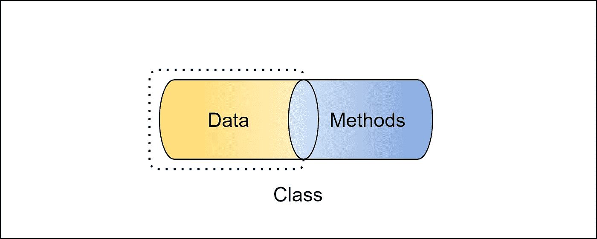

# 你对封装感到困惑吗？现在把它清理干净。

> 原文：<https://levelup.gitconnected.com/are-you-confused-with-encapsulation-clear-it-now-updated-30bd6ca66bfa>

## 面向对象编程

## 您必须知道的一个主要 Java OOPs 概念。



包装

通过这篇文章，我将讨论封装的概念以及我们如何在 java 编程中实现它。阅读完本文后，您将能够理解并在您的下一个 java 应用程序中实现封装。

# 什么是封装？

它和继承、抽象和多态一样，是面向对象的重要概念之一。

**封装**是一种将数据(实例变量)和作用于数据的代码(实例方法)包装成一个单一单元(即类)的机制。

在封装中，一个类的变量对其他类是隐藏的(即包中的其他类和包外的其他类)，只能通过声明它们的类的方法来访问。

你可以把它想象成**一个保护盾**，防止数据被这个盾外的代码访问。因此一个类的实例变量(数据)对其他任何类都是隐藏的，只能通过声明它的类的任何成员函数来访问。

# 如何实现封装？

这可以通过以下方式实现:

*   将类的实例变量声明为**私有**。
*   提供**公共 setter** 和 **getter 方法**来修改和查看变量的值。

我们可以用 Java 编写一个完全封装的类，方法是将该类的所有数据成员都设为私有。我们可以使用 getter 和 setter 方法来获取和设置其中的数据。

> Java Bean 类是完全封装类的一个例子。

现在让我们看一个封装的例子:

具有封装的雇员类

测试封装的驱动程序类

## 输出:

```
name : Vikram Gupta empId : 100
```

在这个例子中，您可以看到该类的变量被声明为私有的，因此除了它们自己的类之外，没有其他类可以直接访问它们。要从外部类访问这些变量，我们需要使用 getter 和 setter 方法来获取和设置这些变量的值。因此，我们可以说，变量和它们的方法一起封装在外部世界的一个类中。

# 关于封装的更多信息:

现在我们已经理解了封装，让我告诉你在实践中我们可以在类的变量的 getter 和 setter 方法中有业务逻辑。

让我们看一个例子，

带有一些 lo 的封装类

测试封装

## 输出:

```
name : Vikram Gupta empId : 100 salary : 80000
```

您可能已经在上面的程序中观察到， **setSalary()** 方法有自己的逻辑将值设置为`salary`变量。即使外部阶层试图将该值设置为低于 **60000，**也会将其设为 **60000** 作为最低工资。

# 为什么我们需要 java 中的封装？

封装在 Java 编程中至关重要，因为:

*   它控制从外部类访问数据的方式。
*   它帮助我们实现**松耦合**。
*   它允许在不中断应用程序中任何其他功能或代码的情况下更改部分代码。

# 封装的好处:

*   一个类的变量(字段)可以通过删除这些字段的 setter 来使**成为只读**，或者通过删除这些字段的 getter 来使**成为只写**。
*   一个类可以完全控制存储在其变量(字段)中的内容。
*   通过封装**可以实现代码的可重用性**和可读性**。**

***本文到此为止。希望你喜欢。***

# **类似内容可以关注[维克拉姆古普塔](https://medium.com/u/2c3b611409dc?source=post_page-----30bd6ca66bfa--------------------------------)。**